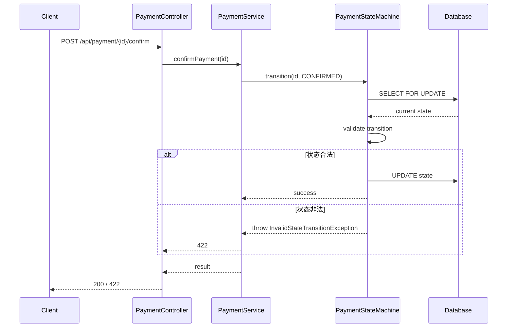

# 详细设计起草（prompt 节点）

> 此 prompt 由阶段 5 detail-design-draft 节点引用。
> 引擎已替换变量：`$RUN_ID` / `$ARTIFACTS_DIR`

## 任务

基于需求 + 技术预研 + 概要设计，撰写详细设计文档 `$ARTIFACTS_DIR/detailed-design.md`。

下一节点 features-json-generate 会基于此文档拆分功能点（features.json），所以**详细设计的颗粒度必须能支撑可拆分的 feature**。

## 输入素材

- $ARTIFACTS_DIR/requirement.md（需求）
- $ARTIFACTS_DIR/tech-feasibility.md（技术预研）
- $ARTIFACTS_DIR/outline-design.md（概要设计）

## 产出规格

`$ARTIFACTS_DIR/detailed-design.md` 必须包含 4 个章节（H2）：

### # 接口签名

每个新增 / 修改的对外接口完整定义：

```java
// 示例（Java）
public interface PaymentStateMachine {
    /**
     * 支付状态流转
     * @param orderId 订单主键，非空
     * @param targetState 目标状态，必须是 PaymentState 枚举之一
     * @return 流转结果，含新状态与变更时间
     * @throws InvalidStateTransitionException 非法状态流转
     * @throws ConcurrentModificationException 乐观锁冲突
     */
    PaymentStateTransition transition(Long orderId, PaymentState targetState);
}
```

每接口必须标注：
- 入参约束（范围、必填、格式）
- 返回值结构
- 异常类型 + 触发条件
- 幂等性说明（关键）
- 性能预期（如响应时间 SLA）

### # 数据结构

- 实体类 / DTO / VO 字段定义（含类型、约束、示例值）
- 数据库表结构（DDL 或字段表，含索引、约束）
- 缓存 key 规则（如有）
- 消息队列 schema（如有）

数据库变更必须给：
- 迁移方式（DDL 是否在线、是否需要数据回填）
- 回滚方案

### # 时序图

主路径 + 关键异常路径，用 mermaid sequenceDiagram：



### # 异常处理

每个异常对应：
- 异常类型（继承自项目既有体系，如 BusinessException）
- 触发场景
- 错误码（对外 API）
- 用户友好提示
- 日志记录策略（INFO/WARN/ERROR + 含哪些字段）

## 颗粒度要求（关键）

详细设计的细节深度要求**任何工程师**能直接据此实现，不需要再问问题。验证标准：

- ✅ 接口签名完整（不缺参数 / 不缺异常）
- ✅ 数据结构无歧义（每字段类型明确）
- ✅ 时序图覆盖主路径 + 至少 1 条异常路径
- ✅ 错误码集合完整
- ✅ 幂等性策略显式（涉及写操作必有）
- ✅ 并发处理策略显式（乐观锁 / 悲观锁 / 分布式锁）
- ✅ 涉及金额必须用 BigDecimal / Decimal（指定 scale + rounding）
- ✅ 涉及时间必须明确时区与精度

## 引用要求（同概要设计）

每条决策必须有依据。引用现有代码 / 规范文档 / requirement.md 章节。

## 完成动作

1. 写完 `$ARTIFACTS_DIR/detailed-design.md`
2. 在 `runs/$RUN_ID/notes.md` 追加待确认项
3. 输出 stdout：
   - 产出文件
   - 接口数量统计
   - 数据结构数量
   - 待确认项清单
   - 字符 "DRAFT_COMPLETE"

引擎拿到 stdout 后进入 features-json-generate 节点。
