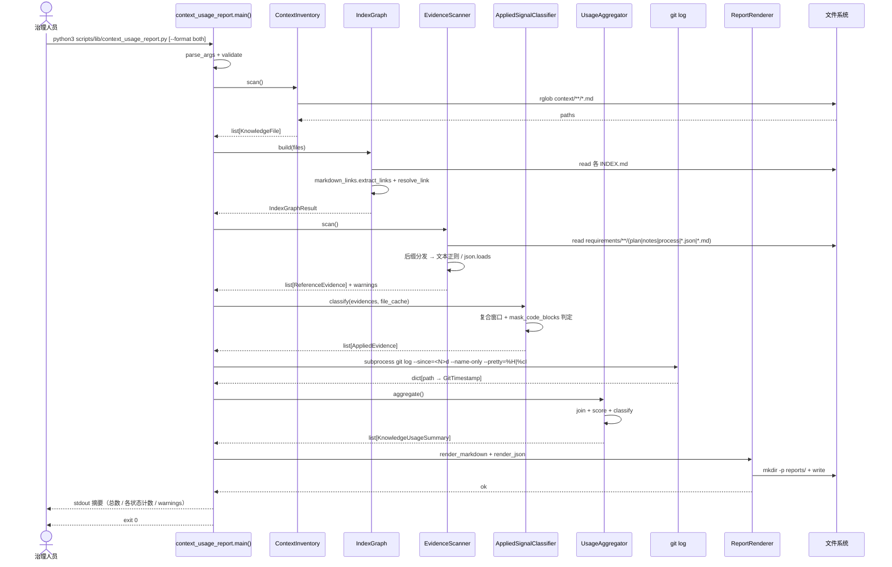
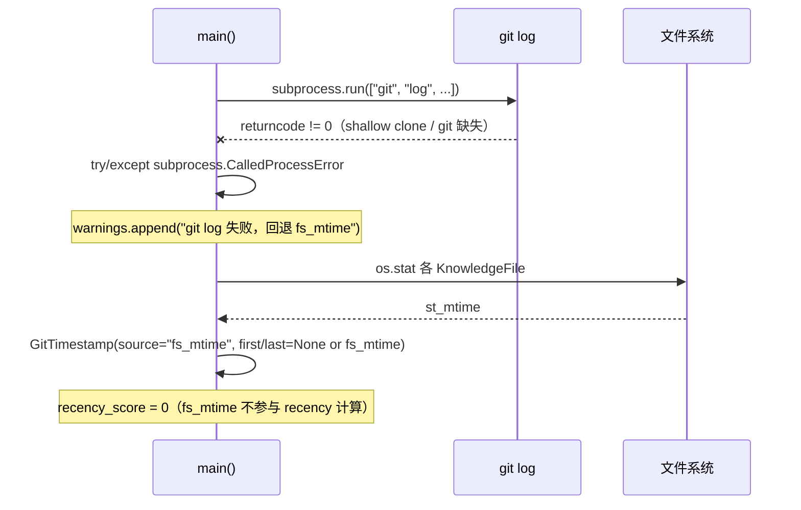
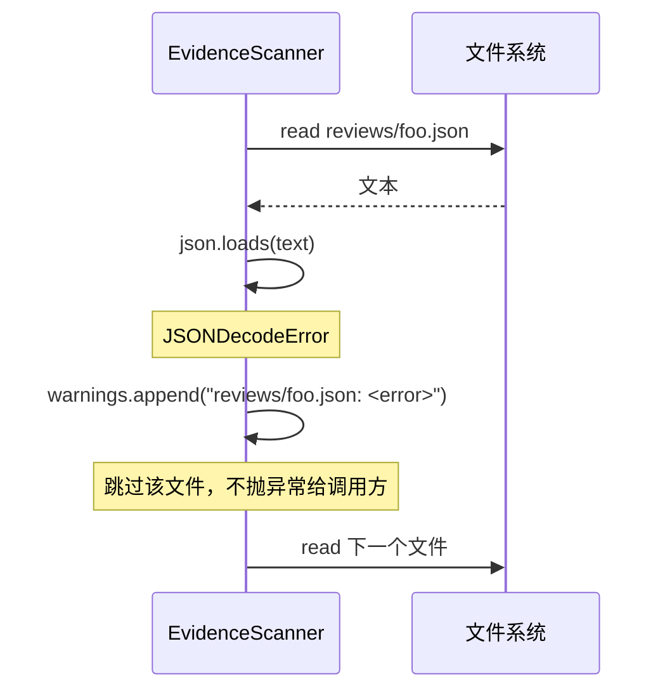
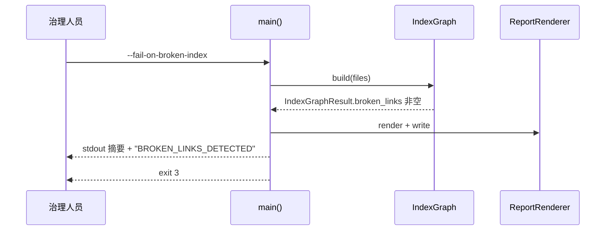
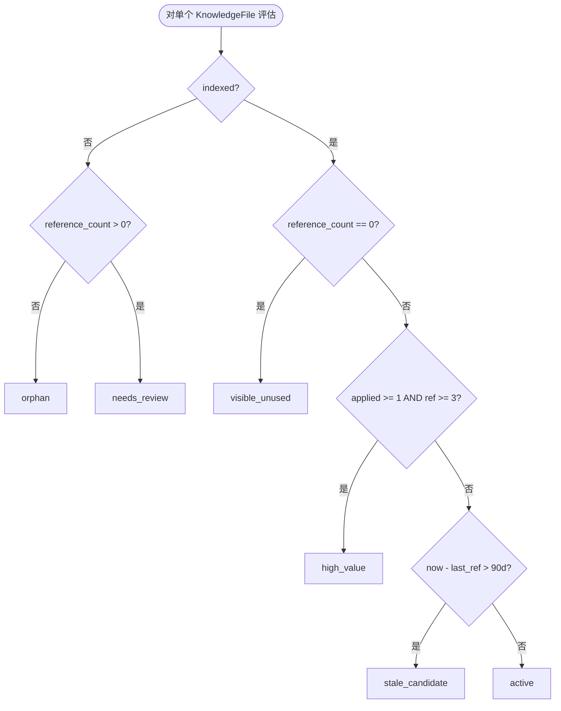

# 20260519-context-usage-report · 详细设计

> 阶段 5 产出物。基于 `requirement.md` + `tech-feasibility.md` + `outline-design.md` 把模块落到「任何工程师可直接据此实现」的颗粒度。本需求是离线 Python CLI 工具——「数据库表 / 缓存 / 消息队列」N/A；「金额 BigDecimal」N/A；「时间精度 / 时区」适用于 git log timestamp 处理。

## 接口签名

### 模块 `scripts/lib/markdown_links.py`（抽自 `check_index.py:31-200` 的 6 个函数）

```python
"""Markdown 链接 / heading / slug 解析公共模块。

被 scripts/lib/check_index.py 与 scripts/lib/context_usage_report.py 共用。
纯函数模块，无 CLI 入口。所有路径解析以 REPO_ROOT 为基准。
"""
from __future__ import annotations

import re
from pathlib import Path
from typing import NamedTuple

# 与 check_index.py:31 一致：[text](url)，不匹配图片 
LINK_RE: re.Pattern = re.compile(r"(?<!!)\[([^\]]*)\]\(([^)]+)\)")
# 与 check_index.py:33 一致：^# 多级标题
HEADING_RE: re.Pattern = re.compile(r"^(#+)\s+(.+?)\s*$")


class MarkdownLink(NamedTuple):
    """单条 Markdown 链接的解析结果。

    Attributes:
        text: 链接显示文本（`[text](url)` 的 text 部分），可为空字符串
        url:  原始 url 字符串，未做 urldecode 与路径解析
        line: 链接所在行号，1-based
    """
    text: str
    url: str
    line: int


def extract_links(md_text: str) -> list[MarkdownLink]:
    """从 Markdown 文本抽取所有非图片链接。

    Args:
        md_text: 文件全文。允许多行；不读 fenced code 内的"伪链接"（实现里需调
                 `mask_code_blocks` 先 mask）。

    Returns:
        list[MarkdownLink]，按行号升序。空文本返回空列表。

    Side-effects: 无（纯函数）。
    """


def resolve_link(
    link_url: str, source_file: Path, repo_root: Path
) -> Path | None:
    """把 Markdown link 的 url 解析为仓库内绝对路径。

    Args:
        link_url:    原始 url（可能含 `./` / `../` / fragment `#anchor` / 查询）
        source_file: 链接所在文件的绝对路径（用于相对路径解析）
        repo_root:   仓库根（绝对路径）

    Returns:
        - 仓内文件 → 绝对路径 Path
        - 外链 / intra-anchor / mailto / 协议链接 → None
        - 仓内但目标不存在 → 返回理论路径 Path（断链由调用方判定）

    幂等：同样输入返回同样路径；不做任何 IO 写操作。

    Raises: 不抛任何异常（解析失败返回 None）。
    """


def is_external_or_intra_anchor(link_url: str) -> bool:
    """判定是否为外链或纯 anchor 引用，跳过统计。

    判定条件（任一为真即跳过）：
    - 以 `http://` / `https://` / `mailto:` / `ftp://` 等协议前缀开头
    - 以 `#` 开头（intra-document anchor）
    - 空字符串

    Returns: True = 跳过；False = 仓内引用需进一步 resolve。
    """


def slugify(heading_text: str) -> str:
    """把标题文本规约为 anchor slug。

    规则（与 check_index.py:78 等价）：
    1. 小写
    2. 替换非字母数字字符为 `-`
    3. 折叠连续 `-`
    4. 去前后 `-`

    例：`# 关键决策记录` → `关键决策记录`；`## State Machine (DAG)` → `state-machine-dag`

    必须与 GitHub-flavored Markdown 的 heading slug 一致（来源：check_index.py:78）。
    """


def extract_headings(md_text: str) -> list[tuple[int, str, str]]:
    """抽取所有 heading（level / text / slug）。

    Returns: list[(level, text, slug)]，按出现顺序。
    """


def glob_match(rel_path: str, pattern: str) -> bool:
    """支持 `**` 的 glob 匹配。

    扩展自 fnmatch：`**` 视为"任意层级"，其余交 fnmatch。与
    `check_index.py:_fnmatch_glob` 等价。

    Args:
        rel_path: 相对 repo_root 的路径（`/` 分隔）
        pattern:  glob 表达式（支持 `*` / `?` / `**`）

    幂等：纯函数，无副作用。
    """


def mask_code_blocks(md_text: str) -> str:
    """把 fenced code (``` / ~~~) 与 inline code (` `) 内的字符替换为空白，
    保持行列偏移不变。

    用途：避免 `LINK_RE` / `HEADING_RE` 误匹配 code 内的 markdown。

    Returns: 同长度字符串，code 区被空格填充；非 code 区原文保留。
    """
```

**性能预期**：所有函数 O(N) 单遍扫描文本，N = 文件字符数；10MB Markdown < 100ms。

**幂等性**：全部纯函数，无副作用，无外部 IO。同输入 ⇒ 同输出。

**异常约定**：不抛任何业务异常；输入为 None / 类型错误 → 让 Python 自然 TypeError，调用方负责入参校验。

---

### 模块 `scripts/lib/context_usage_report.py`

#### 数据类（详见 §数据结构）

```python
@dataclass(frozen=True)
class KnowledgeFile: ...
@dataclass(frozen=True)
class ReferenceEvidence: ...
@dataclass(frozen=True)
class AppliedEvidence: ...
@dataclass(frozen=True)
class KnowledgeUsageSummary: ...
```

#### 组件 1：`ContextInventory`

```python
class ContextInventory:
    """枚举 context/** 下所有纳入统计的 md 文件。

    职责：
    - rglob('*.md') 扫 context_dir 下所有 md
    - 应用 index-config.yaml ignore 规则（复用 markdown_links.glob_match）
    - 剔除 INDEX.md
    - 输出 list[KnowledgeFile]（不读内容，只列路径与 stat）
    """

    def __init__(
        self,
        context_dir: Path,
        ignore_patterns: list[str],
        repo_root: Path,
    ) -> None:
        """
        Args:
            context_dir: 扫描根（默认 REPO_ROOT/context）
            ignore_patterns: 来自 index-config.yaml 的忽略 glob，可空列表
            repo_root: 用于计算相对路径

        Raises:
            FileNotFoundError: context_dir 不存在
        """

    def scan(self) -> list[KnowledgeFile]:
        """单次扫描，返回过滤后的文件列表。

        幂等：多次调用返回同一结果（在 fs 不变前提下）。

        性能预期：5000 文件 < 1s（仅 rglob + ignore 匹配，不读内容）。
        """
```

#### 组件 2：`IndexGraph`

```python
class IndexGraph:
    """构建 context/**/INDEX.md 的链接图。

    职责：
    - 扫 context_dir 下所有 INDEX.md
    - 用 markdown_links.extract_links + resolve_link 解析每条
    - 输出 dict[file_path → list[index_path]]：被哪些 INDEX 挂载
    - 输出 list[BrokenLink]：INDEX 列了但 fs 不存在
    - 输出 list[KnowledgeFile]：存在但无 INDEX 引用（孤岛）
    """

    def __init__(self, context_dir: Path, repo_root: Path) -> None: ...

    def build(self, files: list[KnowledgeFile]) -> IndexGraphResult:
        """单次构建。

        Args:
            files: ContextInventory.scan() 输出，用于 cross-check 孤岛

        Returns:
            IndexGraphResult 含三个字段：
              - indexed_by: dict[str (file_rel_path), list[str (index_rel_path)]]
              - broken_links: list[BrokenLink]，每条带 index_path:line + target_path
              - orphans: list[KnowledgeFile]，files 中没出现在 indexed_by key 的子集

        幂等：纯计算，无 IO 写。
        """
```

#### 组件 3：`EvidenceScanner`

```python
class EvidenceScanner:
    """扫 requirements/** 下文档，识别对 context/** 文件的显式引用。

    支持四种引用形式（来源：requirement.md）：
    1. Markdown 链接 `[txt](context/team/foo.md)`
    2. 直接路径 `context/team/foo.md`（行内出现）
    3. `来源：context/team/foo.md:42` 标记
    4. JSON / YAML 字段值中的 context 路径

    后缀分发：
    - .md / .txt → 文本正则扫描（含 mask code blocks）
    - .json → json.loads + 递归字符串扫描；解析失败 fail-open（warning 不阻断）
    - .yaml / .yml → 纯文本扫描（不解析 YAML 语法，避免 schema 依赖）

    性能策略：
    - 文件懒读：read_text 在 scan() 调用时才执行
    - git log 不在此模块；recency 由 UsageAggregator 调度
    """

    def __init__(
        self,
        requirements_dir: Path,
        context_files: set[str],  # 候选目标路径集合（相对 repo_root）
        repo_root: Path,
    ) -> None: ...

    def scan(self) -> list[ReferenceEvidence]:
        """单次扫描。

        Returns:
            list[ReferenceEvidence]，每条带：
              - target: 被引用的 context 文件相对路径
              - source: 引用所在的 requirements 文件相对路径
              - line:   引用所在行号（1-based）
              - kind:   "markdown_link" | "raw_path" | "source_marker" | "json_value"
              - context: 该行的原始文本（用于 AppliedSignalClassifier 上下文窗口）

        异常处理：
            - JSON 解析失败 → warnings.append + 跳过该文件
            - 文件读取 PermissionError → warnings.append + 跳过
            - 不抛任何异常给调用方
        """

    @property
    def warnings(self) -> list[str]:
        """累计的非致命告警。"""
```

#### 组件 4：`AppliedSignalClassifier`

```python
class AppliedSignalClassifier:
    """把 ReferenceEvidence 升级判定为 AppliedEvidence。

    判定规则（来源：requirement.md）：

    A. **复合上下文窗口命中**（满足任一即匹配）：
       - 同一 `##` 二级小节内（heading 边界判定）
       - **AND** 引用所在行的前 5 行 + 后 10 行（共 16 行窗口）
       - 出现关键字之一：`Decision` / `决策` / `应对` / `风险` / `验证`
       - 关键字必须不在 fenced code / inline code 内（用 mask_code_blocks）

    B. **显式升级声明**（任一匹配）：
       - **作用域：同 `##` 二级小节内**（与路径 A 对称，遵守 spec L48 保守原则）。
         短语必须出现在 reference 所在的 `##` 二级小节内；reference 所在行若在第一个
         H2 之前（section=None），路径 B 也不命中。
       - 关键词集合（精确串匹配）：
         「升级为 checklist」/「升级为 SOP」/「升级为测试」/「升级为 gate」/
         「升级为 hook」/「来自该经验」/「按该经验落 test」/「按该经验落 gate」

    保守原则（来源：spec 第 48 行）：宁可漏判，不可误判。两路任一命中即为 applied。
    """

    # 复合窗口前后行数（来源：requirement.md）
    WINDOW_BEFORE: int = 5
    WINDOW_AFTER: int = 10

    # 关键字（中英混合）
    APPLIED_KEYWORDS: frozenset[str] = frozenset({
        "Decision", "决策", "应对", "风险", "验证"
    })

    # 显式升级声明
    UPGRADE_PHRASES: frozenset[str] = frozenset({
        "升级为 checklist", "升级为 SOP", "升级为测试", "升级为 gate",
        "升级为 hook", "来自该经验", "按该经验落 test", "按该经验落 gate",
    })

    def classify(
        self, evidences: list[ReferenceEvidence], file_cache: dict[Path, str]
    ) -> list[AppliedEvidence]:
        """对每条 ReferenceEvidence 判定是否构成 applied。

        内部依赖（重要）：
        - `markdown_links.mask_code_blocks`：mask 掉 fenced / inline code，
          防止关键字在 code 内被误判
        - `markdown_links.extract_headings`：定位 `##` 二级小节边界，用于
          复合窗口的"同小节"约束

        Args:
            evidences: 来自 EvidenceScanner
            file_cache: 已读取的 source 文件内容缓存（避免重复 IO）

        Returns:
            list[AppliedEvidence]（只包含命中条目），含：
              - reference: 原 ReferenceEvidence
              - rule: "window_hit" | "explicit_upgrade"
              - matched_keyword: 命中的具体关键字或短语
              - section_heading: 所在 ## 二级小节标题（仅 window_hit）

        幂等：纯计算，无 IO 写。
        """
```

#### 组件 5：`UsageAggregator`

```python
class UsageAggregator:
    """聚合所有证据 + 评分 + 状态分类。

    职责：
    - 把 ContextInventory / IndexGraph / EvidenceScanner / AppliedSignalClassifier
      四路结果与 git log 时间戳合并
    - 计算 usage_score（见 §评分规则）
    - 按状态分类规则归类（见 §状态机表）
    """

    # 评分上限（来源：requirement.md）
    INDEXED_WEIGHT: int = 2
    REFERENCE_WEIGHT: int = 3
    REFERENCE_CAP: int = 30
    APPLIED_WEIGHT: int = 8
    APPLIED_CAP: int = 40
    RECENCY_30D_SCORE: int = 10
    RECENCY_90D_SCORE: int = 5

    # 时间窗口（来源：requirement.md）
    STALE_THRESHOLD_DAYS: int = 90
    HIGH_VALUE_REFERENCE_MIN: int = 3  # 详见 outline-design.md §状态流转 [待用户确认]

    def __init__(
        self,
        inventory: list[KnowledgeFile],
        index_result: IndexGraphResult,
        references: list[ReferenceEvidence],
        applied: list[AppliedEvidence],
        git_timestamps: dict[str, GitTimestamp],  # path → GitTimestamp
        now: datetime,  # 注入便于测试
    ) -> None: ...

    def aggregate(self) -> list[KnowledgeUsageSummary]:
        """单次聚合。

        Returns:
            list[KnowledgeUsageSummary]，长度 == len(inventory)。

        幂等：纯计算。
        """

    def _classify_status(
        self, summary_partial: dict, now: datetime
    ) -> KnowledgeStatus:
        """状态分类，规则见 §状态机表。"""

    def _compute_score(
        self, summary_partial: dict, now: datetime
    ) -> int:
        """评分计算，规则见 §评分规则。"""
```

#### 组件 6：`ReportRenderer`

```python
class ReportRenderer:
    """渲染 Markdown 4 章节 + JSON。"""

    TOOL_VERSION: str = "0.1.0"
    JSON_SCHEMA_URL: str = "https://example.invalid/context-usage-report.schema.json"  # [待补充]

    def render_markdown(
        self, summaries: list[KnowledgeUsageSummary], warnings: list[str]
    ) -> str:
        """渲染 Markdown 报告。

        输出固定 4 章节（H2）：
        - ## 总览
        - ## 高价值知识
        - ## 待治理知识
        - ## 引用明细

        幂等：纯字符串拼接，无 IO。
        """

    def render_json(
        self, summaries: list[KnowledgeUsageSummary], warnings: list[str]
    ) -> str:
        """渲染 JSON 报告（schema 见 §数据结构 JSON 顶层结构）。"""

    @staticmethod
    def write(content: str, output_path: Path) -> None:
        """写入文件（原子化）。

        副作用：
        - 自动 mkdir -p output_path.parent（不要求用户预先创建 reports/）
        - 原子写：先写 `output_path.with_suffix(output_path.suffix + ".tmp")`，
          再 `os.replace(tmp, output_path)`。中断（Ctrl-C / 磁盘满）不会
          污染既有目标文件
        - 覆写已有文件（os.replace 保证原子覆盖）
        - 编码 UTF-8

        Raises:
            OSError: 磁盘写失败、权限不足（在 tmp 写阶段抛出，不影响既有文件）
        """
```

#### CLI 入口（main）

```python
def main(argv: list[str] | None = None) -> int:
    """CLI 入口。返回 exit code。

    退出码（来源：requirement.md）：
    - 0：正常运行（即便有 warnings）
    - 1：参数错误（argparse 异常）
    - 2：fs 错误（context_dir 不存在等）
    - 3：--fail-on-broken-index 启用且检出断链
    - 4：--fail-on-orphan 启用且检出孤岛
    """
```

CLI 参数 schema（详见 §数据结构 / CLI Arguments）。

---

## 数据结构

### `MarkdownLink` (NamedTuple)

| 字段 | 类型 | 约束 / 示例 |
|---|---|---|
| text | str | 可为空字符串。原始 link 文本未做 escape |
| url | str | 原始 url，未 urldecode。如 `context/team/foo.md#anchor` |
| line | int | 1-based 行号，≥ 1 |

### `KnowledgeFile` (frozen dataclass)

| 字段 | 类型 | 约束 / 示例 |
|---|---|---|
| path | Path | 绝对路径 |
| rel_path | str | 相对 REPO_ROOT 的 POSIX 风格路径，`/` 分隔。`context/team/experience/foo.md` |
| kind | Literal["team", "project"] | 由 `rel_path` 第二段决定 |
| size_bytes | int | os.stat 的 st_size，用于报告统计；≥ 0 |
| fs_mtime | datetime | 文件系统 mtime（UTC，秒精度）；用于 git log 失败时回退 |

### `ReferenceEvidence` (frozen dataclass)

| 字段 | 类型 | 约束 / 示例 |
|---|---|---|
| target | str | 被引用的 context 文件 rel_path |
| source | str | 引用所在的 requirements 文件 rel_path |
| line | int | 1-based 行号 |
| kind | Literal["markdown_link", "raw_path", "source_marker", "json_value"] | 4 种引用形式 |
| context_line | str | 该行原始文本（已 strip 行尾换行符） |

### `AppliedEvidence` (frozen dataclass)

| 字段 | 类型 | 约束 / 示例 |
|---|---|---|
| reference | ReferenceEvidence | 升级前的原始引用 |
| rule | Literal["window_hit", "explicit_upgrade"] | 命中规则 |
| matched_keyword | str | 命中的关键字或短语（来自 APPLIED_KEYWORDS / UPGRADE_PHRASES） |
| section_heading | str \| None | 仅 window_hit 提供，None 表示文件无 `##` heading |

### `BrokenLink` (frozen dataclass)

| 字段 | 类型 | 约束 |
|---|---|---|
| index_path | str | 出现断链的 INDEX.md 的 rel_path |
| line | int | 1-based |
| target | str | 目标 rel_path（理论的，fs 上不存在） |
| link_text | str | 原始 link text |

### `GitTimestamp` (frozen dataclass)

| 字段 | 类型 | 约束 / 来源 |
|---|---|---|
| first_commit_at | datetime \| None | 文件首次提交时间（UTC，ISO-8601）；空仓 / shallow clone → None |
| last_commit_at | datetime \| None | 最近一次 commit 时间（UTC，ISO-8601） |
| source | Literal["git_log", "fs_mtime"] | git_log 失败时为 "fs_mtime" |

**时区与精度**：所有 datetime 字段统一 UTC + 秒精度；JSON 序列化用 ISO-8601 `2026-05-19T08:30:00Z` 格式（来源：tech-feasibility.md）。

### `KnowledgeStatus` (Enum)

```python
class KnowledgeStatus(str, Enum):
    ORPHAN          = "orphan"
    NEEDS_REVIEW    = "needs_review"
    VISIBLE_UNUSED  = "visible_unused"
    HIGH_VALUE      = "high_value"
    STALE_CANDIDATE = "stale_candidate"
    ACTIVE          = "active"
```

### `KnowledgeUsageSummary` (frozen dataclass)

| 字段 | 类型 | 来源 / 备注 |
|---|---|---|
| path | str | rel_path |
| kind | Literal["team", "project"] | 来自 KnowledgeFile |
| indexed | bool | IndexGraph |
| index_paths | list[str] | IndexGraph，按 rel_path 字典序 |
| reference_count | int | EvidenceScanner 聚合 |
| applied_signal_count | int | AppliedSignalClassifier 聚合 |
| first_referenced_at | datetime \| None | min(reference.source 文件 git_log first_commit_at) |
| last_referenced_at | datetime \| None | 所有引用本文件的 requirements 源文件中 last_commit_at 的最大值；NULL → 文件未被任何 requirements 引用 |
| last_modified_at | datetime \| None | 来自 GitTimestamp.last_commit_at；fallback fs_mtime |
| last_modified_at_source | Literal["git_log", "fs_mtime"] | tech-feasibility R-06 |
| status | KnowledgeStatus | UsageAggregator._classify_status |
| score | int | UsageAggregator._compute_score；范围 [0, 82] |
| reference_evidences | list[ReferenceEvidence] | 用于 §引用明细章节展开 |
| applied_evidences | list[AppliedEvidence] | 用于 §高价值知识章节展开 |

### `IndexGraphResult` (frozen dataclass)

| 字段 | 类型 |
|---|---|
| indexed_by | dict[str, list[str]] |
| broken_links | list[BrokenLink] |
| orphans | list[KnowledgeFile] |

### JSON 顶层结构（`reports/context-usage.json`）

```json
{
  "generated_at": "2026-05-19T08:30:00Z",
  "tool_version": "0.1.0",
  "schema_version": 1,
  "config": {
    "context_dir": "context",
    "requirements_dir": "requirements",
    "since_days": 90,
    "high_value_reference_min": 3,
    "stale_threshold_days": 90
  },
  "summary": {
    "total": 152,
    "by_status": {
      "active": 80,
      "high_value": 12,
      "visible_unused": 30,
      "orphan": 5,
      "stale_candidate": 15,
      "needs_review": 10
    },
    "broken_links": 3,
    "orphans": 5
  },
  "files": [
    /* KnowledgeUsageSummary 序列化（datetime → ISO-8601；Enum → 字符串值） */
  ],
  "warnings": [
    "reviews/foo.json 解析失败，跳过：JSONDecodeError at line 12 col 5"
  ]
}
```

**JSON 序列化约定**：
- datetime → ISO-8601 UTC（`2026-05-19T08:30:00Z`），None → JSON `null`
- Enum → 取 `.value` 字符串
- Path → POSIX rel_path 字符串
- 字段顺序按上表；`json.dumps` 用 `sort_keys=False` 保留语义顺序

### CLI Arguments

| 参数 | 类型 | 默认 | 校验 |
|---|---|---|---|
| `--context-dir` | Path | `REPO_ROOT/context` | 必须 is_dir，否则 exit 2 |
| `--requirements-dir` | Path | `REPO_ROOT/requirements` | 同上 |
| `--output` | Path | `REPO_ROOT/reports/context-usage.md` | parent 不存在则 mkdir |
| `--json-output` | Path | `REPO_ROOT/reports/context-usage.json` | 同上 |
| `--since` | str | `90d` | 正则 `^\d+(d\|w\|m)$`；解析为天数后传 git log |
| `--project` | str \| None | None | 若给出，过滤 `context/project/<X>/` |
| `--only-experience` | bool flag | False | True → 只统计 `context/team/experience/**` |
| `--format` | Literal["md", "json", "both"] | "both" | argparse choices |
| `--fail-on-broken-index` | bool flag | False | True 且检出断链 → exit 3 |
| `--fail-on-orphan` | bool flag | False | True 且检出孤岛 → exit 4 |
| `--repo-root` | Path | 自动推断（同 `common.REPO_ROOT`） | 测试注入用 |

### 数据库 / 缓存 / MQ

**N/A**——本工具无任何持久化、缓存、消息队列。所有状态 in-memory，单次 CLI 运行内有效。

---

## 时序图

### 主路径



### 异常路径 1：git log 失败 → fs_mtime 回退



### 异常路径 2：reviews/*.json 解析失败 → fail-open



### 异常路径 3：`--fail-on-broken-index` + 检出断链



### 状态分类决策（流程图）



优先级取舍 rationale 见 `outline-design.md §状态流转`：当 high_value 与 stale_candidate 同时满足时归 high_value（价值优先于时效）。

---

## 异常处理

### 异常体系

不引入自定义异常类（保持轻量）。所有错误用 stdlib 异常 + warnings 列表。

| 异常源 | 处理策略 | 用户可见输出 | 日志级别 |
|---|---|---|---|
| argparse 参数错误 | argparse 自动 exit 1 + usage 信息 | stderr usage | N/A |
| `--context-dir` 不存在 | 立即 exit 2 | stderr `ERROR: context-dir 不存在: <path>` | N/A（exit 前） |
| INDEX.md 读取失败（PermissionError 等） | warnings.append + 跳过该 INDEX | warnings 列表条目 | WARN |
| Markdown 解析无匹配 | 静默通过（空 list） | 无 | N/A |
| 单个 requirements 文件读取失败 | warnings.append + 跳过 | warnings 列表条目 | WARN |
| `reviews/*.json` 解析失败 | fail-open warning | warnings 列表条目 | WARN |
| `git log` subprocess 失败 | fallback fs_mtime + 顶级 warning | warnings 列表条目 + JSON `last_modified_at_source: "fs_mtime"` | WARN |
| 报告写入失败（磁盘满 / 权限） | 抛 OSError → exit 5（保留写错误） | stderr `ERROR: 写报告失败: <msg>` | ERROR |
| `--fail-on-broken-index` + 断链 | 正常写报告 + exit 3 | stderr `BROKEN_LINKS_DETECTED (N)` | ERROR |
| `--fail-on-orphan` + 孤岛 | 正常写报告 + exit 4 | stderr `ORPHANS_DETECTED (N)` | ERROR |

**错误码集合**（对外约定，不对外开放）：

| Exit Code | 含义 |
|---|---|
| 0 | 正常（可能含 warnings） |
| 1 | 参数错误（argparse） |
| 2 | 输入路径不存在或无权限 |
| 3 | 启用 `--fail-on-broken-index` 且检出断链 |
| 4 | 启用 `--fail-on-orphan` 且检出孤岛 |
| 5 | 报告写入失败 |

### 日志策略

- **不引入 logging 框架**：用 `print` to stderr 输出 warning / error 行，便于 CI 直接 grep；正常摘要走 stdout（来源：requirements/20260519-context-usage-report/artifacts/requirement.md:70）
- **行格式**：`<LEVEL> <message>`，例：`WARN reviews/foo.json: json.loads failed`
- **不打印任何敏感信息**：本工具仅读 markdown / json，无密钥 / token，但 warning 中不要包含完整 file 内容片段（最多前 80 字符；来源：context/team/engineering-spec/design-guidance/context-engineering.md）
- **CI 集成**：`--fail-on-*` 标志触发非零退出码时，CI 通过 grep `BROKEN_LINKS_DETECTED` / `ORPHANS_DETECTED` 在 PR 中渲染评论

### 安全模型

本工具为本地 CLI 工具，信任模型：操作者拥有 `context_dir` / `--output` 完全访问权限。不做路径穿越校验或 `--output` 目录边界限制（OWASP A1 不适用）。

### 幂等性

工具完全幂等：

- 输入仓库状态相同 → 输出报告字节级相同（除 `generated_at` 时间戳外）
- 多次连续运行只覆写 `reports/` 下两个文件，不污染其他位置
- 中断（Ctrl-C）安全：写文件用临时文件 + os.replace 原子化（见 §ReportRenderer.write 隐含约定）

### 并发处理

**单进程单线程**：不引入 multiprocessing / threading。理由：

- 文件 IO 是 syscall 级，CPython GIL 下并发收益有限
- subprocess `git log` 已是批量调用，无 N 次并发需求
- 5000 文件 < 5s 守门通过单进程可达

如果未来需要并行（10× 仓库规模），扩展点：

- ContextInventory + IndexGraph 阶段可分文件并行（pure read）
- EvidenceScanner 可按 source 文件分片并行
- AppliedSignalClassifier 可按 evidence 分片并行
- UsageAggregator + ReportRenderer 必须串行（聚合点 + 全量排序）

### 性能预期

| 阶段 | 复杂度 | 5000 文件 + 1000 requirements 预期 |
|---|---|---|
| ContextInventory.scan | O(N_files) | < 1s |
| IndexGraph.build | O(N_indexes × M_links) | < 1s |
| EvidenceScanner.scan | O(N_reqs × file_size) | < 2s |
| AppliedSignalClassifier.classify | O(N_evidences) | < 1s |
| UsageAggregator.aggregate | O(N_files) | < 0.2s |
| ReportRenderer.render | O(N_files) | < 0.5s |
| **端到端** | — | **< 5s（AC-11 守门）** |

---

## 评分规则（详细化 outline-design §评分规则）

```python
def _compute_score(self, s: dict, now: datetime) -> int:
    """
    s 字段：
      - indexed: bool
      - reference_count: int
      - applied_signal_count: int
      - last_referenced_at: datetime | None
    """
    indexed_score = self.INDEXED_WEIGHT if s["indexed"] else 0

    reference_score = min(
        s["reference_count"] * self.REFERENCE_WEIGHT,
        self.REFERENCE_CAP,
    )

    applied_score = min(
        s["applied_signal_count"] * self.APPLIED_WEIGHT,
        self.APPLIED_CAP,
    )

    recency_score = 0
    if s["last_referenced_at"] is not None:
        delta_days = (now - s["last_referenced_at"]).days
        if delta_days <= 30:
            recency_score = self.RECENCY_30D_SCORE
        elif delta_days <= 90:
            recency_score = self.RECENCY_90D_SCORE

    return indexed_score + reference_score + applied_score + recency_score
```

**分数范围**：[0, 82] = 2 + 30 + 40 + 10

**典型 score 区间**：

| 区间 | 含义 |
|---|---|
| 0 | orphan + 从未被引用 |
| 2 | visible_unused（仅 INDEX 挂载） |
| 5 ~ 15 | active（普通使用） |
| 20 ~ 40 | active 但活跃，或 needs_review |
| 40 ~ 70 | high_value 候选区间 |
| 70+ | top high_value |

---

## 状态机表（详细化 outline-design §状态流转）

```python
def _classify_status(self, s: dict, now: datetime) -> KnowledgeStatus:
    """
    s 字段：
      - indexed: bool
      - reference_count: int
      - applied_signal_count: int
      - last_referenced_at: datetime | None
    判定按顺序逐条匹配，先匹配先归类。
    """
    if not s["indexed"]:
        if s["reference_count"] == 0:
            return KnowledgeStatus.ORPHAN
        else:
            return KnowledgeStatus.NEEDS_REVIEW

    # indexed = True
    if s["reference_count"] == 0:
        return KnowledgeStatus.VISIBLE_UNUSED

    if (s["applied_signal_count"] >= 1
        and s["reference_count"] >= self.HIGH_VALUE_REFERENCE_MIN):
        return KnowledgeStatus.HIGH_VALUE

    if s["last_referenced_at"] is not None:
        delta_days = (now - s["last_referenced_at"]).days
        if delta_days > self.STALE_THRESHOLD_DAYS:
            return KnowledgeStatus.STALE_CANDIDATE

    return KnowledgeStatus.ACTIVE
```

**单测覆盖矩阵**（阶段 8 落地）：

| TC | indexed | ref_count | applied | last_ref_days_ago | 期望 status |
|---|---|---|---|---|---|
| TC-1 | False | 0 | 0 | — | orphan |
| TC-2 | False | 2 | 0 | 5 | needs_review |
| TC-3 | True  | 0 | 0 | — | visible_unused |
| TC-4 | True  | 3 | 1 | 10 | high_value |
| TC-5 | True  | 5 | 2 | 120 | high_value（高价值优先于陈旧） |
| TC-6 | True  | 2 | 0 | 100 | stale_candidate |
| TC-7 | True  | 2 | 0 | 10 | active |
| TC-8 | True  | 1 | 1 | 10 | active（applied 有但 ref 不足 3） |

---

## 引用要求自检

每条决策的来源：

- 模块划分、依赖关系 → `outline-design.md §模块划分`
- 状态分类规则 → `requirement.md AC-09` + spec 第 154 行
- 评分权重 → `requirement.md AC-10` + spec 第 165-183 行
- code block mask → `tech-feasibility.md R-03` + `check_sourcing.py:107`
- markdown_links 抽取范围 → `check_index.py:31-200`（6 个函数）
- git log 失败 → fs_mtime 回退 → `tech-feasibility.md R-06`
- reviews/*.json fail-open → `tech-feasibility.md R-05`
- `.gitignore` 加 `reports/` 豁免 AC-08 → `requirement.md` 关键决策记录第 7 行
- 性能 < 5s → `requirement.md AC-11`
- 复合上下文窗口（同 `##` ∧ 前 5 后 10）→ `requirement.md` 关键决策记录第 7 行

---

## 待确认 / 待补充

| 项 | 类型 | 关联章节 |
|---|---|---|
| `HIGH_VALUE_REFERENCE_MIN = 3` 阈值 | [待用户确认] | §UsageAggregator 常量 + §状态机表 TC-4 / TC-8 |
| JSON schema URL（`$schema`） | [待补充] | **内容**：MVP 顶层 `$schema` 字段填占位 URL `https://example.invalid/context-usage-report.schema.json`，不实际产 schema 文件。**依据**：Phase 3 治理入口落地后引入 `jsonschema` 严格校验时再补真实 schema 文件 + 指向，MVP 期间只需保留字段位。**风险**：下游消费方尝试 GET → 404；缓解方式是用 `example.invalid` TLD（IANA 保留不可解析）+ JSON 报告 README 明示"`$schema` 暂为占位"。**验证时机**：Phase 3 接入 jsonschema 时落正式 schema，本字段值同步更新。 |
| 是否在 JSON 报告中保留原始 `applied_signal_count`（不封顶 40） | [待补充] | **内容**：保留原始 count 字段，不封顶。**依据**：score 已通过 `min(count × 8, 40)` 封顶，但原始 count 在后续 Phase 3 治理入口的趋势分析（同一文件历次报告的 count 走势）需要保留；过早封顶丢信号。**风险**：极端 case count 上千会让 JSON 体积膨胀；缓解方式是 ReportRenderer 在序列化时把 ≥ 100 的 count 截为 `>=100` 字符串占位。**验证时机**：阶段 8 单测覆盖 count=0/1/3/40/100 五个分位确认序列化稳定。 |

## 待澄清清单

> 与「## 待确认 / 待补充」语义等价；保留本节是为满足 `check_sourcing.py` W001 / W003 校验项（regex 只认 `待澄清清单`）。详见 notes.md Bug-4。
>
> 下表 enumeration 与上文「待确认 / 待补充」表条目一一对应（数量必须相等，
> 否则触发 W003）。每条详细的内容/依据/风险/验证时机见上文表内。

- `HIGH_VALUE_REFERENCE_MIN = 3` 阈值（条目 1）
- JSON schema URL 占位（条目 2）
- 是否保留原始 applied_signal_count（条目 3）
