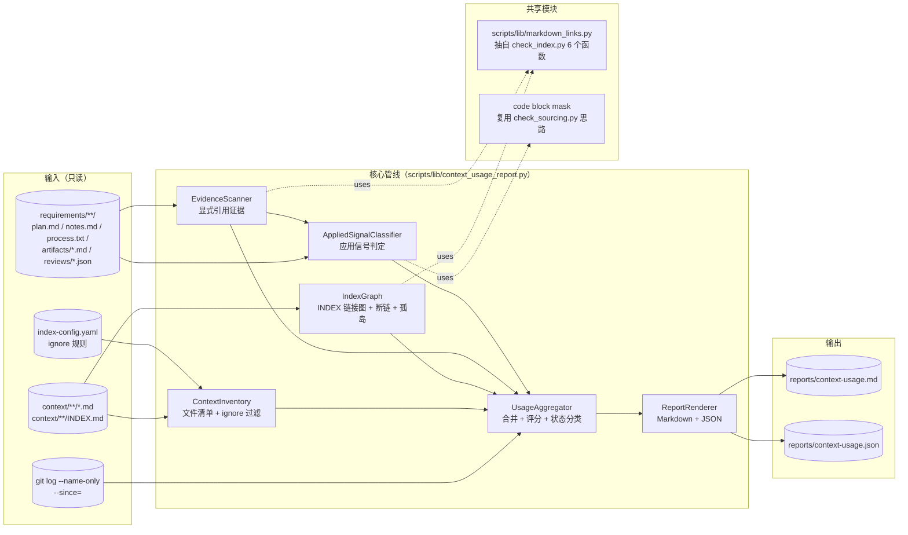
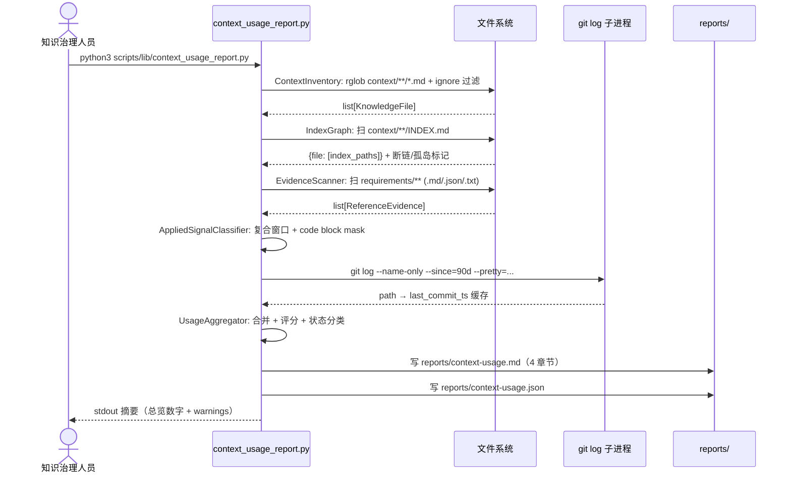

# 20260519-context-usage-report · 概要设计

> 阶段 4 产出物。基于 `requirements/20260519-context-usage-report/artifacts/requirement.md` 与 `tech-feasibility.md`，把模块划分、数据流、状态分类、报告产出落到「做什么、怎么组织」层级。**不下沉到接口签名 / SQL / features.json / 测试用例**——这些是阶段 5 / 8 的产出。

## 架构方案

### 整体形态

离线一次性运行的 Python CLI 工具（来源：requirements/20260519-context-usage-report/artifacts/requirement.md:45）。**单进程、读多写少、无状态**：扫描仓库 → 聚合 → 渲染两份报告（Markdown + JSON）→ 退出。

### 架构图



### 数据流向

`Path → KnowledgeFile → 多源证据合并 → KnowledgeUsageSummary → 报告渲染`。

1. **ContextInventory**：`pathlib.rglob('*.md')` 扫描 `context/team/**` 与 `context/project/**`，按 `index-config.yaml` ignore 规则与 `INDEX.md` 排除（来源：requirements/20260519-context-usage-report/artifacts/requirement.md:103）。产物：`list[KnowledgeFile]`。
2. **IndexGraph**：扫 `context/**/INDEX.md`，用 `markdown_links.py` 抽链接，构建 `{indexed_file: [index_paths]}`，并标记断链与孤岛（来源：requirements/20260519-context-usage-report/artifacts/requirement.md:107）。
3. **EvidenceScanner**：扫 `requirements/**` 下 `.md / .json / .txt`，按后缀分发，识别 4 种引用形式（Markdown 链接 / 直接路径 / `来源：` 标记 / JSON / YAML 字段值），输出 `list[ReferenceEvidence]`，每条带 `path:line`（来源：requirements/20260519-context-usage-report/artifacts/requirement.md:115）（来源：tech-feasibility.md）。
4. **AppliedSignalClassifier**：对 EvidenceScanner 已产出的每条引用，判定是否构成「应用信号」（来源：requirements/20260519-context-usage-report/artifacts/requirement.md:121）。判定条件二选一即满足：
   - 复合上下文窗口命中：「同 `##` 二级小节 ∧ 前 5 行 + 后 10 行」内出现关键字 `Decision / 决策 / 应对 / 风险 / 验证`，并 mask 掉 code block 内的命中（来源：requirements/20260519-context-usage-report/artifacts/requirement.md:171）（来源：tech-feasibility.md）。
   - 显式升级声明：requirements 内出现「升级为 checklist / SOP / 测试 / gate / hook」等句式（来源：requirements/20260519-context-usage-report/artifacts/requirement.md:122）。
5. **UsageAggregator**：把每个 `KnowledgeFile` 与上述四类证据 join，调 git log 拿 `first_referenced_at / last_referenced_at`，计算 `usage_score`，按规则归类 6 种状态之一（来源：requirements/20260519-context-usage-report/artifacts/requirement.md:142）。
6. **ReportRenderer**：把 `list[KnowledgeUsageSummary]` 输出为 Markdown 4 章节（总览 / 高价值 / 待治理 / 引用明细）与 JSON schema（来源：requirements/20260519-context-usage-report/artifacts/requirement.md:130）。

### 关键组件职责

| 组件 | 职责 | 上限 |
|---|---|---|
| `ContextInventory` | 列出待统计的 `KnowledgeFile`，应用 ignore 规则 | ≤ 100 行；只列文件不读内容 |
| `IndexGraph` | 构建 INDEX 链接图、标识断链与孤岛 | ≤ 150 行；不下沉到 anchor 层级的 slug 比较，slug 规则统一交给 `markdown_links.py` |
| `EvidenceScanner` | 扫所有 `requirements/**` 文档，按后缀分发四种格式，产出带行号的引用证据 | ≤ 200 行；fail-open：JSON 解析异常只 warning 不阻断 |
| `AppliedSignalClassifier` | 把"引用"升级判定为"应用"；保守优先（来源：docs/superpowers/specs/2026-05-19-context-knowledge-usage-design.md:48） | ≤ 150 行；code block mask 通过 `markdown_links` 或公共工具，不重复实现 |
| `UsageAggregator` | 单一聚合点，串联前四个组件 + 评分 + 状态分类 | ≤ 200 行；evaluator 表驱动状态判定（详见「关键流程 / 状态流转」） |
| `ReportRenderer` | 渲染 Markdown 4 章节 + JSON；与 `KnowledgeUsageSummary` 严格 1:1 | ≤ 250 行；模板字符串拼接，不引入 jinja2 |
| CLI 入口 | argparse + 调度 | ≤ 100 行；仅参数解析与 wiring |

> 总代码量目标 ≤ 1150 行（含注释 / docstring），与 `check_index.py` 同量级，避免「大文件难审」（来源：scripts/lib/check_index.py）。

## 模块划分

### 新增模块

| 路径 | 角色 | 对内 / 对外 |
|---|---|---|
| `scripts/lib/context_usage_report.py` | CLI 主入口 + 上述 6 个组件的 wiring | 对内：调 `markdown_links.py` / `common.py`；对外：CLI 参数（详见技术选型 §CLI） |
| `scripts/lib/markdown_links.py` | Markdown 链接 / heading / slug 公共解析（抽自 `check_index.py:31-200` 的 6 个函数：`LINK_RE / _extract_links / _resolve_link / _is_external_or_intra_anchor / _slugify / _extract_headings`） | 对内：`check_index.py` / `context_usage_report.py` 共用；对外：纯函数模块，无 CLI |
| `reports/` | 报告输出目录（`.gitignore` 排除） | 默认产物落点；治理人员择期 commit 快照（来源：requirements/20260519-context-usage-report/artifacts/requirement.md:170） |
| `tests/lib/test_context_usage_report.py` | 单元 + fixture 测试 | 阶段 5/8 详化 |
| `tests/lib/test_markdown_links.py` | 抽公共模块后的 4 类用例回归（LINK_RE / slug / glob `**` / 外链跳过） | 阶段 5/8 详化 |
| `tests/fixtures/context_usage_report/` | 小型仿真仓库 fixture | 阶段 5/8 详化 |

### 既有模块改动

| 路径 | 改动 | 范围 |
|---|---|---|
| `scripts/lib/check_index.py` | 切换至 `markdown_links.py`，删除原 6 个内部函数；保留 `_load_config / _glob_match_any / _fnmatch_glob` / 主 CLI 逻辑（来源：scripts/lib/check_index.py:31） | 只删抽走的函数 + import 替换；不动 CLI、不动 `index-config.yaml` ignore 语义（来源：tech-feasibility.md）。`tests/gates/test_index_integrity_plugin.py` 必须全绿才算抽取成功 |
| `.gitignore` | 追加 `reports/` 一行（来源：tech-feasibility.md） | 与首 commit 同步；commit message 明示「需求决策表豁免」 |

### 不改的模块

- `scripts/lib/check_sourcing.py`：仅复用其 `_mask_code_for_position` 思路（来源：scripts/lib/check_sourcing.py:107），不抽公共模块——code block mask 的边界（fenced ``` / inline `\`code\``）相对简单，重复一份比抽取更便宜，避免一次抽两个公共模块叠加风险（来源：tech-feasibility.md）。`[待用户确认]`：是否要在 Phase 2 之后把 mask 也抽到 `markdown_links.py` 内部？
- `scripts/lib/common.py`：复用 `REPO_ROOT / Report / Severity / rel`，不动签名。
- `.claude/workflows/` / `requirements/`：完全只读（来源：requirements/20260519-context-usage-report/artifacts/requirement.md:138）。

### 依赖关系（不能有环）

```
context_usage_report.py
  ├── markdown_links.py          ← check_index.py 同时依赖
  ├── common.py（既有）
  └── (stdlib: pathlib / re / json / subprocess / argparse)

markdown_links.py
  └── (stdlib: re / pathlib / urllib.parse / fnmatch)

check_index.py（既有）
  ├── markdown_links.py          ← 新增依赖
  └── common.py（既有）
```

无环；`markdown_links.py` 是底层，被两个上层 CLI 共享。

### 对内对外接口轮廓

`markdown_links.py`（对外的"接口轮廓"，不写签名细节）：

- 解析一段 Markdown 文本，返回链接列表（含 `text / url / line`）
- 把相对 URL 解析为仓库相对路径（处理 `./` / `../` / `**` / fragment）
- 区分外链 / 仓内 / intra-anchor
- Heading slug 化（与 `check_index.py` 当前规则等价）
- glob 扩展 `**` 匹配

`context_usage_report.py` 的 6 个组件之间通过纯数据类（`@dataclass`）传递，**不耦合到各自的内部实现**，便于阶段 5 详化签名与单测。

`KnowledgeUsageSummary` 字段（仅枚举，签名留阶段 5）：

```
path / kind / indexed / index_paths / reference_count /
applied_signal_count / first_referenced_at / last_referenced_at /
last_modified_at / status / score / evidences (引用与应用证据列表，含 path:line)
```

CLI 入口 contract（详见技术选型 §CLI）。

## 技术选型

### 语言与依赖

| 项 | 选型 | 替代 | 取舍依据 |
|---|---|---|---|
| 语言 | Python 3.x | Go / Node | 复用现有 `scripts/lib/` 体系，避免双语言（来源：scripts/lib/common.py） |
| Markdown 解析 | 自实现 regex（沿用 `check_index.py:31` 的 `LINK_RE`） | `markdown-it-py / mistune` | spec 第 686-687 行明确要求复用 check_index.py 解析逻辑（来源：requirements/20260519-context-usage-report/artifacts/requirement.md:172）；规模小（< 1000 文件），regex 性能足够 |
| YAML 解析 | PyYAML（既有依赖） | `ruamel.yaml` | 仓库已用（来源：scripts/lib/workflow_loader.py:47） |
| JSON 输出 | `json` stdlib | jsonschema | 阶段 5 再决定要不要加 schema 校验；MVP 用 stdlib 足够 |
| 模板渲染 | Python f-string + 字符串拼接 | jinja2 / mako | 报告模板固定 4 章节，无变体；引入模板引擎是过度设计 |
| git 历史 | `subprocess.run(["git", "log", ...])` | `pygit2 / dulwich` | spec 与既有 `submit_codex.py` 都用 subprocess；引入 binding 库提高门槛 |
| CLI | `argparse` stdlib | `click / typer` | 仓库其他脚本统一用 argparse（来源：scripts/lib/check_index.py） |

### 性能策略

| 策略 | 依据 |
|---|---|
| **rglob 后立即按 ignore 过滤**，避免对忽略路径再做 stat / read | tech-feasibility.md R-02 |
| **git log 单次批量抓**：`git log --name-only --since=<recency_window> --pretty=format:%H\|%cI`，缓存 `path → last_commit_ts`，O(N_changed) 而非 O(N_files) | tech-feasibility.md R-02 |
| **文件内容懒加载**：ContextInventory 阶段只列路径，到 EvidenceScanner / AppliedSignalClassifier 才 read_text | 减少 5000 文件场景下的 IO |
| **CI 用 `time` 守门**，fixture 仓库（1000 文件）< 5s 回归 | 来源：requirements/20260519-context-usage-report/artifacts/requirement.md:70 |

### CLI 入参 schema

> 阶段 4 只给字段表与默认值；具体类型签名与互斥规则阶段 5 落 features.json。

| 参数 | 默认 | 说明 |
|---|---|---|
| `--context-dir` | `context` | 扫描根 |
| `--requirements-dir` | `requirements` | 引用扫描根 |
| `--output` | `reports/context-usage.md` | Markdown 输出 |
| `--json-output` | `reports/context-usage.json` | JSON 输出 |
| `--since` | 90d | git log 时间窗口（与 `recency_score` 一致） |
| `--project` | (全部) | 过滤特定 project |
| `--only-experience` | false | 只统计 `context/team/experience/` |
| `--format` | both | `md` / `json` / `both` |
| `--fail-on-broken-index` | false | 留接口，MVP 默认不启用（来源：requirements/20260519-context-usage-report/artifacts/requirement.md:154） |
| `--fail-on-orphan` | false | 同上 |

### 新增依赖与迁移成本

**仅新增内部 import**（`markdown_links.py`），**不引入任何外部 pip 包**。迁移成本：

- `check_index.py` 切换到 `markdown_links.py`：commit 拆 (a) 抽模块 + 切换 check_index (b) `context_usage_report.py` 引用模块（来源：tech-feasibility.md）。
- `tests/gates/test_index_integrity_plugin.py` 必须保持全绿，作为 (a) commit 的硬性门禁。

## 关键流程

### 主时序图：一次完整的报告生成



### 状态流转（每个 KnowledgeFile 的状态机）

不是真正的状态机（无事件驱动），是一次评估后的归类规则（来源：requirements/20260519-context-usage-report/artifacts/requirement.md:142）。判定优先级（先匹配先归类）：

```
1. !indexed && reference_count == 0          → orphan
2. !indexed && reference_count > 0           → needs_review        （能被引用但 INDEX 没挂）
3. indexed && reference_count == 0           → visible_unused
4. indexed && applied_signal_count >= 1 && reference_count >= 3
                                              → high_value
5. indexed && reference_count >= 1
   && (now - last_referenced_at > 90d)        → stale_candidate
6. 否则                                       → active
```

状态分类规则与 spec §「状态分类」对齐（来源：docs/superpowers/specs/2026-05-19-context-knowledge-usage-design.md:154）。`stale_candidate` 90 天阈值来自需求文档关键决策记录（来源：requirements/20260519-context-usage-report/artifacts/requirement.md:165）。

**优先级 rationale**：当一个文件同时满足规则 4（high_value）与规则 5（stale_candidate）时（即 `applied_signal_count >= 1 && reference_count >= 3` 且 `now - last_referenced_at > 90d`），按表中顺序归为 `high_value`。**取舍**：高价值经验即使最近 90 天没被引用，仍属于"曾被多次应用的硬通货"，治理动作（升级 / 合并 / 归档）应基于"价值"而非"时效"，因此 high_value 优先于 stale_candidate。reviewer 可据此判断本设计是否符合预期。

`high_value` 阈值 `applied_signal_count >= 1 && reference_count >= 3`：spec 第 113 行只说「至少一次出现在 Decision/决策/... 上下文窗口附近」。本设计在此基础上叠加 `reference_count >= 3` 防止只出现一次但恰好窗口命中的偶然条目混入高价值列表。`[待用户确认]`：阈值 `reference_count >= 3` 是否合理？或改为 `>=2`？

### 评分规则

`usage_score = indexed_score + reference_score + applied_score + recency_score`（来源：requirements/20260519-context-usage-report/artifacts/requirement.md:146）：

| 子项 | 公式 | 上限 |
|---|---|---|
| `indexed_score` | indexed ? 2 : 0 | 2 |
| `reference_score` | min(reference_count × 3, 30) | 30 |
| `applied_score` | min(applied_signal_count × 8, 40) | 40 |
| `recency_score` | last_referenced_at 在 30 天内 → 10；30-90 天 → 5；否则 0 | 10 |

分数仅用于报告排序，不用于自动处置；项目级与团队级共享同一套权重（来源：requirements/20260519-context-usage-report/artifacts/requirement.md:166）。

### 异常路径与回退

| 异常 | 处理 | 落点 |
|---|---|---|
| `git log` 子进程失败（shallow clone / git 缺失） | fallback 到文件系统 `mtime`，JSON 报告显式标 `last_modified_at_source: fs_mtime`；`recency_score = 0` 单测覆盖 | tech-feasibility.md R-06 |
| `reviews/*.json` 解析失败 | fail-open：warning 不阻断，跳过该文件 | tech-feasibility.md R-05 |
| 关键字命中在 fenced code / inline code | 通过 code block mask 排除，保守优先 | tech-feasibility.md R-03 |
| ignore 规则匹配到全部 context 文件 | 报告输出"零文件"摘要 + warning，stderr 提示 ignore 规则可能过宽 | 边界保护 |
| 报告目录 `reports/` 不存在 | 自动 `mkdir -p`；不要求用户预先创建 | 用户体验 |
| `--fail-on-broken-index` 启用且检出断链 | 退出码非零（具体码阶段 5 定）；MVP 默认 false 不影响其他流程（来源：requirements/20260519-context-usage-report/artifacts/requirement.md:154） | 可选治理门禁 |

### 报告结构（Markdown）

> 阶段 4 只给章节大纲，模板字符串细节阶段 5 落。

| 章节（H2） | 内容 |
|---|---|
| `## 总览` | 文件总数 / 各状态计数 / 断链数 / 孤岛数 / 总分布 |
| `## 高价值知识` | `status == high_value` 的文件，按 score 倒序；每条带 `applied_signal` 证据（path:line） |
| `## 待治理知识` | `status ∈ {orphan, stale_candidate, needs_review, visible_unused}` 的文件，分桶展示，附治理建议 |
| `## 引用明细` | 每个文件展开列出 reference / applied 证据（path:line），按 path 字典序 |

### 报告结构（JSON）

顶层结构：

```
{
  "generated_at": "ISO-8601",
  "tool_version": "0.1.0",
  "summary": { "total": N, "by_status": { ... }, "broken_index": M, "orphan": K },
  "files": [ KnowledgeUsageSummary, ... ]
}
```

`KnowledgeUsageSummary` 字段列表见 §模块划分对内接口轮廓。`tool_version` 用于后续报告纵向对比时识别 schema 变化。

## 边界 / 风险与权衡

- **不做模型隐式参考统计**（来源：requirements/20260519-context-usage-report/artifacts/requirement.md:88）：MVP 只看文本，不接 LSP / 检索 Agent 打点。
- **不自动处置文件**（来源：requirements/20260519-context-usage-report/artifacts/requirement.md:91）：报告只读，治理动作交人。
- **不做实时统计**：spec 第 38、41 行的「不阻断」原则与 hook 实时方案冲突，推后 Phase 4。
- **`reports/` 不入 git**（来源：requirements/20260519-context-usage-report/artifacts/requirement.md:170）：PR diff 不被报告污染；治理人员择期 commit 快照供溯源。
- **AppliedSignalClassifier 保守优先**（来源：docs/superpowers/specs/2026-05-19-context-knowledge-usage-design.md:48）：宁可漏判一个 `applied` 也不能误判一个普通引用为应用，避免 high_value 列表噪声。
- **抽 `markdown_links.py` 的回归风险**（来源：tech-feasibility.md）：commit 拆两步落地，每步独立测试通过。
- **`.gitignore` 追加 `reports/` 一行属于需求决策表豁免**（来源：requirements/20260519-context-usage-report/artifacts/requirement.md:170）（来源：tech-feasibility.md）：AC-08 「不修改除报告文件外的仓库内容」的边界已在 requirement.md 决策表中明示豁免该条目；后续阶段评审需直接以决策表为准，不视为 AC-08 违例。

## 待确认 / 待补充

| 项 | 类型 | 说明 |
|---|---|---|
| `high_value` 阈值 `reference_count >= 3` | [待用户确认] | 是否合适，或改为 `>=2`？仅一次窗口命中是否足够进入高价值名单？ |
| code block mask 抽到 `markdown_links.py` 内部 | [收敛时机已定] | **Phase 3 治理入口（`/knowledge:usage-report` slash command + 弱门禁）落地后复盘**：那时如果 mask 边界还稳定且至少有两处独立调用，再抽公共模块；MVP 期间维持各自局部实现，避免一次抽两个公共模块叠加风险 |
| `applied_signal_count` 上限是否需要硬封 | [待补充] | **内容**：在 JSON 报告中保留 `applied_signal_count` 原始计数，不封顶。**依据**：score 已通过 `applied_score = min(count × 8, 40)` 封顶 40，但 count 本身在后续 Phase 3 治理入口落地后可能用于趋势分析（同一文件历次报告的 count 走势），过早封顶会丢失信号。**风险**：极端 case 某文件 count 上千会让 JSON 体积膨胀；缓解方式是 JSON 渲染时把超过阈值（如 ≥ 100）的 count 截断为 `>=100` 字符串占位。**验证时机**：阶段 8 单测覆盖 count=0/1/3/40/100 五个分位，确认序列化稳定。 |

> 上述 `[待用户确认]` / `[待补充]` 项同步追加到 `notes.md`。

## 待澄清清单

> 与「## 待确认 / 待补充」语义等价；保留本节是为满足 `check_sourcing.py` W001 / W003 校验项（regex 只认 `待澄清清单`）。详见 notes.md Bug-4。

见上文「待确认 / 待补充」表的所有条目。
