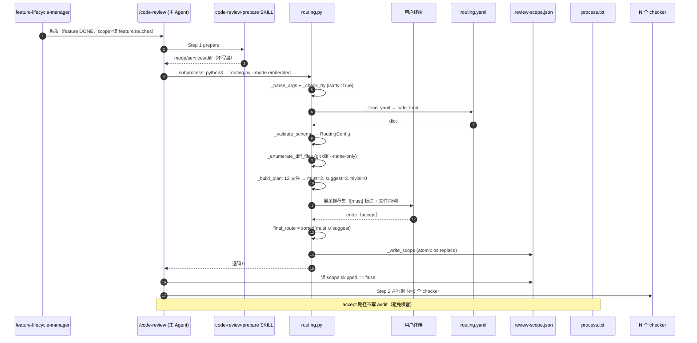
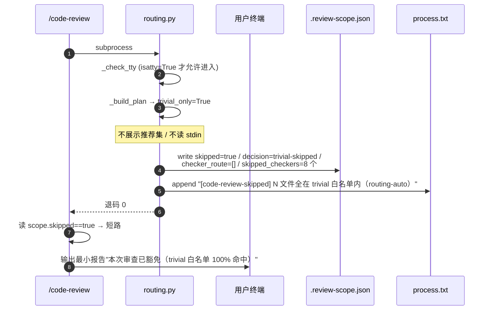
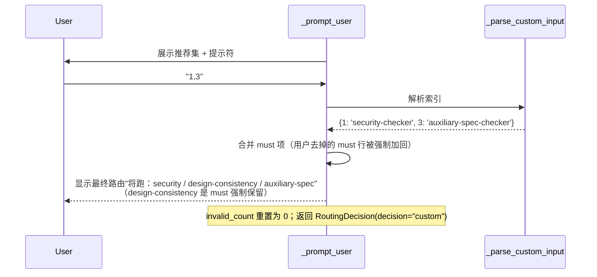
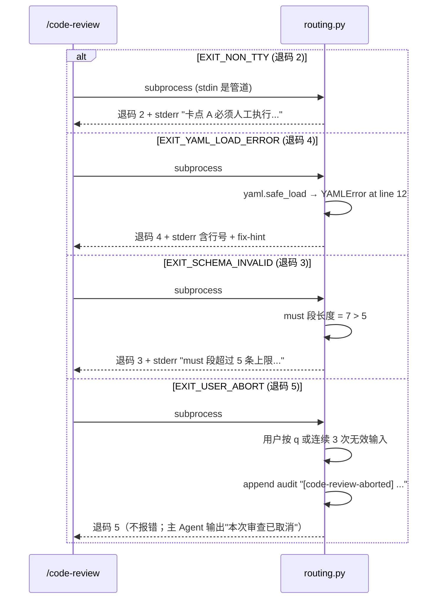

# REQ-2026-003 · 详细设计

> 概要设计基线：requirements/REQ-2026-003/artifacts/outline-design.md
> 三条架构决策（D-001 fail-closed / D-002 4 档热键 / D-003 纯路径规则）见 plan.md「决策记录」段

## 1. 模块目录与文件清单

| 路径 | 类型 | 行数估算 | 说明 |
|---|---|---|---|
| `scripts/lib/code_review_routing.py` | 新增 | ~280 | 路由引擎主体（核心 + tty + audit），见 §2 |
| `.claude/code-review-routing.yaml` | 新增 | ~45 | 路径规则库三段（must / suggest / trivial_whitelist） |
| `tests/lib/test_code_review_routing.py` | 新增 | ~220 | 单元 + tty pty 集成 |
| `tests/lib/test_routing_e2e.sh` | 新增 | ~80 | 端到端（真 routing.py + 真 yaml + 假 diff） |
| `tests/benchmarks/test_routing_perf.py` | 新增 | ~60 | pytest-benchmark P95 < 200ms 验收 |
| `.claude/commands/code-review.md` | 修改 | ~15 行净增/改 | Step 2 改读 checker_route + 加 skipped 短路 |
| `.claude/skills/code-review-prepare/SKILL.md` | 修改 | ~5 行净改 | trivial 100% 命中改为豁免 |
| `.claude/skills/code-review-prepare/reference/scope-schema.md` | 修改 | ~30 行净改 | 新增 `skipped` 顶层 + `routing_decision` + 修关键词遗留 |
| `.github/workflows/quality-check.yml` | 修改 | 1 行 | `pip install` 加 `pathspec>=0.12,<1.0` |

总改动：5 新增 + 4 修改 = 9 处。**所有改动必须同一 PR 提交**（C1/C3/C4/C5 同源 PR 已在 tech-feasibility R-2 强制）。

---

## 2. `scripts/lib/code_review_routing.py` 详细接口

### 2.1 模块级常量与异常

```python
"""code_review_routing.py — /code-review 卡点 A 路由器（D-001 fail-closed / D-002 4 档热键 / D-003 纯路径规则）"""

from __future__ import annotations

import json
import os
import subprocess
import sys
from dataclasses import asdict, dataclass, field
from datetime import datetime
from pathlib import Path
from typing import Literal

import pathspec  # gitignore-flavored glob，需在 quality-check.yml 中预装
import yaml

ALL_CHECKERS: tuple[str, ...] = (
    "complexity-checker", "security-checker", "concurrency-checker",
    "performance-checker", "error-handling-checker",
    "design-consistency-checker", "history-context-checker",
    "auxiliary-spec-checker",
)

ROUTING_YAML_PATH = Path(".claude/code-review-routing.yaml")
SCOPE_JSON_PATH = Path(".review-scope.json")
MAX_INVALID_PROMPTS = 3   # D-002 连续无效输入阈值
MAX_MUST_RULES = 5         # 来源：requirement.md:25

# ---------- 退码协议（D-001 fail-closed 落地，与 outline §3.1 表对齐）----------
EXIT_OK = 0
EXIT_BAD_ARGS = 1
EXIT_NON_TTY = 2
EXIT_SCHEMA_INVALID = 3   # yaml 加载成功但语义不合法（must>5 / 字段类型错 / 必填段缺）
EXIT_YAML_LOAD_ERROR = 4  # yaml IO/解析层失败（文件缺 / YAMLError / 编码错）
EXIT_USER_ABORT = 5       # 用户主动 q 或连续 3 次无效输入


class RoutingError(Exception):
    """路由器异常基类，由 main() catch 后映射退码。"""
    exit_code: int = EXIT_BAD_ARGS


class RoutingYamlError(RoutingError):
    exit_code = EXIT_YAML_LOAD_ERROR


class RoutingSchemaError(RoutingError):
    exit_code = EXIT_SCHEMA_INVALID


class RoutingTTYError(RoutingError):
    exit_code = EXIT_NON_TTY


class RoutingAbort(RoutingError):
    exit_code = EXIT_USER_ABORT
```

### 2.2 数据类（dataclass）

```python
@dataclass(frozen=True)
class MatchResult:
    """pathspec 匹配单个文件的结果。"""
    path: str
    matched_must: list[str] = field(default_factory=list)        # 命中的 must rule pattern
    matched_suggest: list[str] = field(default_factory=list)
    matched_trivial: bool = False


@dataclass(frozen=True)
class RoutingPlan:
    """路由器计算出的推荐集（未经 tty 确认）。

    数据模型不变量（_build_plan 出口 + 单元测试 U-INV-1 强制保障）：
      INV-PLAN-1: set(files_must_hit.keys()) == must_checkers
      INV-PLAN-2: set(files_suggest_hit.keys()) == suggest_checkers
      INV-PLAN-3: must_checkers ⊆ ALL_CHECKERS ∧ suggest_checkers ⊆ ALL_CHECKERS
      INV-PLAN-4: trivial_only=True ⇒ must_checkers == ∅ ∧ suggest_checkers == ∅
                  ∧ files_trivial == files_total ∧ files_total > 0
    F-001 acceptance 必须落契约测试 must_checkers == set(files_must_hit.keys())。
    """
    must_checkers: set[str]      # 来自 must 段命中
    suggest_checkers: set[str]   # 来自 suggest 段命中
    trivial_only: bool            # 100% 命中 trivial_whitelist 且 must/suggest 都未命中
    files_total: int
    files_trivial: int
    files_must_hit: dict[str, list[str]]   # checker -> [paths]，主要供 tty 展示
    files_suggest_hit: dict[str, list[str]]


@dataclass(frozen=True)
class RoutingDecision:
    """tty 卡点 A 的最终决定，写入 .review-scope.json.routing_decision。"""
    decision: Literal["accept", "all", "custom", "abort", "trivial-skipped"]
    confirmed_at: str            # YYYY-MM-DD HH:MM:SS Asia/Shanghai
    confirmed_by: str            # git config user.email
    tty_verified: bool           # 必须 True
    final_route: list[str]       # 排序后的最终 checker 列表（按 ALL_CHECKERS 顺序）
```

### 2.3 公共函数签名（顶层入口）

```python
def main(argv: list[str] | None = None) -> int:
    """CLI 入口；返回退码（不直接 sys.exit，方便单测）。

    步骤：
      1. _parse_args(argv) -> Namespace
      2. _check_tty() -> 非 tty 立即 raise RoutingTTYError
      3. _load_yaml(ROUTING_YAML_PATH) -> dict
      4. _validate_schema(yaml_dict) -> RoutingConfig
      5. _enumerate_diff_files(args.base_sha, args.head_sha) -> list[str]
      6. _build_plan(files, config) -> RoutingPlan
      7. 若 plan.trivial_only:
           写 scope（skipped=true, decision='trivial-skipped'） + audit（trivial-skipped 模板） -> EXIT_OK
         否则:
           _prompt_user(plan) -> RoutingDecision
           写 scope（skipped=false, decision=accept|all|custom）
           audit（仅 custom 写一行；accept 不写避免噪音；abort/non-tty 路径不会到这里）
           -> EXIT_OK
      所有 RoutingError 在 main 中 catch，print 错误模板到 stderr 并返回 .exit_code。
    """
```

### 2.4 内部函数签名

```python
def _parse_args(argv: list[str] | None) -> argparse.Namespace:
    """解析 6 个必填 + 1 可选参数。

    必填：--mode {embedded,standalone} / --requirement-id / --base-sha /
          --head-sha / --base-branch / --current-branch
    可选：--feature-id（embedded 模式可空）/ --services（逗号分隔，可推断）
    校验：mode 枚举 / sha 7 位 hex / requirement-id 格式（^REQ-\d{4}-\d{3}$）/
          email 正则不在此处（confirmed_by 在 _resolve_confirmed_by 校验）
    失败 raise RoutingError(exit_code=EXIT_BAD_ARGS)
    """


def _check_tty() -> None:
    """与 save_review.py:406 同源逻辑。"""
    if not sys.stdin.isatty():
        raise RoutingTTYError("卡点 A 必须人工执行：检测到 stdin 非 tty（AI / 管道 / heredoc 调用被拒绝）")


def _load_yaml(path: Path) -> dict:
    """pyyaml safe_load；文件不存在 / YAMLError / 编码错 → RoutingYamlError(exit_code=4)。"""


@dataclass(frozen=True)
class _RuleEntry:
    pattern: str
    checkers: tuple[str, ...]


@dataclass(frozen=True)
class RoutingConfig:
    version: int
    must: tuple[_RuleEntry, ...]
    suggest: tuple[_RuleEntry, ...]
    trivial_whitelist: tuple[str, ...]


def _validate_schema(raw: dict) -> RoutingConfig:
    """schema 语义校验；任一规则违反 → RoutingSchemaError(exit_code=3)。

    校验项：
      V1: 顶层必含 version / must / suggest / trivial_whitelist 四个键
      V2: version == 1
      V3: must 列表长度 ≤ MAX_MUST_RULES（5）
      V4: must / suggest 每项含 pattern (str) + checkers (list[str])，pattern 非空
      V5: 所有 checkers 元素 ∈ ALL_CHECKERS
      V6: trivial_whitelist 每项是非空 str
      V7: pattern 与 trivial_whitelist 元素调用 pathspec.PathSpec.from_lines 试解析无异常
    """


def _enumerate_diff_files(base_sha: str, head_sha: str) -> list[str]:
    """git diff --name-only base..head；失败抛 RoutingError(EXIT_BAD_ARGS)。"""


def _build_plan(files: list[str], config: RoutingConfig) -> RoutingPlan:
    """对每个文件依次跑 must / suggest / trivial 三组 pathspec 匹配。

    - must 命中：所有匹配规则的 checkers 并入 must_checkers 集合
    - suggest 命中：同理并入 suggest_checkers
    - 没命中 must/suggest 但命中 trivial：files_trivial += 1
    - 三段都没命中：files_trivial 不增、不入 must/suggest——属于"灰色文件"

    trivial_only = (files_must_hit == {} and files_suggest_hit == {} and
                    files_trivial == files_total and files_total > 0)
    """


def _prompt_user(plan: RoutingPlan) -> RoutingDecision:
    """4 档热键交互（D-002）。

    展示模板（行宽 ≤ 100）：
      ─────────────────────────────────────────────────
      代码审查路由器·卡点 A
      diff 共 N 个文件（trivial M / must K1 / suggest K2 / 灰色 G）
      推荐 checker 集（标 [must] 不可去掉）：
        [must] security-checker  ← scripts/lib/save_review.py
        [must] design-consistency-checker  ← scripts/lib/save_review.py
        [sug]  auxiliary-spec-checker  ← .claude/skills/foo/SKILL.md
      ─────────────────────────────────────────────────
      回车=接受推荐  a=升全集 8 路  q=取消  数字逗号(如 1,3)=自定义子集
      >

    输入处理：
      - 空串（直接 enter）→ decision="accept"，final_route = sorted(must ∪ suggest)
      - "a" / "A" → decision="all"，final_route = list(ALL_CHECKERS)
      - "q" / "Q" → 写 abort audit + raise RoutingAbort
      - "1,3,5" 这类数字逗号 → 解析索引（按推荐集中行号 1-based）
        - must 项强制保留：用户去掉 must 行号时仍合并回最终 route
        - 出现非数字 / 索引越界 → 视为 1 次 invalid
      - 连续 invalid 次数 ≥ MAX_INVALID_PROMPTS（3）→ 写 invalid-abort audit + raise RoutingAbort

    invalid 计数器在每次合法输入后清零；累计而非连续过段重置。
    """


def _write_scope(plan: RoutingPlan, decision: RoutingDecision, args: argparse.Namespace) -> None:
    """原子写盘：tmp 文件 + os.replace。

    内容遵循 §3 scope 字段约束：
      - 现有 11 字段透传（mode / requirement_id / feature_id / base_sha / head_sha /
        base_branch / current_branch / services / stats / diff_summary / timestamp）
      - 新增/修改字段：skipped / checker_route / skipped_checkers / routing_decision
      - decision == "abort" / "trivial-skipped" 二者中：trivial-skipped 写盘；
        abort 由 _prompt_user 抛 RoutingAbort，main 不写盘

    abort 路径不写盘，确保下游 critic / judge / report 不会读到一份"半成品" scope。
    """


def _audit_log(req_id: str, line: str) -> None:
    """append 到 requirements/<req_id>/process.txt。

    line 模板（来源 context/team/engineering-spec/time-format.md）：
      "<YYYY-MM-DD HH:MM:SS> [<event-type>] <简短原因>"

    event-type 枚举：
      code-review-skipped       — trivial-100% 命中
      code-review-aborted       — q 主动 / 连续 3 次无效；备注后缀区分
      code-review-route-custom  — 用户用 1,3 自定义子集（accept/all 不写）
    """


def _resolve_confirmed_by() -> str:
    """读 git config user.email；空或不含 @ 抛 RoutingError(EXIT_BAD_ARGS)。"""


# 错误模板表（_ERROR_MESSAGES）见 §6
```

---

## 3. `.review-scope.json` 字段最终契约

### 3.1 完整 schema（合并现有 + 增量）

```jsonc
{
  // ─────── 现有 11 字段（来源：scope-schema.md:7-25，本需求不动）───────
  "mode": "embedded" | "standalone",
  "requirement_id": "REQ-2026-003",
  "feature_id": "F-002",          // 仅 embedded 必填，standalone null
  "base_sha": "abc1234",
  "head_sha": "def5678",
  "base_branch": "develop",
  "current_branch": "feat/req-2026-003",
  "services": ["agentic-meta-engineering"],
  "stats": {"files_changed": 12, "insertions": 320, "deletions": 45},
  "diff_summary": "scripts/lib/foo.py (+12 -3)\n.claude/skills/bar/SKILL.md (+8 -2)",
  "timestamp": "2026-04-30T21:23:50+08:00",

  // ─────── 本需求新增/修订字段 ───────

  // 顶层布尔；trivial 100% 命中 → true，其余场景必须 false
  "skipped": false,

  // 本次实际跑的 checker 列表，按 ALL_CHECKERS 顺序
  "checker_route": ["security-checker", "design-consistency-checker"],

  // 被跳过的 checker 及原因（按路径表述，非关键词；模板见 §3.3）
  // 注：本示例对应 decision="accept"，checker_route 长度 2 + skipped_checkers 长度 6，
  // 此处仅示前 2 项，省略其余 4 项以保示例紧凑；实际写盘必须满足 I8（两者长度合 == 8）。
  "skipped_checkers": [
    {"name": "complexity-checker", "reason": "路径未命中 must/suggest 任何规则"},
    {"name": "concurrency-checker", "reason": "路径未命中 must/suggest 任何规则"}
    // ... 省略 4 项（performance / error-handling / history-context / auxiliary-spec）
  ],

  // 路由确认元信息（替代旧 routing_confirmed_by，命名修正为 routing_decision）
  "routing_decision": {
    "decision": "accept",          // accept / all / custom / trivial-skipped
                                   // abort 路径不写盘，不会出现该值
    "confirmed_at": "2026-04-30 21:23:50",   // YYYY-MM-DD HH:MM:SS Asia/Shanghai
    "confirmed_by": "user@example.com",      // git config user.email
    "tty_verified": true,                    // 必须 true
    "files_must_hit": 3,                     // 触发 must 命中的文件数（审计用）
    "files_suggest_hit": 5,
    "files_trivial": 0,
    "files_total": 8
  }
}
```

### 3.2 不变量（违反任一项视为脏 scope，下游应拒读）

| 不变量 | 描述 |
|---|---|
| I1 | `decision="trivial-skipped"` ⇔ `skipped=true` ∧ `checker_route=[]` ∧ `skipped_checkers` 含 8 个全集 |
| I2 | `decision="all"` ⇔ `skipped=false` ∧ `checker_route` 等于 `ALL_CHECKERS`（顺序敏感） |
| I3 | `decision="custom"` → `checker_route` 必含 plan 中所有 must 命中 checker（用户不可去掉 must） |
| I4 | `decision="abort"` → 不应有 scope 文件（routing.py 不写盘） |
| I5 | `routing_decision.tty_verified` 必须 `true`（routing.py 不接受非 tty 路径写盘） |
| I6 | `confirmed_by` 必须匹配 `^[^@\s]+@[^@\s]+\.[^@\s]+$`，否则 routing.py 退码 1 |
| I7 | `skipped=true` ⇒ `checker_route=[]` 且 `len(skipped_checkers)==8` |
| I8 | `len(checker_route) + len(skipped_checkers) == 8`（除 trivial-skip 外严格成立） |

### 3.3 `skipped_checkers.reason` 三选一模板（D-003 路径表述定稿）

| 触发场景 | reason 字符串 |
|---|---|
| 路径未命中任何 must/suggest 规则 | `"路径未命中 must/suggest 任何规则"` |
| 用户在 custom 子集中未选择 | `"用户在 custom 子集中未选择"` |
| trivial-skip 路径下被全部跳过 | `"diff 全在 trivial 白名单内（skipped=true 全 8 个）"` |

> 这三种字符串机器化分类见 testing 阶段的 audit 统计脚本：按 reason 字串 group by 即可。任何其他表述视为旧 dirty 数据（如 scope-schema.md:65-66 关键词遗留）。

---

## 4. `.claude/code-review-routing.yaml` 最终内容（v1）

```yaml
# 路由器规则库 — /code-review 卡点 A 引擎读取
# Schema 校验：scripts/lib/code_review_routing.py:_validate_schema
# 修改后效：本仓库下次 /code-review 直接生效；CI 不缓存
version: 1

# ─────── must 段：高风险路径，强制全跑相关 checker（≤ 5 条，D-001 fail-closed 校验）───────
must:
  # Q1-1：审查管道核心鉴权脚本（含本需求自身的 routing.py）
  - pattern: "scripts/lib/{save_review,code_review_signoff,code_review_routing,check_signoff_audit}.py"
    checkers: [security-checker, design-consistency-checker]

  # Q1-2：门禁系统（registry / runner / plugin），改动直接影响所有需求的 phase 切换
  - pattern: "scripts/gates/**"
    checkers: [security-checker, concurrency-checker]

  # Q1-3：所有 slash commands 是 AI 工具的对外契约
  - pattern: ".claude/commands/**"
    checkers: [design-consistency-checker, auxiliary-spec-checker]

  # Q1-4：所有 SKILL.md 是 AI 工具契约入口；reference/ 详细规则不在 must（量大且变化频繁）
  - pattern: ".claude/skills/**/SKILL.md"
    checkers: [design-consistency-checker, auxiliary-spec-checker]

  # Q1-5：Hook 脚本运行在每个 PreToolUse / Stop 事件，错一行影响所有会话
  - pattern: ".claude/hooks/**"
    checkers: [security-checker, concurrency-checker]

# ─────── suggest 段：推荐路径，命中后建议跑（用户可在 custom 中去掉，无上限）───────
suggest:
  # 团队规范文档（影响面广，但语义为说明性，不强制）
  - pattern: "context/team/engineering-spec/**"
    checkers: [design-consistency-checker]

  # check_*.py 等校验逻辑（被 plugins 直接 import；非鉴权但属于审查管道支撑）
  - pattern: "scripts/lib/check_*.py"
    checkers: [design-consistency-checker, error-handling-checker]

  # SKILL reference/ 详细规则（非入口，但容易写错被 LLM 误导）
  - pattern: ".claude/skills/**/reference/**"
    checkers: [design-consistency-checker]

  # Agent 定义（影响子 Agent 行为）
  - pattern: ".claude/agents/**"
    checkers: [design-consistency-checker, auxiliary-spec-checker]

  # 项目级 INDEX（位置即语义的入口，必须保持索引完整）
  - pattern: "context/**/INDEX.md"
    checkers: [auxiliary-spec-checker]

# ─────── trivial_whitelist：100% 命中即 skipped=true，跳过整个 review ───────
trivial_whitelist:
  - "**/*.md"                       # 所有 Markdown 默认豁免
  - "docs/**"
  - "**/*.txt"
  - "**/*.rst"
  - "**/.gitignore"
  - "**/*.yaml.example"

  # Q2 决策：notes.md 默认豁免（过程文档，跨需求改动相互独立；含 hook artifact 自动生成内容）
  - "requirements/*/notes.md"

  # 例外提醒（写在 plan.md 决策记录而非 yaml）：
  # 跨需求 ai-collaboration.md / context/team/*.md 改动必须用 /code-review 独立模式手动审，
  # 不靠 trivial 白名单豁免——这两类改动属于"协作元规则"，必须经 design-consistency 检查。
```

**must 段命中样例（验证用）**：

| 文件 | 命中 |
|---|---|
| `scripts/lib/code_review_routing.py` | must 1（本身） |
| `scripts/gates/run.py` | must 2 |
| `.claude/commands/code-review.md` | must 3 |
| `.claude/skills/code-review-prepare/SKILL.md` | must 4 |
| `.claude/hooks/protect-branch.sh` | must 5 |

5 条 must 互不重叠，pathspec gitignore 语义下无歧义（详见 §7.1 R-1 缓解）。

---

## 5. 关键时序图（精化）

### 5.1 主流程：embedded 模式 accept 路径



### 5.2 trivial-skip 短路（无 tty 交互）



### 5.3 4 档热键交互细节（用户输入 `1,3` 的子流程）



### 5.4 fail-closed 路径四分支



---

## 6. 错误文案模板（D-001 Consequences 闭环；4 个 [待补充] 之第 2）

`_ERROR_MESSAGES: dict[int, str]` 常量定义（routing.py 模块级）：

| 退码 | stderr 模板 |
|---|---|
| 1 | `[routing] 入参非法：{detail}\n  fix-hint：检查 --mode / --requirement-id / --base-sha / --head-sha / --base-branch / --current-branch 必填项；sha 格式应为 7 位短 hash；requirement-id 格式应为 REQ-YYYY-NNN。` |
| 2 | `[routing] 卡点 A 必须人工执行：检测到 stdin 非 tty（AI / 管道 / heredoc 调用被拒绝）。\n  fix-hint：在交互式终端手动运行 /code-review；CI 场景请直接跳过本步。` |
| 3 | `[routing] routing.yaml schema 校验失败：{detail}\n  fix-hint：参考 .claude/code-review-routing.yaml 的现有结构；must 段最多 5 条；checkers 元素必须 ∈ 8-checker 全集。` |
| 4 | `[routing] routing.yaml 加载失败：{file}:{line} {detail}\n  fix-hint：确认文件存在、yaml 语法正确、UTF-8 编码；可用 yamllint 离线校验。` |
| 5 | `[routing] 本次审查已取消（{cause}）。`<br>cause ∈ {`用户主动按 q`, `连续 3 次无效输入`} |

**实现要求**：

- yaml 语法错时 `RoutingYamlError` 必须捕获 `yaml.YAMLError.problem_mark.line` 写入 `{line}`
- schema 错时 `RoutingSchemaError` 必须给出违反的具体 V 编号（如 `V3: must 段长度 7 超过 5`）
- 退码 5 stderr 用 stdout 输出（用户主动 abort 不属于错误，避免 CI/wrapper 误判异常）—— 但 process.txt audit 一定写

---

## 7. 退码 3 vs 4 精确分界（tech-feasibility 待澄清 2 / Q2 落定）

| 退码 | 触发条件 | 实现位置 |
|---|---|---|
| **4** | yaml IO/解析层失败 | `_load_yaml` |
| | - 文件不存在 (`FileNotFoundError`) | |
| | - 编码错 (`UnicodeDecodeError`) | |
| | - yaml 语法错 (`yaml.YAMLError`，含 ScannerError / ParserError) | |
| **3** | yaml 已加载成功但语义不合法 | `_validate_schema` |
| | V1: 顶层缺 version / must / suggest / trivial_whitelist 任一键 | |
| | V2: version != 1 | |
| | V3: must 长度 > 5 | |
| | V4: 任一条目缺 pattern / checkers，或 pattern 非 str / checkers 非 list | |
| | V5: checkers 元素 ∉ ALL_CHECKERS | |
| | V6: trivial_whitelist 含非 str 或空字符串 | |
| | V7: pattern 字符串 pathspec.PathSpec.from_lines 解析异常 | |

**不属于退码 3 的场景**（明确不阻断常规流程）：

- 推荐集为空（plan.must_checkers ∪ plan.suggest_checkers == ∅）但非 100% trivial → 走正常 tty 路径展示空推荐集，用户可选 `a` 升全集 / `q` 取消
- 灰色文件存在（既不命中 must/suggest 也不命中 trivial）→ 不报错，进入正常 tty 路径

---

## 8. tty 4 档热键 UX 与连续无效阈值（D-002 + Q3 闭环）

### 8.1 输入解析规则（_prompt_user 内部）

| 输入串 | 处理 |
|---|---|
| `""`（直接 enter） | `accept`，final_route = sorted(must ∪ suggest) |
| `a` / `A` | `all`，final_route = list(ALL_CHECKERS) |
| `q` / `Q` | `abort`，写 audit `用户主动取消 (q)` 后 raise RoutingAbort |
| 数字逗号串（如 `1,3,5` / `1, 3` / `1,3 ,5`） | 解析为 1-based 索引集合 |
| 其他（含空白、字母混杂、负数、超界） | invalid_count += 1 |

### 8.2 数字逗号子集解析

- 推荐集按"按 ALL_CHECKERS 顺序排序后的 must ∪ suggest"行号编号 1-based（must 项标 `[must]`）
- 用户输入索引集合 → 取交集；若交集为空 → invalid
- **must 强制保留**：解析后无论用户是否选择 must 行号，最终 final_route 必含 plan.must_checkers 全部
- final_route 输出按 ALL_CHECKERS 顺序去重排序

### 8.3 连续无效阈值（Q3 沿用 3 次）

- `invalid_count` 累加；每次合法输入（accept/all/abort/custom）后清零
- `invalid_count >= MAX_INVALID_PROMPTS (3)` → audit `连续 3 次无效输入` + raise RoutingAbort（退码 5）
- 错误提示模板：`[invalid] 不识别的输入。提示：直接回车=接受 / a=全集 / q=取消 / 数字逗号(如 1,3)=自定义子集（剩余 {n} 次机会）`

### 8.4 audit 颗粒度（outline §3.1 Q4 落定）

| 场景 | process.txt 行 |
|---|---|
| accept | **不写**（默认路径，避免噪音） |
| all | **不写**（同上） |
| custom | `<ts> [code-review-route-custom] 用户自定义子集：{checker 列表}` |
| q 主动取消 | `<ts> [code-review-aborted] 用户主动取消 (q)` |
| 连续 3 次无效 | `<ts> [code-review-aborted] 连续 3 次无效输入` |
| trivial-skipped | `<ts> [code-review-skipped] N 文件全在 trivial 白名单内（routing-auto）` |

两类 abort 颗粒度独立追踪（"路由质量"信号 vs "UX 清晰度"信号）。

---

## 9. 文档同步面（C3 / C4 / C5 改动细节）

### 9.1 `.claude/commands/code-review.md` 修订

| 现行行 | 现状 | 修订 |
|---|---|---|
| L21 | "code-review-prepare Skill" 单独负责 prepare | 改为"prepare → routing.py" 两步串行；明示 routing.py 写盘 |
| L23-25 | "取 diff / 确定 services / 写 .review-scope.json" | 改为"取 diff / 确定 services（不写盘）" |
| L27 后新增段 | — | **新增 Step 2-pre：路由器（routing.py）卡点 A**——subprocess 调用，处理退码 0/2/3/4/5 五个分支 |
| L28-29 | "Step 2 并行 8 个 checker" | 改为"Step 2 读 .review-scope.json；若 skipped==true 输出最小报告并 return；否则按 checker_route 并行 N 个 checker" |
| L29-38 | 硬编码 8 个 checker 名 | 删除硬编码列表；改为"按 scope.checker_route 并行（N=1..8）" |
| L44 | critic 直接读 scope | 不变（skipped 路径上 critic 根本不会被调） |
| L50 | judge 直接读 scope | 不变 |

### 9.2 `code-review-prepare` SKILL.md 修订

| 现行行 | 现状 | 修订 |
|---|---|---|
| L14-15 | "取 diff / 写 .review-scope.json" | 改为"取 diff / 输出元信息（不写盘）；写盘职责下放 routing.py" |
| L17-21 | 卡点 A 描述（含 L20 "trivial 不豁免"） | **重写**：明确"100% trivial → routing.py 写 skipped=true，跳过整个 review"，删除"trivial 不豁免"旧描述（tech-feasibility R-3） |
| L17 内联 | "code_review_routing.py" 引用 | 改为完整路径 `scripts/lib/code_review_routing.py` |

### 9.3 `code-review-prepare/reference/scope-schema.md` 修订

| 现行行 | 现状 | 修订 |
|---|---|---|
| L42-49 | "由 code_review_routing.py 统一生成" | 表述不变；补充"含 trivial-skip 短路逻辑" |
| L53-94（F-002 段） | `routing_confirmed_by` 子段 | 改名为 `routing_decision`（语义更准确）；新增顶层 `skipped` boolean；按 §3.1 完整 schema 重写本节 |
| L65 reason 示例 | `"diff 未命中 concurrency 关键字"`（关键词遗留） | 改为 §3.3 三选一模板之一 |
| L70-71 mode_hint | `mode_hint` 字段（旧 F-002 设计） | **删除**——`routing_decision.decision` 已涵盖此语义，避免冗余字段 |
| L94-101 不变量 | 旧不变量 | 替换为 §3.2 I1-I8 八条 |

### 9.4 `.github/workflows/quality-check.yml` 修订

L25：`pip install pyyaml ruamel.yaml` → `pip install pyyaml ruamel.yaml "pathspec>=0.12,<1.0"`

---

## 10. 测试详细规格

### 10.1 单元测试（pytest，~12 个用例）

| 用例编号 | 函数 | 场景 |
|---|---|---|
| U1 | `_load_yaml` | 文件不存在 → RoutingYamlError(4) |
| U2 | `_load_yaml` | yaml 语法错 → RoutingYamlError(4) 含行号 |
| U3 | `_load_yaml` | UnicodeDecodeError → RoutingYamlError(4) |
| U4 | `_validate_schema` | 缺 version 顶层键 → RoutingSchemaError(3) V1 |
| U5 | `_validate_schema` | must 长度 6 → RoutingSchemaError(3) V3 |
| U6 | `_validate_schema` | checkers 含 unknown-checker → RoutingSchemaError(3) V5 |
| U7 | `_match_paths`（单元化 _build_plan 子逻辑） | `**/auth/**` vs `auth/**` 锚定差异（R-1 缓解） |
| U8 | `_build_plan` | 12 文件 mixed → must=2 / suggest=3 / trivial=4 / 灰色=3 |
| U9 | `_build_plan` | 5 文件全 .md → trivial_only=True |
| U10 | `_build_plan` | 路径含中文 / 空格 / 特殊字符 → 不崩溃 |
| U11 | `_parse_custom_input`（_prompt_user 子函数） | `"1,3"` / `"1, 3"` / `" 1 ,3 "` 容错 |
| U12 | `_parse_custom_input` | must 强制保留：用户输 `2`（去掉 must 1）→ 最终 must 1 仍在 |

### 10.2 tty 集成测试（pytest + pty，~5 个）

通过 `pty.openpty()` 启动 routing.py 子进程，向 master 端写入按键模拟用户输入。

| 用例编号 | 场景 |
|---|---|
| T1 | 直接 enter → decision=accept |
| T2 | `a\n` → decision=all |
| T3 | `1,3\n` → decision=custom，validate must 强制保留 |
| T4 | `q\n` → 退码 5 + audit 含"用户主动取消" |
| T5 | `xxx\nyyy\nzzz\n` → 退码 5 + audit 含"连续 3 次无效输入" |
| T6 | stdin 非 pty（普通 pipe）→ 退码 2 |

### 10.3 端到端测试（bash + 真 routing.py + 假 git diff，4 个）

`tests/lib/test_routing_e2e.sh` 用 `git init` 临时仓库 + `git commit` 制造 diff：

| 用例编号 | 场景 | 期望 |
|---|---|---|
| E1 | 改 `scripts/lib/save_review.py`（must 1 命中） | accept 后 checker_route 含 security + design-consistency |
| E2 | 改 5 个 .md 文件（trivial 100%） | 退码 0 + skipped=true + audit 写 trivial-skipped |
| E3 | 把 routing.yaml 的 must 写成 6 条 | 退码 3 + stderr 含"V3" |
| E4 | 把 routing.yaml 写成不合法 yaml | 退码 4 + stderr 含行号 |

### 10.4 benchmark（Q4 闭环；4 个 [待补充] 之第 3）

`tests/benchmarks/test_routing_perf.py` 用 `pytest-benchmark`：

| 用例 | diff 规模 | 验收 |
|---|---|---|
| B1 trivial-only | 50 文件全 .md | P95 < 100ms（含 yaml 加载冷启动） |
| B2 mixed | 200 文件 mixed | P95 < 200ms |
| B3 large | 2000 文件 mixed（来源：requirement.md:73 上限） | P95 < 200ms（边界） |

执行：`pytest tests/benchmarks/test_routing_perf.py --benchmark-json=out.json`，CI 不强制（标 `pytest.mark.benchmark`），本地 / 临测跑。冷启动包含——更接近真实路径。

---

## 11. 跨模块影响（细化）

### 11.1 critic / judge / report 不会被调起的证明（防御性 contract test）

`skipped=true` 路径下主 Agent 在 `commands/code-review.md` Step 2 后立即判 skipped 短路，**critic / judge / report 根本不会被调起**。但为防止 commands/code-review.md 被改动后误触发：

- T-CRITIC-1：把 `skipped=true` 的 scope 喂给 review-critic Agent → 它应优雅返回空 verdicts 数组，不应 traceback
- T-JUDGE-1：同上喂给 code-quality-reviewer → 应返回 `conclusion="skipped"` 不崩溃
- T-REPORT-1：code-review-report SKILL 接 `scope.skipped=true` → 主 Agent 不调它（验证 commands/code-review.md 短路条件）

这三条 contract test 在 testing 阶段以 mock scope 文件方式执行，作为防御性保障。**本需求不修改这三个组件的核心逻辑**——仅添加防御性 if 短路（约 3 行/组件）。

### 11.2 feature-lifecycle-manager 触发链（不动代码）

确认 `feature-lifecycle-manager/SKILL.md:49` 的触发逻辑无需修改——routing.py 透明接入 `/code-review`。验证：用 mock feature DONE 流程跑一次 `/code-review` 嵌入模式，scope.feature_id 透传到 routing.py 的 `--feature-id` 参数。

### 11.3 process.txt 写入通道竞争

routing.py 与 `requirement-progress-logger` Skill 都写 `requirements/<id>/process.txt`。约定：

- **routing.py 写**：`code-review-skipped` / `code-review-aborted` / `code-review-route-custom` 三个 event-type
- **logger Skill 写**：`phase-transition` / `save` / `signoff` / `review:*` 等流程事件
- 两者命名空间不冲突；append 模式天然多 writer 安全（POSIX 短行 < PIPE_BUF）

---

## 12. 待澄清清单（detail-design 闭环检查）

| outline / tech-feasibility 待澄清项 | 闭环位置 |
|---|---|
| Q1 must 5 条草案 vs 实际目录 | §4 yaml 5 条规则 |
| Q2 trivial 含 notes.md | §4 trivial_whitelist 第 7 行 |
| Q3 连续 3 次无效阈值 | §8.3 沿用 3，testing 阶段保留可调 |
| Q4 退码 5 audit 颗粒度 | §8.4 三类不同审计行 |
| 退码 3 触发场景 | §7 V1-V7 七项 |
| pathspec 版本锁 | §9.4 `pathspec>=0.12,<1.0` |
| 错误文案模板 | §6 五退码 + fix-hint |
| benchmark 用例定义 | §10.4 B1-B3 三档 |
| skipped_checkers.reason 模板 | §3.3 三选一字符串 |

**全部 9 项 outline / tech-feasibility 留待 detail-design 的项目均已闭环**。

---

## 13. 实施顺序建议（features.json 拆分依据）

详见 `requirements/REQ-2026-003/artifacts/features.json`。粒度依据：

- **F-001**（routing.py 核心引擎）：yaml 加载 + schema 校验 + pathspec 匹配 + 数据类（无 tty / IO 顺利成单测）
- **F-002**（tty 卡点 + 4 档热键 + audit）：依赖 F-001 的 RoutingPlan / RoutingDecision dataclass
- **F-003**（routing.yaml 落地 + 3 处文档同步）：可与 F-002 并行，但需 F-001 的 schema 定稿
- **F-004**（CI 依赖 + e2e + benchmark）：依赖前 3 个完成

依赖图：F-001 → F-002, F-003 → F-004
