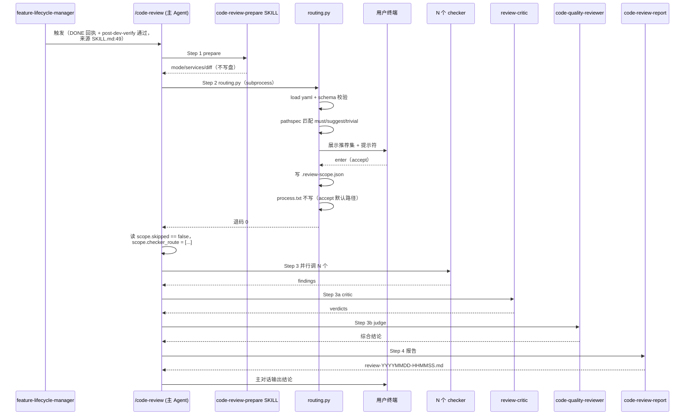
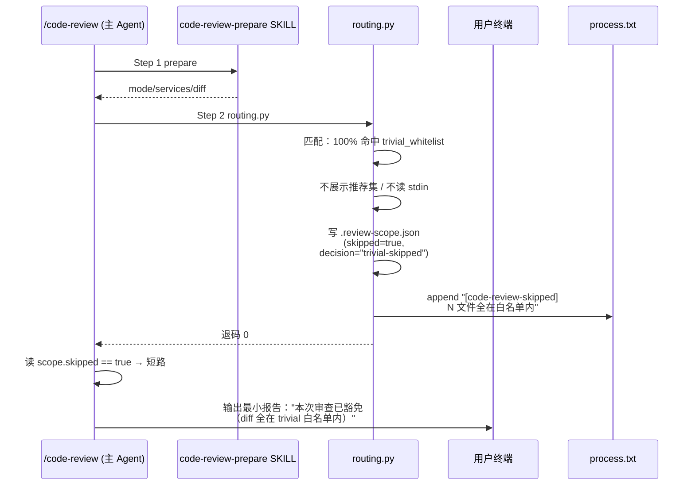
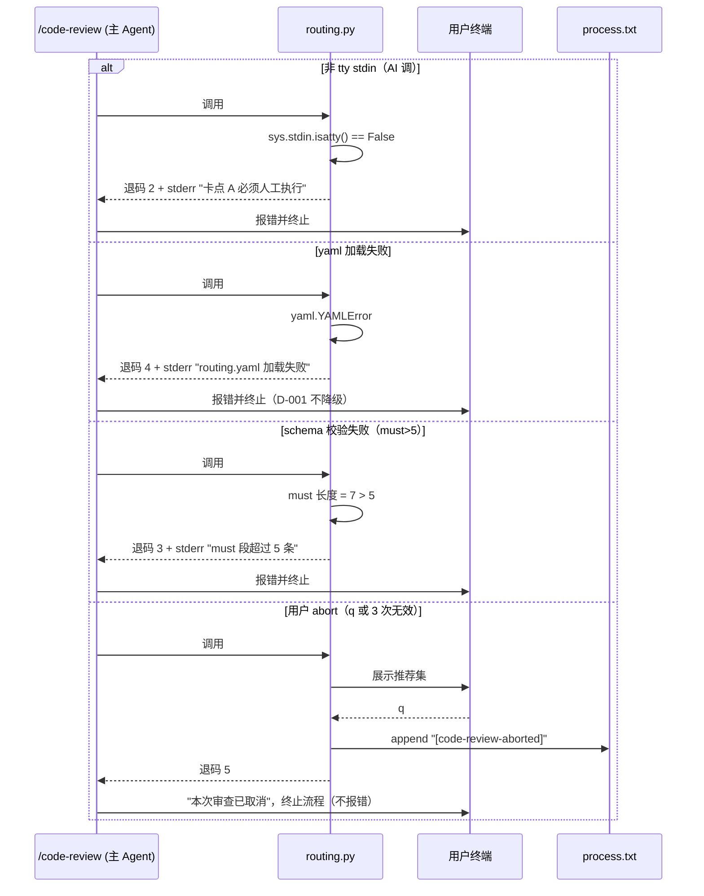

# REQ-2026-003 · 概要设计

## 1. 总体架构

### 1.1 路由器在 `/code-review` 流水线中的位置

新增的卡点 A 路由器（`routing.py`）取代当前 `code-review-prepare` Skill 的写盘职责，作为 `/code-review` 的**第 2 步**——在 prepare 取完 diff、确定 services 之后，紧接着做"按需路由 + tty 卡点 + 审计行落盘"，再驱动后续并行 checker。

```
/code-review 命令编排（修订后）
┌────────────────────────────────────────────────────────────────┐
│  1. code-review-prepare Skill                                  │
│     - 识别 mode（embedded / standalone）                       │
│     - 取 diff 增量、确定 services                              │
│     - 不再自己写 .review-scope.json（职责下放给 routing.py）   │
└────────────────────────────────────────────────────────────────┘
                              │
                              ▼
┌────────────────────────────────────────────────────────────────┐
│  2. ★新增★ routing.py（卡点 A）                                │
│     - 加载 .claude/code-review-routing.yaml                    │
│     - schema 校验：must ≤5、字段类型、非空（D-001 fail-closed）│
│     - 用 pathspec 对 diff 路径做 must / suggest / trivial 匹配 │
│     - tty 校验（sys.stdin.isatty()）→ 非 tty 退码 2            │
│     - 100% 命中 trivial_whitelist → 写 skipped=true 短路       │
│     - 否则展示推荐集 → tty 4 档热键（D-002）→ 写 .review-     │
│       scope.json（含 checker_route + routing_decision）        │
│     - 任何失败均 fail-closed（退码 2/3/4，D-001）              │
│     - process.txt 追加审计行（accept / all / custom / abort /  │
│       trivial-skipped）                                        │
└────────────────────────────────────────────────────────────────┘
                              │
                ┌─────────────┴─────────────┐
                ▼                           ▼
       skipped=true 短路            正常路径（checker_route≠[]）
                │                           │
                ▼                           ▼
┌──────────────────────────┐  ┌─────────────────────────────────┐
│ 主 Agent 跳过 step 3-4   │  │ 3. 并行 N 个 checker            │
│ 写一个最小报告：          │  │    （N=len(checker_route)，     │
│ "本次 diff 全在 trivial  │  │     1-8 之间）                  │
│ 白名单内，已豁免审查"     │  │ 4. critic + judge + report      │
└──────────────────────────┘  └─────────────────────────────────┘
                              │
                              ▼
                     5. /code-review:signoff（卡点 B，已实现，不变）
```

> 编排来源：.claude/skills/code-review-prepare/SKILL.md:14（取 diff 增量、确定 services）。

### 1.2 三个组件的角色

| 组件 | 角色 | 改动类型 |
|---|---|---|
| `code-review-prepare` SKILL | 取 diff、识别 mode、把控制权交 routing.py | 修改（删除"写盘"职责，与 routing.py 边界明确化） |
| `routing.py`（新） | 加载 yaml + 路由匹配 + tty 卡点 + 写 .review-scope.json + audit | 新增（C1，~250 行，来源：requirements/REQ-2026-003/artifacts/tech-feasibility.md:76） |
| `routing.yaml`（新） | 路径规则库（must/suggest/trivial_whitelist 三段） | 新增（C2，~40 行，来源：requirements/REQ-2026-003/artifacts/tech-feasibility.md:77） |

---

## 2. 模块边界

### 2.1 `scripts/lib/code_review_routing.py`

**单一职责**：把 diff 路径映射为 checker 列表 + 强制人工确认。

| 内部子模块 | 职责 | 边界 |
|---|---|---|
| `_load_yaml` | pyyaml safe_load + schema 校验 | 失败抛 `RoutingYamlError` → 退码 4 |
| `_validate_schema` | must ≤5（来源：requirements/REQ-2026-003/artifacts/requirement.md:25）+ 字段类型 + 非空 | 失败抛 `RoutingSchemaError` → 退码 3 |
| `_match_paths` | pathspec 把 diff 路径分成 must/suggest/trivial 三组 | 纯函数，零 IO |
| `_check_tty` | `sys.stdin.isatty()` → False 立刻 `sys.exit(2)` | 与 `save_review.py:406` 同源（来源：requirements/REQ-2026-003/artifacts/tech-feasibility.md:37） |
| `_prompt_user` | 4 档热键交互（enter/a/q/数字逗号），连续 3 次无效 abort | tty IO 唯一入口 |
| `_write_scope` | 原子写盘：tmp 文件 + os.replace | 失败抛 IOError，主 Agent 处理 |
| `_audit_log` | append 行到 `requirements/<id>/process.txt` | 仅 trivial-skip / abort / custom 时写 |

**对外 CLI 协议**：见 §3.1。

### 2.2 `.claude/code-review-routing.yaml`

**单一职责**：路径规则库，团队内统一维护。三段（must / suggest / trivial_whitelist）。

**must 段适配方法**（本仓库 instance）：

requirement.md:25 的 brainstorming 草案列了 `auth / payment / db migrations / api / sql` 5 类业务高风险路径。本仓库是工具/Meta 仓库，**无对应业务目录**——按"对项目最敏感的入口/契约/规范"重映射，candidate 5 类（detail-design 定稿，从中精炼合并到 ≤5 条）：

1. **review pipeline 鉴权脚本**：`scripts/lib/{save_review,code_review_signoff,code_review_routing,check_*}.py` → security + design-consistency
2. **门禁系统**：`scripts/gates/**` → security + concurrency
3. **AI 工具契约**：`.claude/commands/**` `.claude/skills/**` → design-consistency + auxiliary-spec
4. **团队规范**：`context/team/engineering-spec/**` → design-consistency
5. **buffer 槽**：detail-design 阶段视实际 5 类合并粒度决定填什么（如 `requirements/*/meta.yaml` schema 守护、`scripts/lib/check_*.py` 校验逻辑）

**示例 yaml 骨架**（含本仓库映射 + Q2 落实的 notes.md 豁免规则）：

```yaml
version: 1

must:                         # 高风险路径，强制全跑相关 checker（≤5 条）
  - pattern: "scripts/lib/{save_review,code_review_signoff,code_review_routing}.py"
    checkers: [security-checker, design-consistency-checker]
  - pattern: "scripts/gates/**"
    checkers: [security-checker, concurrency-checker]
  # ... ≤5 条（detail-design 定稿）

suggest:                      # 推荐路径，命中后建议跑（用户可在 custom 中去掉）
  - pattern: ".claude/commands/**"
    checkers: [design-consistency-checker, auxiliary-spec-checker]
  - pattern: ".claude/skills/**"
    checkers: [design-consistency-checker, auxiliary-spec-checker]
  - pattern: "context/team/engineering-spec/**"
    checkers: [design-consistency-checker]

trivial_whitelist:            # 100% 命中即 skipped=true，跳过整个 review
  - "**/*.md"
  - "docs/**"
  - "**/*.txt"
  # Q2 决策（2026-04-30）：notes.md 默认豁免——它是过程文档，跨需求改动相互独立，
  # 部分内容是 hook artifact 自动生成（如 [hook-skipped:claude-exit-143]）。
  # 例外路径：cross-requirement 元规则改动需用 /code-review 独立模式手动审。
  - "requirements/*/notes.md"
```

**详细 schema** + must 5 条具体规则的最终定稿留 detail-design 阶段。

### 2.3 `.claude/commands/code-review.md` 修改面

| 行号 | 现状 | 修订 |
|---|---|---|
| L21 | "code-review-prepare Skill" 单独负责 prepare | 改为"prepare + routing 两步"，明示控制权交 routing.py |
| L29-38 | 硬编码 8 个 checker 全跑（来源：.claude/commands/code-review.md:29） | **删除"硬编码 8 个"**；改为读 `.review-scope.json.checker_route`，并行调 N 个 |
| L29 前 | 无 | 新增 **skipped 短路判断**：`if scope.skipped == true → 主 Agent 输出最小报告 → return`（不调 critic / judge / report） |
| L44, L50 | critic / judge 直接读 scope | **不变**（critic / judge 在 skipped 路径上根本不会被调） |

### 2.4 `code-review-prepare` SKILL.md + scope-schema.md 同步点

- `SKILL.md:14-15` 现状声明"取 diff / 写 .review-scope.json" — 改为"取 diff / 调 routing.py / routing.py 负责写盘"
- `SKILL.md:17-21` 卡点 A 描述需重写：明确"trivial 100% 命中 → skipped=true 跳过整个 review"，删除 SKILL.md:20 的"trivial 不豁免"旧描述（来源：requirements/REQ-2026-003/artifacts/tech-feasibility.md:68）
- `scope-schema.md:65-66` 的 `skipped_checkers.reason` 示例 `"diff 未命中 concurrency 关键字"` 是关键词扫描遗留，与 D-003 矛盾——必须改为路径表述（如 `"路径未命中 must/suggest 任何规则"`）
- `scope-schema.md` 新增**顶层 `skipped` 布尔字段** + `routing_decision` 子段（取代 `routing_confirmed_by`，命名更准确）；详见 §3.2

---

## 3. 关键接口契约

### 3.1 routing.py CLI 协议

**调用形式**：

```bash
python3 scripts/lib/code_review_routing.py \
  --mode embedded|standalone \
  --requirement-id REQ-2026-003 \
  [--feature-id F-007] \
  --base-sha <sha> --head-sha <sha> \
  --base-branch develop --current-branch <branch> \
  --services svc-a,svc-b
```

**stdin / stdout**：
- stdin：tty 交互输入（4 档热键）
- stdout：人类可读的推荐集展示 + 提示符
- stderr：日志（INFO / WARN / ERROR）

**输出文件**：项目根 `.review-scope.json`（成功路径写盘；abort / 失败不写盘）。

**退码协议**（D-001 fail-closed 落地）：

| 退码 | 含义 | 触发场景 | 主 Agent 处置 |
|---|---|---|---|
| 0 | 成功 | 写盘完成，含 skipped=true 也算成功 | 继续：读 scope，按 skipped 短路或调 N 个 checker |
| 1 | 参数非法 | --mode 非法 / 缺必填 / SHA 格式错 | 报错"routing.py 入参非法"，终止 |
| 2 | 非 tty stdin | AI / 管道 / heredoc 调用 | 报错"卡点 A 必须人工执行"，终止 |
| 3 | yaml schema 校验失败 | must >5 / 字段类型错 / 必填段缺失 | 报错"routing.yaml schema 异常，请修复"，终止 |
| 4 | yaml IO/解析失败 | 文件不存在 / 语法错 / 编码错 | 报错"routing.yaml 加载失败，请检查"，终止 |
| 5 | 用户 abort | tty 4 档热键选 q 或连续 3 次无效 | 不报错；显示"本次审查已取消"；终止流程 |

**约束**：所有退码 ≥ 2 都明确 fail-closed（D-001），主 Agent **不**降级到 8 路全集。

**退码 5 的 audit 颗粒度**（Q4 决策，2026-04-30）：routing.py 在 process.txt 写两类不同审计行以区分诊断信号——

- 用户主动按 `q` → `[code-review-aborted] 用户主动取消 (q)`（反映"路由推荐质量"：看了不想跑）
- 连续 3 次无效输入 → `[code-review-aborted] 连续 3 次无效输入`（反映"UX 是否清晰"：没看懂如何输入）

两类频率独立追踪，detail-design 阶段定文案模板。

### 3.2 `.review-scope.json` 字段增量

**现状字段**（不变，来源：.claude/skills/code-review-prepare/reference/scope-schema.md:7-25）：
```
mode / requirement_id / feature_id / base_sha / head_sha /
base_branch / current_branch / services / stats / diff_summary / timestamp
```

**新增 / 修订字段**：

```jsonc
{
  // ... 现状字段保持不变 ...

  // ★顶层★ trivial 100% 命中时为 true；其余场景必须 false
  "skipped": false,

  // 本次实际运行的 checker 列表（按 ALL_CHECKERS 顺序）
  // skipped=true 时为空数组 []；decision="all" 时为 8 全集
  "checker_route": ["complexity-checker", "security-checker"],

  // 被跳过的 checker 及原因（按路径表述，非关键词）
  "skipped_checkers": [
    {
      "name": "concurrency-checker",
      "reason": "路径未命中 must/suggest 任何规则"
    }
  ],

  // ★新★ 路由确认元信息（替代 routing_confirmed_by，含义更准确）
  "routing_decision": {
    "decision": "accept" | "all" | "custom" | "abort" | "trivial-skipped",
    "confirmed_at": "2026-04-30 20:54:29",       // YYYY-MM-DD HH:MM:SS Asia/Shanghai
                                                  // 来源：context/team/engineering-spec/time-format.md
    "confirmed_by": "user@example.com",          // git config user.email
    "tty_verified": true                          // 必须 true，非 tty 不写盘
  }
}
```

**字段约束**：

| 字段 | 必填 | 约束 |
|---|---|---|
| `skipped` | 是 | 顶层 boolean；`true` 时 checker_route 必须为 `[]` |
| `checker_route` | 是 | 元素 ∈ 8-checker 全集；元素互斥；`skipped=true` 时为 `[]` |
| `skipped_checkers` | 是 | 数组；`skipped=true` 时含全部 8 个 |
| `routing_decision.decision` | 是 | `accept` / `all` / `custom` / `abort` / `trivial-skipped` 五选一 |
| `routing_decision.confirmed_at` | 是 | YYYY-MM-DD HH:MM:SS（Asia/Shanghai） |
| `routing_decision.confirmed_by` | 是 | git config user.email；空值或无 `@` → 退码 1 |
| `routing_decision.tty_verified` | 是 | 必须 `true` |

**不变量**：

- `decision="all"` ⇔ `checker_route` = 8 全集 ∧ `skipped=false`
- `decision="trivial-skipped"` ⇔ `skipped=true` ∧ `checker_route=[]`
- `decision="abort"` → routing.py 不写盘，退码 5（不会出现这种 scope 文件）

### 3.3 routing.yaml schema

```yaml
# .claude/code-review-routing.yaml
version: 1               # 必填，将来变更 schema 时升级

must:                    # 列表，长度 ≤ 5（D-001 schema 校验）
  - pattern: "**/auth/**"
    checkers: [security-checker, design-consistency-checker]
  - pattern: "**/payment/**"
    checkers: [security-checker, concurrency-checker]
  # ...

suggest:                 # 列表，无上限
  - pattern: "**/*.sql"
    checkers: [security-checker, performance-checker]
  # ...

trivial_whitelist:       # 列表，元素为 pathspec glob 字符串
  - "**/*.md"
  - "docs/**"
  - "**/*.txt"
```

**checkers 字段元素必须 ∈** 8-checker 全集（来源：.claude/skills/code-review-prepare/reference/scope-schema.md:104）：
```
complexity-checker, security-checker, concurrency-checker, performance-checker,
error-handling-checker, design-consistency-checker, history-context-checker,
auxiliary-spec-checker
```

---

## 4. 时序图

### 4.1 嵌入模式正常路径（推荐集 → tty accept → 跑 N 个 checker）



### 4.2 trivial-skip 短路（D-002 trivial-skipped）



### 4.3 fail-closed 路径（yaml 改坏 / 非 tty / abort）



### 4.4 独立模式（与嵌入差异）

唯一差异：触发方是用户手动 `/code-review`（无 feature_id），其余流程同 §4.1。`scope.feature_id=null`。

---

## 5. 跨模块影响

### 5.1 下游消费方（critic / judge / report）skipped 短路约定

**核心结论**：`skipped=true` 路径上 critic / judge / report **根本不会被调起**，因为**主 Agent 在 commands/code-review.md Step 2 后立即判 `scope.skipped`**——这是来源：requirements/REQ-2026-003/artifacts/tech-feasibility.md:70 的设计原则（critic / judge / report 是主 Agent 内联调度，不需要它们各自识别 skipped）。

**消费方 contract**：

| 消费方 | 当前是否假设 checker_route ≠ ∅ | 改造范围 |
|---|---|---|
| `review-critic` Agent | 是 | 不改（不会被调） |
| `code-quality-reviewer` Agent | 是 | 不改（不会被调） |
| `code-review-report` SKILL | 是 | **不改**（skipped 路径下主 Agent 自己写最小报告，不调本 Skill） |

**例外保险**：detail-design 阶段为 critic / judge / report 各加一行 contract test：传入 `skipped=true` 的 scope 时不应崩溃（即使代码路径上不会触发，作为防御性保障）。

### 5.2 feature-lifecycle-manager 触发位置（闭环 suggestion 2）

**精确触发点**：`.claude/skills/feature-lifecycle-manager/SKILL.md:49`「触发 `/code-review` scope = 该 feature」（来源：.claude/skills/feature-lifecycle-manager/SKILL.md:49）。

**触发链**：
1. 用户回执 `DONE` → SKILL.md:43 「完成触发」流程开始
2. SKILL.md:46-48 跑 `post-dev-verify` 门禁，过 → 继续；不过 → status 保持 in-progress 不进入 step 3
3. **SKILL.md:49** 触发 `/code-review` scope = 该 feature ← **本需求介入点**
4. SKILL.md:51-55 调 wrapper 判 sign-off → 推 done

**对本需求的影响**：feature-lifecycle-manager 触发的 `/code-review` 走嵌入模式（feature_id 已知），routing.py 的 base_sha / head_sha 来自 git log，services 来自该 feature 的 touches 字段（已通过 task-context-builder 收敛）。**无需在 feature-lifecycle-manager 侧做任何代码改动**——routing.py 透明接入。

### 5.3 CI 依赖

- `.github/workflows/quality-check.yml:25` 加入 `pathspec`（来源：requirements/REQ-2026-003/artifacts/tech-feasibility.md:33）
- 版本锁定策略 detail-design 阶段定（待澄清 5，来源：requirements/REQ-2026-003/artifacts/tech-feasibility.md:132）

### 5.4 其他不影响

- 卡点 B sign-off 流程：完全不动（来源：requirements/REQ-2026-003/artifacts/requirement.md:94）
- 8 个 checker Agent 内部逻辑：不改（仅"由谁调起"变了）
- Hook / 门禁 / process.txt 写入通道：不改（routing.py 自己 append 审计行，与 requirement-progress-logger 通道并存——routing.py 写的是"事件型"行，与 phase-transition / save 等语义事件无冲突）

---

## 6. 测试策略概要（detail-design 再具化）

| 层级 | 范围 | 关键场景 |
|---|---|---|
| 单元（pytest） | `_load_yaml` / `_validate_schema` / `_match_paths` | 6 个：路径正/负命中 / must>5 拒绝 / 必填段缺 / yaml 语法错 / pathspec globstar 边界 |
| tty 集成（pytest + pty） | `_check_tty` / `_prompt_user` | 5 个：4 档热键各一 / 连续 3 次无效 abort / 非 tty 退码 2 |
| 端到端（bash + 真 routing.py） | 整条 pipeline | 4 个：normal accept / trivial-skip / yaml 改坏退码 4 / abort 退码 5 |

**性能验收**：routing.py 执行时间 < 200ms（diff < 2000 行；来源：requirements/REQ-2026-003/artifacts/requirement.md:73），benchmark 用例定义留 detail-design（definition 评审 minor issue 2，来源：requirements/REQ-2026-003/reviews/definition-001.json:42）。

---

## 待澄清清单

> **outline-design 阶段已闭环 4 项**（2026-04-30 决策，落入对应章节）：
> - Q1 must 5 条草案 vs 实际目录 → §2.2 锁定"映射方法"，5 条具体规则降级为 detail-design 工作项
> - Q2 trivial 白名单含 notes.md → §2.2 yaml 骨架已加 `requirements/*/notes.md`
> - Q3 连续 3 次无效阈值 → 沿用 3 次（§3.1 退码 5 行已注），testing 阶段保留可调空间
> - Q4 退码 5 audit 颗粒度 → §3.1 落实两类不同 process.txt 审计行

**[待补充] 类（每条含 内容/依据/风险/验证时机 四要素）**

- pathspec 版本锁定策略 [待补充]
  - **内容**：`.github/workflows/quality-check.yml:25` 中新增的 `pathspec` 是否需要锁版本下界（如 `pathspec>=0.11,<1.0`）
  - **依据**：CI 当前对 pyyaml/ruamel.yaml 也未锁版本，风格一致；但 pathspec 是新引入依赖，锁定更稳健（来源：requirements/REQ-2026-003/artifacts/tech-feasibility.md:132）
  - **风险**：不锁版本时未来 pathspec 破坏性更新可能导致 glob 语义漂移，routing.py 单测失败
  - **验证时机**：detail-design 阶段在 CI 依赖修改 PR 中确认版本约束策略
- routing.py 错误信息文案模板 [待补充]
  - **内容**：退码 1/2/3/4/5 各自的 stderr 文案 + fix-hint 模板，含错误行号（yaml 解析错时）
  - **依据**：D-001 Consequences 明确"必须给清晰错误信息（包含错误行号 + fix-hint）"（来源：requirements/REQ-2026-003/plan.md:54）
  - **风险**：文案过于简略 → 用户首次写错 yaml 时无法定位；过于啰嗦 → 主 Agent 输出冗余
  - **验证时机**：detail-design 阶段定稿模板；testing 阶段以"非熟手开发者能在 5 分钟内修好 yaml 错误"为验收口径
- benchmark 用例定义 [待补充]
  - **内容**：< 200ms 性能验收的具体测量方法——mock diff vs 真实 diff、是否含 yaml 加载冷启动、采样次数
  - **依据**：definition 评审 minor issue 2 明确要求（来源：requirements/REQ-2026-003/reviews/definition-001.json:42）
  - **风险**：测量方法不一致导致 testing 阶段验收争议；冷启动包含与否决定 200ms 是否切实可达
  - **验证时机**：detail-design 阶段写明 benchmark 脚本路径与统计口径；testing 阶段执行
- scope-schema.md `skipped_checkers.reason` 表述模板 [待补充]
  - **内容**：C5 改动后 `skipped_checkers.reason` 字段的具体表述模板（替代当前 scope-schema.md:65-66 的关键词遗留表述）
  - **依据**：D-003 否决关键词扫描 + tech-feasibility C5 改动点（来源：requirements/REQ-2026-003/artifacts/tech-feasibility.md:67）
  - **风险**：表述模板不统一 → 不同 reason 字符串无法机器化分类（如统计"被路径未命中"vs"被 trivial 豁免"的占比）
  - **验证时机**：detail-design 阶段定稿；C1 routing.py 实现时按模板填充
