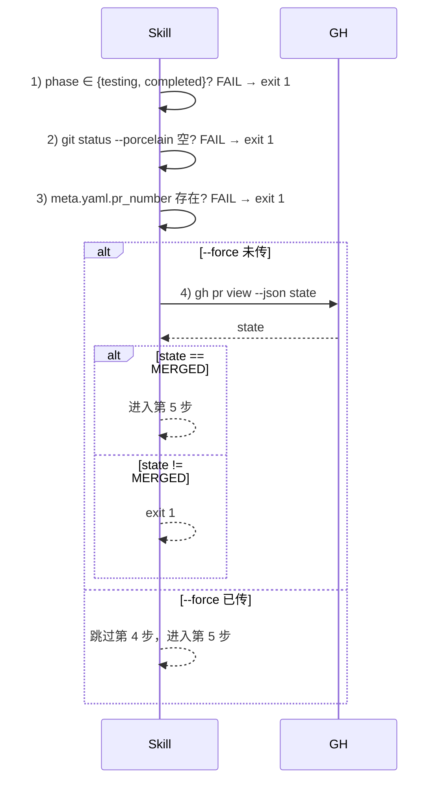

# REQ-2026-007 · 详细设计

## 文档定位

本文档承接 outline-design.md §7「进入 detail-design 的待办」13 项 + 4 条待澄清，做四件事：

1. **决议汇总（§1）**：13 项待办按 D-012（来源：requirements/REQ-2026-007/plan.md:121）的 5 组分类落锤——契约 / 决议 / 实测 / 命令文案 / 规则修订。
2. **接口签名（§3）**：把 outline-design 的 4 层模块视图翻译成可写代码的精确签名（B 案 plugin precheck、archive Skill 子动作、submit codex 子模式状态机）。
3. **数据结构（§4）**：meta.yaml `archived_at` 字段、`round-N.md` frontmatter、process.txt 三个新事件标签的精确 schema。
4. **Features 切分（§6）**：把改动拆成 4 个可独立交付的 feature，落 features.json。

不再重复 spec / outline-design 已有的方案论证，仅在上述四点上落到「detail-design 决议产出」级别。

---

## 1. 13 项 detail-design 待办决议（D-013 ~ D-016）

### 1.1 契约组（#5、#6、#7）

| # | 待办 | 决议 | 落地位置 |
|---|---|---|---|
| 5 | 三个命令的精确 markdown 内容 | submit.md / archive.md / list.md 的参数表、示例、异常路径文案在 §3.4 给精确 patch 段；archive.md 全新文档 | F-002（list）/ F-003（archive）/ F-004（submit） |
| 6 | archive-rules.md 完整正文 | 4 预检（§3.5.1）+ 5 步执行（§3.5.2）+ 三问串行（§3.5.3）+ 错误矩阵（§3.5.4）合并为一份 archive-rules.md 文档；§3.5 给完整骨架 | F-003 |
| 7 | submit-rules.md §7.5 + 三常量精确值 | §7.5 codex 单轮子模式按 §3.6 时序状态机展开；三常量值见 §1.4「实测组」决议（CODEX_REVIEWER_LOGIN_PATTERN 标 [待 V-01 实测确认]） | F-004 |

### 1.2 决议组（#1、#2、#12）

#### D-013 applies_when 实现路径采用 B 案

- **Context**：outline-design §5.4 推荐 B 案，tech-feasibility §2.2（来源：requirements/REQ-2026-007/artifacts/tech-feasibility.md:100）确认 B 案 ~0.3 人天且零 schema 风险，A 案需扩 S9 校验 + ContextResolver +1 人天。
- **Decision**：两 gate 同走 B 案——`AheadOfOriginGate.precheck` 内查 `pr_open_for_branch(ctx)`，命中即返回 `Skip`；`ReviewVerdictGate.precheck` 内查 `ctx.cli_flags.get("draft") is True` 且 `ctx.trigger == "submit"`，命中即返回 `Skip`。registry.yaml schema 不动。
- **Consequences**：好——零 schema 变更、回归面最小、与 spec §3.1/§3.2 完全对齐；差——若未来放宽场景超 2 处，每个 plugin 各写一份谓词；按 outline-design.md:393 兜底升级阈值（同样指 「超 2 处即升级 A 案」），超限即升级为 A 案。
- **时间**：2026-05-04 21:30:00

#### #2 `pr_open_for_branch` 谓词签名

`AheadOfOriginGate.precheck` 内不引入抽象层，直接 inline 调 `gh` CLI：

```python
def precheck(self, ctx: GateContext) -> Optional[Skip]:
    if ctx.trigger != "submit":
        return Skip(f"trigger={ctx.trigger!r} 非 submit；跳过 ahead-of-origin")
    branch = (ctx.cli_flags or {}).get("source_branch") or _detect_branch()
    if _pr_open_for_branch(branch):
        return Skip(f"分支 {branch!r} 已有 open PR；跳过 ahead-of-origin")
    return None
```

`_pr_open_for_branch(branch: str) -> bool` 实现细节见 §3.2.1，约束：

- 输入 `branch` 必须非空；空字符串直接返回 False（不放行）
- subprocess timeout 10s，与既有 `_check_ahead_of_origin` 同档
- `gh` 缺失或 401 → 返回 False（fail-closed，不放行；保留 ahead 检查兜底）
- 仅认 PR state == OPEN（DRAFT 也视为 OPEN，与 GitHub API 一致）

#### D-014 squash merge 不放宽 `-D` 强删约束

- **Context**：tech-feasibility §5.4 + §2.5 行 197 提示「squash merge 后 `git branch -d` 必拒，需复评是否放宽」。
- **Decision**：保留 requirement.md:74「不允许 -D 强删」约束。archive 命令检测 `git branch -d` 失败时**透传原始 git error**（不降级文案），并在终端反馈中显示 `local branch: failed (<git error>)`，由用户手工决定 `-D` / rebase / 保留。
- **Consequences**：好——零误删风险、命令实现最简单（不需要识别 squash 还是真正未合并）；差——squash merge 后用户必须手工跑 `git branch -D <branch>`，多一步操作。
- **时间**：2026-05-04 21:30:00

### 1.3 实测组（#3、#4、#11）

实测命令落入 §2，实测**结果**待用户在 detail-design 首日补：

- 待办 #3（Codex login 实测）→ §2.1，结果填入常量 `CODEX_REVIEWER_LOGIN_PATTERN`
- 待办 #4（Codex App 安装确认，**V-01 沙盒 e2e 硬前置**）→ §2.2
- 待办 #11（F-001 回归基线）→ §2.3，先建 `tests/gates/test_ahead_of_origin.py` / `test_review_verdict.py` 当前快照，再做 F-001 改动

### 1.4 命令文案组（合 §3.4）

参数表 / 示例 / 异常路径文案随 §3.4 各命令的精确 markdown patch 给出，不另设独立小节。

### 1.5 规则修订组（#8、#9、#10、#13）

#### #8 phase-rules.md `#9 completed` 精确 patch

见 §4.4，给出具体的 markdown 增补文本 + 切换链段落 + archived_at 字段说明三块的 diff 形式。

#### #9 run.py `--draft` flag 落点

紧跟既有 `--target` 参数（来源：scripts/gates/run.py:198），位置在 `_build_parser`（暂取该函数名，按既有命名风格）的最后一段：

```python
p.add_argument("--target", help="目标 base 分支，覆盖 meta.base_branch ...")
p.add_argument(
    "--draft",
    action="store_true",
    help="submit trigger 专用：草稿 PR 模式；GATE-REVIEW-VERDICT 命中时跳过",
)
p.add_argument("paths", nargs="*", help="adapter 模式下传入的目标文件 ...")
```

此外：`--draft` 通过 `args.draft` 读取，由 caller（`scripts/gates/triggers/submit.py`）写入 `ctx.cli_flags["draft"]`，B 案 plugin precheck 读这一字段。两侧契约见 §3.2.2。

#### #10 feature_area 主标 `lifecycle`

按 tech-feasibility §5.5（来源：requirements/REQ-2026-007/artifacts/tech-feasibility.md:308）建议沿用——主标 `lifecycle`，`affected_modules` 同时列 `gate-system`（已在 meta.yaml 行 27-31 兑现）。

#### D-016 archive 三问交互通道：A 案锁死（callback + 三个 yes flag 兜底）

- **Context**：reviewer 一审指出 §3.5.5 留 [待用户确认] 不应跨阶段——这是 detail-design 内可决议项；F-003 编码者拿到的签名缺通道入口。
- **Decision**：A 案锁死——`archive_requirement` 入参加 `prompts_callback: Callable[[ArchivePrompt], bool]`（主对话场景，伞形 Skill 装配交互链）+ `yes_experience` / `yes_local_branch` / `yes_remote_branch` 三个 flag（CLI 自动化场景）；callback 与 yes_* 同传时 yes_* 优先级更高（避免歧义）。详见 §3.1 签名 + §3.5.5 决议。
- **Consequences**：好——F-003 编码者按签名落 callback + flag 即可，主对话/CLI 双场景统一；ArchivePrompt 数据结构小，扩展性强；差——多一个 callable 入参，testcase 需注入 mock callback。
- **时间**：2026-05-04 22:30:00

#### D-015 round-N.md frontmatter 不扩 `must_fix_count`

- **Context**：outline-design §3.4.2 给的 8 字段 frontmatter（round / triggered_at / review_id / reviewer / submitted_at / verdict / state / body）已覆盖追溯需求；spec §10 只允许「字段漂移时改一行」常量化策略，扩字段需要谨慎。
- **Decision**：v1 不扩 `must_fix_count`。后续 review 摘要解析需要时（如要在 not_passed 时打印「⚠️ 该轮 N 项 must-fix」），从 body 文本里 grep `^### Must Fix\|^## Must-fix\|^- \[ \]` 计数即可，不进 frontmatter。
- **Consequences**：好——schema 稳定、向后兼容压力最小；差——后续若需要持久化 must_fix_count 要做一次 frontmatter 升级。
- **时间**：2026-05-04 21:30:00

---

## 2. 实测前置（V-01 沙盒 e2e 硬前置链）

按 D-012「V-01 沙盒 e2e（#4）作为本阶段硬前置，未确认则 detail-design 不出阶段」。本节列实测命令 + 期望结果占位，**实测结果由用户/主 Agent 在 detail-design 首日补全**，结果回填后才能进入 task-planning 阶段。

### 2.1 Codex bot login 实测（待办 #3）

```bash
# 用 REQ-2026-006 PR #54（或任意已有 codex review 的 PR）做实测样本
gh api repos/huangjian/agentic-meta-engineering/pulls/54/reviews \
  | jq '.[].user | {login, type}'
```

**期望输出**：JSON 数组，含一条 `{"login": "<某 codex bot 登录名>", "type": "Bot"}`。

**回填动作**：把 `login` 实际值用宽松正则覆盖（如 `chatgpt-codex-connector[bot]` → `^chatgpt-codex.*$` 或 `/codex/i`），写入 `submit-rules.md` 的 `CODEX_REVIEWER_LOGIN_PATTERN`。当前默认值：`/codex/i`，依据 D-011（来源：requirements/REQ-2026-007/plan.md:114）；实测后若仍为 `/codex/i` 即沿用。

**结果占位**：`[待用户确认]` —— 命令输出 + 最终常量值需在 V-01 沙盒 e2e 完成前补入本节。

### 2.2 Codex GitHub App 安装确认（待办 #4，V-01 硬前置）

```bash
# 确认 Codex App 已安装到目标仓库（需仓库 admin 才有权访问 installations）
gh api repos/huangjian/agentic-meta-engineering/installation 2>/dev/null \
  || gh api /user/installations | jq '.installations[] | select(.app_slug | test("codex"; "i"))'
```

**期望输出**：返回 installation 对象，含 `app_slug` 包含 `codex`，且 `permissions.pull_requests == "write"`。

**未安装兜底**：若两个命令都返回空/404，需仓库 admin 在 GitHub 网页 Settings → Installations 装 `chatgpt-codex-connector`（要 `Pull requests: Read and write` 权限）。**未确认安装前 V-01 沙盒 e2e 不能跑**——passed/not_passed 路径都依赖 codex 真实回评。

**结果占位**：`[待用户确认]` —— App 安装状态需在本节回填确认。

### 2.3 F-001 回归基线（待办 #11）

F-001（B 案放宽门禁）改动前先抓快照，避免改完才发现回归挂掉无从对比：

```bash
# 当前 ahead_of_origin 测试基线
pytest tests/gates/test_ahead_of_origin.py -v --tb=short \
  > /tmp/req2026007_ahead_baseline.txt 2>&1

# 当前 review_verdict 测试基线
pytest tests/gates/test_review_verdict.py -v --tb=short \
  > /tmp/req2026007_verdict_baseline.txt 2>&1

# 历史需求 submit 回归基线（只跑不挂）
for req in REQ-2026-001 REQ-2026-002 REQ-2026-003 REQ-2026-005 REQ-2026-006; do
  python3 scripts/gates/run.py --trigger=submit --req=$req 2>&1 \
    | tee /tmp/req2026007_submit_${req}_baseline.txt
done
```

**期望基线**：3 类输出文件就位，不要求当前全 PASS（历史需求可能已 archived 或未达 submit 准入条件）。F-001 改完后用同样命令对比 diff，**新增 skip 是预期，新增 fail 必须排查**。

**结果占位**：本节回填见 §待澄清清单第 8 项——基线快照路径 + diff 对比报告在 F-001 收尾时补入。

---

## 3. 接口签名

### 3.1 archive Skill 子动作签名（F-003）

```python
# .claude/skills/managing-requirement-lifecycle/<内部映射>，仅文档级签名
def archive_requirement(
    req_id: str,
    *,
    # CLI 跳问 flag（CLI 自动化场景）
    force: bool = False,            # --force：跳过 PR merged 校验
    keep_branch: bool = False,      # --keep-branch：跳过本地+远程分支提示（两个一起跳）
    no_experience: bool = False,    # --no-experience：跳过经验沉淀提示
    # A 案 stdin 交互通道（D-016 锁死，主对话场景）
    yes_experience: bool = False,   # --yes-experience：经验问 → 跳问，等价用户答 y
    yes_local_branch: bool = False, # --yes-local-branch：本地分支问 → 跳问，答 y
    yes_remote_branch: bool = False,# --yes-remote-branch：远程分支问 → 跳问，答 y
    prompts_callback: Optional[Callable[[ArchivePrompt], bool]] = None,
    # 主 Agent 串行问的回调；callback 接受 ArchivePrompt（§3.5.5），返回 True/False。
    # 主对话场景由调用层（伞形 Skill）注入；CLI 场景为 None，由 yes_* / no_experience / keep_branch 决定。
) -> ArchiveResult:
    """archive 子动作入口；4 预检 → 原子写 meta → 三问串行。

    返回 ArchiveResult（见 §3.1.1），含每个副作用动作的 outcome（不抛异常）。

    交互通道选择（D-016 A 案）：
      1. 若 yes_<x> 已设：跳问，按 y 处理
      2. 否则若 prompts_callback 注入：调 callback，由主 Agent 串行问
      3. 否则（CLI 自动化无回调）：默认按 N 处理（保守不删/不沉淀）
    """


@dataclass
class ArchivePrompt:
    """三问串行的单条问句契约（A 案 callback 入参）。"""
    kind: Literal["experience", "local_branch", "remote_branch"]
    question: str             # 显示给用户的问句原文
    default: bool = False     # 默认 N
```

#### 3.1.1 `ArchiveResult` 数据结构

```python
@dataclass
class ArchiveResult:
    req_id: str
    phase: str = "completed"
    archived_at: str = ""           # ISO8601 with offset
    experience: Literal["yes", "no", "skipped", "failed"] = "skipped"
    local_branch: Literal["deleted", "kept", "skipped", "failed"] = "skipped"
    remote_branch: Literal["deleted", "kept", "skipped", "already-deleted", "failed"] = "skipped"
    error_messages: list[str] = field(default_factory=list)   # 三动作 failed 的原始 git/调用 error
```

终端反馈按 spec §5.3 第 5 步原样渲染。

### 3.2 Gate plugin precheck 签名（F-001）

#### 3.2.1 `AheadOfOriginGate.precheck` patch（采用 D-013 B 案）

`scripts/gates/plugins/ahead_of_origin.py:41` 既有：

```python
def precheck(self, ctx: GateContext) -> Optional[Skip]:
    if ctx.trigger != "submit":
        return Skip(f"trigger={ctx.trigger!r} 非 submit；跳过 ahead-of-origin")
    return None
```

改为：

```python
def precheck(self, ctx: GateContext) -> Optional[Skip]:
    if ctx.trigger != "submit":
        return Skip(f"trigger={ctx.trigger!r} 非 submit；跳过 ahead-of-origin")
    branch = _detect_source_branch(ctx)
    if branch and _pr_open_for_branch(branch):
        return Skip(f"分支 {branch!r} 已有 open PR；跳过 ahead-of-origin")
    return None


def _detect_source_branch(ctx: GateContext) -> str:
    """优先 ctx.cli_flags.source_branch；回退 git symbolic-ref HEAD。"""
    cli_flags = ctx.cli_flags or {}
    explicit = cli_flags.get("source_branch")
    if explicit:
        return str(explicit)
    try:
        result = subprocess.run(
            ["git", "symbolic-ref", "--short", "HEAD"],
            capture_output=True, text=True, check=False, timeout=_GIT_TIMEOUT_SEC,
        )
    except (subprocess.TimeoutExpired, FileNotFoundError, OSError):
        return ""
    if result.returncode != 0:
        return ""
    return (result.stdout or "").strip()


def _pr_open_for_branch(branch: str) -> bool:
    """gh pr list --head <branch> --state open --limit 1 → 命中即 True。

    fail-closed 策略：gh 缺失 / 401 / 解析失败均返回 False（不放行 skip，
    让 ahead-of-origin 主路径继续校验，行为退化为旧版）。
    """
    if not branch:
        return False
    try:
        result = subprocess.run(
            ["gh", "pr", "list", "--head", branch, "--state", "open",
             "--limit", "1", "--json", "number"],
            capture_output=True, text=True, check=False, timeout=_GIT_TIMEOUT_SEC,
        )
    except (subprocess.TimeoutExpired, FileNotFoundError, OSError):
        return False
    if result.returncode != 0:
        return False
    try:
        data = json.loads(result.stdout or "[]")
    except json.JSONDecodeError:
        return False
    return isinstance(data, list) and len(data) > 0
```

**单测要点**（V-02 ↔ TC-F1-1 ~ TC-F1-4）：

- `test_skip_when_pr_open`：mock `gh pr list` 返回 `[{"number": 99}]` → precheck 返回 `Skip`
- `test_no_skip_when_pr_closed`：mock 返回 `[]` → precheck 返回 None，run 继续
- `test_fail_closed_when_gh_missing`：mock `FileNotFoundError` → 不 skip，走主路径
- `test_fail_closed_when_gh_unauth`：mock returncode=4 → 不 skip
- 历史用例（无新 commit FAIL / git timeout / git failure）原样保留

#### 3.2.2 `ReviewVerdictGate.precheck` patch（采用 D-013 B 案）

`scripts/gates/plugins/review_verdict.py:58` 既有 precheck 顶部加一段：

```python
def precheck(self, ctx: GateContext) -> Optional[Skip]:
    # B 案：submit --draft 模式跳过 review verdict
    if ctx.trigger == "submit" and (ctx.cli_flags or {}).get("draft"):
        return Skip("submit --draft 模式；跳过 review-verdict 校验")

    if ctx.trigger == "ci":
        return None
    # ... 余下逻辑保持不变 ...
```

**为什么放最顶**：`--draft` 是「设计上不该挂」，应在所有其他 skip 判断之前生效，避免 `legacy=true` 等条件抢先。

**单测要点**（V-03 ↔ TC-F1-5 ~ TC-F1-7）：

- `test_skip_on_draft_submit`：ctx.trigger="submit", cli_flags={"draft": True} → Skip
- `test_no_skip_on_phase_transition_with_draft`：ctx.trigger="phase-transition", cli_flags={"draft": True} → 走原路径（draft 仅 submit 生效）
- `test_no_skip_when_draft_unset`：cli_flags={} → 走原路径

#### 3.2.3 `submit.py` 透传 `--draft`

`scripts/gates/triggers/submit.py`（既有入口）需要把 CLI 的 `--draft` flag 写入 `ctx.cli_flags["draft"]`。改动单点：argparse 加 `--draft` flag → 构造 GateContext 时传入 `cli_flags={"draft": args.draft, ...}`。

### 3.3 submit codex 子模式接口签名（F-004）

```python
# .claude/skills/managing-requirement-lifecycle/<内部映射>，文档级签名
def submit_with_codex(
    req_id: str,
    *,
    poll_interval_sec: int = 10,    # --codex-poll-interval，默认 10s
    timeout_sec: int = 600,         # --codex-timeout，默认 600s
) -> CodexRoundResult:
    """submit 子模式：开 PR → @codex review → 单轮轮询 → 落 round-N.md → 判 verdict。

    多轮由主对话推动（D-002）；本函数命令内仅一轮。
    """
```

#### 3.3.1 `CodexRoundResult` 数据结构

```python
@dataclass
class CodexRoundResult:
    round: int                                  # 当前轮号 = 已有 round-*.md 数 + 1
    pr_number: int
    triggered_at: str                            # ISO8601，发评论时刻
    verdict: Literal["passed", "not_passed", "timeout"]
    review_id: Optional[int] = None              # GitHub review API 的 id（timeout 时 None）
    reviewer: Optional[str] = None               # 命中的 user.login（timeout 时 None）
    submitted_at: Optional[str] = None           # codex review 实际提交时间
    state: Optional[str] = None                  # GitHub review state 原值
    artifact_path: Optional[str] = None          # round-N.md 路径（timeout 时也写，body 留 "(timeout)"）
```

退出码契约（来源：context/team/engineering-spec/specs/2026-05-04-submit-codex-loop-and-archive-design.md:164）：三类 verdict 全部 exit 0；passed 时 stderr 无关键串、not_passed 时 stderr 含 `⚠️ codex review NOT passed`、timeout 时 stderr 含 `⚠️ codex review TIMEOUT`。

#### 3.3.2 三常量精确值（落 `submit-rules.md` 顶部）

```
CODEX_PASS_PHRASE            = "Didn't find any major issues."
CODEX_REVIEWER_LOGIN_PATTERN = "/codex/i"            # 默认值；待 §2.1 实测确认
CODEX_REVIEWER_USER_TYPE     = "Bot"
```

漂移策略：bot 用语 / login 改了 → 改一行常量；其他逻辑不动。

#### 3.3.3 轮询 + 命中判定伪码

```python
# 注：以下三个异常类由 F-004 在 scripts/lib/submit_codex.py 内定义，不对外暴露。
# 模块内 _gh_pr_reviews 调用 gh CLI / requests 时按 HTTP 状态码分流抛出。
import time, re, json

class GhApiAbort(Exception):
    """连续 5xx 超阈值，调用方走 exit 1 路径。"""

class GhApi5xx(Exception):
    """单次 5xx 响应，进入 consecutive_5xx 计数器。"""

class GhApi429(Exception):
    """限流响应，立即短路走 timeout 路径。"""

def _poll_codex(pr_num: int, triggered_at_iso: str,
                interval: int, timeout: int) -> Optional[dict]:
    """返回值：dict（命中 codex review）/ None（timeout，含 429 短路）。
    抛 GhApiAbort：连续 5xx ≥ 3 次，调用方按 §3.4.1 文案走 exit 1。
    """
    deadline = time.monotonic() + timeout
    pattern = re.compile(r"codex", re.IGNORECASE)   # CODEX_REVIEWER_LOGIN_PATTERN
    consecutive_5xx = 0
    while time.monotonic() < deadline:
        try:
            reviews = _gh_pr_reviews(pr_num)        # gh api repos/.../pulls/N/reviews
            consecutive_5xx = 0                     # 成功一次即清零
        except GhApi5xx:
            consecutive_5xx += 1
            if consecutive_5xx >= 3:
                raise GhApiAbort("gh api repeated 5xx during poll")
            time.sleep(interval)
            continue
        except GhApi429:
            return None                             # 429 → 短路 timeout 路径，不重试
        for r in reviews:
            user = r.get("user") or {}
            if user.get("type") != "Bot":
                continue
            if not pattern.search(user.get("login") or ""):
                continue
            if r.get("submitted_at", "") <= triggered_at_iso:
                continue   # 早于本轮 trigger 的旧 review
            return r
        time.sleep(interval)
    return None  # timeout


def _is_passed(body: str) -> bool:
    return "Didn't find any major issues." in (body or "")
```

错误路径契约：

- 连续 5xx ≥ 3 次：抛 `GhApiAbort`，调用方按 §3.4.1 文案输出 `❌ gh api repeated 5xx during poll; aborting` + exit 1。计数遇任意 200 即清零。
- 429（限流）：直接 `return None` 走 timeout 分支，verdict=timeout，**不重试**。
- 其他网络错（连接失败 / DNS / SSL）：按 spec §10 视为 5xx 同档处理，进入计数器。

### 3.4 命令 markdown 精确 patch

#### 3.4.1 `.claude/commands/requirement/submit.md` 增补段（F-004）

在「参数」节追加：

```markdown
## 参数

| 参数 | 默认 | 语义 |
|---|---|---|
| `--draft` | false | 推草稿 PR；GATE-REVIEW-VERDICT 命中时跳过 |
| `--codex` | false | 启用 codex 单轮 review-loop（推 PR + @codex review + 轮询 + 落 round-N.md + 判 verdict） |
| `--codex-poll-interval` | 10 | （需 `--codex`）轮询间隔秒数 |
| `--codex-timeout` | 600 | （需 `--codex`）整轮超时秒数 |

参数互斥规则：
- `--codex-poll-interval` / `--codex-timeout` 必须与 `--codex` 同传，否则 exit 1
- `--draft` 与 `--codex` 可同传（draft PR 上跑 codex 一轮也合理）

异常路径文案：
- 推 PR 后 `gh pr comment` 失败 → exit 1，stderr `❌ failed to post @codex review comment: <gh error>`
- 轮询期间 `gh api` 连续 3 次 5xx → exit 1，stderr `❌ gh api repeated 5xx during poll; aborting`
- 429 → 直接 verdict=timeout（不重试）
```

#### 3.4.2 `.claude/commands/requirement/archive.md` 全文骨架（F-003）

```markdown
# /requirement:archive

## 用途
PR 合并后做收尾闭环：phase=completed + archived_at + 经验沉淀 + 删本地+远程分支（提示）。

## 参数
| 参数 | 默认 | 语义 |
|---|---|---|
| `--force` | false | 跳过 PR merged 校验（异常恢复用） |
| `--keep-branch` | false | 跳过删本地+远程分支两问 |
| `--no-experience` | false | 跳过经验沉淀提示 |

## 预检（4 项硬门禁，任一 fail → exit 1）
1. phase ∈ {testing, completed}
2. git status --porcelain 为空
3. meta.yaml.pr_number 存在
4. gh pr view <pr_number> --json state == MERGED（除非 --force）

## 委托
调用 Skill `managing-requirement-lifecycle` 的 archive 子动作；详见 `reference/archive-rules.md`。

## 终端反馈格式
（见 spec §5.3 第 5 步原文）
```

#### 3.4.3 `.claude/commands/requirement/list.md` 增补段（F-002）

在「参数」节追加：

```markdown
## 参数
| 参数 | 默认 | 语义 |
|---|---|---|
| `--all` | false | 含 phase=completed 的需求 |
| `--phase <p>` | — | 仅列 phase=<p> 的需求 |

默认行为：隐藏 phase=completed（避免长期项目堆积）。`--all` 与 `--phase` 互斥（同传 exit 1）。
```

### 3.5 archive-rules.md 完整骨架（F-003）

#### 3.5.1 4 项预检

| # | 检查项 | 失败错误码 | 失败文案 |
|---|---|---|---|
| 1 | phase ∈ {testing, completed} | `R-ARCHIVE-PHASE` | `当前 phase=<X>，期望 testing 或 completed` |
| 2 | `git status --porcelain` 输出为空 | `R-ARCHIVE-DIRTY` | `工作目录有未提交改动；先 commit 再 archive` |
| 3 | meta.yaml.pr_number 非 0 且非空 | `R-ARCHIVE-NO-PR` | `meta.pr_number 缺失；先跑 /requirement:submit` |
| 4 | `gh pr view <pr_number> --json state` == MERGED（除非 --force） | `R-ARCHIVE-PR-NOT-MERGED` | `PR #<N> state=<X>，未合并；等 merge 或加 --force` |

#### 3.5.2 5 步执行

按 spec §5.3 原序：原子写 meta → 追加 process.txt → 经验沉淀（可选）→ 删分支（可选）→ 终端反馈。其中：

- 第 1 步原子写：先写 `meta.yaml.tmp` → `os.replace()` 覆盖 `meta.yaml`，避免中间状态被门禁读到
- 第 2 步走 `requirement-progress-logger` Skill 唯一通道（不允许直接 `>>`）

#### 3.5.3 三问串行交互

按 D-007（来源：requirements/REQ-2026-007/plan.md:91） / D-010（来源：requirements/REQ-2026-007/plan.md:108）：经验 → 本地 → 远程，默认 N。stdin 交互方式按 §3.5.5 决议（同期与下面的 [待澄清] 一并处理）。

#### 3.5.4 错误矩阵（副作用动作降级）

| 动作 | 失败现象 | 降级策略 |
|---|---|---|
| 经验沉淀 | `/knowledge:extract-experience` 调用失败 | 打印原始 error → archive 仍 exit 0 |
| 本地分支删 | `git branch -d` 拒绝（squash merge / 未合并） | 透传 git error → outcome=failed |
| 远程分支删 | `remote ref does not exist` | 折叠为 `already-deleted`，不报错 |
| 远程分支删 | 网络 / 401 / 403 | 透传 error → outcome=failed |

副作用动作 outcome 全部记录到 `ArchiveResult`，archive 命令始终 exit 0（除非 4 项预检挂）。

#### 3.5.5 D-016 三问 stdin 交互通道：A 案锁死

outline-design 待澄清 #3：archive 三问串行的 y/N 在 Claude Code 主对话里如何走？候选两案：

- A. 「主对话渲染问句 → 用户在对话回复 y/n → Skill 解析」——符合主对话不直接读 stdin 的事实
- B. 「Skill 用 `input()` 直接读 stdin」——CLI 用法直观，但主对话中无 stdin

**决议（D-016）**：A 案落地——`archive_requirement(prompts_callback=...)` 注入 callback，主对话场景由伞形 Skill 装配「渲染问句 → 用户回 y/n → 解析后回填 callback 返回」的串行交互；CLI 自动化场景调用方传 `yes_experience` / `yes_local_branch` / `yes_remote_branch` 三个 flag 直接跳问。两条通道同时支持，由调用上下文按需选择。

签名见 §3.1：`ArchivePrompt` 契约 + 三个 yes_* flag + `prompts_callback` 入参。F-003 编码者按 §3.1 落 callback 链路即可，无需再纠结通道。

### 3.6 submit-rules.md §7.5 状态机骨架（F-004）

```
[idle] --submit --codex--> [pr-opened/updated]
[pr-opened/updated] --post @codex review--> [poll-loop]
[poll-loop] --hit codex review--> [persist round-N.md]
[poll-loop] --elapsed > timeout--> [persist round-N.md verdict=timeout]
[poll-loop] --gh 429--> [persist round-N.md verdict=timeout]    # 短路 timeout，不重试
[poll-loop] --gh 5xx x3--> [error-exit-1]                       # 连续 3 次 5xx 中止
[persist round-N.md] --judge body--> [done]
[done] --verdict=passed--> exit 0 (silent stderr)
[done] --verdict=not_passed--> exit 0 (stderr ⚠️ summary)
[done] --verdict=timeout--> exit 0 (stderr ⚠️ TIMEOUT)
[error-exit-1] --> exit 1 (stderr ❌ gh api repeated 5xx during poll; aborting)
```

`pr-opened/updated` 复用既有 submit §7 第 7 步；`poll-loop` 走 §3.3.3 伪码（含 5xx 计数器 + 429 短路）。429 与 elapsed-timeout 都走 `[persist round-N.md verdict=timeout]`，frontmatter 中 verdict=timeout 不区分原因（如需区分可在 v2 frontmatter 加 timeout_reason 字段，本 v1 不扩——D-015）。

---

## 4. 数据结构

### 4.1 `meta.yaml.archived_at` 字段（F-002）

新增 schema：

```yaml
archived_at: ""    # ISO8601 with offset；archive 命令成功后写入；空表示已 completed 但未归档
```

`phase: completed` 与 `archived_at != ""` 是双字段判断（D-006）：
- phase=completed + archived_at="" → 完成但未归档（用户尚未跑 archive）
- phase=completed + archived_at 非空 → 完成并归档（archive 已跑）
- phase != completed + archived_at 非空 → 非法状态，meta-schema gate 应拒收

`meta-schema.yaml` 同步加字段类型约束 + 状态机约束（F-002 acceptance）。

### 4.2 `round-N.md` frontmatter（F-004）

```yaml
---
round: 1                                   # int，必填，文件名 round-<N>.md 的 N
triggered_at: "2026-05-04T19:30:00+08:00"  # str ISO8601，必填，@codex review 评论时间
review_id: 12345678                        # int，timeout 时省略
reviewer: "chatgpt-codex-connector[bot]"   # str，命中的 user.login，timeout 时省略；含 [bot] 后缀必须 quote
submitted_at: "2026-05-04T19:32:14+08:00"  # str ISO8601，timeout 时省略
verdict: passed                            # str ∈ {passed, not_passed, timeout}，必填
state: COMMENTED                           # str，GitHub review state 原值，timeout 时省略
---

<review body 原文 markdown，timeout 时正文为 "(timeout after <N>s, no codex review received)">
```

字段约束：

- `round` ≥ 1，与 `requirements/<id>/artifacts/codex-reviews/round-*.md` 文件名严格一致（不允许重号、跳号）
- `reviewer` 含 `[bot]` 后缀的 GitHub App login 必须 **quote**（YAML safe_load 否则把 `[bot]` 视为 flow-style list）；同理 ISO8601 含 `:` 的字段也建议 quote 防解析为 sexagesimal；`review_id` 也建议 quote 防 GitHub 未来扩到 >2^53 时 YAML 数字精度丢失
- 必填字段缺失或类型错误 → submit --codex 后续解析直接 exit 1
- timeout verdict 时仅 `round / triggered_at / verdict` 三字段必填，其他可省

D-015：v1 不扩 `must_fix_count`。

### 4.3 process.txt 三个新事件标签（F-003 / F-004）

新增白名单条目（更新 `requirement-progress-logger` SKILL.md 的事件标签表）：

| 事件标签 | 内容 | 触发时机 | 触发 feature |
|---|---|---|---|
| `[codex-review-triggered]` | `round=N pr=#num` | submit --codex 发完 @codex review 评论 | F-004 |
| `[codex-review-received]` | `verdict=passed\|not_passed\|timeout round=N` | 单轮轮询结束（命中或超时） | F-004 |
| `[archived]` | `(PR #num merged at <ts>)` | archive 命令完成第 1 步原子写 meta 后 | F-003 |

**注意**：

- `[archived]` 不依赖副作用动作的 outcome——只要原子写 meta 成功就追加事件。副作用 outcome 仅写 stdout 终端反馈，不进 process.txt（避免事件爆炸）。
- **幂等约束**：archive 命令应在追加 `[archived]` 前先 grep 现有 process.txt——若已存在 `[archived]` 行（即首次 archive 已成功写 meta），则**不再追加**。这覆盖三个场景：(1) 用户重跑 archive（如三动作 failed 想重试）；(2) `--force` 强制重跑；(3) 双窗口并发误触。第 1 步原子写 meta 与第 2 步追加 process.txt 之间若崩溃，重跑可重新追加（grep 也会防去重失败时双写）。

---

## 5. 关键时序补全

### 5.1 archive 第 4 步预检与 --force 路径

outline-design §2.2 时序图把 4 项预检折叠成「Skill 内串行检查」未展开。补一下 `--force` 路径：



### 5.2 submit --codex 与 --draft 同时使用

按 §3.4.1 互斥规则：两者可同传（draft PR 上跑 codex review 是合理用法）。状态机：

- 推草稿 PR（既有 submit §7 第 7 步走 `gh pr create --draft` 路径）
- B 案 plugin precheck：GATE-REVIEW-VERDICT 命中 `--draft` skip
- @codex review 评论照发；轮询逻辑不变（codex 对 draft PR 也 review）

不引入额外路径，仅文档说明清楚同传语义。

---

## 6. Features 切分（详见 `features.json`）

按 D-012「5 组结构」与 outline-design §1.2 改动一览，切 4 个 feature：

| ID | 标题 | 主要改动 | 依赖 | 估时 |
|---|---|---|---|---|
| F-001 | 门禁放宽 B 案：AHEAD-OF-ORIGIN skip-when-pr-open + REVIEW-VERDICT skip-when-draft + run.py --draft 透传 + V-02/V-03 测试 | 2 plugin + run.py + submit.py + 2 测试 | — | 1.5 |
| F-002 | phase-rules.md #9 completed + meta.archived_at 字段 + list 默认过滤 + --all/--phase | phase-rules.md + meta-schema.yaml + list.md | — | 0.8 |
| F-003 | archive 命令完整链：archive.md + archive-rules.md + Skill 子动作 + V-04 测试 + 自举 V-08 | archive.md (新) + archive-rules.md (新) + SKILL.md + meta_writer 复用 + 测试 | F-002 | 2.5 |
| F-004 | submit --codex 子模式：submit.md + submit-rules.md §7.5 + 三常量 + codex-reviews 子目录 + V-05 测试 + V-09 常量验收 | submit.md + submit-rules.md + 轮询逻辑 + frontmatter 解析 + 测试 | F-001 | 1.5 |

合计 6.3 人天；按 plan.md 里程碑 development 2026-05-08（4 工作日）+ testing 2026-05-09，需要 F-002 与 F-001 并行、F-003 与 F-004 并行才能赶上。可行（F-002 / F-001 改不同文件，无冲突；F-003 与 F-004 改不同 Skill 段落 + 不同测试文件）。

---

## 7. 验收对齐 V-01 ~ V-09

| V- | 验收点 | 落地 feature | 测试用例 |
|---|---|---|---|
| V-01 | 沙盒 e2e 8 步行为（spec §8.1） | 全 4 features 联调 | TC-F1-8 / TC-F3-8 / TC-F4-8（沙盒 REQ-2099-007） |
| V-02 | tests/gates/test_ahead_of_origin.py + 同分支 open PR skip 用例 | F-001 | TC-F1-1 ~ TC-F1-4 |
| V-03 | tests/gates/test_review_verdict.py + --draft skip 用例 | F-001 | TC-F1-5 ~ TC-F1-7 |
| V-04 | tests/lifecycle/test_archive.py 4 预检 + 三动作 yes/no/skipped/failed | F-003 | TC-F3-1 ~ TC-F3-7 |
| V-05 | tests/lifecycle/test_submit_codex.py passed/not_passed/timeout + round 自增 | F-004 | TC-F4-1 ~ TC-F4-7 |
| V-06 | 历史需求 submit 回归 exit code 不变 | F-001 收尾 | TC-F1-9（基线 diff 比对，§2.3） |
| V-07 | phase-rules.md #9 + archived_at 语义 | F-002 | TC-F2-1 ~ TC-F2-3 |
| V-08 | 自举：本需求自身用 archive 归档 | F-003 收尾 | TC-F3-9（手动） |
| V-09 | CODEX_PASS_PHRASE 集中常量化 | F-004 | TC-F4-9（grep 全仓只在 submit-rules.md 一处定义） |

具体 TC 编号 + 期望结果在 features.json acceptance 数组逐条列出。

---

## 8. 风险与缓解（继承 plan.md）

继承 plan.md «风险» 章节 5 条，无新增。映射到本设计：

- R1（Codex 用语漂移） → §3.3.2 三常量集中策略
- R2（applies_when 谓词扩展破坏 gate） → D-013 选 B 案，零 schema 风险；F-001 acceptance 含 §2.3 历史回归
- R3（archive 误删远程分支） → §3.5.4 默认 N + base_branch 校验
- R4（squash merge 后 -D 拒绝） → D-014 透传 error，不放宽
- R5（gh API 429） → §3.3.3 伪码 429 走 timeout 不重试

---

## 待澄清清单

继承 outline-design「待澄清」+ tech-feasibility「待澄清」共 7 条，本阶段新增 1 条：

1. **三问 stdin 交互通道**（§3.5.5）：A 案（主 Agent 串行问）vs B 案（Skill `input()` 直读）→ D-016 已决（A 案 + callback + 三个 yes_* flag），本条关闭。
2. Codex bot 实际 `user.login` 值 → §2.1 实测后回填 [待用户确认]
3. Codex GitHub App 安装状态 → §2.2 实测后回填 [待用户确认]
4. GitHub API 速率限制配额 → V-01 沙盒 e2e 内顺手实测 [待用户确认]
5. codex 轮询 interval / timeout 默认值 10s / 600s → V-01 沙盒 e2e 实测后定稿 [待用户确认]（来源：context/team/engineering-spec/specs/2026-05-04-submit-codex-loop-and-archive-design.md:108）
6. squash merge 场景策略复评 → D-014 已决（不放宽），本条关闭
7. A 案 DSL 选型 → D-013 已选 B 案，A 案保留兜底，本条关闭
8. F-001 回归基线快照路径 + 5 个历史 REQ submit 基线 + diff 对比报告 → §2.3 实测后回填 [待用户确认]
