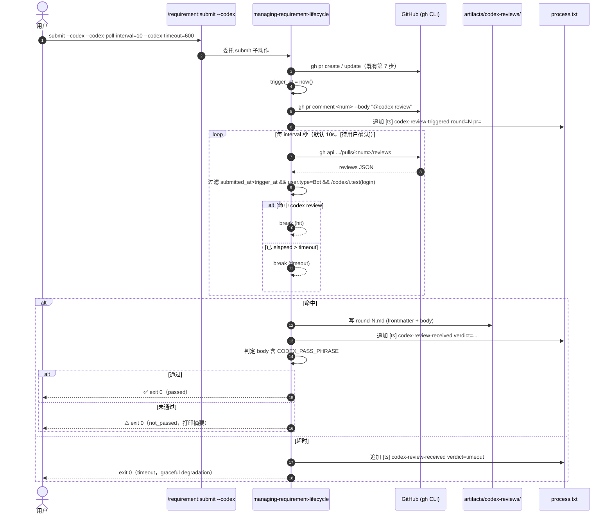
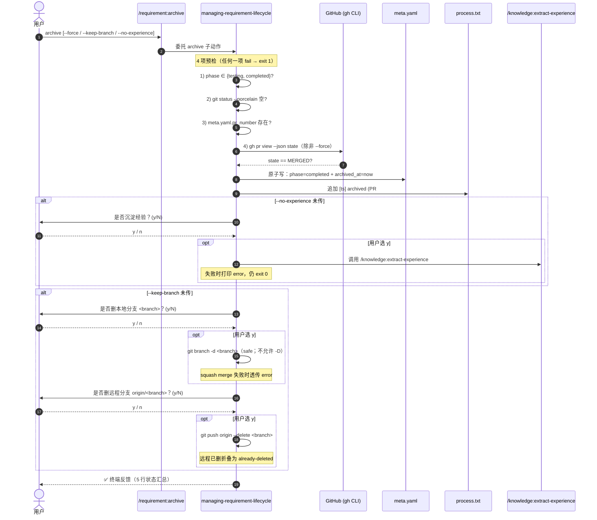

# REQ-2026-007 · 概要设计

## 文档定位

spec（来源：context/team/engineering-spec/specs/2026-05-04-submit-codex-loop-and-archive-design.md:1）已审定目标方案与 9 条决策。本文档不重新论证方案，做三件事：

1. **把 spec 翻译成 4 层模块视图与时序**——为 detail-design 写接口签名做准备
2. **落实 tech-feasibility §5 的 6 项 detail-design 决议事项的方向**（来源：requirements/REQ-2026-007/artifacts/tech-feasibility.md:298）
3. **D-004 `applies_when` 实现路径的两案对比**——本概要列两案不锁死，决议留 detail-design

---

## 1. 总体架构

### 1.1 4 层模块视图

```
┌──────────────────────────────────────────────────────────────────────┐
│ Commands 层 (.claude/commands/requirement/*.md)                      │
│   submit.md  ──[+--codex / --codex-poll-interval / --codex-timeout]  │
│   archive.md ──[NEW] [--force / --keep-branch / --no-experience]     │
│   list.md    ──[+--all / --phase <p>，默认过滤 phase=completed]      │
└──────────────────────────────────────────────────────────────────────┘
                                │ 委托
                                ▼
┌──────────────────────────────────────────────────────────────────────┐
│ Skills 规范层 (.claude/skills/managing-requirement-lifecycle/)       │
│   SKILL.md         ──[+ archive 子动作 + 意图映射]                   │
│   reference/                                                          │
│     submit-rules.md ──[+ §7.5 codex 子模式 + CODEX_PASS_PHRASE       │
│                         + CODEX_REVIEWER_LOGIN_PATTERN               │
│                         + CODEX_REVIEWER_USER_TYPE 三常量]           │
│     archive-rules.md ──[NEW] (4 预检 / 5 步执行 / 三问串行)          │
│     phase-rules.md   ──[+ #9 completed + 切换链 + archived_at 语义]  │
└──────────────────────────────────────────────────────────────────────┘
                                │ 调用 / 校验
                                ▼
┌──────────────────────────────────────────────────────────────────────┐
│ Gates 插件层 (scripts/gates/)                                        │
│   registry.yaml    ──[GATE-AHEAD-OF-ORIGIN / GATE-REVIEW-VERDICT     │
│                       加 applies_when 字段（A 案）]                  │
│   run.py           ──[+--draft 透传；可能加 applies_when 求值器]     │
│   plugins/                                                            │
│     ahead_of_origin.py ──[B 案兜底：precheck 内自查 pr_open_for_branch]│
│     review_verdict.py  ──[B 案兜底：precheck 内自查 --draft]           │
└──────────────────────────────────────────────────────────────────────┘
                                │ 读写
                                ▼
┌──────────────────────────────────────────────────────────────────────┐
│ Artifacts 结构层 (requirements/<id>/)                                │
│   meta.yaml          ──[+ archived_at 字段]                          │
│   artifacts/codex-reviews/round-N.md ──[NEW 子目录 + frontmatter]    │
│   process.txt        ──[+ codex-review-triggered/-received 事件类型] │
└──────────────────────────────────────────────────────────────────────┘
```

四层之间是**单向依赖**（Commands → Skills → Gates → Artifacts），无反向引用。

### 1.2 改动一览表

| # | 路径 | 类型 | spec 来源 |
|---|---|---|---|
| 1 | `.claude/commands/requirement/archive.md` | 新增 | spec:286 |
| 2 | `.claude/skills/managing-requirement-lifecycle/reference/archive-rules.md` | 新增 | spec:286 |
| 3 | `.claude/commands/requirement/submit.md` | 修改（+3 参数说明） | spec:296 |
| 4 | `.claude/commands/requirement/list.md` | 修改（+2 参数 + 默认过滤） | spec:296 |
| 5 | `.claude/skills/managing-requirement-lifecycle/SKILL.md` | 修改（+ archive 子动作） | spec:296 |
| 6 | `.claude/skills/managing-requirement-lifecycle/reference/submit-rules.md` | 修改（+ §7.5） | spec:296 |
| 7 | `.claude/skills/managing-requirement-lifecycle/reference/phase-rules.md` | 修改（+ #9 completed） | spec:296 |
| 8 | `scripts/gates/registry.yaml` | 修改（+ 2 处 applies_when） | spec:296 |
| 9 | `scripts/gates/run.py` | 修改（+ --draft + 可能的求值器） | spec:296 |
| 10 | `scripts/gates/plugins/ahead_of_origin.py` | 修改（B 案备选） | spec:296 |
| 11 | `scripts/gates/plugins/review_verdict.py` | 修改（B 案备选） | spec:296 |
| 12 | `tests/gates/test_ahead_of_origin.py`（V-02：同分支 open PR skip） | 新增 | context/team/engineering-spec/specs/2026-05-04-submit-codex-loop-and-archive-design.md:343 |
| 13 | `tests/gates/test_review_verdict.py`（V-03：`--draft` skip） | 新增 | context/team/engineering-spec/specs/2026-05-04-submit-codex-loop-and-archive-design.md:343 |
| 14 | `tests/lifecycle/test_archive.py`（V-04：4 预检 + 三动作 yes/no/skipped/failed） | 新增 | context/team/engineering-spec/specs/2026-05-04-submit-codex-loop-and-archive-design.md:343 |
| 15 | `tests/lifecycle/test_submit_codex.py`（V-05：passed/not_passed/timeout + round 自增） | 新增 | context/team/engineering-spec/specs/2026-05-04-submit-codex-loop-and-archive-design.md:343 |

详见 §3 各层职责拆分。

---

## 2. 关键流程时序

### 2.1 submit --codex 单轮（在 submit-rules.md 第 7 步「开/更新 PR」之后追加 §7.5）

事实源：spec §4.2（来源：context/team/engineering-spec/specs/2026-05-04-submit-codex-loop-and-archive-design.md:108）。



关键点：
- 命令内**单轮**（D-002，来源：requirements/REQ-2026-007/plan.md:60）；多轮由主对话推动
- 命中条件双因子（D-011，来源：requirements/REQ-2026-007/plan.md:114）：`user.type == "Bot"` **且** `/codex/i.test(user.login)`
- 通过判定走 `CODEX_PASS_PHRASE` 常量精确字符串匹配（D-003，来源：requirements/REQ-2026-007/plan.md:66）
- 三条退出路径（passed / not_passed / timeout）退出码均为 0，差异在 stderr 关键串（来源：context/team/engineering-spec/specs/2026-05-04-submit-codex-loop-and-archive-design.md:164）

### 2.2 archive 串行问询

事实源：spec §5.3（来源：context/team/engineering-spec/specs/2026-05-04-submit-codex-loop-and-archive-design.md:209）。



关键点：
- 串行问询、默认 N（D-007 / D-010，来源：requirements/REQ-2026-007/plan.md:91/108）
- 副作用动作（experience / local branch / remote branch）失败均不阻塞 archive 完成（来源：context/team/engineering-spec/specs/2026-05-04-submit-codex-loop-and-archive-design.md:226）（来源：context/team/engineering-spec/specs/2026-05-04-submit-codex-loop-and-archive-design.md:235）
- 远程分支安全校验：`<branch> != base_branch`，禁删 develop / main / master（来源：requirements/REQ-2026-007/plan.md:39）

---

## 3. 模块划分

### 3.1 Commands 层

| 文件 | 职责 | 改动幅度 |
|---|---|---|
| `submit.md` | 用户入口；定义 `--codex / --codex-poll-interval / --codex-timeout` 参数语义；委托 Skill 执行 | 中（追加参数表 + §7.5 引用）|
| `archive.md` | 新建用户入口；定义 `--force / --keep-branch / --no-experience`；委托 Skill | 大（全新文档） |
| `list.md` | 用户入口；扩 `--all / --phase`；默认过滤 phase=completed | 小（追加参数 + 过滤说明） |

设计原则（沿用 four-layer-hierarchy.md）：Commands 层只负责语义声明 + 委托，不写实现细节。

### 3.2 Skills 规范层

| 文件 | 职责 | 改动幅度 |
|---|---|---|
| `SKILL.md` | 子动作清单 + 意图映射 + 硬约束 | 小（+ archive 行） |
| `submit-rules.md` | 完整 submit 流程规范；新增 §7.5 codex 子模式（含三常量定义） | 中（追加段落） |
| `archive-rules.md` | 新建；4 预检 + 5 步执行 + 三问串行 + 失败降级 | 大（全新文档） |
| `phase-rules.md` | 8 阶段表 + 切换链 + archived_at 字段语义 | 中（+ #9 + 切换链 + 字段说明） |

**三常量**（D-003 / D-011 + tech-feasibility §2.1，来源：requirements/REQ-2026-007/artifacts/tech-feasibility.md:41）：

```
CODEX_PASS_PHRASE         = "Didn't find any major issues."
CODEX_REVIEWER_LOGIN_PATTERN = "/codex/i"
CODEX_REVIEWER_USER_TYPE     = "Bot"
```

集中在 submit-rules.md 顶部统一管理，bot 用语漂移时改一行（来源：context/team/engineering-spec/specs/2026-05-04-submit-codex-loop-and-archive-design.md:359）。

### 3.3 Gates 插件层

| 文件 | A 案职责 | B 案职责 |
|---|---|---|
| `registry.yaml` | 给 GATE-AHEAD-OF-ORIGIN / GATE-REVIEW-VERDICT 加 `applies_when` 表达式 | 不动 |
| `run.py` | + `--draft` flag；+ `applies_when` 求值器（DSL or jq-like） | + `--draft` flag |
| `plugins/ahead_of_origin.py` | precheck 不动 | precheck 内查 `pr_open_for_branch(ctx)` 谓词，命中即返回 Skip |
| `plugins/review_verdict.py` | precheck 不动 | precheck 内查 `ctx.cli_args.draft is True`，命中即返回 Skip |

两案对比详见 §5。

### 3.4 Artifacts 结构层

#### 3.4.1 `meta.yaml` 字段扩展

新增字段：
```yaml
archived_at: ""    # ISO8601 timestamp；archive 命令成功后写入；空表示已 completed 但未归档
```

`phase: completed` 与 `archived_at != ""` 是**双字段判断**——表达「完成」与「归档」两个语义维度（D-006，来源：requirements/REQ-2026-007/plan.md:84）。

#### 3.4.2 codex-reviews 子目录

```
requirements/<id>/artifacts/codex-reviews/
  round-1.md
  round-2.md
  ...
```

每个文件 frontmatter（来源：context/team/engineering-spec/specs/2026-05-04-submit-codex-loop-and-archive-design.md:148）：

```yaml
---
round: <int>            # 当前轮号 = 已有 round-*.md 数 + 1
triggered_at: <ISO8601> # @codex review 评论时间
review_id: <int>        # GitHub review API 的 id
reviewer: <login>       # 命中的 user.login（如 chatgpt-codex-connector[bot]）
submitted_at: <ISO8601> # codex review 实际提交时间
verdict: passed | not_passed | timeout
state: COMMENTED | APPROVED | CHANGES_REQUESTED   # GitHub review state 原值
---

<review body 原文，markdown 直接落>
```

#### 3.4.3 process.txt 新增事件类型（来源：context/team/engineering-spec/specs/2026-05-04-submit-codex-loop-and-archive-design.md:177）

| 事件标签 | 内容 | 触发时机 |
|---|---|---|
| `codex-review-triggered` | `round=N pr=#num` | `@codex review` 评论发出后 |
| `codex-review-received` | `verdict=passed\|not_passed\|timeout round=N` | 单轮结束（命中或超时） |
| `archived` | `(PR #num merged at <ts>)` | archive 命令完成 |

需在 progress-logger Skill 的事件标签白名单里追加这三项。

---

## 4. 跨模块协同

### 4.1 phase-rules.md 修复（来源：context/team/engineering-spec/specs/2026-05-04-submit-codex-loop-and-archive-design.md:258）

- 8 阶段表加第 9 行 `completed`，与现有合法切换链对齐
- 切换链增补 `testing → completed`（命令路径：`/requirement:archive`）
- `archived_at` 字段定义：「ISO8601 timestamp；archive 命令成功后写入；空表示已 completed 但未归档」

### 4.2 list 命令默认过滤（来源：context/team/engineering-spec/specs/2026-05-04-submit-codex-loop-and-archive-design.md:251）

`/requirement:list`（默认）= 列出 `phase != completed` 的需求。
`/requirement:list --all` = 含 completed。
`/requirement:list --phase <p>` = 仅指定阶段。

实现：list.md 修改时同步加过滤逻辑示例；不动现有遍历入口。

### 4.3 submit-rules.md 与 commands 解耦

参数 CLI 形态在 `submit.md` / `archive.md` 定义，行为细节落在 `submit-rules.md` §7.5 / `archive-rules.md`。这与既有 `submit-rules.md` 主体（`/requirement:submit` 标准 7 步）的拆分模式一致。

### 4.4 process.txt 事件追加路径

新增 3 个事件标签由 `requirement-progress-logger` Skill 写入，不允许 Skill 之外的入口直接 `>>` process.txt（来源：.claude/skills/requirement-progress-logger/SKILL.md）。

---

## 5. 选型与备选：`applies_when` 实现路径（D-004）

### 5.1 决策上下文

D-004（来源：requirements/REQ-2026-007/plan.md:72）：用 `applies_when` 表达「设计上不该挂」的语义比 escape hatch 更准。
两条放宽场景（来源：context/team/engineering-spec/specs/2026-05-04-submit-codex-loop-and-archive-design.md:57）：
- GATE-AHEAD-OF-ORIGIN：同分支已有 open PR 时 skip（避免「目标分支等于已 open PR 源分支」误报）
- GATE-REVIEW-VERDICT：`submit --draft` 时 skip（draft 阶段不强制评审通过）

### 5.2 A 案：registry.yaml schema 扩 `applies_when`

```yaml
gates:
  - id: GATE-AHEAD-OF-ORIGIN
    plugin: ahead_of_origin
    triggers: [submit]
    applies_when: "not pr_open_for_branch(branch)"

  - id: GATE-REVIEW-VERDICT
    plugin: review_verdict
    triggers: [submit, phase-transition, ci]
    applies_when:
      - "trigger != 'submit' or not cli_args.draft"
```

`run.py` 在 plugin precheck 之前求值 `applies_when`：表达式 = false → 注入 Skip 直接放行。

| 维度 | 评价 |
|---|---|
| 表达力 | 高——用 DSL 一处声明，多 plugin 共用谓词 |
| 实现成本 | 中——需选 DSL（Python eval / cel-py / 自写小求值器）+ 谓词注册机制 |
| schema 兼容性 | 低风险——新增可选字段，旧 gate 不受影响 |
| 测试成本 | 中——表达式 + 谓词都要单测 |
| 后续扩展 | 高——其他放宽场景（如 GATE-PR-MERGED-STATE）可复用 |

### 5.3 B 案：plugin 内自处理兜底

不动 `registry.yaml` schema，每个 gate 在 `precheck` 内自读 `ctx` 判断：

```python
# ahead_of_origin.py
def precheck(self, ctx):
    if pr_open_for_branch(ctx.branch):
        return Skip(reason="同分支已有 open PR")
    return None

# review_verdict.py
def precheck(self, ctx):
    if ctx.trigger == "submit" and ctx.cli_args.get("draft"):
        return Skip(reason="--draft 模式跳过 review verdict")
    return None
```

| 维度 | 评价 |
|---|---|
| 表达力 | 低——逻辑散在各 plugin，看 registry 看不出 |
| 实现成本 | 低——只改 2 个 plugin，run.py 不动 |
| schema 兼容性 | 100%——零变更 |
| 测试成本 | 低——只测 plugin 自己 |
| 后续扩展 | 低——下一个放宽场景又要改 plugin |

### 5.4 推荐 + 决议时机

**推荐 B 案**——理由：
- spec 已明确「最小变更优先：可改成 plugin 内自处理」（来源：context/team/engineering-spec/specs/2026-05-04-submit-codex-loop-and-archive-design.md:75）
- spec GATE-REVIEW-VERDICT 段直接采用方案 B（来源：context/team/engineering-spec/specs/2026-05-04-submit-codex-loop-and-archive-design.md:90）
- tech-feasibility §2.2 经代码审查确认 A 案需扩 S9 校验 + `_match_requires` + 新增 `ContextResolver`，工期 +1 人天；B 案约 0.3 人天且零 schema 风险（来源：requirements/REQ-2026-007/artifacts/tech-feasibility.md:100）
- 两 gate 同走 B 案保持实现一致，不引入双重修改路径

**A 案保留为兜底**：若 detail-design 阶段发现后续放宽场景超出 2 处（如 GATE-PR-MERGED-STATE 也要放宽），表达力优势开始显现，再升级 A 案不晚。

**决议时机**：detail-design 阶段首日，仅在 B 案实现细节出现意外阻塞时复评。

风险标号映射（不重复 risks 章节，引用 plan.md / tech-feasibility.md）：
- B 案对应风险 R-2「`applies_when` 谓词扩展破坏既有 gate」（来源：requirements/REQ-2026-007/plan.md:38）——B 案不动 schema，风险面已天然收敛
- 缓解：先跑历史需求回归（REQ-2026-001..006）确认 exit code 不变（来源：requirements/REQ-2026-007/plan.md:39）

---

## 6. 验收对齐（V-01 ~ V-09）

| V- | 验收点 | 本概要承担动作 |
|---|---|---|
| V-01 | 沙盒 e2e 8 步行为 | §2.1 + §2.2 时序图覆盖；前置条件「Codex App 安装」见 tech-feasibility §2.4 |
| V-02 | `tests/gates/test_ahead_of_origin.py` + 同分支 open PR skip 用例 | §3.3 + §5（A/B 案均需该用例） |
| V-03 | `tests/gates/test_review_verdict.py` + `--draft` skip 用例 | §3.3 + §5 |
| V-04 | `tests/lifecycle/test_archive.py` 覆盖 4 预检 + 三动作 yes/no/skipped/failed | §2.2 时序图 + §3.2 archive-rules.md |
| V-05 | `tests/lifecycle/test_submit_codex.py` 覆盖 passed/not_passed/timeout + round 自增 | §2.1 时序图 + §3.4.2 round-N 命名规则 |
| V-06 | 历史需求 submit 回归 exit code 不变 | §5.4 决议时机段，A 案先回归后合并 |
| V-07 | phase-rules.md 第 9 行 + archived_at 语义 | §4.1 |
| V-08 | 自举：本需求自身用 archive 归档 | §2.2 + §3.4.1 archived_at 字段 |
| V-09 | CODEX_PASS_PHRASE 集中常量化 | §3.2 三常量段 |

---

## 7. 进入 detail-design 的待办

接 tech-feasibility §5 的 6 条 + 本概要新增项（去重合并）：

| # | 待办项 | 出处 | 必须在 detail-design 决议 |
|---|---|---|---|
| 1 | applies_when 实现路径决议（A 案 DSL 选型 / 降级 B 案） | 本概要 §5.4 | ✅ |
| 2 | A 案选定时：`pr_open_for_branch` 谓词的具体实现签名 + 单测 | 本概要 §5.2 | ✅（依赖 #1） |
| 3 | Codex bot login 实测：`gh api .../reviews` 取真值校准 CODEX_REVIEWER_LOGIN_PATTERN | tech-feasibility §5.1 | ✅ |
| 4 | Codex GitHub App 安装确认（V-01 沙盒 e2e 硬前置） | tech-feasibility §5.2 | ✅ |
| 5 | submit / archive / list 命令的精确 markdown 内容（参数表 + 示例 + 异常路径文案） | 本概要 §3.1 | ✅ |
| 6 | archive-rules.md 完整正文（4 预检条件 + 三动作降级文案 + squash merge 提示文案） | 本概要 §3.2 | ✅ |
| 7 | submit-rules.md §7.5 完整正文 + 三常量精确值 | 本概要 §3.2 | ✅ |
| 8 | phase-rules.md #9 completed + 切换链 + archived_at 字段说明的精确 patch | 本概要 §4.1 | ✅ |
| 9 | run.py `--draft` flag 加在 parse_args 哪个位置（不与既有 flag 冲突） | tech-feasibility §5.3 | ✅ |
| 10 | feature_area 主标确认（lifecycle vs gate-system） | tech-feasibility §5.5 | ✅ |
| 11 | F-001 回归基线：`tests/gates/test_ahead_of_origin.py` + `test_review_verdict.py` 现状快照 | tech-feasibility §5.6 | ✅ |
| 12 | squash merge 场景策略复评（沿用「不允许 -D」还是放宽） | tech-feasibility §5.4 | ✅ |
| 13 | round-N.md frontmatter 字段是否还需要新增（如 `must_fix_count`） | 本概要 §3.4.2 | 可选 |

---

## 待澄清清单

1. **codex 轮询 interval / timeout 默认值**（对应本概要 §2.1 时序图）：spec §4.1 给的默认 10s / 600s，但是否需要在 submit-rules.md 中标注 `[待用户确认]` 等待 V-01 沙盒 e2e 实测后调整？建议 detail-design 阶段实测一轮后定稿。

2. **A 案 DSL 选型**（对应本概要 §5.2）：候选包括 Python `eval` 受限沙盒 / cel-py / 自写 mini parser；detail-design 首日定。如果 DSL 引入成本过高，降级为 B 案。

3. **archive 副作用 3 个动作的 stdin 交互在 Claude Code 主对话里如何走**（对应本概要 §2.2）：当前主对话不直接读 stdin；archive 命令的 y/N 交互是「主对话渲染问句 → 用户在对话回复 y/n → Skill 解析」还是「Skill 直接读 stdin」？建议 detail-design 与 archive-rules.md 同期落定。

4. **沿用** tech-feasibility 的 4 条待澄清（来源：requirements/REQ-2026-007/artifacts/tech-feasibility.md:314）。

---

## 不在本设计范围

- `requirements/<id>/` 目录迁移到 `archive/` 子目录（D-005，来源：requirements/REQ-2026-007/plan.md:78）
- 新增 `phase=archived` 状态（D-006，来源：requirements/REQ-2026-007/plan.md:84）
- submit 命令内多轮 codex 自循环（D-002，来源：requirements/REQ-2026-007/plan.md:60）
- PR merged 后台自动检测进程（来源：requirements/REQ-2026-007/artifacts/requirement.md:125）
- codex review 命中后自动改代码（来源：requirements/REQ-2026-007/artifacts/requirement.md:126）
- 非 Codex bot 兜底（严格匹配 /codex/i 防干扰，来源：requirements/REQ-2026-007/artifacts/requirement.md:127）
- 启用仓库设置 `Automatically delete head branches`（仓库管理员动作，不属代码改动，来源：requirements/REQ-2026-007/artifacts/requirement.md:128）
