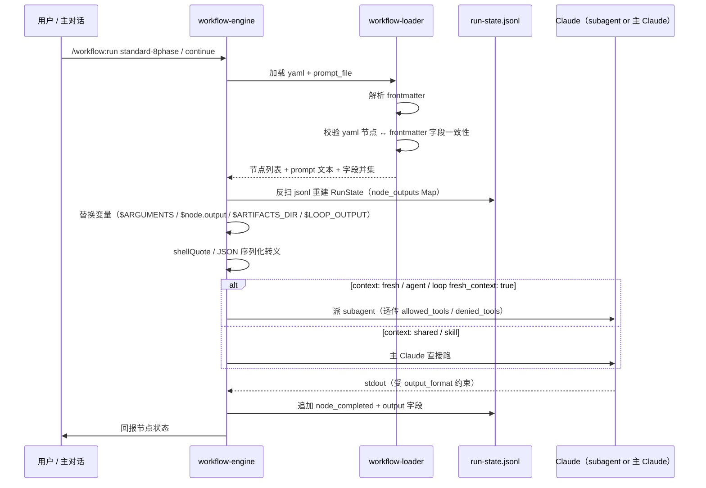
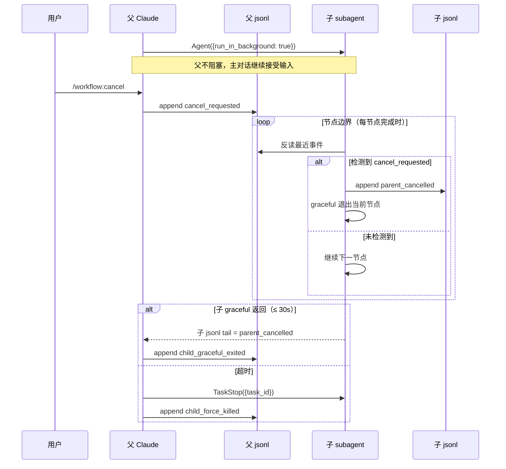

# REQ-2026-009 · 自定义工作流改造 — 详细设计

## 文档定位

本文档把 outline-design §7 锁定的 9 项 detail-design 待办落到「接口签名 / 数据结构 / 时序 / 实现要点 / 单测覆盖 / 影响域」六类机读细节，作为 development 阶段实施的唯一蓝图。

- **上游**（来源：requirements/REQ-2026-009/artifacts/outline-design.md:454）9 项待办映射为本文 §1 ~ §9
- **上游 ADR**（来源：requirements/REQ-2026-009/plan.md:51）D-001 ~ D-010 闭合本阶段范围；本文不引入新决策
- **上游 spec**（来源：context/team/engineering-spec/specs/2026-05-08-workflow-unified-redesign.md）v2.2 修订点 §5 / §11.2 / §11.3 在本文 §6 / §7 落地
- **下游**：本阶段同步产出 `features.json`；task-planning 阶段再拆 `tasks/<fid>.md`
- **章节编号约定**：§1 ~ §9 与 outline-design.md §7 待办表 # 1 ~ # 9 一一对应；§10 ~ §12 为收尾段；本文档采用「先写章节 stub + 待澄清清单」的骨架风格，逐项细化在 detail-design 阶段后期完成

---

## 1. 9 个 `/workflow:*` 通用命令接口签名（对应 outline §7 待办 #1，主责 D-008）

### 1.1 命令清单与 ARGUMENTS

命令集合按"通用 workflow 引擎"语义锁定为 9 个；AC-03 原 11 命令中剔除 `submit` / `archive` 两个 PR 流程特定命令（见 §1.5 通用性裁定，来源：requirements/REQ-2026-009/artifacts/requirement.md:117）。

| # | 命令 | ARGUMENTS 形态 | 触发条件 | 主要副作用 |
|---|---|---|---|---|
| 1 | `/workflow:run` | `<template-id> [<args>]` | 用户主动 / launcher | bootstrap run 目录 + jsonl + 初始 prompt |
| 2 | `/workflow:continue` | `[<run-id>]`（缺省=匹配当前分支） | 用户主动 / launcher | 重建 RunState 进 main loop |
| 3 | `/workflow:save` | `[note]` | 用户主动 | jsonl 追加 `[save]` 事件 |
| 4 | `/workflow:status` | `[<run-id>]` | 用户主动 | 只读输出（含父子树） |
| 5 | `/workflow:list` | `[--filter=...]` | 用户主动 | 只读输出 |
| 6 | `/workflow:approve` | 无 | approval_pending 状态 | 状态机 approval_pending → running（hook 拦 AI；main loop 推进下一节点） |
| 7 | `/workflow:reject` | `<reason>` | approval_pending 状态 | 状态机 → rejected + on_reject 路径 |
| 8 | `/workflow:cancel` | 无 | 用户主动 | 父 jsonl 写 `cancel_requested` |
| 9 | `/workflow:rollback` | `<to-node>` | 用户主动 | mv 产物到 `.archived/<ts>/` + jsonl 截断 |

> **设计裁定**（§1.5 详）：原 AC-03 中的 `submit` / `archive` 与"PR 合并 / 删分支"语义强耦合，对 `code-review-embedded` / `extract-experience` 等模板不适用；改为 standard-8phase yaml 的终态节点（`pr-submit` / `archive-finalize` 等 bash 节点），不进引擎层命令集。spec / outline 早期草稿出现的 `/workflow:new` / `/workflow:next` 也已统一（`run` 替代 `new`；引擎 main loop 自动推进，无 `next`）。

### 1.2 每命令的接口字段（七字段）

通用模板：每命令在 `.claude/commands/workflow/<cmd>.md` 给出 slash-command 入口（ARGUMENTS 透传），调 `.claude/skills/managing-workflow-runs/SKILL.md` 的 9 子动作派发（参考既有 `managing-requirement-lifecycle` 的 8 子动作结构）。下面 9 张表格逐一展开七字段（ARGUMENTS 解析 / 入参约束 / 前置条件 / 副作用 / 返回输出 / 失败模式 / 决策回引）。

#### 1.2.1 `/workflow:run <template-id> [<args>]`

| 字段 | 内容 |
|---|---|
| ARGUMENTS 解析 | `$1` = template-id（必填）；`$2..$N` = template-specific args（如 standard-8phase 的 title / code-review-embedded 的 feature_id 等，多 token 拼空格） |
| 入参约束 | template-id 必须命中 `.claude/workflows/*.yaml`（loader 校验）；args 由对应 template 的 `args:` schema 校验；新 REQ-ID 由 bootstrap 自动生成 |
| 前置条件 | 启动需求类 template（如 standard-8phase）时当前 git 分支 ∉ {main, master, develop}（hook protect-branch.sh 已拦）；启动 sub_workflow 类无此约束 |
| 副作用 | 创建 `runs/<id>/` 或 `requirements/<id>/`（D-002 双轨期）+ meta.yaml + jsonl 事件 `workflow_started` + 需求类自动切 `feat/req-<id>` 分支 |
| 返回输出 | 主对话回报 REQ-ID + 起始节点名 + 下一步提示 |
| 失败模式 | template not found → exit 1 + 可用模板列表；分支冲突 → exit 1 + 切分支建议；args schema 不符 → exit 1 + 字段缺失提示 |
| 决策回引 | D-001（MVP 模板范围）/ D-002 / D-007 |

#### 1.2.2 `/workflow:continue [<run-id>]`

| 字段 | 内容 |
|---|---|
| ARGUMENTS 解析 | `$1` = run-id（可选；缺省=匹配当前分支） |
| 入参约束 | run-id 形如 `REQ-YYYY-NNN`；缺省时需 git 分支 = `feat/req-<id>` 模式可解析 |
| 前置条件 | 目标 run 当前 state ∈ {running, paused, failed}（completed / cancelled 拒绝；approval_pending 由命令转 approve/reject） |
| 副作用 | 反扫 jsonl 重建 RunState + 进 main loop；jsonl 事件 `run_resumed` |
| 返回输出 | 主对话回报当前节点 + 已完成节点数 + 下一步提示 |
| 失败模式 | run 不存在 → exit 1 + 候选 run 列表；jsonl 损坏（spec §13）→ warn + 从最近 checkpoint 恢复 |
| 决策回引 | D-007（_resolve_run_dir 双路径） |

#### 1.2.3 `/workflow:save [<note>]`

| 字段 | 内容 |
|---|---|
| ARGUMENTS 解析 | `$1..$N` = 自由 note（可选；多 token 拼空格） |
| 入参约束 | note ≤ 200 字符；多行不写入（换行替换为空格，与 process.txt 同语义） |
| 前置条件 | 当前 run state ∈ {running, paused, approval_pending, failed, completed} |
| 副作用 | jsonl 追加 `[save]` 事件 + 触发主对话回报 status 摘要 |
| 返回输出 | "已保存 <ts> + 当前节点 + note 摘要" |
| 失败模式 | 无 run → exit 1 + 提示先 new/continue |
| 决策回引 | spec §13 检查点续接 |

#### 1.2.4 `/workflow:status [<run-id>]`

| 字段 | 内容 |
|---|---|
| ARGUMENTS 解析 | `$1` = run-id（可选；缺省=当前分支匹配） |
| 入参约束 | run-id 同 1.2.2 |
| 前置条件 | run 目录存在 |
| 副作用 | 只读；不改 jsonl 不改 meta |
| 返回输出 | 父子树视图：阶段 + 节点拓扑 + 当前位置 + 已完成节点数 + 子 run 嵌套（spec §6.4 sub_workflow 观测） |
| 失败模式 | run 不存在 → 列出候选；目录损坏 → warn |
| 决策回引 | spec §6.4 父子树展示 |

#### 1.2.5 `/workflow:list [--filter=<expr>]`

| 字段 | 内容 |
|---|---|
| ARGUMENTS 解析 | `--filter=` 后跟 yaml-style 表达式（如 `phase=detail-design`、`state=paused`） |
| 入参约束 | filter 字段名 ∈ {phase, state, template, requirement_id, parent_run_id}；值用 = / != / contains |
| 前置条件 | — |
| 副作用 | 只读；扫 `requirements/*/meta.yaml` + `runs/*/meta.yaml` |
| 返回输出 | 表格：REQ-ID / 模板 / 状态 / 阶段 / 当前节点 / 父子标识 |
| 失败模式 | filter 语法错 → exit 1 + 示例 |
| 决策回引 | D-002 双轨期扫描 |

#### 1.2.6 `/workflow:approve`

| 字段 | 内容 |
|---|---|
| ARGUMENTS 解析 | 无 |
| 入参约束 | — |
| 前置条件 | 当前 run state = approval_pending；调用方 = tty 终端（hook + isatty 双层校验，§5） |
| 副作用 | jsonl 事件 `approval_approved` + 状态机 approval_pending → running + 触发下一节点（注：approve 后 state 进 running，main loop 推进下一节点；最终 completed/failed 由 workflow_completed/workflow_failed 事件标记，而非 approve 直接设置） |
| 返回输出 | "Approved <node-id> at <ts> by <signer>"；进入下一节点提示 |
| 失败模式 | state 不匹配 → exit 1；hook 拦截（AI 调用）→ exit 2 BLOCKED |
| 决策回引 | D-006（hook + isatty 双层），spec §15 |

#### 1.2.7 `/workflow:reject <reason>`

| 字段 | 内容 |
|---|---|
| ARGUMENTS 解析 | `$1..$N` = reason（必填；多 token 拼空格） |
| 入参约束 | reason ≥ 8 字符（与 `CLAUDE_GATES_GLOBAL_BYPASS` 同口径）；同 1.2.7 双层校验 |
| 前置条件 | 当前 run state = approval_pending |
| 副作用 | jsonl 事件 `approval_rejected` + reason；状态机 approval_pending → on_reject 节点（yaml 声明的回退路径） |
| 返回输出 | "Rejected <node-id> at <ts> by <signer>: <reason>"；on_reject 节点信息 |
| 失败模式 | reason 太短 → exit 1 + 长度要求提示；同 1.2.6 hook / isatty 拦截 |
| 决策回引 | D-006，spec §6.4 approval 节点 on_reject |

#### 1.2.8 `/workflow:rollback <to-node>`

| 字段 | 内容 |
|---|---|
| ARGUMENTS 解析 | `$1` = to-node（必填，节点 ID） |
| 入参约束 | to-node ∈ 当前 run yaml 节点 ID 集合；to-node 必须是当前节点的拓扑上游 |
| 前置条件 | 当前 run state ∈ {running, paused, approval_pending, failed, completed}（cancelled 拒绝）；无并发 rollback（fcntl.flock 互斥） |
| 副作用 | 调 `rollback_run(run_id, to-node)`：mv 产物到 `.archived/<ts>/` + jsonl 截断尾部 mv 为 `.tail` + 父跨子目录整体 mv（详见 §6） |
| 返回输出 | "Rolled back <run-id> from <X> to <to-node> at <ts>"；归档目录路径 |
| 失败模式 | to-node 不存在 → exit 1；非上游 → exit 1；并发 rollback → exit 1 + .in_progress 标记位置 |
| 决策回引 | D-010 |

#### 1.2.9 `/workflow:cancel`

| 字段 | 内容 |
|---|---|
| ARGUMENTS 解析 | 无 |
| 入参约束 | — |
| 前置条件 | 当前 run state ∈ {running, paused, approval_pending} |
| 副作用 | 父 jsonl 写 `cancel_requested`；子 subagent poll 检测后 graceful 退出（D-005）；30s 超时父调 `TaskStop` forceful 兜底 |
| 返回输出 | "Cancel requested at <ts>; awaiting graceful exit (≤ 30s)" → graceful 完成后再回报 cancelled |
| 失败模式 | state 不匹配 → exit 1；TaskStop 调用失败 → warn + jsonl 写 cancel_taskstop_failed |
| 决策回引 | D-005 |

### 1.3 命令×RunState 状态机矩阵

行 = run state；列 = 命令；✓ = 允许；✗ = 拒绝（前置条件不满足时）；— = 无 run 上下文不适用。

| state \ cmd | run | continue | save | status | list | approve | reject | rollback | cancel |
|---|---|---|---|---|---|---|---|---|---|
| (无 run) | ✓ | ✗ | ✗ | ✗ | ✓ | ✗ | ✗ | ✗ | ✗ |
| running | ✗ | ✓ | ✓ | ✓ | ✓ | ✗ | ✗ | ✓ | ✓ |
| paused | ✗ | ✓ | ✓ | ✓ | ✓ | ✗ | ✗ | ✓ | ✓ |
| approval_pending | ✗ | ✗ | ✓ | ✓ | ✓ | ✓ | ✓ | ✓ | ✓ |
| cancel_requested | ✗ | ✗ | ✗ | ✓ | ✓ | ✗ | ✗ | ✗ | ✗ |
| cancelled | ✗ | ✗ | ✗ | ✓ | ✓ | ✗ | ✗ | ✗ | ✗ |
| failed | ✗ | ✓ | ✓ | ✓ | ✓ | ✗ | ✗ | ✓ | ✗ |
| completed | ✗ | ✗ | ✓ | ✓ | ✓ | ✗ | ✗ | ✓ | ✗ |

矩阵实现位置：每命令 SKILL.md 子动作开头先做 state 校验；不满足直接 exit 1 + 错误文案。覆盖来源：§1.2 各命令"前置条件"字段。

### 1.4 单测覆盖

测试落 `tests/skills/test_workflow_commands.py`，覆盖 4 类断言：

- 每命令 happy path（不同合法状态进入）
- 每命令非法状态拒绝（取 §1.3 矩阵中"✗"格子）
- 跨命令串行：`run → continue → save → status → approve（终态 approval 节点）` 端到端（standard-8phase yaml 的终态 bash 节点 `pr-submit` / `archive-finalize` 由 yaml e2e 测试覆盖，不归本节）+ 旁路 `cancel` 短路径
- approve/reject 走 hook 拦截（命中 → exit 2）+ tty fallback（命中 → exit 0）双路径

具体用例数与 fixture 设计见 OQ-DD-A1-T（detail-design 评审前补完）。

### 1.5 通用性裁定：为什么 submit / archive 不在引擎层

原 AC-03 列 11 命令含 `submit` / `archive`，本设计将其下沉到 standard-8phase yaml 的终态节点，理由：

| 维度 | submit / archive 的特定性 | 引擎层 9 命令的通用性 |
|---|---|---|
| 与 yaml 模板的耦合 | 硬编码 `gh pr create` + `feat/req-*` 分支 + GitHub PR 流程 | 仅操作 jsonl / RunState / 产物路径，与 yaml 内容无关 |
| 对其他模板适用性 | `code-review-embedded`（输出报告）/ `extract-experience`（写 lessons）/ `release-cut`（v2 标签流程）/ `general-assist`（无产物）均不适用 | `run` / `continue` / `save` / `status` / `list` / `approve` / `reject` / `cancel` / `rollback` 对**所有** workflow 模板都有意义 |
| 设计自洽 | spec §1.2 / AC-01 锁定"改阶段顺序只改 1 yaml 零代码改动"——意味着特定阶段动作（PR / 归档）必须在 yaml 内 | 引擎命令是模板无关的语义层 |

替代方案：standard-8phase.yaml 末端引入 3 个 bash 节点（属 F-003 完整化范围）：

```yaml
- id: pr-submit
  bash: |
    set -e
    git push origin "feat/req-$RUN_ID"
    EXISTING=$(gh pr list --head "feat/req-$RUN_ID" --state open --json url --jq '.[0].url' 2>/dev/null || true)
    if [ -n "$EXISTING" ]; then
      PR_URL="$EXISTING"
    else
      PR_URL=$(gh pr create --title "$PR_TITLE" --body-file "$PR_BODY_FILE" \
                            --base "$BASE_BRANCH" ${DRAFT_FLAG:+--draft})
    fi
    [[ -z "$PR_URL" ]] && { echo "ERROR: gh pr create 未返回 PR URL（RUN_ID=$RUN_ID）" >&2; exit 1; }
    yq e ".pr_url = \"$PR_URL\"" -i runs/$RUN_ID/meta.yaml
  depends_on: [test-final-signoff]   # 落地修订：原文 [test-traceability-check]，按 yaml 实际拓扑末端 test-final-signoff 接（F-003 review F-20 同步）
  output_format: { type: object, properties: { pr_url: { type: string } } }

- id: pr-merged-gate
  approval:
    gate_message: |
      PR 已合并？请 approve 进入归档；如未合并请 reject 并继续等待。
    capture_response: true
    on_reject:
      prompt: |
        PR 尚未合并，请等待合并后再次 approve。当前 PR：$pr-submit.output.pr_url
      max_attempts: 10
  depends_on: [pr-submit]

- id: archive-finalize
  bash: |
    set -e
    ARCHIVED_AT="$(date '+%Y-%m-%d %H:%M:%S')"
    COMPLETED_AT="$(date -u +%Y-%m-%dT%H:%M:%SZ)"
    yq e ".archived_at = \"$ARCHIVED_AT\" | .outcome = \"shipped\" | .phase = \"completed\" | .workflow_status = \"completed\" | .completed_at = \"$COMPLETED_AT\"" -i runs/$RUN_ID/meta.yaml
    echo "归档完成；建议手动跑：git branch -d feat/req-$RUN_ID"
    python3 scripts/lib/append_process.py "phase-transition: completed → archived" 2>/dev/null || true
  depends_on: [pr-merged-gate]
```

落地修订（F-003 review F-21 同步）：原 archive-finalize 仅锁定 `archived_at` + `outcome` 2 字段；实际落地吸收原 `workflow-mark-completed` 节点的 `phase=completed` / `workflow_status=completed` / `completed_at`，合并写一条 yq 管道表达式（原子性）。`append_process.py` 兜底 `|| true` 防 F-005 落地前 script 缺失抛错。

用户路径：跑到 pr-submit 节点引擎自动推 PR + 写 pr_url；用户合并 PR 后回来 `/workflow:approve` 触发 archive-finalize。**无需引擎层 submit / archive 命令**。

其他 yaml 模板（不需要 PR）的终态节点不写这三个节点即可，自然不受 PR 流程绑定。

---

## 2. 节点级 prompt 文件清单（对应 outline §7 待办 #2，主责 D-001）

### 2.1 目录结构（v2.2 spec 落地）

来源：requirements/REQ-2026-009/artifacts/outline-design.md:459 锁定节点级 prompt 抽到 `.claude/workflows/prompts/`。

```
.claude/workflows/prompts/
  standard-8phase/      # 8 阶段对应 prompt
  code-review-embedded/
    cr-prepare.md       # /code-review 预检（识别 mode + diff scope）
    cr-checker-security.md
    cr-checker-performance.md
    cr-checker-complexity.md
    cr-checker-concurrency.md
    cr-checker-error-handling.md
    cr-checker-design-consistency.md
    cr-checker-auxiliary-spec.md
    cr-checker-history-context.md
    cr-critic.md         # review-critic 对抗
    cr-judge.md          # 综合裁决（code-quality-reviewer）
```

8 个 cr-checker-*.md 文件名 1:1 对应 .claude/agents/*-checker.md（OQ-DD-B4 闭合，2026-05-08 用户拍板照搬）。

**占位 prompt 规则（F-003 review F-23 / F-24 同步）**：

- standard-8phase/ 下 8 个阶段 prompt（initialization / definition / tech-research / outline-design / detail-design / task-planning / development / testing）属"占位 prompt"——它们的 frontmatter `node_id` 仅锚定到该阶段内**任意一个**已存在的 yaml 节点，loader 只校验单向引用（frontmatter.node_id 在 yaml 中存在），**不**要求 yaml 节点反向 `prompt_file:` 指回这些占位文件。
- 当某 yaml 节点显式声明 `prompt_file: prompts/standard-8phase/<phase>.md` 时，loader 才执行双向校验（frontmatter.node_id ↔ yaml.<id>）。
- 占位 prompt 的 `node_id` 选择规则：优先选阶段内**第一个**有实际 prompt 内容（`prompt_override` / `prompt`）可抽离的节点；如阶段全为 skill / agent / artifact 节点（无 inline prompt），允许选阶段内任一具代表性节点（约定但不强制对齐入口节点）。

### 2.2 frontmatter 字段定义

每个 prompt 文件用 YAML frontmatter 头（`---` 三连线分隔），字段语义全部对齐 spec §6.3 / §6.4 / §6.13 的节点字段；yaml workflow 是字段的唯一事实源（source of truth），prompt frontmatter 只在外置 prompt_file 时声明对应字段供引擎做"yaml 节点 ↔ prompt 文件" 一致性校验。

**字段表**（参考来源：context/team/engineering-spec/specs/2026-05-08-workflow-unified-redesign.md:393）：

| 字段 | 是否必填 | 类型 | 语义 | 引擎处理 |
|---|---|---|---|---|
| `name` | 必填 | string | prompt 文件唯一名（kebab-case，建议 = node_id） | loader 校验唯一性 |
| `node_id` | 必填 | string | yaml workflow 中对应的节点 id | loader 校验 yaml 节点存在且 prompt_file 字段指向本文件 |
| `version` | 必填 | string | semver；frontmatter 演化时升 minor | 校验日志记录 |
| `inputs[]` | 可选 | list of `{name, source, type, required}` | 输入变量声明 | loader 校验与 yaml 节点 inputs 一致；运行时引擎做 type 校验 |
| `output_format` | 可选 | JSON Schema | 节点 output 契约（覆盖 yaml 节点字段） | 写 jsonl 前用 ajv 校验 |
| `context` | 可选 | enum: `fresh` / `shared` | fresh = 派 subagent；shared = 主 Claude 直接跑 | 决定派发方式（spec §7.2 决策表） |
| `allowed_tools` / `denied_tools` | 可选 | list[string] | 工具白名单 / 黑名单 | 派发时透传给 subagent |
| `model` / `effort` / `thinking` / `fallback_model` | 可选 | 同 yaml 节点 | 模型档位覆盖（优先级见 §2.2.1） | LLM 调用参数 |
| `idle_timeout` | 可选 | int (毫秒) | 节点空闲超时 | 引擎计时 |
| `retry` | 可选 | `{max_attempts, delay_ms, on_error}` | 重试策略 | 引擎重试 |
| `context_budget` | 可选 | int (token) | 主对话压力监控阈值 | 命中触发 §6.11 inline → file 切换 + warn |
| `on_subworkflow_failure` | 可选 | enum: `fail` / `continue` / `skip` | 子 workflow 抛异常时父节点行为；仅 `sub_workflow` 类型节点生效；缺省 = `fail`（spec §6.4） | 引擎按枚举分支：fail = 父节点 fail / continue = 写 child_failed 后继续下游 / skip = 跳过本节点直接进 next |

#### 2.2.1 字段优先级（覆盖规则）

`yaml workflow 节点字段` ＞ `prompt frontmatter` ＞ `workflow 顶层默认`。yaml 是事实源；prompt frontmatter 只在 yaml 节点未显式声明对应字段时生效；冲突时以 yaml 为准并 loader 报 warning。

#### 2.2.2 frontmatter 示例（cr-checker-security.md 雏形）

```yaml
---
name: cr-checker-security
node_id: cr-checker-security
version: 1.0.0
context: fresh
allowed_tools: [Read, Grep]
denied_tools: [Bash, Edit, Write]
model: claude-sonnet-4-6
effort: medium
inputs:
  - name: diff_range
    source: $cr-prepare.output.diff_range
    type: string
    required: true
  - name: scope_file
    source: $cr-prepare.output.scope_file
    type: string
    required: true
output_format:
  type: object
  properties:
    findings:
      type: array
      items: { type: object }
  required: [findings]
idle_timeout: 300000
context_budget: 60000
---

# Prompt 正文

你是安全 checker，对 `$diff_range` 范围内的增量做 OWASP Top 10 检查。
读 `$scope_file` 取增量文件清单。
输出 JSON：{"findings": [...]}
```

### 2.3 ARGUMENTS 注入约定

`$ARGUMENTS` 是 `/workflow:run <template> <args>` 中 `<args>` 的字面量（来源：context/team/engineering-spec/specs/2026-05-08-workflow-unified-redesign.md:607）。注入规则：

- **顶层 run**：`$ARGUMENTS` = 用户输入的命令行参数原文；`$1` ~ `$9` = 位置参数（spec §6.5）
- **sub_workflow 节点**：父 yaml 的 `args:` 字段（如 `feature_id: $feature-implement.output.id`）经引擎替换后，整体序列化为 JSON 字符串透传给子 run 的 `$ARGUMENTS`（来源：context/team/engineering-spec/specs/2026-05-08-workflow-unified-redesign.md:565）
- **引擎替换时机**：派发前做字符串替换（不在 LLM 内做），变量值经 `shellQuote` 转义（spec §6.5 注入防御）
- **prompt 文件内引用**：用 `$ARGUMENTS` / `$<nodeId>.output` 形式（无 mustache 双大括号），与 spec §6.5 变量表对齐

### 2.4 `$ARTIFACTS_DIR` 父子隔离

`$ARTIFACTS_DIR` 在每个 run 内独立解析；引擎按 run_id 走 `_resolve_run_dir`（D-007 双路径 loader，来源：requirements/REQ-2026-009/plan.md:110）：

- **父 run**：`$ARTIFACTS_DIR = requirements/<id>/artifacts/`（兼容期路径）或 `runs/<id>/artifacts/`（rename 后路径）
- **子 run**：`$ARTIFACTS_DIR = runs/<child-run-id>/artifacts/`（子 run 一律走 runs/ 路径）
- **写权限**：子 run prompt 不能写父 run 的 artifacts；引擎在派发子 prompt 前替换 `$ARTIFACTS_DIR` 为子目录字面量，hook 层（`.claude/hooks/protect-branch.sh` 同位置）拒绝写跨 run 路径
- **D-005 父 cancel 写**：父 jsonl 的 `cancel_requested` 事件由父 Claude 写父 jsonl，子 jsonl 永远由子自身写（来源：requirements/REQ-2026-009/plan.md:92），不存在跨 run 文件写

### 2.5 `$LOOP_OUTPUT` / `$LOOP_PREV_OUTPUT` 读取协议

引擎从 jsonl 中读最近一条 `loop_iteration_completed` 事件的 `output` 字段（来源：context/team/engineering-spec/specs/2026-05-08-workflow-unified-redesign.md:614）：

- **`$LOOP_OUTPUT`**：interactive loop 当前轮 prompt 完成后，gate_message 替换时可见；语义 = 本轮 prompt stdout（受 output_format 约束）
- **`$LOOP_PREV_OUTPUT`**：下一轮 prompt 内可见；语义 = 上一轮 loop_iteration_completed 的 output
- **读取实现**：引擎在 gate_message / prompt 替换前反扫 jsonl 拿最近一条事件，命不到（首轮）则替换为空字符串
- **首轮**：`$LOOP_OUTPUT` = `""`（空字符串），`$LOOP_PREV_OUTPUT` 同样替换为 `""`（与 spec §6.5 / `substitute_vars` 实现一致：env 缺失即默认空串）

### 2.6 派发时序图



### 2.7 单测覆盖

测试落 `tests/workflows/test_prompt_structure.py`，覆盖：

- frontmatter 解析：合法 → pass / 缺必填字段 (`name`/`node_id`/`version`) → 拒绝 / 字段类型错（`inputs[]` 不是 list）→ 拒绝
- yaml 节点 ↔ frontmatter 一致性：`prompt_file` 指向但 frontmatter `node_id` 不匹配 → 拒绝；`output_format` 双声明但语义冲突 → 拒绝
- 变量占位符与 inputs 一致性：prompt 正文引用 `$X` 但 frontmatter `inputs[]` 缺 `X` → warn（不拒绝，兼容隐式上游）
- ARGUMENTS 注入边界：含单引号 / 双引号 / 反斜杠的 args 经 `shellQuote` 后 LLM 收到的字面量与原文一致
- `$ARTIFACTS_DIR` 父子隔离：父子 run 同名 prompt 节点替换得不同字面量

具体用例数与 fixture 设计见 OQ-DD-A4-T（detail-design 评审前补完）。

---

## 3. `features.json` 拆分（对应 outline §7 待办 #3）

### 3.1 schema 引用

来源：context/team/engineering-spec/features-schema.yaml 作为 `id` / `title` / `description` 必填的事实源；可选机读字段（`complexity` / `depends_on_features` / `touches` / `interfaces_frozen`）来源：.claude/skills/task-context-builder/reference/extract-rules.md。

### 3.2 单文件 vs 多文件决策（A5 闭合）

**决策：单文件 `requirements/REQ-2026-009/artifacts/features.json`。**

依据：

- GATE-FEATURES-SCHEMA plugin 的 glob 字面量为 `requirements/*/artifacts/features.json`（来源：scripts/gates/plugins/features_schema.py:37）；多文件方案需同时改 plugin glob、`scripts/lib/check_features.py` merge 逻辑、`feature-lifecycle-manager` Skill 拆分读取——三处脱离 REQ-2026-009 范围（落 Post-MVP 评估）
- features-schema.yaml 已锁 schema_version=1.0 顶层结构（来源：context/team/engineering-spec/features-schema.yaml:32）；多文件需升级 schema 加 `index_file` 概念，破坏性变更
- 文件大小不构成约束：REQ-2026-008 单文件 19KB / 8 features，本需求 ~12-14 features 估算 ~30 KB 量级

### 3.3 粒度修正：thematic feature（原"节点 / 命令" 1:1 估算作废）

A5 同时修正 §3.2 旧版"feature_id 编号空间分组"的过粗估算（65-75 features 把节点 / 命令都当 feature）。正确粒度参考 REQ-2026-008 的 thematic level——一个 feature 覆盖一组协作模块的端到端落地（含 schema / 实现 / gate / 单测）。

#### 初版 feature 清单（detail-design 评审前精化）

| feature_id | 主题 | 主责章节 | 复杂度初判 |
|---|---|---|---|
| F-001 | workflow-engine 核心（loader + run-state + dispatcher）| spec §6 / §7 | heavy |
| F-002 | 8 种节点类型实现（含 sub_workflow / loop / approval）| spec §6.4 + §11.2 | heavy |
| F-003 | standard-8phase.yaml 38 节点完整化 + 阶段 prompt 抽离 | §2 | medium |
| F-004 | code-review-embedded.yaml + sub_workflow 验证 | §2 | medium |
| F-005 | 9 个 `/workflow:*` 通用命令 + managing-workflow-runs Skill | §1 | medium |
| F-006 | workflow-launcher 关键词触发 Skill + 仲裁 | §4 | medium |
| F-007 | workflow_rollback.py + 跨父子归档（D-010）| §6 | medium |
| F-008 | sub_workflow 父子状态联动（D-005 cancel + parent_cancelled）| §7 | medium |
| F-009 | D-006 hook 拦截 + workflow_approve/reject.py + ai-collaboration patch | §5 | light |
| F-010 | 9 个 `/requirement:*` 别名兼容期保留实现（D-009）| §10.2 | light |
| F-011 | 自举验证 SOP（Plan 6）+ migration 测试（R001-R007 等价）| §8 + §10.3 | medium |
| F-012 | Plan 7 清理（删 PHASE_REQUIREMENTS / phase_enum / signoff / next）| §10.3 | light |
| F-013 | requirements/ → runs/ 批量 rename 工具（D-002）| §9 | medium |

合计 13 features，与 REQ-2026-008 同量级。具体 modules / touches / acceptance 由 detail-design 评审前补完（OQ-DD-A5-D）。

### 3.4 依赖关系（DAG 完整表）

基于 §3.3 重新编号的 13 features，每条 `depends_on_features[]` 字面量：

| feature_id | depends_on_features | 依赖理由 |
|---|---|---|
| F-001 engine 核心 | `[]` | DAG 起点 |
| F-002 节点类型 | `[F-001]` | 节点执行依赖 dispatcher |
| F-003 standard-8phase yaml | `[F-001, F-002]` | yaml 落地依赖 loader + 节点类型；含末端 pr-submit / pr-merged-gate / archive-finalize 三 bash/approval 节点（§1.5） |
| F-004 code-review-embedded yaml | `[F-001, F-002]` | 同 F-003 + sub_workflow 验证 |
| F-005 11 命令 + Skill | `[F-001]` | 命令调 RunState API |
| F-006 launcher | `[F-005]` | launcher 翻译为 `/workflow:*` 命令 |
| F-007 rollback | `[F-001, F-002]` | jsonl 截断（F-001）+ sub_workflow mv 语义（F-002） |
| F-008 父子状态联动 | `[F-002]` | 依赖 sub_workflow 节点类型已实现 |
| F-009 hook + approve/reject.py | `[F-005]` | hook 拦截 `/workflow:approve` 字面量需命令骨架 |
| F-010 别名兼容期 | `[F-005]` | 9 个 `/requirement:*` 别名转 `/workflow:*` 调用 |
| F-011 自举 + migration 测试 | `[F-001, F-002, F-003, F-004, F-005, F-006, F-007, F-008, F-009, F-010]` | 端到端链路全要在位 |
| F-013 rename 工具 | `[F-011]` | §9.8 顺序：自举验证通过后才能跑 rename |
| F-012 Plan 7 清理 | `[F-013]` | §9.8 顺序：rename 完成后才能删 PHASE_REQUIREMENTS |

DAG 验证（自检）：

- 无环：拓扑序合法 = `[F-001, F-002, F-003, F-004, F-005, F-006, F-007, F-008, F-009, F-010, F-011, F-013, F-012]`
- 关键路径：F-001 → F-005 → F-011 → F-013 → F-012（5 节点串行；其余可并行）
- 工具校验：`tools/check_features_dag.py` 在 features.json 落盘后跑（Plan 1 已合并）

DAG 关键边解读（与 §6 / §7 / §9 联动）：

- F-007（rollback）= §6 落地 + 提供 §7 跨父子复用
- F-008（父子状态联动）= §7 落地 + 复用 F-007 实现
- F-013（rename 工具）= §9 落地 + 解锁 D-007 loader 1 行清理（在 F-012 内）

### 3.5 features.json 校验

来源：scripts/gates/registry.yaml 已注册 GATE-FEATURES-SCHEMA（在 phase-transition / submit / pre-commit / ci 四触发点生效）；本阶段仅"承接"该 gate，不引入新规则。features.json 落盘后由 `scripts/lib/check_features.py` 校验 schema_version=1.0 + 顶层 required_fields + 每条 feature 的 required={id,title,description,modules,depends_on,depends_on_features,complexity,touches,acceptance}。

---

## 4. `keyword-matching.md` 关键词长度排序表（对应 outline §7 待办 #4，主责 D-008）

### 4.1 字符长度计数规则

统一规则（D-008 锁定，来源：requirements/REQ-2026-009/artifacts/outline-design.md:218）：

- 一个汉字 = 1 字符
- 一个 ASCII 字符 = 1 字符（含字母 / 数字 / 标点）
- 计数用 Python `len(s)`（Python 3 原生 Unicode 字符长度），跨平台一致

#### 4.1.1 6 类关键词清单与长度

| 类 | 关键词 | 长度 | 映射命令 / ARGUMENTS |
|---|---|---:|---|
| **continue** | `继续之前的需求` | 7 | `/workflow:continue` |
| **continue** | `继续这个需求` | 6 | `/workflow:continue` |
| **continue** | `接着做` | 3 | `/workflow:continue` |
| **continue** | `继续` | 2 | `/workflow:continue` |
| **review** | `code review` | 11 | `/workflow:run code-review-embedded` |
| **review** | `跑下代码评审` | 6 | `/workflow:run code-review-embedded` |
| **review** | `跑代码评审` | 5 | `/workflow:run code-review-embedded` |
| **review** | `审一下` | 3 | `/workflow:run code-review-embedded` |
| **new** | `开个新需求` | 5 | `/workflow:new standard-8phase "<title>"` |
| **new** | `新建需求` | 4 | `/workflow:new standard-8phase "<title>"` |
| **new** | `创建需求` | 4 | `/workflow:new standard-8phase "<title>"` |
| **release** | `release` | 7 | `/workflow:run release-cut`（Post-MVP） |
| **release** | `我要发版` | 4 | `/workflow:run release-cut`（Post-MVP） |
| **release** | `打版本` | 3 | `/workflow:run release-cut`（Post-MVP） |
| **approve** | `approve` | 7 | `/workflow:approve` |
| **approve** | `批准` | 2 | `/workflow:approve` |
| **approve** | `通过` | 2 | `/workflow:approve` |
| **reject** | `reject:` | 7 | `/workflow:reject <reason>` |
| **reject** | `不通过` | 3 | `/workflow:reject <reason>` |
| **reject** | `驳回` | 2 | `/workflow:reject <reason>` |

#### 4.1.2 排序后的最长匹配表（按 length DESC）

```
length=11: code review (review)
length= 7: 继续之前的需求 (continue) | release (release) | approve (approve) | reject: (reject)
length= 6: 继续这个需求 (continue) | 跑下代码评审 (review)
length= 5: 跑代码评审 (review) | 开个新需求 (new)
length= 4: 新建需求 (new) | 创建需求 (new) | 我要发版 (release)
length= 3: 接着做 (continue) | 审一下 (review) | 打版本 (release) | 不通过 (reject)
length= 2: 继续 (continue) | 批准 (approve) | 通过 (approve) | 驳回 (reject)
```

length=7 共 4 条（继续之前的需求 / release / approve / reject:）—— 这是**等长冲突**的主要发生层（§4.4 兜底 ask）。其余层多数无冲突。

### 4.2 匹配语义

| 关键词类型 | 匹配方式 | 示例 |
|---|---|---|
| ASCII（如 `approve` / `release`） | `\b<keyword>\b` 词边界 | `approved` / `releases` 不命中（避免假阳性）|
| 中文（如 `继续`） | substring 匹配 | "我要继续之前的需求" → 命中"继续之前的需求"（最长匹配优先）|
| 混合标点（如 `reject:`） | 必须含冒号字面量 | "rejected" 不命中；"reject:理由太弱" 命中 |

### 4.3 state tiebreaker 伪码

来源：requirements/REQ-2026-009/plan.md:120 D-008 第 1 步——若有 run 处于 `approval_pending` 状态，优先匹配 approve / reject，绕过最长匹配。

```python
def match_keyword(
    user_input: str,
    active_runs: list[RunState],
) -> tuple[Optional[Command], Optional[str], Optional[ConflictReason]]:
    # Step 1: state tiebreaker
    has_approval_pending = any(r.state == "approval_pending" for r in active_runs)
    if has_approval_pending:
        for kw in [k for k in KEYWORDS if k.category in ("approve", "reject")]:
            if kw.matches(user_input):
                return kw.command, kw.extract_args(user_input), None
    # Step 2: 最长匹配
    sorted_kws = sorted(KEYWORDS, key=lambda k: -k.length)
    hits = [kw for kw in sorted_kws if kw.matches(user_input)]
    # Step 3: 等长冲突兜底
    if len(hits) >= 2 and hits[0].length == hits[1].length:
        equal_top = [h for h in hits if h.length == hits[0].length]
        return None, None, ConflictReason("equal_length", equal_top)
    # Step 4: 命中或空
    if hits:
        return hits[0].command, hits[0].extract_args(user_input), None
    return None, None, None  # 无命中：launcher 不接管，主对话正常处理
```

### 4.4 等长冲突 ask 兜底

length=7 等长冲突最常见——例：用户说 "approve 这个需求并跑下评审" 同时命中 `approve` (7) 与 `跑下代码评审` (6)，**长度不等**走最长匹配（approve 7 胜出）；但 "我要 reject: 这个 release"（如果同时含 reject: 7 和 release 7）则触发 ask。

**兜底 prompt 模板**：

```
我同时检测到以下 N 个意图（关键词长度都为 K）：
  1. "<kw1>" → <command1>
  2. "<kw2>" → <command2>
  ...
请明示要执行哪一个，或换一种说法。
```

具体替换示例：

```
我同时检测到以下 2 个意图（关键词长度都为 7）：
  1. "approve" → /workflow:approve
  2. "reject:" → /workflow:reject
请明示要执行哪一个，或换一种说法。
```

ask 后用户的回复直接送回 launcher 第二轮匹配；本设计**不引入轮次状态**，避免 launcher 复杂化（参考 D-008 "MVP 不支持多步连接词"决策）。

### 4.5 `keyword-matching.md` reference 文件结构

落 `.claude/skills/workflow-launcher/reference/keyword-matching.md`，主结构：

```markdown
# 关键词路由表（D-008 锁定）

## 计数规则
（§4.1 内容）

## 6 类关键词清单
| 类 | 关键词 | 长度 | 命令映射 |
（§4.1.1 表）

## 排序后的最长匹配序
（§4.1.2 表）

## 匹配语义（ASCII vs 中文 vs 混合）
（§4.2 表）

## state tiebreaker 伪码
（§4.3 代码）

## 等长冲突 ask 模板
（§4.4 模板）
```

引用关系：launcher Skill 的 SKILL.md 主入口提示「具体关键词与长度见 reference/keyword-matching.md」；本文件由本设计直接生成首版，运行期不变（演化走 PR review）。

### 4.6 单测矩阵

测试落 `tests/skills/test_keyword_matching.py`，覆盖 6 类断言：

| # | 断言类 | 用例样本 | 期望 |
|---|---|---|---|
| 1 | 每类命中 happy | 6 类各 1 条标准输入（如 "继续" / "跑下代码评审"）| 命中 → 返回正确 command + ARGUMENTS |
| 2 | 最长匹配优先 | "我要继续之前的需求做下一步" 同时含"继续之前的需求"(7) 与"继续"(2) | 命中 7 长版本，绕过 2 长版本 |
| 3 | state tiebreaker | active_run.state=approval_pending + 输入"approve 这个需求并跑下评审" | approve 优先，绕过最长匹配；返回 `/workflow:approve` |
| 4 | 等长冲突 ask | active_run.state ≠ approval_pending + 输入触发 length=7 多命中 | 返回 ConflictReason("equal_length", [...]) + 不调命令 |
| 5 | ASCII 词边界 | 输入 "approved this" / "releases" | 不命中 approve / release（词边界保护）|
| 6 | 空匹配 | "今天天气真好" / "what's the schema for X?" | 全部返回 (None, None, None) |

**用例数估算**：6 类断言 × ~3 fixture/类 = ~18 条 pytest parametrize 用例。fixture 文件 `tests/skills/fixtures/keyword_matching.yaml` 含 `inputs[]` + `expected[]` 双字段。

### 4.7 影响域

新增文件：

- `.claude/skills/workflow-launcher/SKILL.md`（launcher Skill 入口；按 D-008 §4.3 伪码实现）
- `.claude/skills/workflow-launcher/reference/keyword-matching.md`（路由表，§4.5 结构）
- `tests/skills/test_keyword_matching.py`（6 类断言）
- `tests/skills/fixtures/keyword_matching.yaml`（输入 / 期望对照）

不改动文件：

- yaml workflow schema（关键词路由不进 yaml，是 launcher Skill 的内部逻辑）
- 主对话上下文格式（launcher 仅做意图翻译，不修改 RunState）

---

## 5. `pre-tool-use-guard.sh` case 分支详细脚本（对应 outline §7 待办 #5，主责 D-006）

### 5.1 现状定位

- 旧 isatty 校验位于 scripts/lib/code_review_signoff.py:61
- spec §15 决策删除该校验（来源：context/team/engineering-spec/specs/2026-05-08-workflow-unified-redesign.md）
- 新拦截点：`.claude/hooks/pre-tool-use-guard.sh` 同构搬到 hook 层（D-006，来源：requirements/REQ-2026-009/plan.md:101）

### 5.2 拦截语义（关键认知）

PreToolUse hook **只对 Claude Code Agent 调 Bash / Edit / Write 等工具时触发**（case 分支按 `tool_name` 派发，来源：.claude/hooks/pre-tool-use-guard.sh:88）。用户在 tty 终端直接打命令不会进 hook。因此本 patch 的拦截语义 = "AI 正在尝试调用 approval / reject 入口"，命中 = 拒绝（无需也无法在 hook 内做"是否 tty"判断）。

CLI 层 `workflow_approve.py` / `workflow_reject.py` 走 `sys.stdin.isatty()` 兜底（§5.4），覆盖 hook 被 disable / 绕过的边界场景——构成"hook 拦 AI / isatty 拦非交互进程"的双层。

### 5.3 patch 形态：完整 shell 片段

**改动定位**（pre-tool-use-guard.sh 增量 patch）：

1. 顶部新增正则常量（与 `WRITE_OPS_PATTERN` 同位置）：

```bash
# D-006 approval / reject 是人类专属（来源：requirements/REQ-2026-009/plan.md:101）
# 命中即拒绝——hook 只对 AI Bash 触发，tty 用户不走此路径
readonly APPROVAL_SLASH_PATTERN='(/workflow:(approve|reject))(\b|[[:space:]])'
readonly APPROVAL_PYTHON_PATTERN='python3?[[:space:]]+([^[:space:]]+/)?(scripts/lib/)?workflow_(approve|reject)\.py(\b|[[:space:]])'
```

2. `case "$tool_name" in ... Bash) ... esac` 分支增加一行调用：

```bash
    Bash)
      check_workflow_approval_human_only "$command"   # ← 新增
      check_bash_writes_review "$command"
      ;;
```

3. 文件尾部 `check_bash_writes_review` 之后追加新函数：

```bash
check_workflow_approval_human_only() {
  local cmd="$1"
  [[ -z "$cmd" ]] && return 0
  if echo "$cmd" | grep -qE "$APPROVAL_SLASH_PATTERN" \
     || echo "$cmd" | grep -qE "$APPROVAL_PYTHON_PATTERN"; then
    cat >&3 <<EOF
BLOCKED: /workflow:approve / /workflow:reject 是人类专属动作（D-006）。
AI 在主对话或 subagent 中不能调用以下入口：
  - /workflow:approve / /workflow:reject（slash command）
  - python3 scripts/lib/workflow_approve.py / workflow_reject.py（CLI 直入）
请由人类在 tty 终端运行；详见 context/team/ai-collaboration.md 规则三。
紧急绕过：CLAUDE_GATES_GLOBAL_BYPASS="<原因>" <重新执行>
EOF
    exit 2
  fi
}
```

### 5.4 已知绕过通道（与 F-002 carryover-A 一致接受）

变量间接引用形式无法被正则命中，例如：

```bash
P=/workflow:approve; eval "$P"          # 命中不到 SLASH 正则
S=workflow_approve.py; python3 "$S"     # 命中不到 PYTHON 正则
```

此类绕过的兜底防线（carryover-A 决策接受，来源：.claude/hooks/pre-tool-use-guard.sh:15）：

- **CLI 层 isatty fail-closed**（§5.5）：`workflow_approve.py` / `workflow_reject.py` 顶端 `if not sys.stdin.isatty(): sys.exit(2)`
- **CLAUDE_GATES_GLOBAL_BYPASS reason ≥ 8 字符**（pre-tool-use-guard.sh:60）：要求显式给原因，audit 全文记录
- **PR review 人工**（D-006 软约束）：ai-collaboration.md 规则三明文禁止；review 时人工抓取相关 commit

### 5.5 兜底 isatty 实现（CLI 层）

新增 `scripts/lib/workflow_approve.py` / `scripts/lib/workflow_reject.py` 顶端模板：

```python
# scripts/lib/workflow_approve.py（雏形）
import sys

def main() -> int:
    if not sys.stdin.isatty():
        print(
            "ERROR: /workflow:approve 必须在 tty 终端执行。\n"
            "AI 主对话 / subagent / CI / pipe 调用一律拒绝（D-006）。",
            file=sys.stderr,
        )
        return 2
    # ... 业务逻辑（写 verdict.human_signoff / 状态机推进）
    return 0
```

注意 `code_review_signoff.py:61` 的同构 isatty 检查在 Plan 7 删除前作 fallback 共存（D-009 兼容期）；删除时机由 §10.3 顺序约束控制。

### 5.6 单测矩阵

测试落 `tests/hooks/test_pre_tool_use_guard.py`，组合维度：

| 维度 | 取值 |
|---|---|
| **入口形态** | (a) `/workflow:approve` / (b) `/workflow:reject reason-text` / (c) `python3 scripts/lib/workflow_approve.py` / (d) `python3 scripts/lib/workflow_reject.py "reason"` |
| **包装方式** | (1) 直接调 / (2) `bash -c "..."` 包装 / (3) 命令前后加无关 token（环境变量 / 重定向） / (4) 从绝对路径调 python（`python3 /repo/scripts/lib/workflow_approve.py`）|
| **预期** | hook 命中 → exit 2 + BLOCKED 消息 / hook 不命中 → exit 0 |

**用例数**（建议 detail-design 评审前完成 fixture 落盘）：

- 命中场景：4 入口 × 4 包装 = 16 条 happy block
- 边界放行场景：5 条（grep 搜索字面量 / 注释中 / 字符串字面量在另一文件 / `--help` 显示帮助 / `dry-run` flag）
- 已知绕过通道场景：2 条（变量间接引用直接 eval / `python3 "$S"`）— 期望 hook 放行 + CLI 层 isatty 拒绝（双层验证）
- audit 行格式：1 条（命中时 audit log 不写 `BYPASS used`，因为本类拦截不属于 BYPASS 路径，与 audit_log 现有约定一致）

合计 24 条，按 pytest parametrize 落 fixture YAML（参考 tests/hooks/ 既有风格）。

### 5.7 ai-collaboration.md 规则三 patch

现状（来源：context/team/ai-collaboration.md:38）规则三仅写"sign-off 是人类专属动作"，列出 `code_review_signoff.py` / `/code-review:signoff` / `save_review.py signoff` 三入口。

patch 后扩展到 sign-off / approval / reject 三类，新增入口段：

```markdown
**Approval 唯一入口**（人类在 tty 终端执行）：

  /workflow:approve   # slash command 形式（最终调 workflow_approve.py）
  /workflow:reject <reason>

底层实现 `python3 scripts/lib/workflow_approve.py` / `workflow_reject.py` 同样禁止 AI 调用。
hook 层（.claude/hooks/pre-tool-use-guard.sh）已加 D-006 拦截；CLI 层 isatty fail-closed 兜底。
```

---

## 6. `workflow_rollback.py` 4 场景单测设计（对应 outline §7 待办 #6，主责 D-010）

### 6.1 公开 API 签名

来源：requirements/REQ-2026-009/plan.md:138 D-010 锁定的 mv 语义。

```python
def rollback_run(
    run_id: str,
    to_node: str,
    target_id: Optional[str] = None,
    repo_root: Optional[Path] = None,
) -> RollbackResult:
    """
    把 run_id 从当前节点回滚到 to_node：
    - 拓扑序找产物路径集合 → shutil.move 到 .archived/<ts>/
    - 父 run 跨 sub_workflow 节点时，递归 mv 子 run 整目录
    - 写 .in_progress atomic 标记保护中断
    - 截断 jsonl 尾部 mv 为 <archived>/run-state.jsonl.tail
    repo_root: testability hatch；生产为 None 时用 REPO_ROOT
    """
```

参数：

- `run_id`: 目标 run id（兼容 `requirements/<id>/` 与 `runs/<id>/` 双路径，走 `_resolve_run_dir`）
- `to_node`: yaml 节点 id；必须是当前节点的拓扑上游
- `target_id`: 跨父子 rollback 时指定子 run id（可选）；缺省时父 rollback 自动级联到所有匹配 sub_workflow 子 run

### 6.2 RollbackResult 数据结构

```python
@dataclass(frozen=True)
class RollbackResult:
    run_id: str                              # 被回滚的 run id
    archive_ts: str                          # 归档目录时间戳（ISO8601 East 8）
    archive_root: Path                       # .archived/<ts>/ 绝对路径
    moved_artifacts: list[Path]              # 被 mv 的产物文件相对路径
    moved_sub_runs: list[SubRunArchive]      # 跨父子 mv 的子 run（F1 场景）
    truncated_jsonl_tail: Path               # <archived>/run-state.jsonl.tail
    new_current_node: str                    # rollback 后续跑起点（= to_node，rollback 后从此节点重新执行）
    duration_ms: int                         # 操作耗时
    partial: bool = False                    # True = 续跑收尾路径（不是首次 rollback）

@dataclass(frozen=True)
class SubRunArchive:
    child_run_id: str                        # 子 run id（释放后不复用）
    archive_path: Path                       # 父 .archived/<ts>/sub_runs/<child-id>/ 绝对路径
    jsonl_event_count: int                   # 子 jsonl 行数（用于断言完整性）
```

### 6.3 异常契约

| 异常类 | 触发条件 | exit 码（CLI 透传）|
|---|---|---|
| `RollbackError` | 基类；参数校验失败 / 路径穿越 / IO 失败等无独立子类语义时直接抛出 | 1 |
| `RunStateNotFoundError` | `run_id` 在两条路径都查不到 run 目录 | 1 |
| `TargetNodeNotFoundError` | `to_node` 不在 run 对应 yaml 节点 ID 集合 | 1 |
| `TargetNodeNotUpstreamError` | `to_node` 不是当前节点的拓扑上游（或就是当前节点本身） | 1 |
| `ConcurrentRollbackError` | `runs/<id>/.rollback.lock` 已被持有（fcntl.flock 失败） | 1 |
| `RollbackInProgressError` | O_EXCL 原子创建 .in_progress 失败（同 archive_ts 已被持有或残留） | 1 |
| `RollbackResumeMismatchError` | `.meta.json` 中 `to_node` 与调用方传入不一致（续跑验证失败） | 1 |
| `IOError` | mv 文件失败（磁盘满 / 权限） | 1（重抛标准异常） |

### 6.4 并发互斥与中断保护选型

**选型决策：双层锁**——`fcntl.flock`（advisory lock，进程崩溃自动释放）+ `os.O_EXCL`（原子创建 `.in_progress` 标记）。

```python
# 伪码
with open(run_dir / ".rollback.lock", "w") as lock_fd:
    fcntl.flock(lock_fd, fcntl.LOCK_EX | fcntl.LOCK_NB)  # 失败 → ConcurrentRollbackError
    archive_dir = run_dir / ".archived" / archive_ts
    archive_dir.mkdir(parents=True, exist_ok=True)
    in_progress = archive_dir / ".in_progress"
    in_progress_fd = os.open(in_progress, os.O_WRONLY | os.O_CREAT | os.O_EXCL)
    try:
        # mv 产物 + jsonl tail + sub_run 整目录
        os.close(in_progress_fd)
        in_progress.unlink()                 # mv 完成后删标记
    finally:
        fcntl.flock(lock_fd, fcntl.LOCK_UN)
```

为什么不单选一个：

- 单 `fcntl.flock`：进程崩溃后锁自动释放，但中间状态产物（部分 mv 完毕）会被下次 rollback 误覆盖
- 单 `os.O_EXCL`：原子创建保证标记唯一，但进程崩溃不会清理，下次启动卡住
- 双层组合：flock 解决"并发"，O_EXCL `.in_progress` 解决"崩溃后中间状态识别"

**续跑流程**（启动时检测 `.in_progress` 残留）：

1. 扫 `run_dir / ".archived" / *` 找带 `.in_progress` 标记的目录
2. 命中 → 拿 `.rollback.lock` → 完成剩余 mv → 删 `.in_progress`
3. 找不到 fcntl 锁但有 `.in_progress` 残留 → 进程崩溃后续跑 → 强制完成
4. 结束后 RollbackResult.partial = True 标识

### 6.5 4 场景测试矩阵 + Fixture 设计

| 场景 | run 拓扑 | rollback 调用 | 期望文件树（精简） | 期望 jsonl |
|---|---|---|---|---|
| **R1 单层** | A → B → C → D（D 当前）| `rollback(run_id="X", to_node="C")` | `.archived/<ts>/D/output.json` 存在 / 原 `D/output.json` 删 | 截断到 C 完成处；尾部 mv 为 `<archived>/run-state.jsonl.tail`（行数 = 旧 jsonl 行数 - 截断处） |
| **F1 跨父子** | A → B(sub_workflow→child Y) → C → D（D 当前）| `rollback(run_id="X", to_node="A")` | `.archived/<ts>/{B,C,D}/...` 存在 / `.archived/<ts>/sub_runs/Y/` 整目录存在 / `runs/Y/` 已删 | 父 jsonl 截到 A 完成；子 jsonl 整体 mv（行数保留）|
| **T1 多次** | 第一次 rollback 后再次 rollback（两次 ts 不同）| `rollback(run_id="X", to_node="C")` 两次 | `.archived/2026-05-08T17:00:00+0800/` 与 `.archived/2026-05-08T17:30:00+0800/` 互不覆盖 | 两次截断各对应 `.tail` 文件 |
| **到 root** | A（当前=最末节点）| `rollback(run_id="X", to_node="A")` | 全部产物 mv 到 `.archived/<ts>/` / `runs/X/artifacts/` 仅留空目录或 init 产物 | jsonl 仅留 `workflow_started` + `node_started(A)` |

**Fixture 文件结构**（`tests/lib/test_workflow_rollback.py` 同目录 `fixtures/`）：

```
tests/lib/fixtures/rollback/
  R1-single-layer/
    workflow.yaml          # 4 节点 A-B-C-D
    initial-jsonl.txt      # 完整执行到 D 的 jsonl
    expected-tree-after.txt # 期望文件树（diff 断言）
  F1-cross-parent-child/
    workflow.yaml          # 含 sub_workflow 节点
    parent-jsonl.txt
    child-jsonl.txt
    expected-tree-after.txt
  T1-multiple-rollback/
    workflow.yaml          # 同 R1
    initial-jsonl.txt
    expected-tree-first.txt
    expected-tree-second.txt
  to-root/
    workflow.yaml          # 单节点 A
    initial-jsonl.txt
    expected-tree-after.txt
```

测试用 pytest parametrize；每场景独立 tmpdir + monkey patch `_resolve_run_dir` 指向 fixture。

### 6.6 中断保护单测（追加 1 类场景）

| 场景 | 触发方式 | 期望 |
|---|---|---|
| crash-recovery | 用 monkeypatch 在 mv 中途 raise → 模拟进程崩溃 → 重新调 `rollback_run` 续跑 | RollbackResult.partial=True；最终文件树等于无中断版本；`.in_progress` 已删 |
| concurrent-block | 同 run_id 并发 2 个 rollback（线程或子进程）| 第二个抛 `ConcurrentRollbackError` |

### 6.7 影响域

新增文件：

- `scripts/lib/workflow_rollback.py`（公开 API + RollbackResult dataclass + 异常类 + CLI 入口）
- `scripts/lib/workflow_rollback_lock.py`（双层锁 _acquire/_release/_find_in_progress）
- `scripts/lib/workflow_rollback_archive.py`（_collect/_move/_truncate_jsonl）
- `scripts/lib/workflow_rollback_subrun.py`（_discover_sub_runs + _archive_sub_run）
- `scripts/lib/workflow_rollback_topology.py`（yaml 加载 / 拓扑工具）
- `tests/lib/test_workflow_rollback.py`（4 主场景 + 2 中断保护场景）
- `tests/lib/fixtures/rollback/*`（4 套 fixture）

不改动文件：

- `scripts/lib/run_state.py`（jsonl 读取 / 写入流程不变；rollback 调 run_state 的 reverse-scan 接口）
- workflow yaml schema（不引入新字段）

---

## 7. `sub_workflow` 父子状态联动 e2e 测试设计（对应 outline §7 待办 #7，主责 D-005 / D-010）

### 7.1 cancel graceful 路径（D-005）

来源：requirements/REQ-2026-009/plan.md:92 D-005 锁定"子自检父"模式。完整时序：



关键约束：

- 子 jsonl **永远由子自身写**——父不跨 run 写文件（D-005 第 4 项决策）（来源：requirements/REQ-2026-009/plan.md:92）
- poll 间隔默认 30s（spec §6.10 idle_timeout 单位毫秒；测试中可调到 100ms 见 §7.3）
- TaskStop API graceful / forceful 语义无公开文档——本设计当作**force kill** 使用，graceful 收尾由子主动做

### 7.2 rollback 跨父子路径（D-010）

父 N+5 → N+1 节点产物归档 + 子 run 整目录 mv 到 `.archived/<ts>/sub_runs/<child-id>/` + 子 id 释放（D-010，来源：requirements/REQ-2026-009/plan.md:138）。本路径**复用 §6 `workflow_rollback.py`** 的 F1 场景实现 + RollbackResult.moved_sub_runs[] 字段。

与 §7.1 cancel 路径的协作：rollback 越过 sub_workflow 节点 → workflow_rollback.py 内部触发子 jsonl 写 `parent_rolled_back`（spec line 341）→ 子 graceful 退出（同 cancel 收尾）→ 父继续 mv 子整目录。

### 7.3 测试运行环境与 fixture 设计

#### 7.3.1 子 subagent 模拟方式：mock 优先

**决策：mock 模式（pytest-mock）作主路径，真派 Agent 仅手工 smoke 验证。**

| 模式 | 优 | 缺 | 用途 |
|---|---|---|---|
| **mock subprocess**（推荐） | 速度快（< 5s 跑完）/ CI 可靠 / 状态可控 | 不能验真 Claude Code Agent 的 task_id 派发 | §7.4 全部场景 |
| 真派 Agent | 验真派发链路 | 计费 / 不稳定 / CI 不可跑 | 手工 smoke（Plan 4 阶段一次） |

mock 实现要点：

```python
# tests/e2e/fixtures/sub_workflow_mock.py
class MockSubAgent:
    """模拟 Claude Code Agent({run_in_background: true}) 派发的子 subagent"""
    def __init__(self, child_run_id: str, jsonl_path: Path, poll_interval_ms: int = 100):
        self.child_run_id = child_run_id
        self.jsonl_path = jsonl_path
        self.poll_interval_ms = poll_interval_ms

    def run(self, parent_jsonl: Path, scripted_nodes: list[str]):
        """按 scripted_nodes 顺序执行；每节点完成前 poll parent_jsonl"""
        for node in scripted_nodes:
            if self._poll_parent_cancel(parent_jsonl):
                self._append_event("parent_cancelled")
                return "graceful_exit"
            self._execute_node(node)
        return "completed"
```

#### 7.3.2 poll 间隔可调

通过 `MockSubAgent(poll_interval_ms=100)` 注入；生产默认值由 spec §6.10 决定，本设计**不引入新 yaml 字段**（来源：context/team/engineering-spec/specs/2026-05-08-workflow-unified-redesign.md:732）。测试场景因此可在 < 5s 内跑完整个 cancel graceful 链路。

#### 7.3.3 共享 fixture（与 §6 F1 复用）

`tests/e2e/fixtures/sub_workflow/` 复用 `tests/lib/fixtures/rollback/F1-cross-parent-child/` 的 workflow.yaml + 父子 jsonl 模板（symlink 或 conftest.py 共享 loader），避免维护两套同源 fixture。

### 7.4 单测覆盖矩阵

测试落 `tests/e2e/test_sub_workflow_lifecycle.py`，覆盖 2 主场景 + 4 边界场景：

| # | 场景 | 触发 | 期望 |
|---|---|---|---|
| **主-1** | cancel graceful 全链路 | mock 子在节点 N+2 之前 poll 命中 cancel_requested | 子 jsonl 末尾 = `parent_cancelled` / 父 jsonl 含 `child_graceful_exited` / 不调 TaskStop / 总耗时 ≤ 5 秒 |
| **主-2** | rollback 跨父子全链路 | 调 `rollback_run(parent_id, to_node="A")` | RollbackResult.moved_sub_runs 含 1 项 / `.archived/<ts>/sub_runs/<child-id>/` 整目录存在 / 子 jsonl 含 `parent_rolled_back` / 父 jsonl 截断 |
| 边-1 | 子崩（节点中途 raise） | mock 子在节点 N 抛 `RuntimeError` | 父检测子异常退出 → jsonl 写 `child_failed` / 父按 `on_subworkflow_failure` 字段决定 fail / continue / skip（spec §6.4） |
| 边-2 | 父崩（cancel 写入后立即 raise） | parent_jsonl 写 `cancel_requested` 后 monkeypatch 父 raise | 子继续 poll，命中后正常 graceful 退出 / 父崩重启后续跑 = 子已 graceful 完成 |
| 边-3 | TaskStop graceful 不明确兜底 | mock 子 poll 命中但故意阻塞 60s | 父 30s 超时调 TaskStop / 子 jsonl 末尾 = `parent_cancelled`（已写入）/ 父 jsonl 含 `child_force_killed` |
| 边-4 | poll 频率边界 | poll_interval_ms=10000（10s）vs scripted 节点耗时 1s | cancel 检测时延 ≈ poll_interval；不超过 poll_interval × 1.1 上界 |

### 7.5 影响域

新增文件：

- `tests/e2e/test_sub_workflow_lifecycle.py`（2 主 + 4 边界共 6 用例）
- `tests/e2e/fixtures/sub_workflow_mock.py`（MockSubAgent 类）
- `tests/e2e/fixtures/conftest.py`（与 `tests/lib/fixtures/rollback/F1-*` 共享 fixture loader）

不改动文件：

- `scripts/lib/workflow_rollback.py`（§6 实现，本节复用）
- `scripts/lib/run_state.py`（jsonl 读写不变）
- workflow yaml schema（不引入新字段，poll 间隔走 spec §6.10）

---

## 8. migration 测试设计（对应 outline §7 待办 #8，主责 D-009 / R-3）

### 8.1 关键认知（迁移不是重写）

骨架曾把"migration 测试"理解为**重写 R001-R007 实现到新引擎**——这是错的。

正确语义（PHASE_REQUIREMENTS 字典定义位置，来源：scripts/lib/check_reviews.py:57）：

- 旧链路：`/requirement:next` → `managing-requirement-lifecycle` Skill → 调 `check_reviews.py` → 查 `PHASE_REQUIREMENTS[target_phase]` → 跑 R001-R007 函数
- 新链路：yaml workflow `phase-transition` 节点 → 调 `scripts/gates/run.py --trigger=phase-transition` → 调 `GATE-REVIEW-VERDICT` plugin → 复用同一份 R001-R007 函数（来源：scripts/gates/registry.yaml）

R001-R007 的 Python 函数本身**保留**；migration 测试要保证的是"yaml workflow 在 phase-transition 节点上正确调用 gate runner，结论与旧 Skill 直接调 check_reviews.py 一致"。Plan 7 真删的是 `PHASE_REQUIREMENTS` 字典 + `managing-requirement-lifecycle` 的 Skill 逻辑，**不是** R001-R007 函数。

### 8.2 R001 ~ R007 等价语义对照（修正骨架表）

骨架 §8.1 旧版的 6 条规则名称与含义错位且漏 R007；本节修正：

| Rule | 含义 | 旧入口 | 新引擎等价点 |
|---|---|---|---|
| R001 | target_phase 要求的 review 必须 latest != null | check_reviews.py:76 | yaml `phase-transition` 节点 → GATE-REVIEW-VERDICT plugin → check_reviews._r001 |
| R002 | review JSON schema 合法（save_review 校验函数复用）| check_reviews.py:148 | save-review.sh 写入流程保留；GATE-REVIEW-VERDICT 跑 _r002 |
| R003 | latest.conclusion ≠ blocked **且** 必须有 `human_signoff` 字段 | check_reviews.py:103 | yaml `approval:` 节点 + `capture_response: true` 天然等价；GATE-REVIEW-VERDICT 跑 _r003 兜底 |
| R004 | latest.conclusion = `needs_attention` → WARNING（--strict 升 ERROR）| check_reviews.py:187 | yaml `when:` 表达式 `$review.output.conclusion == "needs_attention"` 软提示；--strict 走 GATE-REVIEW-VERDICT |
| R005 | `reviewed_artifacts[].sha256` 与当前 HEAD commit 一致（hash drift）| check_reviews.py:203 | GATE-REVIEWS-CONSISTENCY plugin（来源：scripts/gates/registry.yaml）+ R005 函数复用；触发点扩到 yaml `phase-transition` 节点 |
| R006 | supersedes 链无环 / 无悬挂引用 | check_reviews.py:259 | GATE-REVIEW-VERDICT plugin 包含 _r006；新引擎仅做 trigger wire |
| R007 | testing 阶段 `code.by_feature` 必须覆盖 features.json 中所有 status=done 的 feature | check_reviews.py:294 | yaml standard-8phase 阶段 7 → 8 切换节点 → `bash:` 节点调 `python3 scripts/lib/check_reviews.py --target-phase=testing` 或 GATE-REVIEW-VERDICT plugin |

### 8.3 测试设计：双跑对照

测试位于 `tests/migration/test_phase_requirements_equivalence.py`；用 pytest parametrize 跑 7 条规则 × 多 fixture：

**测试矩阵**（每条规则的 fixture 组）：

| 规则 | happy fixture | failure fixture | 边界 fixture |
|---|---|---|---|
| R001 | meta.yaml 完整有 latest | latest 缺失 | latest 字段为 null vs "" 双形态 |
| R002 | review JSON schema 合规 | 缺 schema_version / required 字段 | dimensions issues 数组类型错 |
| R003 | conclusion=looks_clean + signoff 完整 | conclusion=blocked / 缺 human_signoff | rejected（旧枚举）等价 blocked（新枚举）|
| R004 | conclusion=looks_clean | conclusion=needs_attention（非 strict 走 WARNING）| --strict 升 ERROR |
| R005 | hash 全匹配 | reviewed_artifacts 中某文件 sha256 偏移 | meta.yaml 自引用（黑名单兜底）|
| R006 | supersedes 链直链 | 链含环 | 悬挂引用（指向不存在 review_id） |
| R007 | by_feature 覆盖全 done features | 缺 by_feature 项 / latest 为空 | conclusion=rejected（旧枚举）等价 blocked + 缺 human_signoff |

**断言协议**：双跑对照 = 同 fixture 在两条链路上运行，断言结论枚举（pass / fail / warn）和 violation 字段集合**完全一致**；错误码可不同（旧 exit 1 vs 新 exit 2 是允许的差异，由 GATE-REVIEW-VERDICT 内部归一化）。

### 8.4 通过门槛（自举硬阈值）

D-009 自举验证锁定的硬阈值（来源：requirements/REQ-2026-009/plan.md:128）落到 migration 测试上的具体含义：

- **完整覆盖**：7 条规则 × 3 类 fixture（happy / failure / 边界）= 21 条对照用例全 pass
- **零误差**：0 false-pass（旧 fail 但新 pass）+ 0 false-fail（旧 pass 但新 fail）
- **签字一致性**：R003 在新链路下 sign-off 走 §5 hook + isatty 双层（已 D-006 锁定，不允许新引擎跳过签字）
- **触发点完整**：phase-transition / submit / ci 三触发点都要跑过（与 GATE-REVIEW-VERDICT 注册的 trigger 一致）

测试通过 = 解锁 Plan 7 删除 `PHASE_REQUIREMENTS` 字典 / `managing-requirement-lifecycle` Skill 旧逻辑 / `check_reviews.py main()` CLI 入口（R 函数本身保留供 plugin 复用）。

### 8.5 顺序约束（与 §10.3 联动）

来源：requirements/REQ-2026-009/plan.md:128 D-009——本测试通过是 Plan 7 删除 `PHASE_REQUIREMENTS` 字典 + `managing-requirement-lifecycle` Skill 旧 SOP 的前置条件；具体时序见 §10.3。

测试 Failed 时的 fallback：保留 `/requirement:*` 别名实际实现（D-009 已锁定）+ 用户手动切回旧命令推进。

### 8.6 影响域

新增 / 改动文件：

- 新增 `tests/migration/test_phase_requirements_equivalence.py`（21 条对照用例）
- 新增 `tests/migration/fixtures/<rule>/{happy,failure,boundary}.yaml`（21 个 fixture 文件 + 共享 fixture loader）
- 改动 `scripts/gates/registry.yaml`（如需为 GATE-REVIEW-VERDICT 添加新触发点；具体改动由 F-001 / F-011 期完成）

不改动文件：

- `scripts/lib/check_reviews.py` R001-R007 函数（保留供 plugin 复用）
- `scripts/lib/save_review.py`（写 verdict 流程不变）

---

## 9. `requirements/` → `runs/` 批量 rename 工具（对应 outline §7 待办 #9，主责 D-002）

### 9.1 path 引用扫描范围

来源：requirements/REQ-2026-009/artifacts/outline-design.md:466 列出扫描类别。本节给出精确扫描矩阵：

| 扫描层 | 文件类型 / 路径 | 工具 | 命中后处理 |
|---|---|---|---|
| 1 代码层 | `*.py` / `*.sh` 全文 | `grep -rn "requirements/REQ-"` | 字面量 path → 自动改；变量拼接 / f-string → 标 risky_unmapped 人工 review |
| 2 配置层 | `.claude/skills/**/*.md` / `.claude/commands/**/*.md` / `.claude/agents/**/*.md` | grep + frontmatter 解析 | frontmatter 里的 path 字段自动改；正文示例 path 自动改；正文说明性文本（如「在 requirements/ 下…」）保留作历史叙述 |
| 3 gate 层 | `scripts/gates/registry.yaml` | YAML AST | `changed_files:` 字段中的 glob 自动改 |
| 4 文档层 | `context/team/engineering-spec/**/*.md` / `CLAUDE.md` | grep | 自动改 |
| 5 历史层 | `requirements/REQ-2026-*/{plan,notes,artifacts/*}.md` 历史 ADR | grep | 自动改本需求引用；其他需求 ADR / 历史快照按白名单不改（§9.3）|
| 6 git 层 | git commit message 历史 | — | **不改 git history**；迁移说明文档显式声明历史 commit 中的旧路径作快照理解 |

### 9.2 公开 API 签名

```python
def migrate_requirements_to_runs(
    dry_run: bool = True,
    include_history_comments: bool = False,
    whitelist: Optional[list[Path]] = None,
) -> MigrationReport:
    """扫描全仓 requirements/ 字面量引用并按 §9.1 矩阵改成 runs/。
    dry_run=True 仅产出报告，不写文件 / 不 mv 目录。
    """
```

参数：

- `dry_run`：True = 仅扫描 + 报告；False = 实际改写 + mv 目录
- `include_history_comments`：True = 把代码中注释 / docstring 里的 path 字面量也算入 references_found（默认 False，注释作历史叙述）
- `whitelist`：白名单路径列表，命中的文件跳过改写（缺省走工具内置白名单见 §9.4，来源：requirements/REQ-2026-009/plan.md:69 D-002）

### 9.3 数据结构：MigrationReport

```python
@dataclass(frozen=True)
class MigrationReport:
    scanned_files: int                       # 扫描的文件总数
    files_changed: list[Path]                # 实际改动的文件相对路径（dry_run=True 时 = 即将改动）
    references_found: list[Reference]        # 命中清单（含 file / line / old / new / kind）
    risky_unmapped: list[Reference]          # 含变量拼接，需人工 review
    skipped_whitelist: list[Reference]       # 白名单内（历史 ADR / 迁移文档），不改
    moved_directories: list[DirectoryMove]   # 物理 mv 的目录对（dry_run 时仍报告意图）
    pre_commit_added: bool                   # 本次是否新增 pre-commit hook
    dry_run: bool
    duration_ms: int

@dataclass(frozen=True)
class Reference:
    file_path: Path
    line: int
    old_text: str                            # 原文片段（如 "requirements/REQ-2026-001/artifacts/..."）
    new_text: str                            # 改后片段（即使 dry_run 也填）
    kind: str                                # literal | f_string | concat | comment | docstring | yaml_glob

@dataclass(frozen=True)
class DirectoryMove:
    src: Path                                # requirements/REQ-2026-001/
    dst: Path                                # runs/REQ-2026-001/
```

### 9.4 白名单与豁免（内置默认）

工具内置白名单，命中即 skip 不改：

- `requirements/INDEX.md` — 索引文档；改动由本工具自身重写
- `requirements/REQ-*/plan.md` 历史 ADR 段（含 D-002 / D-007 引用记录）— 历史决策快照，保留旧路径作叙述
- `*.archived/` 路径下任何文件 — 已归档，不动
- 工具自身 + pre-commit 规则文件 — 自引用循环避免

migration 说明文档（新增 `context/team/engineering-spec/migration/2026-XX-runs-rename.md`）显式声明以下边界：

- git commit message 里的 `requirements/` 字面量不改（历史快照）
- 已发布的 review verdict JSON `reviewed_artifacts[].path` 字段不改（hash 锁定）

### 9.5 pre-commit hook 拦截规则

Plan 7 后新增 `scripts/git-hooks/pre-commit-rename-guard.sh`，触发条件：

- `git diff --cached` 中**新增**（不含修改）`requirements/REQ-` 字面量字符串 → exit 2 + 提示改用 `runs/REQ-`
- 命中 §9.4 白名单路径 → 放行
- 命中文件类型 ∈ `*.md` 且字面量在 markdown 引用块（`> ...`）或代码块（`\`\`\`...\`\`\``）内 → 放行（叙述性引用）

紧急绕过：`CLAUDE_GATES_GLOBAL_BYPASS="<reason>"` 与既有 hook 同口径。

### 9.6 自动 vs 人工 review

| 改写策略 | 命中 kind | 处理 |
|---|---|---|
| **自动改** | `literal` / `yaml_glob` | grep + sed 直接替换；写入 `files_changed[]` |
| **自动改 + 标注** | `comment` / `docstring`（仅 `include_history_comments=True` 时）| 同自动改，但报告标 kind=comment |
| **人工 review** | `f_string` / `concat`（如 `f"requirements/{req_id}"`、`"requirements/" + req_id`）| 写入 `risky_unmapped[]`；建议改为 `_resolve_run_dir(req_id)` 调用（D-007）|
| **跳过** | 命中 §9.4 白名单 | 写入 `skipped_whitelist[]` |

### 9.7 单测覆盖

测试落 `tests/tools/test_migrate_requirements.py`，覆盖 5 类断言：

- **dry_run 报告精确**：fixture 仓库（含已知 N 处引用）→ dry_run 后 `references_found.len == N` + `files_changed == []`（dry_run 不写）
- **wet_run 全改**：dry_run + wet_run 双跑后 grep 全仓 `requirements/REQ-` 字面量数 = 白名单数
- **risky_unmapped 识别**：fixture 含 `f"requirements/{rid}"` → 进 `risky_unmapped[]` + 不进 `files_changed[]`
- **白名单豁免**：fixture 含 `requirements/REQ-2026-001/plan.md` 历史引用 → 进 `skipped_whitelist[]`
- **pre-commit hook 拦截**：fixture 模拟 `git diff --cached` 含新增 `requirements/REQ-` → hook exit 2

Fixture 目录：`tests/tools/fixtures/migrate_requirements/` 含 mini 仓库快照（含 `*.py` / `*.md` / `*.yaml` 各 1-2 个含引用的样本 + 1 个白名单文件）。

### 9.8 顺序约束（与 D-002 / D-007 / Plan 7 协同）

时序锁定：

```
F-001 ~ F-010 完成（loader 已支持双路径，D-007）
  ↓
F-011 自举验证通过 + migration 测试 21/21（§8.4）
  ↓
F-013 启动：
  ① dry_run = True 跑 migrate_requirements_to_runs → 产出 MigrationReport
  ② 人工 review risky_unmapped 列表 → 改为 _resolve_run_dir 调用
  ③ dry_run = False 跑 wet_run → 实际 mv 目录 + 改代码 + 新增 pre-commit hook
  ④ 自检：grep 全仓 `requirements/REQ-` 字面量数 ≤ 白名单数
  ↓
F-012 Plan 7 清理：删 PHASE_REQUIREMENTS / phase_enum / code_review_signoff / /requirement:next
  ↓
最后：loader 中"探测 requirements/" 1 行删（D-007 锁定）
```

### 9.9 影响域

新增文件：

- `scripts/lib/migrate_requirements_to_runs.py`（API 实现 + MigrationReport / Reference / DirectoryMove dataclass）
- `scripts/git-hooks/pre-commit-rename-guard.sh`（pre-commit 拦截）
- `tests/tools/test_migrate_requirements.py`（5 类断言）
- `tests/tools/fixtures/migrate_requirements/`（mini 仓库快照）
- `context/team/engineering-spec/migration/2026-XX-runs-rename.md`（迁移说明文档）

改动文件：

- 全仓 `requirements/REQ-` 字面量 path（自动）
- `requirements/INDEX.md`（工具自身重写）

不改动文件：

- `scripts/lib/_resolve_run_dir`（D-007 双路径 loader，本工具调用方）
- 历史 commit message（不可改）
- 已 sign-off 的 review verdict JSON（hash 锁定）

---

## 10. 接口契约的兼容性

### 10.1 yaml workflow schema v2

来源：context/team/engineering-spec/specs/2026-05-08-workflow-unified-redesign.md v2 → v2.1 → v2.2 修订点（§5 / §11.2 / §11.3）；schema 新增字段需在 `SUPPORTED_VERSIONS` 列表标注。

### 10.2 `/requirement:*` 别名兼容期

来源：requirements/REQ-2026-009/plan.md:128 D-009：9 个旧 `/requirement:*` 命令 3 月兼容期内**保留实际实现** + 输出 deprecation warning + 转 `/workflow:*` ARGUMENTS 透传；`/requirement:next` 例外保留实际实现到 Plan 6 自举验证通过（覆盖 spec §4.3 立即删决策）。

#### 10.2.1 9 命令别名映射表

| 旧命令 | 目标 `/workflow:*` | ARGUMENTS 透传规则 |
|---|---|---|
| `/requirement:new <title>` | `/workflow:run standard-8phase "<title>"` | `$@` 拼空格作 title |
| `/requirement:continue [<id>]` | `/workflow:continue [<id>]` | `$1` 直传 |
| `/requirement:next` | **无映射，保留独立旧实现** | 无参数；D-009 例外——直接调旧 `managing-requirement-lifecycle` 的 phase-transition 子动作 + `PHASE_REQUIREMENTS` 校验，**不**转发到 `/workflow:*`（语义将被引擎 main loop 自动推进 + `/workflow:status` 替代，过渡期保留旧实现至 Plan 6 自举验证通过） |
| `/requirement:save [<note>]` | `/workflow:save [<note>]` | `$@` 拼空格作 note |
| `/requirement:status [<id>]` | `/workflow:status [<id>]` | `$1` 直传 |
| `/requirement:list [--filter=<expr>]` | `/workflow:list [--filter=<expr>]` | flag 直传 |
| `/requirement:rollback <to-node>` | `/workflow:rollback <to-node>` | `$1` 直传 |
| `/requirement:submit [--draft]` | **无映射，保留独立旧实现** | flag 直传到旧 submit 实现；新引擎语义由 standard-8phase yaml 末端 `pr-submit` bash 节点承载（§1.5），用户跑到该节点引擎自动推 PR；3 月兼容期内旧实现并存（D-009） |
| `/requirement:archive` | **无映射，保留独立旧实现** | 无参数；新引擎语义由 standard-8phase yaml `archive-finalize` 节点承载（§1.5），用户在 PR 合并后 `/workflow:approve` `pr-merged-gate` 触发；3 月兼容期内旧实现并存 |

#### 10.2.2 deprecation warning 文案模板

每命令调用时主对话先回报固定模板（落 `.claude/commands/requirement/<cmd>.md` 入口处）：

```
[DEPRECATION] /requirement:<cmd> 已纳入 3 月兼容期（截至 2026-08-08）。
请改用：/workflow:<target> <args>
本次仍执行旧实现以保证兼容；Plan 6 自举验证通过 + 兼容期到期后将物理删除。
详见：context/team/engineering-spec/migration/2026-XX-runs-rename.md
```

`/requirement:next` 例外文案：

```
[DEPRECATION-NEXT] /requirement:next 是 D-009 例外项，保留实际实现至 Plan 6 自举验证通过。
新链路对应：/workflow:next（语义等价但走 yaml workflow phase-transition 节点）。
建议在自举验证 SOP 中评估切换时机。
```

#### 10.2.3 实现位置

- 9 个 `.claude/commands/requirement/<cmd>.md` 文件保留 SOP（不删），首段加 DEPRECATION warning + ARGUMENTS 透传到 `/workflow:<target>` 的 Skill 入口
- 兼容期到期 = `created_at + 90 days`（D-009 锁定 3 月）；本设计取 `2026-05-08 + 3 月 = 2026-08-08`
- 兼容期到期后由人工触发删除（D-003 锁定，不引入时间型 CI 自动门禁）

### 10.3 `PHASE_REQUIREMENTS` 删除顺序约束

时序：

```
Plan 6 自举验证通过（本需求自身用新引擎跑通）
  ↓
migration 测试 21/21 全 pass（§8.4）
  ↓
Plan 7 真删 PHASE_REQUIREMENTS / phase_enum.py / code_review_signoff.py / /requirement:next
  ↓
Plan 7+1 删 8 个别名（兼容期到期人工触发）
```

---

## 11. 验收对齐（AC ↔ 接口 / 测试 ID 双向追溯）

继承 outline-design.md §6 的 AC ↔ 模块映射，本阶段补充 AC ↔ 测试 ID 完整映射。AC 来源：requirements/REQ-2026-009/artifacts/requirement.md:115（AC-01 ~ AC-CLEAN 共 14 条）。

| AC | 验证测试 ID | 主责章节 / feature |
|---|---|---|
| AC-01 改阶段顺序只改 1 yaml | tests/lib/test_workflow_loader.py（拓扑排序）+ tests/workflows/test_yaml_schema.py | §2 / F-001 |
| AC-02 MVP 模板共存 | tests/lib/test_workflow_loader.py（standard-8phase + code-review-embedded 加载） | §2 / F-003 + F-004 |
| AC-03 11 命令可调用 | tests/skills/test_workflow_commands.py（9 通用命令 smoke）+ tests/e2e/test_standard_8phase_terminal_nodes.py（pr-submit / archive-finalize 节点 e2e）| §1 + §1.5 / F-003 + F-005 |
| AC-04 任意中断点续跑 | tests/lib/test_run_state.py（反扫重建）+ tests/e2e/test_continue.py（3 状态续跑） | §1.2.2 / F-001 + F-005 |
| AC-05 5 lego 组合 | tests/e2e/test_code_review_embedded.py（8 critic 并发 + synthesize） | §2 / F-004 |
| AC-06 节点级 model 覆盖 | tests/lib/test_workflow_loader.py（字段优先级 yaml > frontmatter > 顶层） | §2.2.1 / F-001 |
| AC-07 8 节点互斥 + 嵌套 ≤ 2 | tests/lib/fixtures/workflows/{invalid-mutex,invalid-deep-nest}.yaml + loader 拒绝断言 | §2 / F-002 |
| AC-08 14 类 yaml 错误识别 | tests/lib/fixtures/workflows/invalid-*.yaml 全集（14 fixture）+ 行号断言 | §2 / F-001 |
| AC-09 兼容期别名 | tests/skills/test_alias_passthrough.py（9 命令 × deprecation warning 文案 + ARGUMENTS 透传） | §10.2 / F-010 |
| AC-10 跨父子 rollback | tests/lib/test_workflow_rollback.py（F1 场景，§6.5）+ tests/e2e/test_sub_workflow_lifecycle.py（主-2，§7.4） | §6 + §7 / F-007 + F-008 |
| AC-11 父 cancel 子终止 | tests/e2e/test_sub_workflow_lifecycle.py（主-1 graceful + 边-3 TaskStop 兜底） | §7 / F-008 |
| AC-E2E 老需求新引擎续跑 | tests/e2e/test_legacy_run_compat.py（选 1 个 paused 历史 run 跑通 continue） | §10 + §3 / F-011 |
| AC-SELF 自举验证 | F-011 SOP（手工 + migration 测试 21/21，§8.4）+ Plan 6 验证日志 | §8 / F-011 |
| AC-CLEAN 旧路径清理 | tests/tools/test_migrate_requirements.py（5 类断言，§9.7）+ pre-commit hook + grep 自检 | §9 / F-012 + F-013 |

**双向追溯**：

- AC → 测试：每条 AC 对应具体测试 ID（GATE-TRACEABILITY 切到 testing 时校验）
- 测试 → feature：每条测试归属一个 feature_id（写入 features.json 的 `acceptance[]` 字段，§3.1 所列必填字段）
- feature → AC：features.json `acceptance[]` 文本含 AC-XX 引用（dispatch_precheck 已支持 acceptance 字段提取）

完整覆盖度自检（detail-design 评审前）：14 AC 全部映射到测试 ID；任何 AC 缺测试 ID → 评审 blocker。

---

## 待澄清清单

> 详细设计阶段后期需逐一闭合。每条按「内容 / 依据 / 风险 / 验证时机」四要素填写；闭合后从清单删除并合并到对应 §N。

- ~~**OQ-DD-A1（命令字段表）**~~：**已闭合**——§1.2.1 ~ §1.2.11 逐一展开 11 命令七字段（ARGUMENTS / 入参约束 / 前置条件 / 副作用 / 返回输出 / 失败模式 / 决策回引）；篇幅控制在主文档内（约 +160 行），未拆 `command-implementations/<cmd>.md` 多文件。遗留 OQ-DD-A1-T 见下条。

- ~~**OQ-DD-A2（命令×状态机矩阵）**~~：**已闭合**——§1.3 给出 8 状态 × 11 命令矩阵（含 (无 run) 行），每格 ✓/✗/— 三态；实现位置 = 每命令 SKILL.md 子动作开头先做 state 校验。

- ~~**OQ-DD-A3（命令单测用例数）**~~：与 A1-T 合并——具体用例数 / fixture 设计见 OQ-DD-A1-T。

- **OQ-DD-A1-T（命令单测的具体用例数 + fixture）**：[待补充]
  - 内容：§1.4 列出 4 类断言场景（每命令 happy ×2 / 非法状态 ×1 / 跨命令串行 / approve+reject 双路径），需逐一展开成具体用例数 + fixture YAML（jsonl 状态快照 + 命令 stdin / 期望 stdout）
  - 依据：参考 tests/skills/ 现有 fixture 风格 + §1.3 矩阵中 ✓/✗ 格子
  - 风险：用例过密拖慢 CI；过疏漏边界（特别是 approval_pending 行的 4 ✓ 命令交互）
  - 验证时机：detail-design 评审前完成 fixture 落盘 + 单测骨架

- ~~**OQ-DD-A4（prompt frontmatter + 注入）**~~：**已闭合**——展开为 §2.2（字段表 + 优先级 + 示例）/ §2.3（ARGUMENTS 注入）/ §2.4（`$ARTIFACTS_DIR` 父子隔离）/ §2.5（`$LOOP_OUTPUT` 读取协议）/ §2.6（派发时序图）/ §2.7（单测覆盖范围）；变量语法用 `$xxx` 形式（与 spec §6.5 对齐，无 mustache 双大括号）；遗留 OQ-DD-A4-T 见下条。

- **OQ-DD-A4-T（prompt 解析单测的具体用例数 + fixture 设计）**：[待补充]
  - 内容：§2.7 列出 5 类断言场景，需逐一展开成具体测试用例数 + fixture YAML 数据；建议至少每类场景 2 ~ 3 条边界用例
  - 依据：参考 tests/lib/test_check_*.py 现有 fixture 风格；frontmatter 解析与 yaml workflow 字段一致性是 Plan 2 引擎核心校验
  - 风险：测试覆盖不足让 frontmatter 字段冲突在运行时才暴露；fixture 过密拖慢 CI
  - 验证时机：detail-design 评审前完成 fixture 落盘 + 单测骨架

- ~~**OQ-DD-A5（features.json 拆分粒度）**~~：**已闭合**——决策单文件（GATE-FEATURES-SCHEMA plugin glob hardcode 单路径，多文件需改 3 处脱离范围）+ 粒度修正到 thematic（原 65-75 估算把节点 / 命令当原子 feature 错误，正确粒度 ~13 features 与 REQ-2026-008 同量级）；详见 §3.2 / §3.3。遗留 OQ-DD-A5-D 见下条。

- **OQ-DD-A5-D（13 features 各自的 modules / touches / acceptance 字面量）**：[待补充]
  - 内容：F-001 ~ F-013 每个 feature 的精确 modules[] / touches[] / acceptance[] 字段；features.json 落盘内容
  - 依据：参考 REQ-2026-008 features.json 的字段密度（每条含 ~6 modules + 4 acceptance TC）
  - 风险：modules / touches 字面量错会让派发期 dispatch_precheck.py 报越界写入 + GATE-TOUCHES-VIOLATION 拦
  - 验证时机：detail-design 评审前 features.json 落盘 + check_features.py 跑通

- ~~**OQ-DD-A6（features 依赖 DAG 完整表）**~~：**已闭合**——§3.4 给出 13 features 的完整 `depends_on_features[]` 字面量表 + DAG 自检（无环 / 拓扑序 / 关键路径 5 节点）+ 与 §6/§7/§9 联动解读。features.json 落盘前用 `tools/check_features_dag.py` 跑一遍兜底校验。

- ~~**OQ-DD-A7（关键词字面量 + 长度表 + 单测）**~~：**已闭合**——§4 全章扩展：§4.1 字符长度计数规则（汉字 1 + ASCII 1，Python `len()`）+ 6 类 20 关键词清单 + 排序后最长匹配序（length=7 是冲突主层）/ §4.2 匹配语义（ASCII 词边界 / 中文 substring / 混合标点字面量）/ §4.3 state tiebreaker 伪码（含 ConflictReason 返回值）/ §4.4 等长冲突 ask prompt 模板 / §4.5 keyword-matching.md 文件结构 / §4.6 6 类断言 ~18 用例矩阵 / §4.7 影响域。

- ~~**OQ-DD-A8（hook patch + 单测矩阵）**~~：**已闭合**——展开为 §5.2 ~ §5.7：拦截语义认知 / 完整 shell 片段（正则常量 + case 分支挂钩 + check 函数）/ 已知绕过通道 + 双层兜底（CLI isatty + BYPASS reason ≥ 8 + PR review）/ CLI 层 workflow_approve.py 雏形 / 24 条单测矩阵 / ai-collaboration 规则三 patch。

- ~~**OQ-DD-A9（rollback API + RollbackResult + 中断保护）**~~：**已闭合**——§6 全章扩展：§6.1 API 签名 + 参数 / §6.2 RollbackResult dataclass（含 SubRunArchive）/ §6.3 异常契约 8 类 / §6.4 双层锁选型（fcntl.flock + O_EXCL，决策对比单选方案）/ §6.5 4 场景 fixture（含期望文件树 / jsonl tail）/ §6.6 中断保护单测追加（crash-recovery + concurrent-block）/ §6.7 影响域（新增 workflow_rollback.py + 4 fixture 套件）。

- ~~**OQ-DD-A10（sub_workflow e2e 测试运行环境）**~~：**已闭合**——§7 全章扩展：§7.1 cancel graceful Mermaid 时序图（父子 jsonl 跨进程协作明示）/ §7.2 rollback 跨父子复用 §6 F1 实现 / §7.3 决策 mock 优先 + 真派 Agent 仅 smoke / MockSubAgent 雏形 / §7.3.3 共享 §6 F1 fixture / §7.4 单测矩阵（2 主 + 4 边界 = 6 用例）/ §7.5 影响域。

- ~~**OQ-DD-A11（migration 测试 R001 ~ R007 等价点 + 通过门槛）**~~：**已闭合**——§8 全章重写：§8.1 关键认知（迁移≠重写，R 函数复用）/ §8.2 R001-R007 等价点对照（修正骨架 6 条名称错位 + 补 R007）/ §8.3 双跑对照测试矩阵（21 条用例）/ §8.4 通过门槛（21/21 pass + 0 false-pass / 0 false-fail）/ §8.5 顺序约束（与 §10.3 联动）/ §8.6 影响域（保留 R 函数 / 新增 21 fixture）。

- ~~**OQ-DD-A12（rename 工具 MigrationReport + pre-commit 规则）**~~：**已闭合**——§9 全章扩展：§9.1 6 层扫描矩阵 / §9.2 公开 API（dry_run + include_history_comments + whitelist）/ §9.3 MigrationReport + Reference + DirectoryMove dataclass / §9.4 内置白名单 + 迁移说明文档边界 / §9.5 pre-commit hook 拦截规则 / §9.6 自动 vs 人工 review 分类（kind = literal/f_string/concat/comment/docstring/yaml_glob）/ §9.7 5 类单测 + fixture 目录布局 / §9.8 顺序约束 4 步流程（dry → 人工 → wet → 自检）/ §9.9 影响域。

- ~~**OQ-DD-A13（别名 deprecation warning 文案）**~~：**已闭合**——§10.2.1 给 9 命令完整映射表（注：实际 9 命令含 archive，骨架原写 8 是错算）/ §10.2.2 标准 deprecation warning 模板 + `/requirement:next` 例外文案 / §10.2.3 实现位置（兼容期到期日 = 2026-08-08）。

- ~~**OQ-DD-A14（AC ↔ 测试 ID 完整映射表）**~~：**已闭合**——§11 给 14 条 AC（AC-01 ~ AC-11 + AC-E2E + AC-SELF + AC-CLEAN）逐一映射到测试 ID + 主责章节 + feature_id；附双向追溯解读（AC↔测试↔feature）+ 14/14 全覆盖自检。

- ~~**OQ-DD-B1（output_threshold 字节 vs 行数语义）**~~：**已闭合**——spec §6.11 锁定 16KB 字节阈值 + 超出写 `.run-logs/<node-id>.txt`（来源：context/team/engineering-spec/specs/2026-05-08-workflow-unified-redesign.md:732）；本设计无歧义。

- ~~**OQ-DD-B2（loop 节点 $LOOP_OUTPUT 多变量场景）**~~：**已闭合**——spec §6.5 锁定双变量：`$LOOP_OUTPUT`（本轮，gate_message 内）+ `$LOOP_PREV_OUTPUT`（上一轮，prompt 内）（来源：context/team/engineering-spec/specs/2026-05-08-workflow-unified-redesign.md:614）；本设计无新增。

- ~~**OQ-DD-B3（sub_workflow inputs 透传约束）**~~：**已闭合**——spec §6.4 锁定 yaml 字段 `args:` 显式白名单（例：`feature_id: $feature-implement.output.id`）（来源：context/team/engineering-spec/specs/2026-05-08-workflow-unified-redesign.md:565）；本设计无新增。

- ~~**OQ-DD-B4（8 critic 文件名约定）**~~：**已闭合**——用户拍板照搬 .claude/agents/*-checker.md 命名 1:1（cr-checker-{security,performance,complexity,concurrency,error-handling,design-consistency,auxiliary-spec,history-context}.md）；详见 §2.1。

---

## 不在本设计范围

继承 outline-design.md §"不在本设计范围"：

- **Post-MVP 第一批**：`lite-3phase` / `hotfix` / `release-cut` / `codex-review-loop` / `pr-feedback-handle` / `extract-experience` / `generate-sop` / `general-assist` 模板
- **Post-MVP 其他**：多 provider 共存 / git worktree 强制隔离 / 独立 daemon / HTTP API server / Web Dashboard / Postgres 持久化 / `maxBudgetUsd` 节点级硬熔断 / 多步连接词串行执行
- **不引入**：兼容期到期后旧别名的自动清理 CI 门禁（D-003 锁定为人工清理）
- **不引入**：双重确认链路（cli + tty 两处校验，spec §15 反对）；本设计 §5 仅单一 hook 层

detail-design 阶段额外裁定：

- **不冻结接口实现代码**：本骨架仅给签名 + 数据结构 + 测试设计；具体函数体落 development 阶段
- **不写 features.json 实际内容**：features.json 由本阶段后期产出，"分组规则"与 DAG 关键边在 §3 锁定即可
