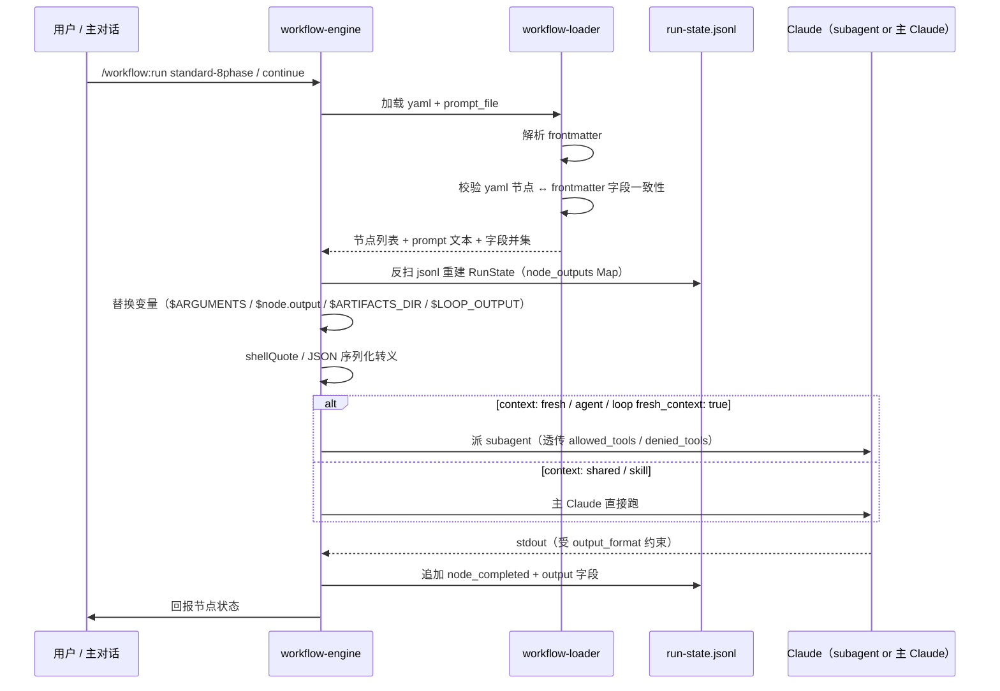

# REQ-2026-009 · 自定义工作流改造 — 详细设计

## 文档定位

本文档把 outline-design §7 锁定的 9 项 detail-design 待办落到「接口签名 / 数据结构 / 时序 / 实现要点 / 单测覆盖 / 影响域」六类机读细节，作为 development 阶段实施的唯一蓝图。

- **上游**（来源：requirements/REQ-2026-009/artifacts/outline-design.md:454）9 项待办映射为本文 §1 ~ §9
- **上游 ADR**（来源：requirements/REQ-2026-009/plan.md:51）D-001 ~ D-010 闭合本阶段范围；本文不引入新决策
- **上游 spec**（来源：context/team/engineering-spec/specs/2026-05-08-workflow-unified-redesign.md）v2.2 修订点 §5 / §11.2 / §11.3 在本文 §6 / §7 落地
- **下游**：本阶段同步产出 `features.json`；task-planning 阶段再拆 `tasks/<fid>.md`
- **章节编号约定**：§1 ~ §9 与 outline-design.md §7 待办表 # 1 ~ # 9 一一对应；§10 ~ §12 为收尾段；本文档采用「先写章节 stub + 待澄清清单」的骨架风格，逐项细化在 detail-design 阶段后期完成

---

## 1. 11 个 `/workflow:*` 命令接口签名（对应 outline §7 待办 #1，主责 D-008）

### 1.1 命令清单与 ARGUMENTS

来源：requirements/REQ-2026-009/artifacts/outline-design.md:458 锁定 11 个命令名称；本节给出 ARGUMENTS 形态与触发条件的初版骨架。

| # | 命令 | ARGUMENTS 形态 | 触发条件 | 主要副作用 |
|---|---|---|---|---|
| 1 | `/workflow:new` | `<template-id> [<title>]` | 用户主动 | bootstrap run 目录 + jsonl + 初始 prompt |
| 2 | `/workflow:continue` | `[<run-id>]`（缺省=匹配当前分支） | 用户主动 / launcher | 重建 RunState 进 main loop |
| 3 | `/workflow:next` | 无 | 当前节点完成 | 推进到下一拓扑节点 |
| 4 | `/workflow:save` | `[note]` | 用户主动 | jsonl 追加 `[save]` 事件 |
| 5 | `/workflow:status` | `[<run-id>]` | 用户主动 | 只读输出（含父子树） |
| 6 | `/workflow:list` | `[--filter=...]` | 用户主动 | 只读输出 |
| 7 | `/workflow:approve` | 无 | approval_pending 状态 | 状态机 → approved（hook 拦 AI） |
| 8 | `/workflow:reject` | `<reason>` | approval_pending 状态 | 状态机 → rejected + on_reject 路径 |
| 9 | `/workflow:rollback` | `<to-node>` | 用户主动 | mv 产物到 `.archived/<ts>/` + jsonl 截断 |
| 10 | `/workflow:cancel` | 无 | 用户主动 | 父 jsonl 写 `cancel_requested` |
| 11 | `/workflow:submit` | `[--draft]` | 当前 run 进入 testing | submit gate + 推分支 + 开 PR |

### 1.2 每命令的接口字段（七字段）

通用模板：每命令在 `.claude/commands/workflow/<cmd>.md` 给出 slash-command 入口（ARGUMENTS 透传），调 `.claude/skills/managing-workflow-runs/SKILL.md` 的 11 子动作派发（参考既有 `managing-requirement-lifecycle` 的 8 子动作结构）。下面 11 张表格逐一展开七字段（ARGUMENTS 解析 / 入参约束 / 前置条件 / 副作用 / 返回输出 / 失败模式 / 决策回引）。

#### 1.2.1 `/workflow:new <template-id> [<title>]`

| 字段 | 内容 |
|---|---|
| ARGUMENTS 解析 | `$1` = template-id（必填）；`$2..$N` = title（可选，多 token 拼空格） |
| 入参约束 | template-id 必须命中 `.claude/workflows/*.yaml`（loader 校验）；title ≤ 80 字符；REQ-ID 由 bootstrap 自动生成 |
| 前置条件 | 当前 git 分支 ∉ {main, master, develop}（hook protect-branch.sh 已拦） |
| 副作用 | 创建 `runs/<id>/` 或 `requirements/<id>/`（D-002 双轨期）+ meta.yaml + jsonl 事件 `workflow_started` + 切 `feat/req-<id>` 分支 |
| 返回输出 | 主对话回报 REQ-ID + 起始节点名 + 下一步提示 |
| 失败模式 | template not found → exit 1 + 可用模板列表；分支冲突 → exit 1 + 切分支建议 |
| 决策回引 | D-002 / D-007 |

#### 1.2.2 `/workflow:continue [<run-id>]`

| 字段 | 内容 |
|---|---|
| ARGUMENTS 解析 | `$1` = run-id（可选；缺省=匹配当前分支） |
| 入参约束 | run-id 形如 `REQ-YYYY-NNN`；缺省时需 git 分支 = `feat/req-<id>` 模式可解析 |
| 前置条件 | 目标 run 当前 state ∈ {running, paused, failed}（completed / cancelled 拒绝；approval_pending 由命令转 approve/reject） |
| 副作用 | 反扫 jsonl 重建 RunState + 进 main loop；jsonl 事件 `run_resumed` |
| 返回输出 | 主对话回报当前节点 + 已完成节点数 + 下一步提示 |
| 失败模式 | run 不存在 → exit 1 + 候选 run 列表；jsonl 损坏（spec §13）→ warn + 从最近 checkpoint 恢复 |
| 决策回引 | D-007（_resolve_run_dir 双路径） |

#### 1.2.3 `/workflow:next`

| 字段 | 内容 |
|---|---|
| ARGUMENTS 解析 | 无参数 |
| 入参约束 | — |
| 前置条件 | 当前节点 state = completed；存在拓扑下游节点 |
| 副作用 | 推进到拓扑下一节点 + 替换变量 + 派发；jsonl 事件 `node_started` |
| 返回输出 | 主对话回报新节点名 + 类型 + 输入摘要 |
| 失败模式 | 当前节点未完成 → exit 1 + 完成判定提示；无下游节点 → 触发 workflow_completed |
| 决策回引 | spec §7.2 节点执行决策表 |

#### 1.2.4 `/workflow:save [<note>]`

| 字段 | 内容 |
|---|---|
| ARGUMENTS 解析 | `$1..$N` = 自由 note（可选；多 token 拼空格） |
| 入参约束 | note ≤ 200 字符；多行不写入（换行替换为空格，与 process.txt 同语义） |
| 前置条件 | 当前 run state ∈ {running, paused, approval_pending, failed} |
| 副作用 | jsonl 追加 `[save]` 事件 + 触发主对话回报 status 摘要 |
| 返回输出 | "已保存 <ts> + 当前节点 + note 摘要" |
| 失败模式 | 无 run → exit 1 + 提示先 new/continue |
| 决策回引 | spec §13 检查点续接 |

#### 1.2.5 `/workflow:status [<run-id>]`

| 字段 | 内容 |
|---|---|
| ARGUMENTS 解析 | `$1` = run-id（可选；缺省=当前分支匹配） |
| 入参约束 | run-id 同 1.2.2 |
| 前置条件 | run 目录存在 |
| 副作用 | 只读；不改 jsonl 不改 meta |
| 返回输出 | 父子树视图：阶段 + 节点拓扑 + 当前位置 + 已完成节点数 + 子 run 嵌套（spec §6.4 sub_workflow 观测） |
| 失败模式 | run 不存在 → 列出候选；目录损坏 → warn |
| 决策回引 | spec §6.4 父子树展示 |

#### 1.2.6 `/workflow:list [--filter=<expr>]`

| 字段 | 内容 |
|---|---|
| ARGUMENTS 解析 | `--filter=` 后跟 yaml-style 表达式（如 `phase=detail-design`、`state=paused`） |
| 入参约束 | filter 字段名 ∈ {phase, state, template, requirement_id, parent_run_id}；值用 = / != / contains |
| 前置条件 | — |
| 副作用 | 只读；扫 `requirements/*/meta.yaml` + `runs/*/meta.yaml` |
| 返回输出 | 表格：REQ-ID / 模板 / 状态 / 阶段 / 当前节点 / 父子标识 |
| 失败模式 | filter 语法错 → exit 2 + 示例 |
| 决策回引 | D-002 双轨期扫描 |

#### 1.2.7 `/workflow:approve`

| 字段 | 内容 |
|---|---|
| ARGUMENTS 解析 | 无 |
| 入参约束 | — |
| 前置条件 | 当前 run state = approval_pending；调用方 = tty 终端（hook + isatty 双层校验，§5） |
| 副作用 | jsonl 事件 `approval_granted` + 状态机 approval_pending → completed + 触发 next |
| 返回输出 | "Approved <node-id> at <ts> by <signer>"；进入下一节点提示 |
| 失败模式 | state 不匹配 → exit 1；hook 拦截（AI 调用）→ exit 2 BLOCKED |
| 决策回引 | D-006（hook + isatty 双层），spec §15 |

#### 1.2.8 `/workflow:reject <reason>`

| 字段 | 内容 |
|---|---|
| ARGUMENTS 解析 | `$1..$N` = reason（必填；多 token 拼空格） |
| 入参约束 | reason ≥ 8 字符（与 `CLAUDE_GATES_GLOBAL_BYPASS` 同口径）；同 1.2.7 双层校验 |
| 前置条件 | 当前 run state = approval_pending |
| 副作用 | jsonl 事件 `approval_rejected` + reason；状态机 approval_pending → on_reject 节点（yaml 声明的回退路径） |
| 返回输出 | "Rejected <node-id> at <ts> by <signer>: <reason>"；on_reject 节点信息 |
| 失败模式 | reason 太短 → exit 1 + 长度要求提示；同 1.2.7 hook / isatty 拦截 |
| 决策回引 | D-006，spec §6.4 approval 节点 on_reject |

#### 1.2.9 `/workflow:rollback <to-node>`

| 字段 | 内容 |
|---|---|
| ARGUMENTS 解析 | `$1` = to-node（必填，节点 ID） |
| 入参约束 | to-node ∈ 当前 run yaml 节点 ID 集合；必须是当前节点的拓扑上游 |
| 前置条件 | 当前 run state ∈ {running, paused, approval_pending, failed, completed}（cancelled 拒绝）；无并发 rollback（fcntl.flock 互斥） |
| 副作用 | 调 `rollback_run(run_id, to-node)`：mv 产物到 `.archived/<ts>/` + jsonl 截断尾部 mv 为 `.tail` + 父跨子目录整体 mv（详见 §6） |
| 返回输出 | "Rolled back <run-id> from <X> to <to-node> at <ts>"；归档目录路径 |
| 失败模式 | to-node 不存在 → exit 1；非上游 → exit 1；并发 rollback → exit 1 + .in_progress 标记位置 |
| 决策回引 | D-010 |

#### 1.2.10 `/workflow:cancel`

| 字段 | 内容 |
|---|---|
| ARGUMENTS 解析 | 无 |
| 入参约束 | — |
| 前置条件 | 当前 run state ∈ {running, paused, approval_pending} |
| 副作用 | 父 jsonl 写 `cancel_requested`；子 subagent poll 检测后 graceful 退出（D-005）；30s 超时父调 `TaskStop` forceful 兜底 |
| 返回输出 | "Cancel requested at <ts>; awaiting graceful exit (≤ 30s)" → graceful 完成后再回报 cancelled |
| 失败模式 | state 不匹配 → exit 1；TaskStop 调用失败 → warn + jsonl 写 cancel_taskstop_failed |
| 决策回引 | D-005 |

#### 1.2.11 `/workflow:submit [--draft]`

| 字段 | 内容 |
|---|---|
| ARGUMENTS 解析 | `--draft`（可选 flag）= 开 draft PR |
| 入参约束 | — |
| 前置条件 | 当前 run state = completed；阶段 = testing（阶段 7 SOP 跑完）；submit gate 全过（GATE-PR-MERGED-STATE / GATE-GH-AUTH / GATE-BASE-REACHABLE / GATE-BRANCH-MATCH 等） |
| 副作用 | 推 origin 分支 + `gh pr create`；回写 meta.yaml.pr_url / pr_number；jsonl 事件 `pr_opened` |
| 返回输出 | PR URL + PR #N + draft 标识 |
| 失败模式 | gate fail → exit 2 + 缺口列表；推送冲突 → exit 1 + rebase 建议 |
| 决策回引 | spec §12 阶段 7 SOP；submit-rules.md |

### 1.3 命令×RunState 状态机矩阵

行 = run state；列 = 命令；✓ = 允许；✗ = 拒绝（前置条件不满足时）；— = 无 run 上下文不适用。

| state \ cmd | new | continue | next | save | status | list | approve | reject | rollback | cancel | submit |
|---|---|---|---|---|---|---|---|---|---|---|---|
| (无 run) | ✓ | ✗ | ✗ | ✗ | ✗ | ✓ | ✗ | ✗ | ✗ | ✗ | ✗ |
| running | ✗ | ✓ | ✓ | ✓ | ✓ | ✓ | ✗ | ✗ | ✓ | ✓ | ✗ |
| paused | ✗ | ✓ | ✗ | ✓ | ✓ | ✓ | ✗ | ✗ | ✓ | ✓ | ✗ |
| approval_pending | ✗ | ✗ | ✗ | ✓ | ✓ | ✓ | ✓ | ✓ | ✓ | ✓ | ✗ |
| cancel_requested | ✗ | ✗ | ✗ | ✗ | ✓ | ✓ | ✗ | ✗ | ✗ | ✗ | ✗ |
| cancelled | ✗ | ✗ | ✗ | ✗ | ✓ | ✓ | ✗ | ✗ | ✗ | ✗ | ✗ |
| failed | ✗ | ✓ | ✗ | ✓ | ✓ | ✓ | ✗ | ✗ | ✓ | ✗ | ✗ |
| completed | ✗ | ✗ | ✗ | ✓ | ✓ | ✓ | ✗ | ✗ | ✓ | ✗ | ✓ |

矩阵实现位置：每命令 SKILL.md 子动作开头先做 state 校验；不满足直接 exit 1 + 错误文案。覆盖来源：§1.2 各命令"前置条件"字段。

### 1.4 单测覆盖

测试落 `tests/skills/test_workflow_commands.py`，覆盖 4 类断言：

- 每命令 happy path（不同合法状态进入）
- 每命令非法状态拒绝（取 §1.3 矩阵中"✗"格子）
- 跨命令串行：`new → continue → save → status → cancel` 端到端
- approve/reject 走 hook 拦截（命中 → exit 2）+ tty fallback（命中 → exit 0）双路径

具体用例数与 fixture 设计见 OQ-DD-A1-T（detail-design 评审前补完）。

---

## 2. 节点级 prompt 文件清单（对应 outline §7 待办 #2，主责 D-001）

### 2.1 目录结构（v2.2 spec 落地）

来源：requirements/REQ-2026-009/artifacts/outline-design.md:459 锁定节点级 prompt 抽到 `.claude/workflows/prompts/`。

```
.claude/workflows/prompts/
  standard-8phase/      # 8 阶段对应 prompt
  code-review-embedded/
    cr-prepare.md       # /code-review 预检（识别 mode + diff scope）
    cr-checker-security.md
    cr-checker-performance.md
    cr-checker-complexity.md
    cr-checker-concurrency.md
    cr-checker-error-handling.md
    cr-checker-design-consistency.md
    cr-checker-auxiliary-spec.md
    cr-checker-history-context.md
    cr-critic.md         # review-critic 对抗
    cr-judge.md          # 综合裁决（code-quality-reviewer）
```

8 个 cr-checker-*.md 文件名 1:1 对应 .claude/agents/*-checker.md（OQ-DD-B4 闭合，2026-05-08 用户拍板照搬）。

### 2.2 frontmatter 字段定义

每个 prompt 文件用 YAML frontmatter 头（`---` 三连线分隔），字段语义全部对齐 spec §6.3 / §6.4 / §6.13 的节点字段；yaml workflow 是字段的唯一事实源（source of truth），prompt frontmatter 只在外置 prompt_file 时声明对应字段供引擎做"yaml 节点 ↔ prompt 文件" 一致性校验。

**字段表**（参考来源：context/team/engineering-spec/specs/2026-05-08-workflow-unified-redesign.md:393）：

| 字段 | 是否必填 | 类型 | 语义 | 引擎处理 |
|---|---|---|---|---|
| `name` | 必填 | string | prompt 文件唯一名（kebab-case，建议 = node_id） | loader 校验唯一性 |
| `node_id` | 必填 | string | yaml workflow 中对应的节点 id | loader 校验 yaml 节点存在且 prompt_file 字段指向本文件 |
| `version` | 必填 | string | semver；frontmatter 演化时升 minor | 校验日志记录 |
| `inputs[]` | 可选 | list of `{name, source, type, required}` | 输入变量声明 | loader 校验与 yaml 节点 inputs 一致；运行时引擎做 type 校验 |
| `output_format` | 可选 | JSON Schema | 节点 output 契约（覆盖 yaml 节点字段） | 写 jsonl 前用 ajv 校验 |
| `context` | 可选 | enum: `fresh` / `shared` | fresh = 派 subagent；shared = 主 Claude 直接跑 | 决定派发方式（spec §7.2 决策表） |
| `allowed_tools` / `denied_tools` | 可选 | list[string] | 工具白名单 / 黑名单 | 派发时透传给 subagent |
| `model` / `effort` / `thinking` / `fallback_model` | 可选 | 同 yaml 节点 | 模型档位覆盖（优先级见 §2.2.1） | LLM 调用参数 |
| `idle_timeout` | 可选 | int (毫秒) | 节点空闲超时 | 引擎计时 |
| `retry` | 可选 | `{max_attempts, delay_ms, on_error}` | 重试策略 | 引擎重试 |
| `context_budget` | 可选 | int (token) | 主对话压力监控阈值 | 命中触发 §6.11 inline → file 切换 + warn |

#### 2.2.1 字段优先级（覆盖规则）

`yaml workflow 节点字段` ＞ `prompt frontmatter` ＞ `workflow 顶层默认`。yaml 是事实源；prompt frontmatter 只在 yaml 节点未显式声明对应字段时生效；冲突时以 yaml 为准并 loader 报 warning。

#### 2.2.2 frontmatter 示例（cr-checker-security.md 雏形）

```yaml
---
name: cr-checker-security
node_id: cr-checker-security
version: 1.0.0
context: fresh
allowed_tools: [Read, Grep]
denied_tools: [Bash, Edit, Write]
model: claude-sonnet-4-6
effort: medium
inputs:
  - name: diff_range
    source: $cr-prepare.output.diff_range
    type: string
    required: true
  - name: scope_file
    source: $cr-prepare.output.scope_file
    type: string
    required: true
output_format:
  type: object
  properties:
    findings:
      type: array
      items: { type: object }
  required: [findings]
idle_timeout: 300000
context_budget: 60000
---

# Prompt 正文

你是安全 checker，对 `$diff_range` 范围内的增量做 OWASP Top 10 检查。
读 `$scope_file` 取增量文件清单。
输出 JSON：{"findings": [...]}
```

### 2.3 ARGUMENTS 注入约定

`$ARGUMENTS` 是 `/workflow:run <template> <args>` 中 `<args>` 的字面量（来源：context/team/engineering-spec/specs/2026-05-08-workflow-unified-redesign.md:607）。注入规则：

- **顶层 run**：`$ARGUMENTS` = 用户输入的命令行参数原文；`$1` ~ `$9` = 位置参数（spec §6.5）
- **sub_workflow 节点**：父 yaml 的 `args:` 字段（如 `feature_id: $feature-implement.output.id`）经引擎替换后，整体序列化为 JSON 字符串透传给子 run 的 `$ARGUMENTS`（来源：context/team/engineering-spec/specs/2026-05-08-workflow-unified-redesign.md:565）
- **引擎替换时机**：派发前做字符串替换（不在 LLM 内做），变量值经 `shellQuote` 转义（spec §6.5 注入防御）
- **prompt 文件内引用**：用 `$ARGUMENTS` / `$<nodeId>.output` 形式（无 mustache 双大括号），与 spec §6.5 变量表对齐

### 2.4 `$ARTIFACTS_DIR` 父子隔离

`$ARTIFACTS_DIR` 在每个 run 内独立解析；引擎按 run_id 走 `_resolve_run_dir`（D-007 双路径 loader，来源：requirements/REQ-2026-009/plan.md:110）：

- **父 run**：`$ARTIFACTS_DIR = requirements/<id>/artifacts/`（兼容期路径）或 `runs/<id>/artifacts/`（rename 后路径）
- **子 run**：`$ARTIFACTS_DIR = runs/<child-run-id>/artifacts/`（子 run 一律走 runs/ 路径）
- **写权限**：子 run prompt 不能写父 run 的 artifacts；引擎在派发子 prompt 前替换 `$ARTIFACTS_DIR` 为子目录字面量，hook 层（`.claude/hooks/protect-branch.sh` 同位置）拒绝写跨 run 路径
- **D-005 父 cancel 写**：父 jsonl 的 `cancel_requested` 事件由父 Claude 写父 jsonl，子 jsonl 永远由子自身写（来源：requirements/REQ-2026-009/plan.md:92），不存在跨 run 文件写

### 2.5 `$LOOP_OUTPUT` / `$LOOP_PREV_OUTPUT` 读取协议

引擎从 jsonl 中读最近一条 `loop_iteration_completed` 事件的 `output` 字段（来源：context/team/engineering-spec/specs/2026-05-08-workflow-unified-redesign.md:614）：

- **`$LOOP_OUTPUT`**：interactive loop 当前轮 prompt 完成后，gate_message 替换时可见；语义 = 本轮 prompt stdout（受 output_format 约束）
- **`$LOOP_PREV_OUTPUT`**：下一轮 prompt 内可见；语义 = 上一轮 loop_iteration_completed 的 output
- **读取实现**：引擎在 gate_message / prompt 替换前反扫 jsonl 拿最近一条事件，命不到（首轮）则替换为空字符串
- **首轮**：`$LOOP_OUTPUT` = `""`（空字符串），`$LOOP_PREV_OUTPUT` 不可见（不替换）

### 2.6 派发时序图



### 2.7 单测覆盖

测试落 `tests/workflows/test_prompt_structure.py`，覆盖：

- frontmatter 解析：合法 → pass / 缺必填字段 (`name`/`node_id`/`version`) → 拒绝 / 字段类型错（`inputs[]` 不是 list）→ 拒绝
- yaml 节点 ↔ frontmatter 一致性：`prompt_file` 指向但 frontmatter `node_id` 不匹配 → 拒绝；`output_format` 双声明但语义冲突 → 拒绝
- 变量占位符与 inputs 一致性：prompt 正文引用 `$X` 但 frontmatter `inputs[]` 缺 `X` → warn（不拒绝，兼容隐式上游）
- ARGUMENTS 注入边界：含单引号 / 双引号 / 反斜杠的 args 经 `shellQuote` 后 LLM 收到的字面量与原文一致
- `$ARTIFACTS_DIR` 父子隔离：父子 run 同名 prompt 节点替换得不同字面量

具体用例数与 fixture 设计见 OQ-DD-A4-T（detail-design 评审前补完）。

---

## 3. `features.json` 拆分（对应 outline §7 待办 #3）

### 3.1 schema 引用

来源：context/team/engineering-spec/features-schema.yaml 作为 `id` / `title` / `description` 必填的事实源；可选机读字段（`complexity` / `depends_on_features` / `touches` / `interfaces_frozen`）来源：.claude/skills/task-context-builder/reference/extract-rules.md。

### 3.2 单文件 vs 多文件决策（A5 闭合）

**决策：单文件 `requirements/REQ-2026-009/artifacts/features.json`。**

依据：

- GATE-FEATURES-SCHEMA plugin 的 glob 字面量为 `requirements/*/artifacts/features.json`（来源：scripts/gates/plugins/features_schema.py:37）；多文件方案需同时改 plugin glob、`scripts/lib/check_features.py` merge 逻辑、`feature-lifecycle-manager` Skill 拆分读取——三处脱离 REQ-2026-009 范围（落 Post-MVP 评估）
- features-schema.yaml 已锁 schema_version=1.0 顶层结构（来源：context/team/engineering-spec/features-schema.yaml:32）；多文件需升级 schema 加 `index_file` 概念，破坏性变更
- 文件大小不构成约束：REQ-2026-008 单文件 19KB / 8 features，本需求 ~12-14 features 估算 ~30 KB 量级

### 3.3 粒度修正：thematic feature（原"节点 / 命令" 1:1 估算作废）

A5 同时修正 §3.2 旧版"feature_id 编号空间分组"的过粗估算（65-75 features 把节点 / 命令都当 feature）。正确粒度参考 REQ-2026-008 的 thematic level——一个 feature 覆盖一组协作模块的端到端落地（含 schema / 实现 / gate / 单测）。

#### 初版 feature 清单（detail-design 评审前精化）

| feature_id | 主题 | 主责章节 | 复杂度初判 |
|---|---|---|---|
| F-001 | workflow-engine 核心（loader + run-state + dispatcher）| spec §6 / §7 | heavy |
| F-002 | 8 种节点类型实现（含 sub_workflow / loop / approval）| spec §6.4 + §11.2 | heavy |
| F-003 | standard-8phase.yaml 38 节点完整化 + 阶段 prompt 抽离 | §2 | medium |
| F-004 | code-review-embedded.yaml + sub_workflow 验证 | §2 | medium |
| F-005 | 11 个 `/workflow:*` 命令 + managing-workflow-runs Skill | §1 | heavy |
| F-006 | workflow-launcher 关键词触发 Skill + 仲裁 | §4 | medium |
| F-007 | workflow_rollback.py + 跨父子归档（D-010）| §6 | medium |
| F-008 | sub_workflow 父子状态联动（D-005 cancel + parent_cancelled）| §7 | medium |
| F-009 | D-006 hook 拦截 + workflow_approve/reject.py + ai-collaboration patch | §5 | light |
| F-010 | 8 个 `/requirement:*` 别名兼容期保留实现（D-009）| §10.2 | light |
| F-011 | 自举验证 SOP（Plan 6）+ migration 测试（R001-R007 等价）| §8 + §10.3 | medium |
| F-012 | Plan 7 清理（删 PHASE_REQUIREMENTS / phase_enum / signoff / next）| §10.3 | light |
| F-013 | requirements/ → runs/ 批量 rename 工具（D-002）| §9 | medium |

合计 13 features，与 REQ-2026-008 同量级。具体 modules / touches / acceptance 由 detail-design 评审前补完（OQ-DD-A5-D）。

### 3.4 依赖关系（DAG 关键边）

基于 §3.3 重新编号的 13 features：

- `F-001`（engine 核心）是 `F-002` ~ `F-008` 的前置
- `F-002`（节点类型）是 `F-003` / `F-004`（具体 yaml 落地）的前置
- `F-007`（rollback）依赖 `F-001`（jsonl 截断 / 状态恢复）+ `F-002`（sub_workflow 节点 mv 语义）
- `F-008`（父子状态联动）依赖 `F-002`（sub_workflow 节点）
- `F-009`（hook + workflow_approve/reject.py）依赖 `F-005`（命令骨架）— hook 拦截的字面量与命令名一致
- `F-010`（别名）依赖 `F-005`（target 命令实现存在）
- `F-011`（自举验证 + migration 测试）依赖 `F-001` ~ `F-010`（端到端链路完整）
- `F-012`（Plan 7 清理）依赖 `F-011` 通过（D-009 顺序约束，来源：requirements/REQ-2026-009/plan.md:128）
- `F-013`（rename 工具）依赖 `F-001` 中 `_resolve_run_dir` 双路径已落地（D-007）

完整 `depends_on_features[]` 字面量见 OQ-DD-A6（detail-design 评审前补完，与 features.json 同步落盘）。

### 3.5 features.json 校验

来源：scripts/gates/registry.yaml 已注册 GATE-FEATURES-SCHEMA（在 phase-transition / submit / pre-commit / ci 四触发点生效）；本阶段仅"承接"该 gate，不引入新规则。features.json 落盘后由 `scripts/lib/check_features.py` 校验 schema_version=1.0 + 顶层 required_fields + 每条 feature 的 required={id,title,description,modules,depends_on,depends_on_features,complexity,touches,acceptance}。

---

## 4. `keyword-matching.md` 关键词长度排序表（对应 outline §7 待办 #4，主责 D-008）

### 4.1 6 类基础关键词

来源：requirements/REQ-2026-009/artifacts/outline-design.md:201 列出 6 类（new / continue / review / release / approve / reject）；具体关键词字面量与字符长度排序表见 OQ-DD-A7（含汉字 1 字符 + ASCII 1 字符 的统一计数规则）。

### 4.2 state tiebreaker 规则

来源：requirements/REQ-2026-009/plan.md:120 D-008 第 1 步——若有 run 处于 `approval_pending` 状态，优先匹配 approve / reject，绕过最长匹配。

### 4.3 ≥2 等长冲突的 ask 兜底

主 Claude 应 ask 用户消歧；prompt 模板见 OQ-DD-A7。

### 4.4 单测覆盖

测试落 `tests/skills/test_keyword_matching.py`：每类基础关键词、等长冲突、state tiebreaker、空匹配兜底各覆盖；具体用例数见 OQ-DD-A7。

---

## 5. `pre-tool-use-guard.sh` case 分支详细脚本（对应 outline §7 待办 #5，主责 D-006）

### 5.1 现状定位

- 旧 isatty 校验位于 scripts/lib/code_review_signoff.py:61
- spec §15 决策删除该校验（来源：context/team/engineering-spec/specs/2026-05-08-workflow-unified-redesign.md）
- 新拦截点：`.claude/hooks/pre-tool-use-guard.sh` 同构搬到 hook 层（D-006，来源：requirements/REQ-2026-009/plan.md:101）

### 5.2 拦截语义（关键认知）

PreToolUse hook **只对 Claude Code Agent 调 Bash / Edit / Write 等工具时触发**（case 分支按 `tool_name` 派发，来源：.claude/hooks/pre-tool-use-guard.sh:88）。用户在 tty 终端直接打命令不会进 hook。因此本 patch 的拦截语义 = "AI 正在尝试调用 approval / reject 入口"，命中 = 拒绝（无需也无法在 hook 内做"是否 tty"判断）。

CLI 层 `workflow_approve.py` / `workflow_reject.py` 走 `sys.stdin.isatty()` 兜底（§5.4），覆盖 hook 被 disable / 绕过的边界场景——构成"hook 拦 AI / isatty 拦非交互进程"的双层。

### 5.3 patch 形态：完整 shell 片段

**改动定位**（pre-tool-use-guard.sh 增量 patch）：

1. 顶部新增正则常量（与 `WRITE_OPS_PATTERN` 同位置）：

```bash
# D-006 approval / reject 是人类专属（来源：requirements/REQ-2026-009/plan.md:101）
# 命中即拒绝——hook 只对 AI Bash 触发，tty 用户不走此路径
readonly APPROVAL_SLASH_PATTERN='(/workflow:(approve|reject))(\b|[[:space:]])'
readonly APPROVAL_PYTHON_PATTERN='python3?[[:space:]]+([^[:space:]]+/)?(scripts/lib/)?workflow_(approve|reject)\.py(\b|[[:space:]])'
```

2. `case "$tool_name" in ... Bash) ... esac` 分支增加一行调用：

```bash
    Bash)
      check_workflow_approval_human_only "$command"   # ← 新增
      check_bash_writes_review "$command"
      ;;
```

3. 文件尾部 `check_bash_writes_review` 之后追加新函数：

```bash
check_workflow_approval_human_only() {
  local cmd="$1"
  [[ -z "$cmd" ]] && return 0
  if echo "$cmd" | grep -qE "$APPROVAL_SLASH_PATTERN" \
     || echo "$cmd" | grep -qE "$APPROVAL_PYTHON_PATTERN"; then
    cat >&3 <<EOF
BLOCKED: /workflow:approve / /workflow:reject 是人类专属动作（D-006）。
AI 在主对话或 subagent 中不能调用以下入口：
  - /workflow:approve / /workflow:reject（slash command）
  - python3 scripts/lib/workflow_approve.py / workflow_reject.py（CLI 直入）
请由人类在 tty 终端运行；详见 context/team/ai-collaboration.md 规则三。
紧急绕过：CLAUDE_GATES_GLOBAL_BYPASS="<原因>" <重新执行>
EOF
    exit 2
  fi
}
```

### 5.4 已知绕过通道（与 F-002 carryover-A 一致接受）

变量间接引用形式无法被正则命中，例如：

```bash
P=/workflow:approve; eval "$P"          # 命中不到 SLASH 正则
S=workflow_approve.py; python3 "$S"     # 命中不到 PYTHON 正则
```

此类绕过的兜底防线（carryover-A 决策接受，来源：.claude/hooks/pre-tool-use-guard.sh:15）：

- **CLI 层 isatty fail-closed**（§5.5）：`workflow_approve.py` / `workflow_reject.py` 顶端 `if not sys.stdin.isatty(): sys.exit(2)`
- **CLAUDE_GATES_GLOBAL_BYPASS reason ≥ 8 字符**（pre-tool-use-guard.sh:60）：要求显式给原因，audit 全文记录
- **PR review 人工**（D-006 软约束）：ai-collaboration.md 规则三明文禁止；review 时人工抓取相关 commit

### 5.5 兜底 isatty 实现（CLI 层）

新增 `scripts/lib/workflow_approve.py` / `scripts/lib/workflow_reject.py` 顶端模板：

```python
# scripts/lib/workflow_approve.py（雏形）
import sys

def main() -> int:
    if not sys.stdin.isatty():
        print(
            "ERROR: /workflow:approve 必须在 tty 终端执行。\n"
            "AI 主对话 / subagent / CI / pipe 调用一律拒绝（D-006）。",
            file=sys.stderr,
        )
        return 2
    # ... 业务逻辑（写 verdict.human_signoff / 状态机推进）
    return 0
```

注意 `code_review_signoff.py:61` 的同构 isatty 检查在 Plan 7 删除前作 fallback 共存（D-009 兼容期）；删除时机由 §10.3 顺序约束控制。

### 5.6 单测矩阵

测试落 `tests/hooks/test_pre_tool_use_guard.py`，组合维度：

| 维度 | 取值 |
|---|---|
| **入口形态** | (a) `/workflow:approve` / (b) `/workflow:reject reason-text` / (c) `python3 scripts/lib/workflow_approve.py` / (d) `python3 scripts/lib/workflow_reject.py "reason"` |
| **包装方式** | (1) 直接调 / (2) `bash -c "..."` 包装 / (3) 命令前后加无关 token（环境变量 / 重定向） / (4) 从绝对路径调 python（`python3 /repo/scripts/lib/workflow_approve.py`）|
| **预期** | hook 命中 → exit 2 + BLOCKED 消息 / hook 不命中 → exit 0 |

**用例数**（建议 detail-design 评审前完成 fixture 落盘）：

- 命中场景：4 入口 × 4 包装 = 16 条 happy block
- 边界放行场景：5 条（grep 搜索字面量 / 注释中 / 字符串字面量在另一文件 / `--help` 显示帮助 / `dry-run` flag）
- 已知绕过通道场景：2 条（变量间接引用直接 eval / `python3 "$S"`）— 期望 hook 放行 + CLI 层 isatty 拒绝（双层验证）
- audit 行格式：1 条（命中时 audit log 不写 `BYPASS used`，因为本类拦截不属于 BYPASS 路径，与 audit_log 现有约定一致）

合计 24 条，按 pytest parametrize 落 fixture YAML（参考 tests/hooks/ 既有风格）。

### 5.7 ai-collaboration.md 规则三 patch

现状（来源：context/team/ai-collaboration.md:38）规则三仅写"sign-off 是人类专属动作"，列出 `code_review_signoff.py` / `/code-review:signoff` / `save_review.py signoff` 三入口。

patch 后扩展到 sign-off / approval / reject 三类，新增入口段：

```markdown
**Approval 唯一入口**（人类在 tty 终端执行）：

  /workflow:approve   # slash command 形式（最终调 workflow_approve.py）
  /workflow:reject <reason>

底层实现 `python3 scripts/lib/workflow_approve.py` / `workflow_reject.py` 同样禁止 AI 调用。
hook 层（.claude/hooks/pre-tool-use-guard.sh）已加 D-006 拦截；CLI 层 isatty fail-closed 兜底。
```

---

## 6. `workflow_rollback.py` 4 场景单测设计（对应 outline §7 待办 #6，主责 D-010）

### 6.1 公开 API 签名

来源：requirements/REQ-2026-009/plan.md:138 D-010 锁定的 mv 语义。

```python
def rollback_run(run_id: str, to_node: str, target_id: Optional[str] = None) -> RollbackResult:
    """
    把 run_id 从当前节点回滚到 to_node：
    - 拓扑序找产物路径集合 → shutil.move 到 .archived/<ts>/
    - 父 run 跨 sub_workflow 节点时，递归 mv 子 run 整目录
    - 写 .in_progress atomic 标记保护中断
    - 截断 jsonl 尾部 mv 为 <archived>/run-state.jsonl.tail
    """
```

`RollbackResult` 字段表 + 异常契约见 OQ-DD-A9。

### 6.2 4 场景测试矩阵

| 场景 | 描述 | 关键断言 |
|---|---|---|
| R1 单层 | 单 run 内回滚到中间节点 | 原路径删 / `.archived/<ts>/<相对路径>` 存在 / jsonl 尾部 mv 为 `.tail` |
| F1 跨父子 | 父 run 回滚越过 sub_workflow 节点 | 子 run 整目录 mv / 子 id 释放 |
| T1 多次 | 同 run 第二次回滚 | 两个 timestamp 目录互不覆盖 / `.in_progress` 各自独立 |
| 到 root | rollback 到首个节点 | 全部产物归档 / jsonl 仅留 init |

每场景 fixture 数据 + 期望文件树 + 期望 jsonl 行数见 OQ-DD-A9。

### 6.3 中断保护

`.in_progress` 标记 + 续跑流程：检测残留 → 完成 mv 收尾或回退；并发互斥用 `fcntl.flock` 或 `os.O_EXCL`（具体选型见 OQ-DD-A9）。

---

## 7. `sub_workflow` 父子状态联动 e2e 测试设计（对应 outline §7 待办 #7，主责 D-005 / D-010）

### 7.1 cancel graceful 路径

来源：requirements/REQ-2026-009/plan.md:92 D-005 锁定"子自检父"模式：父 jsonl 写 `cancel_requested` → 子 subagent poll 检测 → 子写 `parent_cancelled` graceful 退出 → 父等子返回或 30s 超时调 `TaskStop` forceful 兜底。

### 7.2 rollback 跨父子路径

父 N+5 → N+1 节点产物归档 + 子 run 整目录 mv 到 `sub_runs/<child-id>/` + 子 id 释放（D-010，来源：requirements/REQ-2026-009/plan.md:138）。

### 7.3 测试运行环境

子 subagent 在测试中的模拟方式（mock subprocess vs 真派 Agent）、poll 间隔可调缩短到 100ms 加速测试——具体方案见 OQ-DD-A10。

### 7.4 单测覆盖

测试落 `tests/e2e/test_sub_workflow_lifecycle.py`：2 条端到端 + 边界（父进程崩 / 子崩 / 网络分区 / TaskStop graceful 不明确兜底）。

---

## 8. migration 测试设计（对应 outline §7 待办 #8，主责 D-009 / R-3）

### 8.1 关键认知（迁移不是重写）

骨架曾把"migration 测试"理解为**重写 R001-R007 实现到新引擎**——这是错的。

正确语义（PHASE_REQUIREMENTS 字典定义位置，来源：scripts/lib/check_reviews.py:57）：

- 旧链路：`/requirement:next` → `managing-requirement-lifecycle` Skill → 调 `check_reviews.py` → 查 `PHASE_REQUIREMENTS[target_phase]` → 跑 R001-R007 函数
- 新链路：yaml workflow `phase-transition` 节点 → 调 `scripts/gates/run.py --trigger=phase-transition` → 调 `GATE-REVIEW-VERDICT` plugin → 复用同一份 R001-R007 函数（来源：scripts/gates/registry.yaml）

R001-R007 的 Python 函数本身**保留**；migration 测试要保证的是"yaml workflow 在 phase-transition 节点上正确调用 gate runner，结论与旧 Skill 直接调 check_reviews.py 一致"。Plan 7 真删的是 `PHASE_REQUIREMENTS` 字典 + `managing-requirement-lifecycle` 的 Skill 逻辑，**不是** R001-R007 函数。

### 8.2 R001 ~ R007 等价语义对照（修正骨架表）

骨架 §8.1 旧版的 6 条规则名称与含义错位且漏 R007；本节修正：

| Rule | 含义 | 旧入口 | 新引擎等价点 |
|---|---|---|---|
| R001 | target_phase 要求的 review 必须 latest != null | check_reviews.py:76 | yaml `phase-transition` 节点 → GATE-REVIEW-VERDICT plugin → check_reviews._r001 |
| R002 | review JSON schema 合法（save_review 校验函数复用）| check_reviews.py:148 | save-review.sh 写入流程保留；GATE-REVIEW-VERDICT 跑 _r002 |
| R003 | latest.conclusion ≠ blocked **且** 必须有 `human_signoff` 字段 | check_reviews.py:103 | yaml `approval:` 节点 + `capture_response: true` 天然等价；GATE-REVIEW-VERDICT 跑 _r003 兜底 |
| R004 | latest.conclusion = `needs_attention` → WARNING（--strict 升 ERROR）| check_reviews.py:187 | yaml `when:` 表达式 `$review.output.conclusion == "needs_attention"` 软提示；--strict 走 GATE-REVIEW-VERDICT |
| R005 | `reviewed_artifacts[].sha256` 与当前 HEAD commit 一致（hash drift）| check_reviews.py:203 | GATE-REVIEWS-CONSISTENCY plugin（来源：scripts/gates/registry.yaml）+ R005 函数复用；触发点扩到 yaml `phase-transition` 节点 |
| R006 | supersedes 链无环 / 无悬挂引用 | check_reviews.py:259 | GATE-REVIEW-VERDICT plugin 包含 _r006；新引擎仅做 trigger wire |
| R007 | testing 阶段 `code.by_feature` 必须覆盖 features.json 中所有 status=done 的 feature | check_reviews.py:294 | yaml standard-8phase 阶段 7 → 8 切换节点 → `bash:` 节点调 `python3 scripts/lib/check_reviews.py --target-phase=testing` 或 GATE-REVIEW-VERDICT plugin |

### 8.3 测试设计：双跑对照

测试位于 `tests/migration/test_phase_requirements_equivalence.py`；用 pytest parametrize 跑 7 条规则 × 多 fixture：

**测试矩阵**（每条规则的 fixture 组）：

| 规则 | happy fixture | failure fixture | 边界 fixture |
|---|---|---|---|
| R001 | meta.yaml 完整有 latest | latest 缺失 | latest 字段为 null vs "" 双形态 |
| R002 | review JSON schema 合规 | 缺 schema_version / required 字段 | dimensions issues 数组类型错 |
| R003 | conclusion=looks_clean + signoff 完整 | conclusion=blocked / 缺 human_signoff | rejected（旧枚举）等价 blocked（新枚举）|
| R004 | conclusion=looks_clean | conclusion=needs_attention（非 strict 走 WARNING）| --strict 升 ERROR |
| R005 | hash 全匹配 | reviewed_artifacts 中某文件 sha256 偏移 | meta.yaml 自引用（黑名单兜底）|
| R006 | supersedes 链直链 | 链含环 | 悬挂引用（指向不存在 review_id） |
| R007 | by_feature 覆盖全 done features | 缺 by_feature 项 / latest 为空 | conclusion=rejected（旧枚举）等价 blocked + 缺 human_signoff |

**断言协议**：双跑对照 = 同 fixture 在两条链路上运行，断言结论枚举（pass / fail / warn）和 violation 字段集合**完全一致**；错误码可不同（旧 exit 1 vs 新 exit 2 是允许的差异，由 GATE-REVIEW-VERDICT 内部归一化）。

### 8.4 通过门槛（自举硬阈值）

D-009 自举验证锁定的硬阈值（来源：requirements/REQ-2026-009/plan.md:128）落到 migration 测试上的具体含义：

- **完整覆盖**：7 条规则 × 3 类 fixture（happy / failure / 边界）= 21 条对照用例全 pass
- **零误差**：0 false-pass（旧 fail 但新 pass）+ 0 false-fail（旧 pass 但新 fail）
- **签字一致性**：R003 在新链路下 sign-off 走 §5 hook + isatty 双层（已 D-006 锁定，不允许新引擎跳过签字）
- **触发点完整**：phase-transition / submit / ci 三触发点都要跑过（与 GATE-REVIEW-VERDICT 注册的 trigger 一致）

测试通过 = 解锁 Plan 7 删除 `PHASE_REQUIREMENTS` 字典 / `managing-requirement-lifecycle` Skill 旧逻辑 / `check_reviews.py main()` CLI 入口（R 函数本身保留供 plugin 复用）。

### 8.5 顺序约束（与 §10.3 联动）

来源：requirements/REQ-2026-009/plan.md:128 D-009——本测试通过是 Plan 7 删除 `PHASE_REQUIREMENTS` 字典 + `managing-requirement-lifecycle` Skill 旧 SOP 的前置条件；具体时序见 §10.3。

测试 Failed 时的 fallback：保留 `/requirement:*` 别名实际实现（D-009 已锁定）+ 用户手动切回旧命令推进。

### 8.6 影响域

新增 / 改动文件：

- 新增 `tests/migration/test_phase_requirements_equivalence.py`（21 条对照用例）
- 新增 `tests/migration/fixtures/<rule>/{happy,failure,boundary}.yaml`（21 个 fixture 文件 + 共享 fixture loader）
- 改动 `scripts/gates/registry.yaml`（如需为 GATE-REVIEW-VERDICT 添加新触发点；具体改动由 F-001 / F-011 期完成）

不改动文件：

- `scripts/lib/check_reviews.py` R001-R007 函数（保留供 plugin 复用）
- `scripts/lib/save_review.py`（写 verdict 流程不变）

---

## 9. `requirements/` → `runs/` 批量 rename 工具（对应 outline §7 待办 #9，主责 D-002）

### 9.1 path 引用扫描范围

来源：requirements/REQ-2026-009/artifacts/outline-design.md:466 列出扫描类别。骨架级覆盖：`*.py` / `*.sh` / `*.md` 全文 grep；`.claude/skills/` / `.claude/commands/` / `.claude/agents/` 引用；`scripts/gates/registry.yaml` changed_files 模式；`context/team/engineering-spec/` 文档；历史 commit message（不改 git history，但需在迁移说明文档中说明）。

### 9.2 工具签名

```python
def migrate_requirements_to_runs(
    dry_run: bool = True,
    include_history_comments: bool = False,
) -> MigrationReport:
    """扫描 → 列出引用清单 → 修改 → 自检"""
```

`MigrationReport` 字段表（`files_changed[]` / `references_found[]` / `risky_unmapped[]` / `pre_commit_added[]`）见 OQ-DD-A12。

### 9.3 pre-commit hook 拦截规则

Plan 7 后新增 pre-commit hook：拒绝任何新增的 `requirements/` 字面量引用，白名单 = 历史 ADR / 迁移文档；详细规则见 OQ-DD-A12。

### 9.4 自动 vs 人工 review

字面量 path 自动改；含变量拼接（`f"requirements/{req_id}"`）的代码必须 grep 出来人工 review，改为 `_resolve_run_dir` 调用。

### 9.5 单测覆盖

测试落 `tests/tools/test_migrate_requirements.py`：dry_run 报告精确 / 实际改写后 grep 全仓再无 `requirements/` 字面量（除白名单）/ pre-commit hook 拦截新引用。

### 9.6 与 D-007 协同

来源：requirements/REQ-2026-009/plan.md:110 D-007——rename 工具运行**之前**双路径 loader 必须存在；rename 完成后 loader 中"探测 `requirements/`"分支才能删（D-007 锁定 1 行清理）。

---

## 10. 接口契约的兼容性

### 10.1 yaml workflow schema v2

来源：context/team/engineering-spec/specs/2026-05-08-workflow-unified-redesign.md v2 → v2.1 → v2.2 修订点（§5 / §11.2 / §11.3）；schema 新增字段需在 `SUPPORTED_VERSIONS` 列表标注。

### 10.2 `/requirement:*` 别名兼容期

来源：requirements/REQ-2026-009/plan.md:128 D-009：8 个别名 3 月兼容期内输出 deprecation warning + 转 `/workflow:*` ARGUMENTS 透传；`/requirement:next` 例外保留实际实现到 Plan 6 自举验证通过。具体 warning 文案模板见 OQ-DD-A13。

### 10.3 `PHASE_REQUIREMENTS` 删除顺序约束

时序：

```
Plan 6 自举验证通过（本需求自身用新引擎跑通）
  ↓
migration 测试 21/21 全 pass（§8.4）
  ↓
Plan 7 真删 PHASE_REQUIREMENTS / phase_enum.py / code_review_signoff.py / /requirement:next
  ↓
Plan 7+1 删 8 个别名（兼容期到期人工触发）
```

---

## 11. 验收对齐（AC ↔ 接口 / 测试 ID 双向追溯）

继承 outline-design.md §6 的 AC ↔ 模块映射，本阶段补充 AC ↔ 测试 ID 映射；完整 AC 表见 requirements/REQ-2026-009/artifacts/requirement.md。骨架示例如下，完整表见 OQ-DD-A14。

| AC | 验证测试 ID | 主责章节 |
|---|---|---|
| AC-01 yaml schema v2 | tests/workflows/test_yaml_schema.py | §3.4 |
| AC-09 兼容期别名 | tests/skills/test_alias_passthrough.py | §10.2 |
| AC-CLEAN 旧路径清理 | tests/tools/test_migrate_requirements.py | §9 |

---

## 待澄清清单

> 详细设计阶段后期需逐一闭合。每条按「内容 / 依据 / 风险 / 验证时机」四要素填写；闭合后从清单删除并合并到对应 §N。

- ~~**OQ-DD-A1（命令字段表）**~~：**已闭合**——§1.2.1 ~ §1.2.11 逐一展开 11 命令七字段（ARGUMENTS / 入参约束 / 前置条件 / 副作用 / 返回输出 / 失败模式 / 决策回引）；篇幅控制在主文档内（约 +160 行），未拆 `command-implementations/<cmd>.md` 多文件。遗留 OQ-DD-A1-T 见下条。

- ~~**OQ-DD-A2（命令×状态机矩阵）**~~：**已闭合**——§1.3 给出 8 状态 × 11 命令矩阵（含 (无 run) 行），每格 ✓/✗/— 三态；实现位置 = 每命令 SKILL.md 子动作开头先做 state 校验。

- ~~**OQ-DD-A3（命令单测用例数）**~~：与 A1-T 合并——具体用例数 / fixture 设计见 OQ-DD-A1-T。

- **OQ-DD-A1-T（命令单测的具体用例数 + fixture）**：[待补充]
  - 内容：§1.4 列出 4 类断言场景（每命令 happy ×2 / 非法状态 ×1 / 跨命令串行 / approve+reject 双路径），需逐一展开成具体用例数 + fixture YAML（jsonl 状态快照 + 命令 stdin / 期望 stdout）
  - 依据：参考 tests/skills/ 现有 fixture 风格 + §1.3 矩阵中 ✓/✗ 格子
  - 风险：用例过密拖慢 CI；过疏漏边界（特别是 approval_pending 行的 4 ✓ 命令交互）
  - 验证时机：detail-design 评审前完成 fixture 落盘 + 单测骨架

- ~~**OQ-DD-A4（prompt frontmatter + 注入）**~~：**已闭合**——展开为 §2.2（字段表 + 优先级 + 示例）/ §2.3（ARGUMENTS 注入）/ §2.4（`$ARTIFACTS_DIR` 父子隔离）/ §2.5（`$LOOP_OUTPUT` 读取协议）/ §2.6（派发时序图）/ §2.7（单测覆盖范围）；变量语法用 `$xxx` 形式（与 spec §6.5 对齐，无 mustache 双大括号）；遗留 OQ-DD-A4-T 见下条。

- **OQ-DD-A4-T（prompt 解析单测的具体用例数 + fixture 设计）**：[待补充]
  - 内容：§2.7 列出 5 类断言场景，需逐一展开成具体测试用例数 + fixture YAML 数据；建议至少每类场景 2 ~ 3 条边界用例
  - 依据：参考 tests/lib/test_check_*.py 现有 fixture 风格；frontmatter 解析与 yaml workflow 字段一致性是 Plan 2 引擎核心校验
  - 风险：测试覆盖不足让 frontmatter 字段冲突在运行时才暴露；fixture 过密拖慢 CI
  - 验证时机：detail-design 评审前完成 fixture 落盘 + 单测骨架

- ~~**OQ-DD-A5（features.json 拆分粒度）**~~：**已闭合**——决策单文件（GATE-FEATURES-SCHEMA plugin glob hardcode 单路径，多文件需改 3 处脱离范围）+ 粒度修正到 thematic（原 65-75 估算把节点 / 命令当原子 feature 错误，正确粒度 ~13 features 与 REQ-2026-008 同量级）；详见 §3.2 / §3.3。遗留 OQ-DD-A5-D 见下条。

- **OQ-DD-A5-D（13 features 各自的 modules / touches / acceptance 字面量）**：[待补充]
  - 内容：F-001 ~ F-013 每个 feature 的精确 modules[] / touches[] / acceptance[] 字段；features.json 落盘内容
  - 依据：参考 REQ-2026-008 features.json 的字段密度（每条含 ~6 modules + 4 acceptance TC）
  - 风险：modules / touches 字面量错会让派发期 dispatch_precheck.py 报越界写入 + GATE-TOUCHES-VIOLATION 拦
  - 验证时机：detail-design 评审前 features.json 落盘 + check_features.py 跑通

- **OQ-DD-A6（features 依赖 DAG 完整表）**：[待补充]
  - 内容：F-001 ~ F-013 的全部 `depends_on_features[]` 字面量（§3.4 已列关键边，缺细粒度边）
  - 依据：outline §3 模块划分 + ADR D-005 ~ D-010 的"前置条件"语义
  - 风险：循环依赖未检出会让 task-planning 拓扑排序死锁
  - 验证时机：features.json 提交前用 `tools/check_features_dag.py`（Plan 1 已合并工具）跑一遍

- **OQ-DD-A7（关键词字面量 + 长度表 + 单测）**：[待补充]
  - 内容：6 类关键词的字面量集合 / 字符长度数字 / 排序后顺序 / 等长冲突的 ask 兜底文案 / 单测用例数
  - 依据：outline §2.4 锁定 3 步仲裁
  - 风险：汉字与 ASCII 字符长度计数不统一会让排序错乱
  - 验证时机：detail-design 评审前 + Plan 5 实现期间持续校准

- ~~**OQ-DD-A8（hook patch + 单测矩阵）**~~：**已闭合**——展开为 §5.2 ~ §5.7：拦截语义认知 / 完整 shell 片段（正则常量 + case 分支挂钩 + check 函数）/ 已知绕过通道 + 双层兜底（CLI isatty + BYPASS reason ≥ 8 + PR review）/ CLI 层 workflow_approve.py 雏形 / 24 条单测矩阵 / ai-collaboration 规则三 patch。

- **OQ-DD-A9（rollback API + RollbackResult + 中断保护）**：[待补充]
  - 内容：`RollbackResult` 字段表 + 异常契约 + 4 场景 fixture / 期望文件树 / jsonl 行数 + 并发互斥选型（fcntl.flock vs os.O_EXCL）
  - 依据：D-010 锁定的 mv 语义 + `.in_progress` 标记
  - 风险：并发 rollback 数据损坏；中断后状态无法恢复
  - 验证时机：detail-design 评审前需给 4 场景单测设计文档

- **OQ-DD-A10（sub_workflow e2e 测试运行环境）**：[待补充]
  - 内容：子 subagent 模拟方式（mock subprocess vs 真派 Agent）+ poll 间隔可调机制 + 边界场景列表（父崩 / 子崩 / 网络分区 / TaskStop graceful 不明确兜底）
  - 依据：D-005 子自检父模式 + D-010 跨父子归档
  - 风险：mock 模式覆盖不到真 subagent 的并发 race；真派模式 CI 时长爆
  - 验证时机：detail-design 评审前 + Plan 4 实现期间 smoke test 落地

- ~~**OQ-DD-A11（migration 测试 R001 ~ R007 等价点 + 通过门槛）**~~：**已闭合**——§8 全章重写：§8.1 关键认知（迁移≠重写，R 函数复用）/ §8.2 R001-R007 等价点对照（修正骨架 6 条名称错位 + 补 R007）/ §8.3 双跑对照测试矩阵（21 条用例）/ §8.4 通过门槛（21/21 pass + 0 false-pass / 0 false-fail）/ §8.5 顺序约束（与 §10.3 联动）/ §8.6 影响域（保留 R 函数 / 新增 21 fixture）。

- **OQ-DD-A12（rename 工具 MigrationReport + pre-commit 规则）**：[待补充]
  - 内容：`MigrationReport` 字段（`files_changed[]` / `references_found[]` / `risky_unmapped[]` / `pre_commit_added[]`）+ pre-commit hook 拦截白名单
  - 依据：D-002 双轨共存 + D-007 双路径 loader 协同
  - 风险：变量拼接 path 漏改 → 运行时找不到 run 目录；白名单过宽会让旧引用永久残留
  - 验证时机：detail-design 评审前需给设计文档；Plan 7 实施时跑 dry_run 自检

- **OQ-DD-A13（别名 deprecation warning 文案）**：[待补充]
  - 内容：8 个 `/requirement:*` 别名的精确 warning 文案模板 + ARGUMENTS 透传规则
  - 依据：D-009 兼容期保留实现 + 3 月到期人工清理
  - 风险：警告过密扰民；过宽会让用户无意识依赖旧入口
  - 验证时机：detail-design 评审前

- **OQ-DD-A14（AC ↔ 测试 ID 完整映射表）**：[待补充]
  - 内容：requirement.md AC-01 ~ AC-CLEAN 全部 12 ~ 15 条逐一映射到 §1 ~ §9 中的某个测试 ID
  - 依据：outline-design.md §6 已给 AC ↔ 模块映射作上游
  - 风险：未映射的 AC 会在 testing 阶段成为追溯链断点（GATE-TRACEABILITY 拦）
  - 验证时机：detail-design 评审前

- ~~**OQ-DD-B1（output_threshold 字节 vs 行数语义）**~~：**已闭合**——spec §6.11 锁定 16KB 字节阈值 + 超出写 `.run-logs/<node-id>.txt`（来源：context/team/engineering-spec/specs/2026-05-08-workflow-unified-redesign.md:732）；本设计无歧义。

- ~~**OQ-DD-B2（loop 节点 $LOOP_OUTPUT 多变量场景）**~~：**已闭合**——spec §6.5 锁定双变量：`$LOOP_OUTPUT`（本轮，gate_message 内）+ `$LOOP_PREV_OUTPUT`（上一轮，prompt 内）（来源：context/team/engineering-spec/specs/2026-05-08-workflow-unified-redesign.md:614）；本设计无新增。

- ~~**OQ-DD-B3（sub_workflow inputs 透传约束）**~~：**已闭合**——spec §6.4 锁定 yaml 字段 `args:` 显式白名单（例：`feature_id: $feature-implement.output.id`）（来源：context/team/engineering-spec/specs/2026-05-08-workflow-unified-redesign.md:565）；本设计无新增。

- ~~**OQ-DD-B4（8 critic 文件名约定）**~~：**已闭合**——用户拍板照搬 .claude/agents/*-checker.md 命名 1:1（cr-checker-{security,performance,complexity,concurrency,error-handling,design-consistency,auxiliary-spec,history-context}.md）；详见 §2.1。

---

## 不在本设计范围

继承 outline-design.md §"不在本设计范围"：

- **Post-MVP 第一批**：`lite-3phase` / `hotfix` / `release-cut` / `codex-review-loop` / `pr-feedback-handle` / `extract-experience` / `generate-sop` / `general-assist` 模板
- **Post-MVP 其他**：多 provider 共存 / git worktree 强制隔离 / 独立 daemon / HTTP API server / Web Dashboard / Postgres 持久化 / `maxBudgetUsd` 节点级硬熔断 / 多步连接词串行执行
- **不引入**：兼容期到期后旧别名的自动清理 CI 门禁（D-003 锁定为人工清理）
- **不引入**：双重确认链路（cli + tty 两处校验，spec §15 反对）；本设计 §5 仅单一 hook 层

detail-design 阶段额外裁定：

- **不冻结接口实现代码**：本骨架仅给签名 + 数据结构 + 测试设计；具体函数体落 development 阶段
- **不写 features.json 实际内容**：features.json 由本阶段后期产出，"分组规则"与 DAG 关键边在 §3 锁定即可
