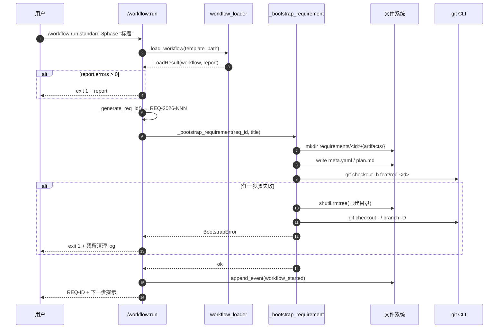

# REQ-2026-010 · 概要设计

## 1. 设计目标与约束回顾

回应 `requirement.md` 的 5 条 AC + 4 条决策记录 + 阶段 3 用户确认锁定的 4 条结论：

- **AC-01** bootstrap 完整化（来源：requirements/REQ-2026-010/artifacts/requirement.md:78）
- **AC-02** main loop 真派发 7 类节点（含 approval 写 `approval_pending` return）
- **AC-03** 模板硬编码路径参数化（`$RUN_DIR` / `$META_PATH`）
- **AC-04** 父子 run 路径收敛到 `run_dir/sub_runs/<node_id>/`
- **AC-05** 替换 2 条占位 e2e 为 mock LLM dispatcher 方案

设计约束：D-007 双轨期延续；approval 方案 ii（jsonl 反扫重建）；不动 REQ-2026-009 已落地的 F-001 / F-005 / F-007 / F-010 模块（来源：requirements/REQ-2026-010/artifacts/requirement.md:99）。

## 2. 整体架构

### 2.1 模块视图（PR 拆分对应）

```
┌──────────────────────── PR-A：bootstrap 侧 ──────────────────────────┐
│                                                                    │
│  scripts/lib/workflow_run.py            ← AC-01 扩展                │
│    ├── _generate_req_id()       (新增) │ REQ-YYYY-NNN 编号策略       │
│    ├── _bootstrap_requirement() (新增) │ 切分支 + 建目录 + plan.md   │
│    ├── _bootstrap_rollback()    (新增) │ 失败兜底反向撤销             │
│    └── main()                   (扩展) │ 挂 load_workflow 校验       │
│                                                                    │
│  .claude/workflows/requirement/standard-8phase.yaml  ← AC-03 改造  │
│    7 处 bash 节点：runs/$RUN_ID/... → $RUN_DIR / $META_PATH         │
│                                                                    │
└────────────────────────────────────────────────────────────────────┘
                              ↓ 合并后
┌──────────────────────── PR-B：引擎执行侧 ────────────────────────────┐
│                                                                    │
│  scripts/lib/workflow_dispatcher.py     (新增) ← AC-02 核心          │
│    ├── dispatch_node(node, run_state, run_dir, root)               │
│    ├── _dispatch_agent_node()    (mock 切入点供 AC-05 用)            │
│    ├── _dispatch_skill_node()                                      │
│    ├── _dispatch_prompt_node()                                     │
│    ├── _dispatch_bash_node()                                       │
│    ├── _dispatch_approval_node() → 写 approval_pending + return    │
│    ├── _dispatch_loop_node()                                       │
│    └── _dispatch_sub_workflow_node()                               │
│                                                                    │
│  scripts/lib/workflow_continue.py       ← AC-02 替换 stub           │
│    main loop = while current_node and state==running:              │
│      dispatch_node(...)                                            │
│                                                                    │
│  scripts/lib/workflow_status.py         ← AC-04 路径收敛            │
│    nodes_dir → sub_runs_dir                                        │
│                                                                    │
│  tests/e2e/test_code_review_embedded.py       ← AC-05 mock 改造    │
│  tests/e2e/test_sub_workflow_lifecycle.py     ← AC-05 mock 改造    │
│                                                                    │
└────────────────────────────────────────────────────────────────────┘
```

### 2.2 数据流（场景 1：用户起新需求）



### 2.3 数据流（场景 2：main loop 派发节点）

```mermaid
sequenceDiagram
    autonumber
    participant Cont as /workflow:continue
    participant Reb as RunState.rebuild
    participant Loop as main_loop
    participant Disp as dispatch_node
    participant Sub as substitute_vars
    participant Out as 节点执行体（LLM/bash/skill...）

    Cont->>Reb: read_events(jsonl) → events
    Reb-->>Cont: RunState(state, current_node, node_outputs)
    Cont->>Loop: while state in {running} and current_node:
    Loop->>Disp: dispatch_node(node)
    Disp->>Sub: 替换 $ARGUMENTS / $RUN_DIR / $node.output
    Disp->>Out: 派发（fresh/shared/bash）
    alt 普通节点
        Out-->>Disp: stdout / output_format
        Disp->>Loop: append node_completed event
        Loop->>Loop: current_node = topology.next(node)
    else approval 节点（方案 ii）
        Disp->>Loop: append approval_pending event + return
        Loop->>Cont: break + 提示用户跑 /workflow:approve
    else 失败
        Disp->>Loop: append node_failed + state=failed
        Loop->>Cont: break
    end
```

## 3. 关键设计决策

| 决策点 | 选择 | 依据 |
|---|---|---|
| **dispatcher 文件组织** | 单文件 `workflow_dispatcher.py` 起步，每类节点独立函数 | 参考 `workflow_rollback.py` 的拆法（来源：scripts/lib/workflow_rollback.py:14），MVP 阶段单文件约 300-400 行可维护；后续按需升级为子模块 |
| **变量注入机制** | 字符串预替换（方案 B）；`$RUN_DIR` / `$META_PATH` 在 `substitute_vars` 的 `env` 字典中注入；bash 节点 `escape_for_bash=False` | 与现有 `substitute_vars` 设计意图一致（来源：scripts/lib/substitute_vars.py:61），统一所有节点类型的变量处理；env 字典与 `$ARGUMENTS` / `$ARTIFACTS_DIR` 同一来源 |
| **approval 状态机** | 方案 ii：写 `approval_pending` 事件 → main loop return → 用户 `/workflow:approve` 后由下次 `/workflow:continue` 续跑 | 与"反扫 jsonl 重建 RunState"既有设计天然契合（来源：requirements/REQ-2026-009/artifacts/detailed-design.md:372），不引入进程常驻 |
| **父子 run 路径** | 统一走 `run_dir/sub_runs/<node_id>/`；淘汰 `nodes/<id>/run_id` 间接索引 | 与 `workflow_rollback_subrun.py:79` 现有默认 fixture 一致；无历史兼容负担（详见 requirements/REQ-2026-010/artifacts/tech-research.md AC-04 节段） |
| **AC-05 真 e2e** | mock `_dispatch_agent_node` 返回值，不走真实 Claude API | 用户阶段 3 确认；满足 AC-05 断言（jsonl `node_completed` + output 非空），CI 完全稳定零费用 |
| **bootstrap 失败回滚** | try/except 包裹副作用三步；失败时反向撤销已建目录与 git 分支 | 参考 `workflow_rollback.py` 的 `.in_progress` 标记模式；失败 IOError 至少 ERROR 日志后 exit 1 |
| **REQ-ID 生成策略** | 扫 `requirements/REQ-YYYY-NNN` 取 max+1；EEXIST 重试 3 次 | 与现有 `_generate_run_id` 一致（来源：scripts/lib/workflow_run.py:29） |
| **PR 拆分顺序** | PR-A (AC-01 + AC-03) 先合，PR-B (AC-02 + AC-04 + AC-05) 后合 | bootstrap 副作用必须先于 main loop e2e（R-01 阻塞风险） |

## 4. 接口契约（模块间）

### 4.1 workflow_run.py → workflow_loader.py

```python
from workflow_loader import load_workflow, LoadResult

result: LoadResult = load_workflow(template_path)
if result.report.errors:
    print(result.report.render(), file=sys.stderr)
    return 1
workflow_definition = result.workflow  # 后续传给 dispatcher
```

### 4.2 workflow_continue.py → workflow_dispatcher.py

```python
from workflow_dispatcher import dispatch_node, DispatchResult

while run_state.state == "running" and run_state.current_node:
    node = node_map[run_state.current_node]
    dispatch_result: DispatchResult = dispatch_node(
        node=node,
        run_state=run_state,
        run_dir=run_dir,
        root=root,
        env={"RUN_DIR": str(run_dir), "META_PATH": str(run_dir/"meta.yaml"),
             "ARTIFACTS_DIR": str(run_dir/"artifacts"), "RUN_ID": run_id,
             "ARGUMENTS": arguments, **node_outputs_as_env(run_state)},
    )
    if dispatch_result.outcome == "approval_pending":
        break  # 等用户 /workflow:approve
    if dispatch_result.outcome == "failed":
        break
    run_state.current_node = topology.next(node, run_state)
```

### 4.3 dispatch_node 内部契约

```python
@dataclass
class DispatchResult:
    outcome: Literal[
        "completed",            # 普通节点正常完成（agent/skill/prompt/bash）
        "approval_pending",     # approval 节点写 approval_pending 事件 → main loop return
        "failed",               # 节点执行失败，state=failed
        "loop_continue",        # loop 节点：本轮完成但 max_iterations 未达 → 同节点下一轮
        "loop_done",            # loop 节点：max_iterations 达到或终止条件成立 → 进下游
        "sub_workflow_pending", # sub_workflow 节点：子 run 已派发尚未完成 → main loop return
        "sub_workflow_done",    # sub_workflow 节点：子 run 已 completed → 进下游
    ]
    output: Any | None
    error: str | None = None
    next_node_hint: str | None = None  # 显式覆盖默认拓扑序（如 on_reject 路径）

def dispatch_node(node, run_state, run_dir, root, env) -> DispatchResult:
    """按 node 类型派发。所有事件写入由本函数负责。"""
    if "agent" in node:
        return _dispatch_agent_node(node, run_state, run_dir, env)
    if "skill" in node:
        return _dispatch_skill_node(...)
    if "loop" in node:
        return _dispatch_loop_node(...)        # → loop_continue / loop_done / failed
    if "sub_workflow" in node:
        return _dispatch_sub_workflow_node(...) # → sub_workflow_pending / sub_workflow_done / failed
    # ... 其余节点类型
```

`_dispatch_agent_node` 是 AC-05 mock 切入点：测试用 monkeypatch 替换其返回值。

main loop 根据 outcome 决定下一步：

| outcome | main loop 行为 |
|---|---|
| `completed` | `current_node = topology.next(node)` 继续 |
| `loop_continue` | `current_node` 不变，下次 dispatch 进入同节点新一轮 |
| `loop_done` / `sub_workflow_done` | `current_node = topology.next(node)` 继续 |
| `approval_pending` / `sub_workflow_pending` | break；等用户 `/workflow:approve` 或子 run completed 后由 `/workflow:continue` 续跑 |
| `failed` | break；进入 §5.2 失败续跑策略 |

### 4.4 yaml 模板变量约定（AC-03）

| 变量 | 注入时机 | 值 | 适用字段 |
|---|---|---|---|
| `$RUN_ID` | bootstrap 时 | `REQ-YYYY-NNN` 或 `RUN-...` | yaml 内任何字符串字段 |
| `$RUN_DIR` | dispatcher 派发前 | `_resolve_run_dir(run_id, root)` 解析的绝对路径 | yaml 内任何字符串字段（替代硬编码 `runs/$RUN_ID/`） |
| `$META_PATH` | dispatcher 派发前 | `$RUN_DIR/meta.yaml` | bash 节点 yq 命令、`artifact.must_exist` |
| `$ARTIFACTS_DIR` | dispatcher 派发前 | `$RUN_DIR/artifacts` | 同上 |
| `$ARGUMENTS` | workflow_started 时记入 jsonl | 用户 `/workflow:run` 后跟的字符串 | prompt / agent / skill 节点 |
| `$<nodeId>.output` | 上游节点 completed 时 | `node_completed` 事件的 `data.output` | 下游节点的 `args` / prompt |

## 5. 非功能设计

### 5.1 性能

- dispatcher overhead 软约束（SLO）≤ 200ms，阶段 8 micro-bench 验证；当前架构纯 Python 文件 IO，预期 10-30ms 量级（详见 requirements/REQ-2026-010/artifacts/tech-research.md §2 R-06 风险段）
- jsonl 写采用 `fcntl.LOCK_EX`（已有，来源：scripts/lib/run_state.py:268）

### 5.2 错误处理

#### 5.2.1 bootstrap 失败兜底

- mkdir 已建目录 → `shutil.rmtree`
- 已切 `feat/req-<id>` 分支 → `git checkout <prev>` + `git branch -D feat/req-<id>`
- 已写 jsonl `workflow_started` → 不删（事件追加式，幂等读取无副作用）
- 三步全包在 try/except 内，任一步 IOError 时打 ERROR + exit 1

#### 5.2.2 节点失败后的 `/workflow:continue` 续跑策略

dispatcher 失败时写 `node_failed` 事件，state=failed，main loop break。用户下次 `/workflow:continue` 时，按节点配置的 `on_failure` 字段决定行为（默认 `retry`）：

| `on_failure` 配置 | 续跑行为 | 适用场景 |
|---|---|---|
| `retry`（默认） | RunState 回退 `current_node` 到失败节点，重派一次；同节点连续失败 ≥ `max_retries`（默认 3）则升级 `abort` | 网络抖动、LLM 临时不可用 |
| `skip` | 把失败节点标记为 skipped + 写 `node_skipped` 事件，`current_node = topology.next(node)` 继续 | 非关键节点（如可选评审） |
| `abort` | state 保持 failed，main loop 拒绝续跑；用户必须显式 `/workflow:rollback` 回退 | 关键节点失败（如 bootstrap-validate） |

**dispatcher 幂等边界**：

- **节点输出幂等**：重派同一节点前，引擎删 jsonl 中该节点最后一条 `node_started` 之后的所有事件（即 `node_failed`、partial output 等）；从最后一条 `node_completed` 角度看，重派等价于"从未发生过失败"
- **副作用幂等**：bash 节点用户自管（设计上要求 yaml 中 bash 脚本本身做幂等校验，例如 `mkdir -p`、`yq e ".phase = ..."` 等本就幂等）；agent / skill / prompt 节点由 LLM 自管（无 stateful 副作用）
- **approval / sub_workflow 不重派**：状态机这两类节点 outcome 是 `*_pending`，不属于 failed 范畴；用户 `/workflow:approve` 后 dispatcher 重新读 jsonl 直接走 completed 分支，不会重派

#### 5.2.3 approval reject 路径

走 `on_reject` 字段（已在 REQ-2026-009 设计完成，本需求不展开）。reject 时 main loop 跳到 `on_reject.next_node` 或重派当前 approval 节点 ≤ `max_attempts` 次。

### 5.3 安全

- 所有 `$VAR` 替换前必须 `shell_quote()`；bash 节点单独 escape_for_bash 控制（来源：scripts/lib/substitute_vars.py:61）
- approval / cancel tty 校验由 `pre-tool-use-guard.sh` Hook 兜底，dispatcher 不需要重复

### 5.4 测试策略

| 层级 | 范围 | 工具 |
|---|---|---|
| 单元 | 每个 `_dispatch_*_node` 函数 | pytest + monkeypatch mock 外部副作用 |
| 集成 | dispatch_node + main loop（含变量替换） | pytest + 真 jsonl 文件 |
| e2e | `/workflow:run` 走完 bootstrap-validate；真跑 2-3 节点；sub_workflow + rollback 跨父子 | pytest e2e + mock `_dispatch_agent_node`（AC-05 决策） |
| 性能 | dispatcher overhead 微基准 | `time.perf_counter()` × 50 次取 P95，阶段 8 一次性 |

## 6. 模块依赖图

```
workflow_run.py ──→ workflow_loader.py
        │
        └──→ _bootstrap_requirement ──→ subprocess git
                       │
                       └──→ shutil (rollback)

workflow_continue.py ──→ run_state.RunState.rebuild
        │
        └──→ workflow_dispatcher.dispatch_node
                       │
                       ├──→ substitute_vars.substitute_vars
                       ├──→ run_state.append_event
                       └──→ 7 类节点执行体
                              agent → Task tool（mock 切入点）
                              skill → Skill tool / 主 Claude
                              prompt → 主 Claude
                              bash → subprocess
                              approval → 仅写事件
                              loop → 内部状态机
                              sub_workflow → 嵌套 workflow_run 派子

workflow_status.py ──→ run_dir / sub_runs / <node_id>（AC-04 新统一路径）
workflow_rollback_subrun.py ──→ 同上（已是默认）
```

## 7. 范围与不做事项

### 包含
- 5 条 AC 全部
- mock LLM dispatcher 测试基础设施
- yaml 路径参数化（7 处节点）
- status / dispatcher / rollback 三处子 run 发现路径统一

### 不包含
- `/workflow:next` 命令落地（F-012 独立 PR）
- sub_workflow 节点完整父子联动（仅 dispatcher 框架，深度联动留后续）
- loop 节点完整迭代状态机（仅占位返回，深度实现留后续）
- 历史 `requirements/` → `runs/` 目录迁移
- 并发触发 `/workflow:run` 的 REQ-ID 竞争场景

## 8. 决策回引（traceability）

| 设计章节 | 回引 AC / requirement.md / tech-research.md |
|---|---|
| §2.1 PR 拆分 | AC-01 ~ AC-05 / tech-research §3 PR 拆分建议 |
| §2.2 bootstrap 流程 | AC-01 / requirement.md 场景 1 / tech-research AC-01 评估 |
| §2.3 main loop 派发 | AC-02 / requirement.md 场景 2 / tech-research AC-02 评估 |
| §3 dispatcher 文件组织 | tech-research AC-02 评估 |
| §3 变量注入 | AC-03 / tech-research AC-03 评估 |
| §3 父子路径 | AC-04 / tech-research AC-04 评估 |
| §4.3 mock 切入点 | AC-05 / 阶段 3 用户确认 |
| §5.1 性能 SLO | 阶段 3 用户确认（200ms 软约束）|

## 待澄清清单

本阶段无新增待澄清条目；阶段 3 末锁定的 4 条决策（mock LLM / 9.8 天工作量 / PR 拆分 / 200ms SLO）作为本概要设计的输入直接采纳，不再列入清单。
