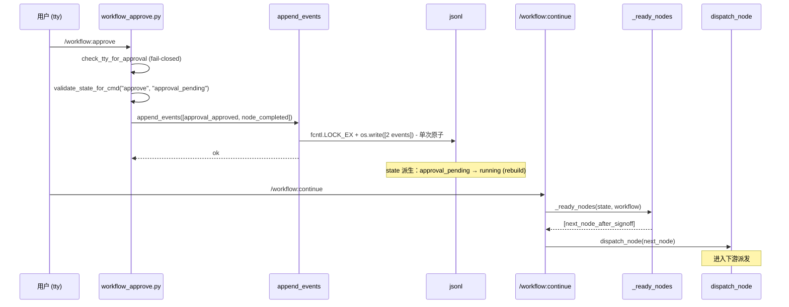
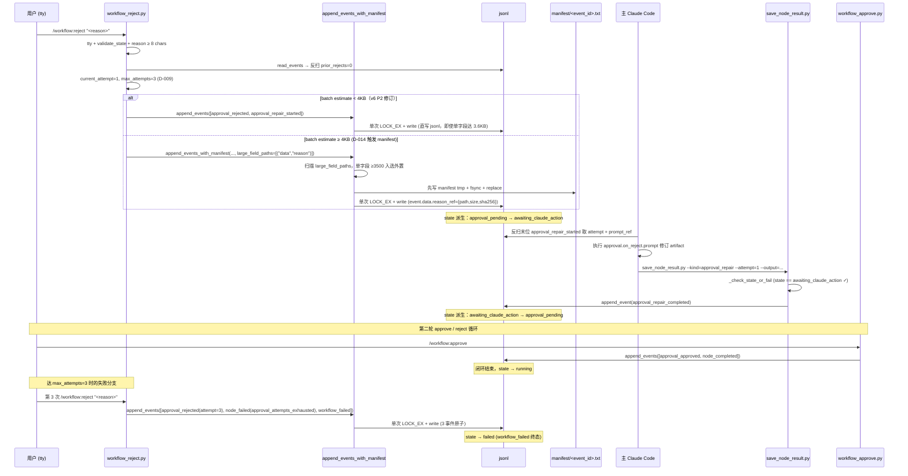
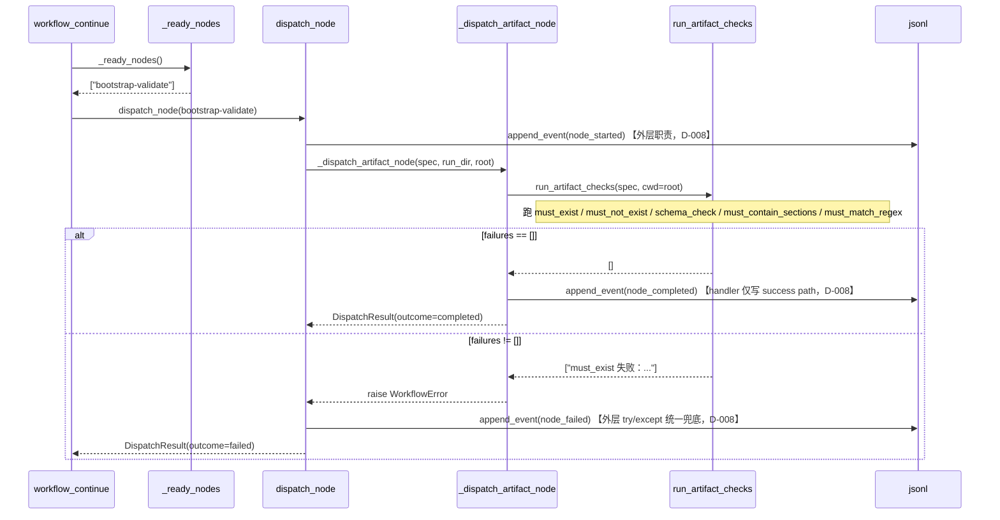
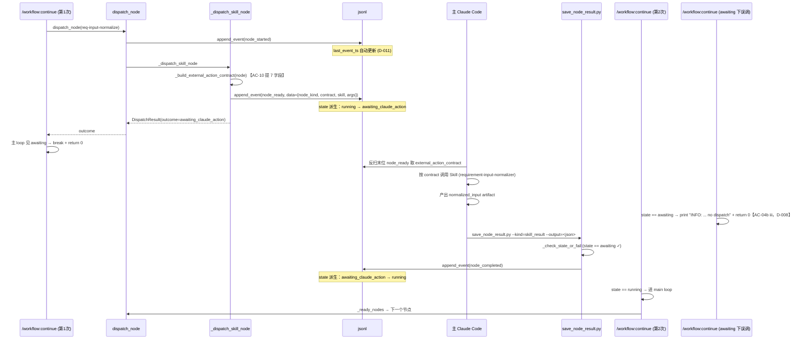
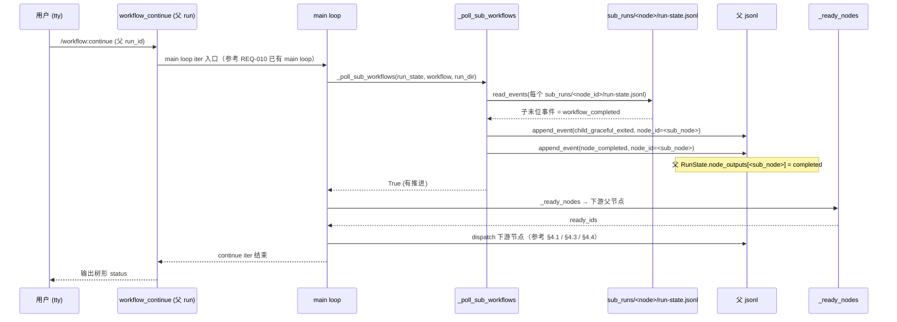
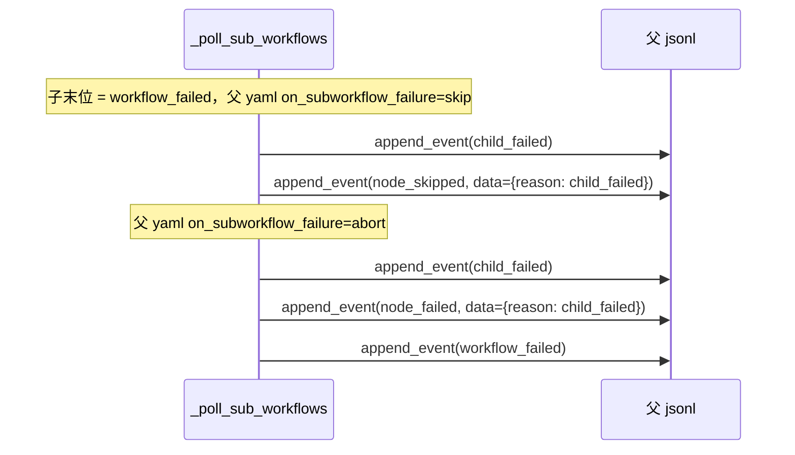
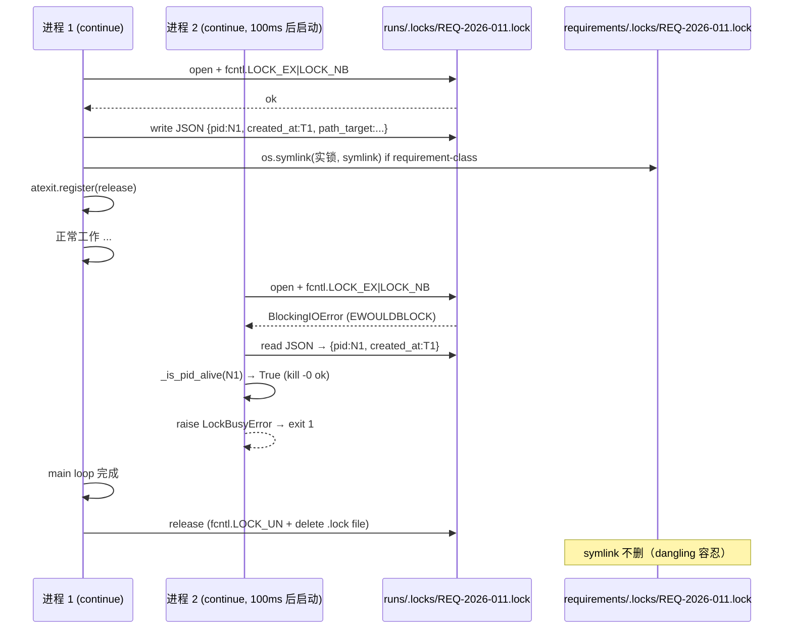
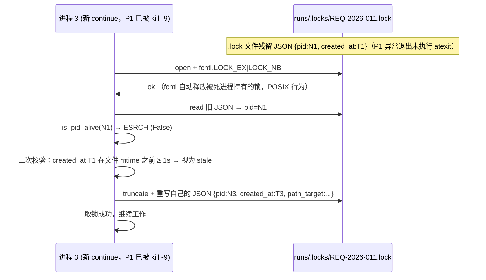

# REQ-2026-011 · 详细设计

> 落地 outline-design v4 的抽象到具象层；按"数据结构 / 接口签名 / 时序图 / 关键子系统 / Hook 与 tty / 测试 / 兼容性 / 风险 / features.json 说明"分层。
> 14 条 ADR D-001~D-014 在文档中逐条标注落地位置，未落地处禁止存在。

## 1. 概览

### 1.1 与 outline-design 的差异与增量

outline-design v4 给出 6 层架构（CLI / State / Lock / Loader / Scheduler / Dispatcher）+ 7 大流程时序，但接口签名 / 数据结构字段 / 异常类型 / 事件 payload schema 均留给本文档落地。本文档相对 v4 的关键增量：

| 项 | outline-design v4 | detailed-design v1 |
|---|---|---|
| 新增模块 | 2 个（`save_node_result.py` / `workflow_lock.py`） | 3 个（追加 `append_events.py`，承载 D-014 4KB 上限 + manifest-pointer）；**`workflow_lock.py` 在本文档统一改名为 `path_lock.py`**（更准确反映 D-003 三件套 path-lock 语义；outline-design v4 仍用旧名，detail-design 阶段起改名） |
| 事件 payload | 仅命名（`node_ready` / `approval_repair_started/completed`） | 给出每条事件 payload JSON schema + 必填字段（§2.2） |
| 接口签名 | 仅列函数名 | 全部带 Python type hints + 异常声明（§3.x） |
| 数据结构 | RunState 字段微调 | `RunState.last_event_ts` 用法 / lock 文件格式 / manifest 文件格式 / features.json `priority` 字段（§2.x） |
| 时序图 | 4 类正常路径 + 2 类异常 | 6 类（追加 path-lock 三件套残锁清理；sub_workflow 父子完成回填补完）（§4.x） |
| 测试矩阵 | 概念性 | 给出 fixture 命名 + 断言条目数 + micro-benchmark 用例（§7.x） |

### 1.2 14 条 ADR 一览表（D-001~D-014）

| ADR | 标题 | 落地章节 | 对外可见的产物 |
|---|---|---|---|
| D-001 | AI 节点完成回写接口选 `save_node_result.py` | §3.1 | `scripts/lib/save_node_result.py` CLI |
| D-002 | `/workflow:status --verbose` 输出格式选树形文本 | §3.7 / §4.4 | `workflow_status.py` `--verbose` flag |
| D-003 | path-lock 死亡兜底选三件套 | §2.3 / §3.9 / §4.6 / §5.1 | `scripts/lib/path_lock.py`（D-014 后改名为本文件） |
| D-004 | DAG scheduler 重构不引入 feature flag | §8.3 | （仅 PR 描述，无代码产物） |
| D-005 | features.json 增 `priority: P0\|P1\|P2` 字段 | §2.5 / §10.2 | `features-schema.yaml` 扩展 + features.json |
| D-006 | DAG 兼容退化判定依据 `depends_on_explicit` + 同层 ready 串行 | §2.1 / §3.4 / §5.4 | `workflow_loader._expand_implicit_depends_on` |
| D-007 | approval reject inline repair 事件流 + 复用 `awaiting_claude_action` | §2.2 / §3.2 / §4.2 | `workflow_reject.py` / 新事件 |
| D-008 | dispatcher 事件写入职责（外层 started/failed，handler 仅 completed） | §3.3 / §4.1 | `workflow_dispatcher.dispatch_node` 内层职责约束 |
| D-009 | approval `max_attempts` 引擎默认 = 3 | §3.2 | 常量 `DEFAULT_APPROVAL_MAX_ATTEMPTS = 3` |
| D-010 | stale 阈值默认 = 30 分钟（env 可覆盖） | §3.7 / §5.2 | 常量 `STALE_THRESHOLD_MINUTES = 30` + env `CLAUDE_WORKFLOW_STALE_MINUTES` |
| D-011 | AC-06 heartbeat 复用 `last_event_ts` 字段 | §3.8 / §5.2 | RunState.last_event_ts（已有字段，零代码改动） |
| D-012 | `save_node_result.py` 与 `save_review.py` 不抽公共 helper | §3.1 注 | （仅说明，无代码产物） |
| D-013 | `_ready_nodes` 每次全量重算（无增量缓存） | §3.3 / §5.4 | `workflow_continue._ready_nodes` 实现策略 |
| D-014 | 4KB 上限 + manifest-pointer fallback | §2.4 / §3.5 / §5.3 | `scripts/lib/append_events.py` + `runs/<id>/manifest/` |

---

## 2. 数据结构

### 2.1 RunState 扩展（对应 ADR D-006 / D-011 / D-013）

`scripts/lib/run_state.py:103-130` 的 `RunState` dataclass **保持单 `current_node` 模型不变**（D-006 串行派发 + AC-01 决策）；本期改动仅触达：

- `last_event_ts: str | None`：已有字段（来源：scripts/lib/run_state.py:127），本期不新增字段，仅扩展 rebuild 时对新事件类型的 ts 更新（详细见 §3.8）。`STALE_THRESHOLD_MINUTES` 判定基于此字段。对应 ADR：D-011。
- 不新增 `awaiting_kind` / `attempts` 等子字段：`awaiting_claude_action` 状态由"末位事件类型反扫"判别（末位 = `node_ready` 则 skill_result；末位 = `approval_repair_started` 则 approval_repair），attempts 由反扫 jsonl 中 `approval_rejected` 事件计数得出（详细见 §3.2）。对应 ADR：D-007 决策附属。

新增状态：

```python
# scripts/lib/run_state.py
WORKFLOW_EVENT_TO_STATE: dict[str, str] = {
    # 既有 6 项保持不变；本期不在此扁平映射表中新增任何条目。
    # 原因：rebuild 实现是 `elif ev_type in WORKFLOW_EVENT_TO_STATE`（run_state.py:159），
    # 命中即跳后续 elif；如果新事件放进来，后面的 if/elif 专门分支（current_node /
    # pending_approval 等副作用）永远不可达 —— **三件副作用必须在专门分支里完整完成**。
}
```

> **关键设计修订（对抗审阅 P1-1）**：原 v3 设计把 `node_ready` / `approval_repair_started` / `approval_repair_completed` 加入 `WORKFLOW_EVENT_TO_STATE` 扁平映射并希望与 `RunState.rebuild` 的 if/elif 专门分支配合 — 但 run_state.py:159 现有实现是 `elif ev_type in WORKFLOW_EVENT_TO_STATE` 先命中，专门分支不可达，副作用（设 `current_node` / `pending_approval`）会被吞掉。本期 v4 改为**全部走显式 if/elif 专门分支**（详见 §3.8.3），扁平映射不扩展。

**真实状态回退全部在 rebuild 的 if/elif 专门分支处理**（详见 §3.8.3 完整代码）：

- `node_ready`：`current_node = node_id` + `state = "awaiting_claude_action"`。
- `approval_repair_started`：`pending_approval = node_id` + `state = "awaiting_claude_action"`。
- `approval_repair_completed`：`state = "approval_pending"`（`pending_approval` 保持，仍是同一节点等下一次 approve/reject）。
- `node_completed`：若先前 state 为 `awaiting_claude_action` → state 回 `running`；否则保持当前 state（既有逻辑保持）。

对应 ADR：D-006 / D-007。

### 2.2 jsonl event payload schemas（对应 ADR D-007 / D-008）

本期新增 3 种事件类型，全部进入 `VALID_EVENT_TYPES` 白名单（scripts/lib/run_state.py:54）。

**顶层字段约束**（对抗审阅 P2-1 修订；与 `append_event` 现有实现 run_state.py:288-302 + rebuild 现有实现 run_state.py:153-158 对齐）：

| 字段 | 必填范围 | 说明 |
|---|---|---|
| `type` | **所有事件必填** | 事件类型；不在 `VALID_EVENT_TYPES` 白名单则 `append_event` 抛 `WorkflowError` |
| `ts` | 必填（未传则自动补） | `append_event` 自动塞 ISO8601 `YYYY-MM-DDTHH:MM:SSZ`（run_state.py:301-302） |
| `run_id` | **仅 `workflow_started` 必填** | 其他事件 `run_id` optional —— rebuild 只从首条 `workflow_started.run_id` 兜底（run_state.py:156-157），其他事件 run_id 不被读取；jsonl 路径 `runs/<run_id>/run-state.jsonl` 已隐含 run_id 信息，无需事件内冗余 |
| `node_id` | 节点级事件必填 | 全局事件（`workflow_started/completed/failed/cancelled` 等）不需要 |
| `data` | 按事件类型 schema 必填 | 详见下方各事件 payload 段；payload 大小校验见 §2.4 |

> **示例代码约定**（M-3 修订）：
> - §2.2.x JSON payload 示例显式写 `run_id` —— **仅作为读 jsonl 时人类辨识便利**，机器侧 rebuild 不依赖此字段（见上表）。
> - §3.x Python 代码示例与现有 `scripts/lib/workflow_dispatcher.py:132/163` 既有写法一致：append_event payload **包含** `run_id=run_state.run_id`（虽 rebuild 不读，但写入侧保持冗余以备未来日志/审计/外部消费）。
> - §3.2 reject CLI（line 421-432）等少量"作为可读 schema 示例"的事件构造没写 `run_id`——实施时按 §3.3 dispatcher 同款补上即可，本文档**不强制改写示例**（避免与 §2.2.x JSON 示例风格冲突）。
> - 核心契约：`append_event` 不校验 `run_id`，缺失合法；rebuild 仅在首条 `workflow_started` 兜底取 `run_id`。

#### 2.2.1 `node_ready`（AC-04a，对应 ADR D-007 / D-008）

```json
{
  "type": "node_ready",
  "ts": "2026-05-14T10:30:00Z",
  "run_id": "REQ-2026-011",
  "node_id": "req-input-normalize",
  "data": {
    "node_kind": "skill",
    "external_action_contract": {
      "allowed_tools": ["Read", "Edit", "Bash"],
      "denied_tools": [],
      "mcp": ["context7"],
      "skills": ["requirement-doc-writer"],
      "agents": [],
      "idle_timeout": 1800,
      "output_format": null
    }
  }
}
```

- **必填**：`data.node_kind ∈ {skill, prompt, agent}`；`data.external_action_contract` 必须存在（缺省 `{}`，**不允许缺字段**）。
- `external_action_contract` 7 字段名 1:1 映射 yaml 节点字段（AC-10 透传），缺省值：`allowed_tools=[]` / `denied_tools=[]` / `mcp=[]` / `skills=[]` / `agents=[]` / `idle_timeout=null` / `output_format=null`。
- **消费方**：主 Claude Code 反扫 jsonl 中**末位类型为 `node_ready` 的事件**取 contract（AC-A3 baseline）。

#### 2.2.2 `approval_repair_started`（AC-03b，对应 ADR D-007 / D-014）

```json
{
  "type": "approval_repair_started",
  "ts": "2026-05-14T10:31:00Z",
  "run_id": "REQ-2026-011",
  "node_id": "req-signoff",
  "data": {
    "attempt": 1,
    "max_attempts": 3,
    "prompt_ref": "approval.on_reject.prompt",
    "reason": "用户反馈：缺少 ...（inline，常规场景）"
    // 或当 batch ≥4KB 触发 manifest fallback 且 reason 单字段 ≥3500 入选外置时（§2.4 二段语义）：
    // "reason_ref": {"path": "manifest/<event_id>.txt", "size": 5234, "sha256": "abc..."}
  }
}
```

- **必填**：`data.attempt` (int, 1-based) / `data.max_attempts` (int) / `data.prompt_ref` (str)。
- **互斥**：`data.reason`（inline）xor `data.reason_ref`（manifest pointer，详见 §2.4 D-014）；写入方按 §2.4/§3.5 的"batch ≥4KB 触发 + 单字段 ≥3500 入选"算法自动选择。
- **统一封装**：reject CLI 通过 `append_events_with_manifest(..., large_field_paths=[("data", "reason")])` 自动判定（公开 API 名见 §3.5）。

#### 2.2.3 `approval_repair_completed`（AC-03b/AC-04b，对应 ADR D-007）

```json
{
  "type": "approval_repair_completed",
  "ts": "2026-05-14T10:35:00Z",
  "run_id": "REQ-2026-011",
  "node_id": "req-signoff",
  "data": {
    "attempt": 1,
    "output": "已修订章节 [非功能需求, 待澄清]"
  }
}
```

- **必填**：`data.attempt` (int, 与对应 started 对齐) / `data.output` (str 或 dict)。
- **写入方**：`save_node_result.py --kind=approval_repair` 唯一入口。

#### 2.2.4 既有事件 payload 微调（无 schema 破坏）

- `approval_rejected` 事件 `data.reason` 受 D-014 同样规则约束（**batch ≥ 4KB 时**触发 manifest fallback；不再"单字段 ≥3.5KB 即外置"，v6 P2 修订）。
- `node_failed` 事件 `data.reason` 字段含义补：当因 `approval_attempts_exhausted` 触发时（AC-03c），`data.reason = "approval_attempts_exhausted"`，`data.attempt = max_attempts`（**单数 `attempt` 与 approval_rejected / approval_repair_started/completed 事件命名统一**，消费方可用单一 key 反扫；不再使用复数 `attempts` 字段），`workflow_failed` 紧随其后写入（由 reject CLI 一次原子三事件）。

### 2.3 lock 文件格式（对应 ADR D-003 / D-005）

`runs/.locks/<run-id>.lock` 文件（fcntl 锁载体）payload 为 JSON 单行：

```json
{
  "pid": 12345,
  "created_at": "2026-05-14T10:30:00Z",
  "path_target": "/abs/path/to/runs/REQ-2026-011",
  "host": "Darwin-25.4.0"
}
```

- **必填**：`pid` / `created_at` / `path_target`；
- **path_target**：实锁的绝对路径（用于 symlink 一致性校验，§5.1）；
- **失活检测**：取锁失败时第二进程读 pid → `kill -0 pid` → `ESRCH` 视为 stale；二次校验 `created_at` 在 mtime 之前 ≥ 1s（缓解 pid 复用窗口，详见 §5.1）；
- requirement 类 run（`run_id.startswith("REQ-")`）acquire 时按需 `os.symlink("../../runs/.locks/<id>.lock", "requirements/.locks/<id>.lock")`，存在性检测**必须用 `os.path.lexists()`**（outline-design v4 §lock layer 已强调）。

### 2.4 manifest 文件格式（对应 ADR D-014，对抗审阅 P2 v6 修订对齐 §3.5 算法）

**触发条件**（与 §3.5 `append_events_with_manifest` 算法严格对齐）：

1. 先 dry-run 估算 batch 序列化字节数；
2. 若 `estimate < 4KB` → 直接走 `append_events` 直写，**不**外置（即使有 3.6KB 单字段）；
3. 仅当 `estimate ≥ 4KB` 时，对 `large_field_paths` 中**单字段 ≥ 3500 字节** (`MAX_INLINE_FIELD_BYTES`) 的部分外置到 `runs/<run_id>/manifest/<event_id>.txt`，event 内仅留 ref（详见 §3.5 第 2-3 步）。

> **v5 → v6 修订要点**：v5 §2.4 写"单字段 ≥ 3500 字节就落 manifest"与 §3.5 算法（先看 batch 大小再判单字段）不一致。v6 统一为**仅 batch ≥ 4KB 时才扫描 single field 并按 3500 字节阈值外置**——简化路径、避免 3.6KB 小事件产生不必要的 manifest 文件 IO。`MAX_INLINE_FIELD_BYTES=3500` 仅在外置场景内作为"选谁外置"的阈值，不是独立触发器。

```
runs/REQ-2026-011/
├── meta.yaml
├── run-state.jsonl
└── manifest/
    ├── index.txt            # 一行一个 "<event_id> <field> <sha256> <bytes>"，便于 grep
    ├── 20260514T103100Z-req-signoff-repair-001.txt    # 原文
    └── 20260514T104200Z-req-signoff-repair-002.txt
```

- **event_id 命名**：`<iso_ts>-<node_id>-<purpose>-<seq>`（`purpose ∈ {repair, reject-reason, skill-output}`）；
- **purpose 与事件类型映射**：

  | purpose | 对应触发事件类型 | 来源字段 | 触发位置 |
  |---|---|---|---|
  | `repair` | `approval_repair_started` / `approval_repair_completed` | `data.prompt_ref` / `data.output` | `workflow_reject.py`（attempt < max）+ `save_node_result.py --kind=approval_repair` |
  | `reject-reason` | `approval_rejected` + `node_failed(reason=approval_attempts_exhausted)` | `data.reason` | `workflow_reject.py`（reject CLI 入口）|
  | `skill-output` | `node_completed`（kind=skill_result，主 Claude 回写大 output） | `data.output` | `save_node_result.py --kind=skill_result` |

  扩展约束：未来新增 purpose 必须在本表登记 + 出现在事件 payload schemas 段（即上文 jsonl event payload schemas 小节）；未登记的 purpose 视为 schema 违规（落 manifest 时 raise WorkflowError）。
- **ref 结构**：`{"path": "manifest/<event_id>.txt", "size": N, "sha256": "<hex>"}`；
- **生命周期**：随 run 归档；`requirement:archive` 不单独清理 manifest 目录（与 run 目录同进退）。
- **写入原子性**：先写 manifest tmp 文件 → fsync → `os.replace()` 到目标路径 → 再 `append_events` 写 jsonl event（jsonl 写失败时 manifest 文件成孤儿，按"先 manifest 后 jsonl"顺序，孤儿 manifest 不影响 rebuild；后台清理留 follow-up）。
- **index.txt 并发原子**：多进程并发 `append_events_with_manifest()` 时，index.txt fd 需 `fcntl.LOCK_EX` 锁后再追加；F-001 acceptance 含 2 进程并发各写 1 行的回归断言（缓解 §9 R-5 风险）。

### 2.5 features.json `priority` 字段（对应 ADR D-005）

`context/team/engineering-spec/features-schema.yaml` 扩展：

```yaml
# 在 enums: 段下追加
enums:
  priority:           # 新增
    - P0
    - P1
    - P2
  complexity:
    - trivial
    - light
    - medium
    - heavy

# 在 optional_feature_fields: 段下追加
optional_feature_fields:
  - estimate_days
  - interfaces_frozen
  - priority          # 新增（**软兼容**：缺省视为 P1）
  - pr_group          # 已沿用 REQ-010
  - ac_refs           # 已沿用 REQ-010
```

- 字段位置：每条 feature 顶层；
- 软兼容：`check_features.py` 不强制必填（避免破坏历史 features.json），但 GATE-FEATURES-SCHEMA 在 task-planning 阶段提示用户"未填 priority 视为 P1"。

---

## 3. 接口签名

> 全部以 Python `from __future__ import annotations` 风格写；异常显式列出。

### 3.1 `scripts/lib/save_node_result.py`（新建，对应 ADR D-001 / D-012）

```python
"""主 Claude Code 写 outcome 事件的统一入口（AC-04a）。

CLI 形态：
  python3 scripts/lib/save_node_result.py
    --run <run_id>
    --node <node_id>
    --kind {skill_result|approval_repair}
    --output <json-string-or-@file>
    [--attempt <int>]   # approval_repair 时必填，与 started 事件对齐

退出码：
  0  写入成功
  1  业务错误（run 不存在 / state 不允许 / output 解析失败）
  2  fail-closed 拒绝（state ≠ awaiting_claude_action）

D-001：与 save_review.py 平级独立模块；
D-012：不抽公共 helper，两份 _validate_inputs 独立维护。
AI-CMD-LOCK 拦截边界（§6.1）：本模块不在拦截列表（AI 主 Claude 允许调用）。
"""
from __future__ import annotations

import argparse
import json
import sys
from pathlib import Path
from typing import Literal

from common import REPO_ROOT, WorkflowError
from run_state import RunState, _resolve_run_dir, append_event, read_events
# 注：_resolve_run_dir 虽带下划线前缀，但已是 run_state 模块的稳定公开 contract——
#     供 workflow_continue / workflow_approve / save_node_result 等所有 CLI 入口
#     统一定位 runs/<run_id>/ 目录。保留下划线前缀以表达"非业务逻辑、勿在外部测试中 mock"
#     的内部协议语义；如 development 阶段觉得歧义，可在 F-007 PR 中改名为 resolve_run_dir
#     并同步所有调用站（不在本 ADR 范围）。
from workflow_state_validator import validate_state_for_cmd

KindLiteral = Literal["skill_result", "approval_repair"]
_AWAITING = "awaiting_claude_action"


def main(args: list[str], repo_root: Path | None = None) -> int:
    """CLI entry。

    Returns:
        int — 退出码语义：
            0 = success（事件成功写入 jsonl + 状态已切回 running / approval_pending）
            1 = 入参非法 / WorkflowError（如 --kind=approval_repair 缺 --attempt；run_id 不存在）
            2 = fail-closed（state != awaiting_claude_action；详见 _check_state_or_fail 抛 SystemExit(2)）
        其他非 0 = 未捕获异常（main 不再额外包装，由 traceback 暴露给 stderr）。

    Raises:
        本函数自身不 raise——所有错误转为 print(stderr) + return non-zero；
        但 _check_state_or_fail / _validate_inputs 内部抛 SystemExit / WorkflowError，
        由 main 顶层 try/except 转译为 return 1 / 2。
    """
    ...


def _validate_inputs(
    run_id: str,
    node_id: str,
    kind: KindLiteral,
    output_raw: str,
    attempt: int | None,
) -> dict:
    """解析 / 校验入参，返回标准化 dict。

    Raises:
        WorkflowError: 任何字段非法（包括 kind=approval_repair 但 attempt 缺失）。
    """
    ...


def _check_state_or_fail(
    run_id: str,
    run_state: RunState,
) -> None:
    """fail-closed 第 1 道闸：state != awaiting_claude_action 时退出码 2。

    Raises:
        SystemExit(2): state 不为 awaiting_claude_action。
    """
    if run_state.state != _AWAITING:
        print(
            f"ERROR [E-NODE-RESULT-001]: state={run_state.state!r} != {_AWAITING!r}; "
            f"主 Claude Code 仅可在 awaiting_claude_action 下回写 outcome。",
            file=sys.stderr,
        )
        sys.exit(2)


def _check_node_match_or_fail(
    run_id: str,
    node_id: str,
    kind: KindLiteral,
    run_state: RunState,
    jsonl_path: Path,
) -> None:
    """fail-closed 第 2 道闸（对抗审阅 P1-1）：节点身份校验。

    必须验证两条：
      (1) RunState 字段匹配 —— skill_result 时 run_state.current_node == node_id；
                              approval_repair 时 run_state.pending_approval == node_id。
      (2) jsonl 末位事件类型 + 该末位的 node_id 严格匹配——即 awaiting 状态来自该节点：
            kind=skill_result      → 末位 awaiting 事件 == node_ready(node_id)
            kind=approval_repair   → 末位 awaiting 事件 == approval_repair_started(node_id)

    没有此校验时，AI 可在等待 N1 的 awaiting 下错误写 N2 的 node_completed，
    会绕过整个节点身份契约。

    Raises:
        SystemExit(2): 任一校验失败。
    """
    # (1) RunState 字段比对
    if kind == "skill_result":
        expected = run_state.current_node
        field_name = "current_node"
    else:  # approval_repair
        expected = run_state.pending_approval
        field_name = "pending_approval"

    if expected != node_id:
        print(
            f"ERROR [E-NODE-RESULT-002]: --node={node_id!r} 与 RunState.{field_name}={expected!r} "
            f"不匹配；主 Claude 仅可回写当前 awaiting 的节点。",
            file=sys.stderr,
        )
        sys.exit(2)

    # (2) jsonl 末位事件类型 + node_id 严格匹配
    events, _ = read_events(jsonl_path)
    expected_type = "node_ready" if kind == "skill_result" else "approval_repair_started"
    # 找末位匹配 expected_type 的事件
    last_node_lifecycle_evt = None
    for evt in reversed(events):
        if evt.get("type") in {"node_ready", "approval_repair_started",
                               "node_completed", "approval_repair_completed",
                               "node_failed"}:
            last_node_lifecycle_evt = evt
            break

    if last_node_lifecycle_evt is None or last_node_lifecycle_evt.get("type") != expected_type:
        print(
            f"ERROR [E-NODE-RESULT-003]: jsonl 末位 awaiting 事件 ="
            f"{(last_node_lifecycle_evt or {}).get('type')!r}，期望 {expected_type!r}；"
            f"kind={kind!r} 状态契约违反。",
            file=sys.stderr,
        )
        sys.exit(2)

    if last_node_lifecycle_evt.get("node_id") != node_id:
        print(
            f"ERROR [E-NODE-RESULT-004]: jsonl 末位 {expected_type}.node_id="
            f"{last_node_lifecycle_evt.get('node_id')!r}，期望 {node_id!r}；节点身份错位。",
            file=sys.stderr,
        )
        sys.exit(2)


def _write_event(
    jsonl_path: Path,
    run_id: str,
    node_id: str,
    kind: KindLiteral,
    payload: dict,
) -> None:
    """按 kind 选择事件类型并写入。

    kind=skill_result   → node_completed
    kind=approval_repair → approval_repair_completed
    """
    ...
```

**关键约束**（对抗审阅 P1-1 修订 — 改"单门禁"为"复合 fail-closed 三件套"）：

- **第 1 道闸：state 校验**（`_check_state_or_fail`）—— `state == awaiting_claude_action` 时通过，否则 exit 2 `E-NODE-RESULT-001`。
- **第 2 道闸：节点身份校验**（`_check_node_match_or_fail`）——
  - kind=skill_result：要求 `run_state.current_node == node_id` ∧ jsonl 末位 awaiting 事件 = `node_ready(node_id)`；
  - kind=approval_repair：要求 `run_state.pending_approval == node_id` ∧ jsonl 末位 awaiting 事件 = `approval_repair_started(node_id)`；
  - 任一不匹配 → exit 2 `E-NODE-RESULT-002/003/004`（区分 RunState 字段错位 / 末位类型错位 / 末位 node_id 错位）。
- **第 3 道闸：attempt 校验**（仅 `--kind=approval_repair`）—— `--attempt` 必填且必须与最近一条 `approval_repair_started.data.attempt` 一致，不一致 exit 1。
- `--output` 接受裸 JSON 字符串或 `@<file>` 文件引用；`_write_event` 一律走 `append_events_with_manifest()`（§3.5 公开 API），由其内部按 batch ≥4KB 触发 + 单字段 ≥3500 入选的算法决定是否外置。

> **设计依据**：单 state 门禁存在身份漏洞——AI 可在等待 N1 时 `--node=N2 --kind=skill_result` 写错节点的 `node_completed`。RunState 字段（rebuild 已正确设置 `current_node` / `pending_approval`）+ jsonl 末位事件双向交叉校验，杜绝身份错位。

### 3.2 `scripts/lib/workflow_approve.py` / `workflow_reject.py` 改动（对应 ADR D-007 / D-008 / D-009 / D-014）

#### 3.2.1 `workflow_approve.py`（AC-03a）

在写 `approval_approved` 之后**原子追加 `node_completed`**（仍在 isatty 校验之后；事件位置不前移，保证 R-S01 不破）：

```python
def main(args: list[str], repo_root: Path | None = None) -> int:
    # ... 既有 isatty + state 校验保持不变 ...
    node_id = run_state.pending_approval or "unknown_node"

    # AC-03a：approve CLI 原子写两条事件（approval_approved + node_completed）
    # 使用 append_events 批量写（§3.5）保 R-T03 不再适用——两条事件要么都在要么都不在
    try:
        append_events(jsonl_path, [
            {
                "type": "approval_approved",
                "run_id": run_id,
                "node_id": node_id,
            },
            {
                "type": "node_completed",
                "run_id": run_id,
                "node_id": node_id,
                "data": {"output": {"decision": "approved"}},
            },
        ])
    except (WorkflowError, PayloadTooLargeError) as exc:
        print(f"ERROR: 写 approve 事件失败：{exc}", file=sys.stderr)
        return 1
    return 0
```

异常：`WorkflowError`（VALID_EVENT_TYPES 失配）/ `PayloadTooLargeError`（虚拟，approve 事件 < 200 字节不会触达）。

#### 3.2.2 `workflow_reject.py`（AC-03b/c，对应 ADR D-007 / D-009 / D-014）

引入常量：

```python
DEFAULT_APPROVAL_MAX_ATTEMPTS = 3   # D-009

def main(args: list[str], repo_root: Path | None = None) -> int:
    # ... 既有 isatty + reason 长度校验保持不变 ...

    # 1. 反扫 jsonl 统计 attempt
    events, _ = read_events(jsonl_path)
    prior_rejects = sum(
        1 for e in events
        if e.get("type") == "approval_rejected" and e.get("node_id") == node_id
    )
    current_attempt = prior_rejects + 1

    # 2. 取 max_attempts：yaml override > 引擎默认 D-009
    node_def = _load_workflow_node(run_state, node_id, root)
    max_attempts = (
        node_def.get("approval", {})
        .get("on_reject", {})
        .get("max_attempts", DEFAULT_APPROVAL_MAX_ATTEMPTS)
    )

    # 3. 分支：未到上限 → 两条事件；达上限 → 三条事件 + workflow_failed
    if current_attempt < max_attempts:
        events_to_write = [
            {"type": "approval_rejected", "node_id": node_id, "data": {"reason": reason, "attempt": current_attempt}},
            {"type": "approval_repair_started", "node_id": node_id,
             "data": {"attempt": current_attempt, "max_attempts": max_attempts,
                      "prompt_ref": "approval.on_reject.prompt"}},
        ]
    else:
        events_to_write = [
            {"type": "approval_rejected", "node_id": node_id, "data": {"reason": reason, "attempt": current_attempt}},
            {"type": "node_failed", "node_id": node_id,
             "data": {"reason": "approval_attempts_exhausted", "attempt": current_attempt}},
            {"type": "workflow_failed",
             "data": {"reason": "approval_attempts_exhausted", "node_id": node_id}},
        ]

    # 4. 原子写（§3.5 append_events + manifest fallback for batch ≥4KB；单字段 ≥3500 入选）
    try:
        append_events_with_manifest(
            jsonl_path,
            events_to_write,
            large_field_paths=[("data", "reason")],
            run_dir=run_dir,
        )
    except PayloadTooLargeError as exc:
        print(f"ERROR: reject payload 超出 4KB 上限且 manifest 落盘失败：{exc}", file=sys.stderr)
        return 1
    return 0
```

异常：`WorkflowError`（白名单失配 / state 失配，理论上 isatty + validate_state_for_cmd 已拦截）；`PayloadTooLargeError`（仅当 manifest 文件写失败兜底）。

### 3.3 `scripts/lib/workflow_dispatcher.py` 改动（对应 ADR D-008 / D-013 / AC-02 / AC-04a / AC-07 / AC-10）

#### 3.3.1 顶层 `dispatch_node` 改动

```python
DispatchOutcome = Literal[
    "completed",
    "approval_pending",
    "failed",
    "loop_continue",
    "loop_done",
    "sub_workflow_pending",
    "sub_workflow_done",
    "awaiting_claude_action",   # AC-04a 新增（D-008）
]

def dispatch_node(
    node: dict,
    run_state: RunState,
    run_dir: Path,
    root: Path,
    env: dict[str, Any],
    jsonl_path: Path,
) -> DispatchResult:
    """既有职责保持，加入第 8 类 artifact 分支（AC-02）。

    D-008 职责分工：
      - 外层进入即写 node_started（已有，scripts/lib/workflow_dispatcher.py:128）
      - 异常 try/except 统一转 node_failed
      - 所有 handler 仅 success path 写自己的 outcome 事件（node_completed / node_ready / ...）
      - artifact handler **必须**遵循同款契约（不重复 node_started、不双写 failed）
    """
    node_id = node.get("id", "<unknown>")
    append_event(jsonl_path, {"type": "node_started", "node_id": node_id,
                              "run_id": run_state.run_id})
    try:
        if "agent" in node:
            result = _dispatch_agent_node(...)
        elif "skill" in node:
            result = _dispatch_skill_node(...)
        elif "prompt" in node or "prompt_file" in node:
            result = _dispatch_prompt_node(...)
        elif "bash" in node:
            result = _dispatch_bash_node(...)
        elif "approval" in node:
            result = _dispatch_approval_node(...)
        elif "loop" in node:
            result = _dispatch_loop_node(...)
        elif "sub_workflow" in node:
            result = _dispatch_sub_workflow_node(...)
        elif "artifact" in node:                          # AC-02 第 8 类
            result = _dispatch_artifact_node(node, run_dir, root, jsonl_path)
        else:
            raise WorkflowError(f"未知节点类型: {node_id}")
    except Exception as exc:
        error_msg = str(exc)
        append_event(jsonl_path, {"type": "node_failed", "node_id": node_id,
                                  "run_id": run_state.run_id,
                                  "data": {"error": error_msg}})
        return DispatchResult(outcome="failed", error=error_msg)
    return result
```

#### 3.3.2 `_dispatch_artifact_node`（AC-02，对应 ADR D-008）

```python
def _dispatch_artifact_node(
    node: dict,
    run_dir: Path,
    root: Path,
    jsonl_path: Path,
) -> DispatchResult:
    """artifact 第 8 类 dispatcher（AC-02）。

    职责：
      - 调 run_artifact_checks.run_artifact_checks(spec, cwd=root) 跑 5 类校验
      - failures 为空 → 写 node_completed（success path）
      - failures 非空 → raise WorkflowError，由外层转 node_failed（D-008 职责分工）

    禁止：
      - 写 node_started（外层已写）
      - 直接写 node_failed（由外层 try/except 兜底）

    Raises:
      WorkflowError: artifact 校验失败（含失败明细列表）
    """
    from run_artifact_checks import run_artifact_checks  # 避免顶层循环

    node_id = node.get("id", "<unknown>")
    spec = node.get("artifact") or {}
    failures = run_artifact_checks(spec, cwd=root)
    if failures:
        raise WorkflowError(
            f"artifact 节点 {node_id!r} 校验失败：\n  - " + "\n  - ".join(failures)
        )

    append_event(jsonl_path, {
        "type": "node_completed",
        "node_id": node_id,
        "data": {"output": {"artifact_pass": True, "checks_run": len(failures) + sum(
            len(spec.get(k) or []) for k in
            ("must_exist", "must_not_exist", "schema_check",
             "must_contain_sections", "must_match_regex"))}},
    })
    return DispatchResult(outcome="completed")
```

#### 3.3.3 `_dispatch_skill_node` / `_dispatch_prompt_node` / `_dispatch_agent_node` 改写（AC-04a）

三个 handler 的 success path 由"直接写 `node_completed`"改为"写 `node_ready` + 返回 `outcome="awaiting_claude_action"`"：

```python
def _dispatch_skill_node(
    node: dict,
    run_state: RunState,
    env: dict[str, Any],
    jsonl_path: Path,
) -> DispatchResult:
    """AC-04a 改写：写 node_ready，不写 node_completed。"""
    node_id = node.get("id", "<unknown>")
    skill_name = node.get("skill") or ""
    if not skill_name:
        raise WorkflowError(f"skill 节点 {node_id!r} 缺少 skill 字段")

    contract = _build_external_action_contract(node)   # AC-10
    append_event(jsonl_path, {
        "type": "node_ready",
        "node_id": node_id,
        "run_id": run_state.run_id,
        "data": {
            "node_kind": "skill",
            "external_action_contract": contract,
            "skill": skill_name,
            "args": _render_skill_args(node, run_state, env),
        },
    })
    return DispatchResult(outcome="awaiting_claude_action")


def _build_external_action_contract(node: dict) -> dict:
    """AC-10：从 yaml 节点提取 7 字段透传 contract（缺省值见 §2.2.1）。"""
    return {
        "allowed_tools": node.get("allowed_tools", []),
        "denied_tools": node.get("denied_tools", []),
        "mcp":          node.get("mcp", []),
        "skills":       node.get("skills", []),
        "agents":       node.get("agents", []),
        "idle_timeout": node.get("idle_timeout"),
        "output_format": node.get("output_format"),
    }
```

agent / prompt 同款改写；prompt_file 仍在 dispatcher 内读文件渲染后塞入 `data.prompt`。

#### 3.3.4 `_dispatch_loop_node` 扩展（AC-07）

```python
import os

def _dispatch_loop_node(
    node: dict,
    env: dict[str, Any],
    run_state: RunState,
    jsonl_path: Path,
    root: Path,                  # AC-07 新增：until_bash 需 cwd
) -> DispatchResult:
    """AC-07：扩展 until_bash + max_iterations 确定性 loop。

    新增字段 node["loop"]["until_bash"]: str：每轮 iteration_start 前跑此 bash
        exit=0 → 跳过 iteration，直接 loop_completed 退出（携 data.iteration 供 RunState 消费）
        exit≠0 → 写 loop_iteration_started / loop_iteration_completed 继续
        TimeoutExpired / OSError → 写 loop_iteration_completed.data.error 走 max_iterations 兜底
            （与 _dispatch_bash_node:323-338 双捕基线对齐；oserror: / timeout: 前缀对称）
    """
    loop_cfg = node.get("loop") or {}
    max_iters = int(loop_cfg.get("max_iterations", 1))
    until_bash = loop_cfg.get("until_bash")
    current_iter = run_state.loop_counters.get(node["id"], 0)

    # AC-07 新分支：until_bash 优先判定
    if until_bash:
        rendered = substitute_vars(until_bash, run_state.node_outputs, env, escape_for_bash=False)
        try:
            # env 注入：iter 暴露给 bash 脚本读取（acceptance #2 用 `test $iter -ge 3`）
            proc = subprocess.run(
                ["bash", "-c", rendered],
                cwd=str(root),
                capture_output=True, text=True, timeout=30.0,
                env={**os.environ, "iter": str(current_iter)},
            )
            if proc.returncode == 0:
                append_event(jsonl_path, {
                    "type": "loop_completed",
                    "node_id": node["id"],
                    "data": {"iteration": current_iter},  # F-010 rev1：供 RunState 消费 + 与 iteration_* 事件对齐
                })
                return DispatchResult(outcome="loop_done")
        except subprocess.TimeoutExpired:
            _write_loop_iteration_with_error(
                jsonl_path, node["id"], current_iter, f"timeout: {rendered}",
            )
            return _loop_check_max_or_continue(node["id"], current_iter, max_iters, jsonl_path)
        except OSError as exc:
            # F-010 rev2：对齐 _dispatch_bash_node:323-338 双捕基线（bash 不在 PATH / cwd 不存在等）
            _write_loop_iteration_with_error(
                jsonl_path, node["id"], current_iter, f"oserror: {exc}",
            )
            return _loop_check_max_or_continue(node["id"], current_iter, max_iters, jsonl_path)

    # 后续按既有 loop_iteration_started/completed 逻辑写
    ...
```

#### 3.3.5 `_ready_nodes` 新增（AC-01，对应 ADR D-006 / D-013）

```python
def _ready_nodes(
    run_state: RunState,
    workflow: dict,
) -> list[str]:
    """计算当前 ready 节点 ID 列表（D-013：每次全量重算）。

    算法（**v8 REV-007 P1 修订**：SUCCESS_TERMINAL 贯穿）：
      1. 取 workflow.nodes 全集
      2. 对每个候选节点：
         - 已在任一终态（success_terminal {completed, skipped} 或 failed）→ 不再 ready
         - 已在派发中（current_node / state ∈ {running, awaiting_claude_action}）→ 不再 ready
         - 所有 depends_on 节点的 state ∈ SUCCESS_TERMINAL（**含 skipped**）→ 加入 ready
      3. 按 yaml 出现顺序返回（保 D-006 串行派发的事件顺序确定）

    退化路径（D-006）：当 workflow.meta.depends_on_explicit == False（loader 标记），
    本函数仍可被调用但返回值忽略；调用方走 _next_node 单链。

    Returns:
        list[str]: 0~N 个 ready node id（空 = 拓扑跑完 或 全部阻塞）

    Time: O(V × avg_deps)，50 节点 × 5 deps ≈ 250 set 查询 < 5ms。

    **对抗审阅 P1 修订（v8）**：原 completed-only 实现有两处漏洞——
      (i) 跳过条件仅检查 'in completed'，skipped/failed 节点会被错误重新派发；
      (ii) 依赖满足只看 completed，下游节点在 on_failure=skip 后永久阻塞。
    """
    # 与 §3.6.2 / §3.6.3 同源（implementation 阶段建议抽到 run_state.py 共享常量）
    SUCCESS_TERMINAL = {"completed", "skipped"}
    NON_READY_STATES = SUCCESS_TERMINAL | {"failed", "running", "awaiting_claude_action"}

    success_done = {nid for nid, entry in run_state.node_outputs.items()
                    if entry.get("state") in SUCCESS_TERMINAL}
    ready: list[str] = []
    for node in workflow.get("nodes", []):
        nid = node.get("id")
        if not nid or nid == run_state.current_node:
            continue
        # 任何已"走过"或正在处理的节点都不再 ready
        existing_state = (run_state.node_outputs.get(nid) or {}).get("state")
        if existing_state in NON_READY_STATES:
            continue
        deps = node.get("depends_on") or []
        # 依赖满足：所有 deps 都在 success_done（completed | skipped）
        if all(d in success_done for d in deps):
            ready.append(nid)
    return ready
```

### 3.4 `scripts/lib/workflow_loader.py` 改动（对应 ADR D-006 / AC-01 / AC-10）

#### 3.4.1 `_expand_implicit_depends_on` 加标记位

```python
def _expand_implicit_depends_on(workflow: dict[str, Any]) -> None:
    """`depends_on` 缺省 = 隐式接上一节点（spec §6.12）。

    本期改动（D-006 / AC-01）：
      - 在加载后给 workflow dict 顶层加 `depends_on_explicit: bool`
      - True：原始 YAML 中**所有节点**（除首节点）显式声明了 depends_on
      - False：至少一个节点缺省 depends_on（loader 自动补 [prev_id]）
      - scheduler 根据此 flag 选择 _ready_nodes（True）/ _next_node（False）路径
    """
    nodes = workflow.get("nodes") or []
    prev_id: str | None = None
    all_explicit = True
    for node in nodes:
        if not isinstance(node, dict):
            continue
        if "depends_on" not in node:
            node["depends_on"] = [prev_id] if prev_id else []
            if prev_id is not None:        # 首节点缺省 depends_on=[] 不算"隐式"
                all_explicit = False
        prev_id = node.get("id")
    workflow["depends_on_explicit"] = all_explicit
```

#### 3.4.2 节点 schema 字段白名单扩展（AC-10）

在 `scripts/lib/workflow_loader.py` 既有 `_validate_node_fields` / `ALLOWED_NODE_FIELDS`（行号附近：400）追加 7 字段：

```python
ALLOWED_NODE_FIELDS: set[str] = {
    # ... 既有
    # AC-10 Claude 运行参数白名单（透传到 node_ready.data.external_action_contract）
    "allowed_tools",
    "denied_tools",
    "mcp",
    "skills",
    "agents",
    "idle_timeout",
    "output_format",
}
```

校验：`allowed_tools / denied_tools / mcp / skills / agents` 为 list[str]；`idle_timeout` 为 int 或 None；`output_format` 为 dict 或 None。

### 3.5 `scripts/lib/append_events.py` 新建（对应 ADR D-014）

```python
"""批量原子事件追加 + 4KB 上限校验 + manifest-pointer fallback（D-014）。

公开 API：
  - append_events(jsonl_path, events) → None
      原子批量追加（单次 LOCK_EX + 单次 os.write），R-T03 根除。
      payload 累计 ≥ MAX_BATCH_PAYLOAD_BYTES → raise PayloadTooLargeError。
  - append_events_with_manifest(jsonl_path, events, large_field_paths, run_dir) → None
      payload 超限时，按 large_field_paths 将指定字段落 manifest 文件 + jsonl 仅留 ref。
  - PayloadTooLargeError：单事件或批量超 4KB 时抛出（manifest fallback 后仍超才抛）。

D-014 决策：
  - 4KB = POSIX PIPE_BUF 保守跨平台原子写边界
  - 3.5KB = MAX_INLINE_FIELD_BYTES（每字段 inline 上限）
  - 4KB - 3.5KB = 500 字节冗余（含 ts/run_id/type 等顶层字段）
"""
from __future__ import annotations

import fcntl
import hashlib
import json
import os
import sys
from datetime import datetime, timezone
from pathlib import Path
from typing import Any

from common import WorkflowError
from run_state import VALID_EVENT_TYPES

MAX_BATCH_PAYLOAD_BYTES: int = 4096        # D-014
MAX_INLINE_FIELD_BYTES: int = 3500         # 单字段 inline 上限（manifest 触发阈）


class PayloadTooLargeError(WorkflowError):
    """单事件或批量序列化后 ≥ 4KB（D-014）。"""

    def __init__(self, size: int, limit: int = MAX_BATCH_PAYLOAD_BYTES) -> None:
        super().__init__(
            f"batch payload {size} bytes ≥ {limit} bytes (POSIX 原子写上限)"
        )
        self.size = size
        self.limit = limit


def append_events(jsonl_path: Path, events: list[dict[str, Any]]) -> None:
    """单次 LOCK_EX + 单次 os.write 写多条事件（R-T03 根除）。

    Raises:
        WorkflowError: events 中包含非白名单 type 或非 dict。
        PayloadTooLargeError: 拼接后字节数 ≥ MAX_BATCH_PAYLOAD_BYTES。
        OSError: 文件 IO 失败。
    """
    if not events:
        return
    payloads: list[str] = []
    for event in events:
        if not isinstance(event, dict):
            raise WorkflowError("event 必须是 dict")
        ev_type = event.get("type")
        if not ev_type or ev_type not in VALID_EVENT_TYPES:
            raise WorkflowError(f"event type {ev_type!r} 不在白名单")
        if "ts" not in event:
            event["ts"] = datetime.now(timezone.utc).strftime("%Y-%m-%dT%H:%M:%SZ")
        payloads.append(json.dumps(event, ensure_ascii=False))
    blob = "\n".join(payloads) + "\n"
    blob_bytes = blob.encode("utf-8")
    if len(blob_bytes) >= MAX_BATCH_PAYLOAD_BYTES:
        raise PayloadTooLargeError(len(blob_bytes))

    jsonl_path.parent.mkdir(parents=True, exist_ok=True)
    fd = os.open(str(jsonl_path),
                 os.O_WRONLY | os.O_APPEND | os.O_CREAT, 0o644)
    try:
        fcntl.flock(fd, fcntl.LOCK_EX)
        try:
            os.write(fd, blob_bytes)
        finally:
            fcntl.flock(fd, fcntl.LOCK_UN)
    finally:
        os.close(fd)


def append_events_with_manifest(
    jsonl_path: Path,
    events: list[dict[str, Any]],
    large_field_paths: list[tuple[str, ...]],
    run_dir: Path,
) -> None:
    """payload 超限时按 large_field_paths 落 manifest（D-014）。

    Args:
        large_field_paths: 形如 [("data", "reason")] 表示
            event["data"]["reason"] 字段允许被外置 manifest。

    流程：
      1. 先 dry-run 估算字节数
      2. 若超限 → 对每个 large_field_path：若该字段值 ≥ MAX_INLINE_FIELD_BYTES，
          替换为 ref dict {path, size, sha256}，原文落 run_dir/manifest/<event_id>.txt
      3. 再 append_events（仍超限 raise PayloadTooLargeError）

    Raises:
        PayloadTooLargeError: manifest fallback 后仍超 4KB
        OSError: manifest 文件写失败
    """
    ...
```

### 3.6 `scripts/lib/workflow_continue.py` 改动（对应 ADR D-006 / D-008 / D-013 / AC-01 / AC-04b / AC-08）

#### 3.6.1 awaiting_claude_action 下只读 continue（AC-04b）

在 `main()` 进入 main loop 之前插入分支：

```python
def main(args: list[str], repo_root: Path | None = None) -> int:
    # ... 既有 _setup_run + _resume_run 保持不变 ...

    # AC-04b iii：awaiting_claude_action 下只读不派发（D-008）
    if run_state.state == "awaiting_claude_action":
        # 反扫末位 node_ready / approval_repair_started 取节点 + kind 信息
        kind = _peek_awaiting_kind(jsonl_path)   # → "skill_result" or "approval_repair"
        node_id = run_state.current_node or run_state.pending_approval or "<unknown>"
        print(
            f"INFO: node {node_id!r} awaiting external save_node_result "
            f"(kind={kind}), no dispatch",
            file=sys.stderr,
        )
        return 0

    # ... 既有 _load_workflow_for_run + _main_loop 调用 ...
```

`_peek_awaiting_kind` 实现：从末位向前扫，遇到 `node_ready` 返回 `"skill_result"`、遇到 `approval_repair_started` 返回 `"approval_repair"`、其他返回 `None`。

#### 3.6.2 `_next_node` 升级为支持 `_ready_nodes` 双路径（AC-01）

```python
def _select_next_dispatch_target(
    run_state: RunState,
    workflow: dict,
    node_map: dict[str, dict],
) -> str | None:
    """选择下一个待派发节点 id。

    分流：
      - workflow["depends_on_explicit"] == True → _ready_nodes（DAG 路径）
      - 否则 → _next_node 单链路径（兼容退化）

    DAG 路径返回第一个 ready id（D-006 串行），单链路径返回 current_node.next。

    对抗审阅 P1-2 修订（**v6 二次修订**）：
      bootstrap 仅写 workflow_started 不设 current_node（workflow_bootstrap.py:324-336），
      rebuild 后新 run 的 run_state.current_node is None；同时 node_completed handler
      在 run_state.py:171-172 会把 current_node 置 None（"if state.current_node == node_id：
      state.current_node = None"）。所以 current_node is None 同时覆盖两种场景：
        (a) 真新 run（无任何 completed）
        (b) 已有节点 completed 但 main loop 还没 _advance（crash 或重 continue）

      退化（单链）路径双分支处理（v8 REV-007 P1 措辞修订：success_terminal 贯穿）：
        (a) 无 success_terminal 节点（即 state ∈ {completed, skipped} 的节点为 0 个）→ 返回 yaml 首节点 nodes[0]
        (b) 有 success_terminal 节点 → 从 jsonl 反扫"最后 last_visited 的 node_id"（含 skipped），
            走 _next_node(last_visited)
        DAG 路径无此问题：_ready_nodes 自然返回 depends_on 全 success_terminal 的入口节点 +
            已 success_terminal / failed / running / awaiting 的节点不再入 ready
    """
    if workflow.get("depends_on_explicit"):
        ready = _ready_nodes(run_state, workflow)
        return ready[0] if ready else None

    # 退化（单链）路径（v6→v7 REV-006 P1 修订：success_terminal 与 §3.6.3 对齐）
    # 关键：何为"该节点已走过"= state ∈ {completed, skipped}——与 §3.6.3 P1-3
    # 修订的 success_terminal 集合严格对齐，避免出现"on_failure=skip 让首节点
    # skipped 后被退化路径再次派发"的回溯漏洞。
    SUCCESS_TERMINAL = {"completed", "skipped"}   # 与 §3.6.3 line 1071 同源

    if run_state.current_node is None:
        # 分支 a：无任何 success_terminal 节点 → 真新 run → 取 yaml 首节点
        any_visited = any(
            out.get("state") in SUCCESS_TERMINAL
            for out in run_state.node_outputs.values()
        )
        if not any_visited:
            nodes = workflow.get("nodes") or []
            return nodes[0].get("id") if nodes else None

        # 分支 b（v6 P1-2 修订；v7 REV-006 P1 闭环 success_terminal 漏 skipped）：
        # 有 success_terminal 但 current_node is None → 反扫 node_outputs 取
        # 最后一个进入 SUCCESS_TERMINAL 的节点（包括 completed 与 skipped）→
        # 走 _next_node(last_visited) 继续推进；若 _next_node 也 is None →
        # workflow 已自然终态，由 _finalize_after_rebuild_if_last_topology_node
        # （§3.6.3）写 workflow_completed。
        # 注意（P3 #2）：仅退化路径执行；dict 插入序 ≡ rebuild 处理事件序
        # ≡ 节点完成时间序（因 rebuild 每次 setdefault 或 reassign 都按事件流推进），
        # 该假设仅在 depends_on_explicit=False 路径成立——DAG 路径已在 line 990 短路。
        last_visited_id: str | None = None
        for nid, out in run_state.node_outputs.items():
            if out.get("state") in SUCCESS_TERMINAL:
                last_visited_id = nid   # 字典插入顺序，最后赋值即末位
        if last_visited_id is None:
            return None   # 防御性：理论 any_visited 已保证不进
        last_node = node_map.get(last_visited_id)
        if last_node is None:
            return None
        return _next_node(last_node, None)

    cur_node = node_map.get(run_state.current_node)
    return _next_node(cur_node, None) if cur_node else None
```

> **关于"反扫顺序"**：Python 3.7+ dict 保留插入序，rebuild 按事件顺序 `state.node_outputs[node_id] = ...` 设置，循环末位赋值即是最后一个 completed。若担忧 dict 序变更（外部代码 mutate），可改用 `events` 列表显式反扫（如 `_finalize_after_rebuild_if_last_topology_node` §3.6.3 line 951-955 已有此模式）—— development 阶段二选一。

**单测约束**（覆盖 P1-2 修复回归 — v6 补全 + v7 REV-006 P1 反向覆盖）：

- 测试 1（真新 run）：仅 `[workflow_started]` 事件 + yaml 含 3 个节点 N1/N2/N3 + `depends_on_explicit=False` → `_select_next_dispatch_target` 返回 `"N1"`（首节点 ID）。
- 测试 2（v6 P1-2 修订）：事件序列 `[workflow_started, node_started(N1), node_completed(N1)]` + 退化 yaml（N1.next=N2）→ rebuild 后 `current_node is None` ∧ `node_outputs[N1].state=='completed'` → `_select_next_dispatch_target` 反扫得 last_visited=N1 → 返回 `_next_node(N1, None)`（即 N2 id）。
- 测试 3（末节点已 completed）：事件序列 `[..., node_completed(N3)]` + N3 是末节点 → 反扫 last_visited=N3 → `_next_node(N3, None) is None` → 返回 None（交 _finalize_after_rebuild 处理）。
- **测试 4（v7 REV-006 P1 反向回归）**：事件序列 `[workflow_started, node_started(N1), node_skipped(N1, reason="on_failure=skip")]` + 退化 yaml（N1.next=N2）→ rebuild 后 `current_node is None` ∧ `node_outputs[N1].state=='skipped'` → 分支 a 的 `any_visited=True`（包含 skipped）→ 进入分支 b → 反扫得 last_visited=N1 → 返回 `_next_node(N1, None)`（即 N2 id）。**关键反向**：N1 不会被错误重新派发。
- 测试 5（DAG 路径首启动，`depends_on_explicit=True` ∧ yaml N1 depends_on=[]）→ `_ready_nodes` 返回 `["N1"]`，路径自然正确。

#### 3.6.3 `_finalize_after_rebuild_if_last_topology_node` 适配（AC-01 / R-T01）

```python
def _finalize_after_rebuild_if_last_topology_node(
    run_state: RunState,
    workflow: dict,
    node_map: dict,
    jsonl_path: Path,
) -> bool:
    """末节点判定双分支（AC-01 / R-T01；对抗审阅 P1-3 v6 二次修订 + v8 P1 反扫起点修订）。

    - depends_on_explicit=False：保留既有"_next_node(last_visited, None) is None"判定。
      **node_failed 处理**：单链路径反扫候选集 {node_completed, node_skipped} 不含 node_failed
      （v8 P1 抉择）；单链 + on_failure=abort 末节点 failed 时反扫返回 None → finalize 直接
      return False，由 dispatcher 的 abort 路径主动写 workflow_failed（与 DAG 路径一致：
      failed 节点的 workflow 终结**绝不**走 finalize，仅由失败矩阵 _handle_abort/_handle_skip
      在 workflow_continue.py 内显式触发——保证 failed 与 completed 的终态信号互不串台）。
    - depends_on_explicit=True ：用"全节点 ∈ {completed, skipped} ∧ 不存在 failed ∧ _ready_nodes 空"
      （v5 把 failed 纳入终态会让含失败节点的 workflow 被错误标 completed，
        v6 排除 failed；含 failed 节点的 workflow 由 _route_outcome 失败矩阵决定
        workflow_failed / retry / skip，finalize 不接管）

    """
    if run_state.current_node is not None or run_state.state != "running":
        return False
    events, _ = read_events(jsonl_path)
    # v8 REV-007 P1：反扫 last_visited（含 node_completed 与 node_skipped）——
    # 单链末节点是 skipped 时，原 last_completed 反扫会返 None → 漏写 workflow_completed
    last_visited_id = None
    for evt in events:
        if evt.get("type") in ("node_completed", "node_skipped"):
            last_visited_id = evt.get("node_id")
    if not last_visited_id:
        return False
    last_node = node_map.get(last_visited_id)
    if last_node is None:
        return False

    if workflow.get("depends_on_explicit"):
        # DAG 路径（对抗审阅 P1-3 修订 — v6 二次修订）：
        #   v5 把 failed 纳入终态会让含失败节点的 workflow 被错误写成 workflow_completed。
        #   语义应该是：只有"全节点 ∈ {completed, skipped}（成功类终态）"才写 workflow_completed；
        #   若存在 failed 节点 → finalize 返回 False，由 _route_outcome 的失败矩阵
        #   （on_failure=abort/skip/retry）接管，由 dispatcher 在写 node_failed 同步写
        #   workflow_failed（已有 abort 路径，见 workflow_outcome_router.py:_handle_abort —— IB-13 拆模块后移入 workflow_outcome_router.py，原属 workflow_continue.py）。
        success_terminal = {"completed", "skipped"}
        node_states = {
            n["id"]: run_state.node_outputs.get(n["id"], {}).get("state")
            for n in workflow.get("nodes", []) if n.get("id")
        }
        has_failed = any(s == "failed" for s in node_states.values())
        all_success_terminal = all(s in success_terminal for s in node_states.values())
        no_more_ready = len(_ready_nodes(run_state, workflow)) == 0
        # 关键：has_failed 即放弃 finalize，由失败矩阵决定 workflow_failed / retry / skip
        is_last = all_success_terminal and no_more_ready and not has_failed
    else:
        is_last = (_next_node(last_node, None) is None)

    if is_last:
        append_event(jsonl_path, {"type": "workflow_completed", "data": {}})
        run_state.state = "completed"
        return True
    return False
```

#### 3.6.4 sub_workflow 父子完成回填（AC-08）

在 `_route_outcome` 的 `sub_workflow_pending` 分支前，新增子 run 状态轮询：

```python
def _poll_sub_workflows(
    run_state: RunState,
    workflow: dict,
    run_dir: Path,
    jsonl_path: Path,
) -> bool:
    """AC-08：每次 continue 进入 main loop 前，反扫所有 sub_runs 子 jsonl 末位状态。

    若发现某子 run 处于 terminal 状态（completed/failed/cancelled），且父 run 中
    对应 sub_workflow 节点尚未关闭：
      - 父 run 写 child_graceful_exited / child_failed / child_force_killed 事件
      - 按 on_subworkflow_failure 决定写 node_completed 还是 node_failed
      - 父节点关闭后由 main loop 重算 _ready_nodes 推进下游

    返回：True = 至少有一个父节点状态被推进；False = 无变化
    """
    ...
```

### 3.7 `scripts/lib/workflow_status.py` 改动（对应 ADR D-002 / D-010 / D-011 / AC-06）

#### 3.7.1 `--verbose` flag + 树形增强

```python
def main(args: list[str], repo_root: Path | None = None) -> int:
    parser = argparse.ArgumentParser(...)
    parser.add_argument("run_id", nargs="?")
    parser.add_argument("--verbose", action="store_true",
                        help="树形输出 + ready/running/blocked/awaiting/done 5 分类 + stale 检测（AC-06）")
    parsed = parser.parse_args(args)
    ...


def _render_status_verbose(
    run_state: RunState,
    run_dir: Path,
    workflow: dict | None,
    indent: int = 0,                 # IB-34：main 顶层单次调用不需要；保留参数签名以兼容未来子 run 嵌套 verbose 渲染
) -> str:
    """AC-06 verbose 输出（D-002 树形文本）。

    新增段（与 features.json AC-1 5 分类对齐）：
      - 节点分类：ready (k) / running (1 or 0) / blocked (k) / awaiting (k) / done (k)
      - heartbeat：基于 run_state.last_event_ts（D-011）
      - stale 检测：last_event_ts 距 now ≥ STALE_THRESHOLD_MINUTES → WARN（D-010）
      - blocked 节点附 reason：incomplete_dispatch / awaiting_deps / awaiting_claude_action
    """
    output = _render_status(run_state, run_dir, indent)  # 既有，返回 str（baseline）
    lines = [output]
    ...
    return "\n".join(lines)
```

#### 3.7.2 stale 检测常量

```python
import os
STALE_THRESHOLD_MINUTES: int = int(
    os.environ.get("CLAUDE_WORKFLOW_STALE_MINUTES", "30")   # D-010
)
```

### 3.8 `scripts/lib/run_state.py` 改动（对应 ADR D-007 / D-011 / AC-04b）

#### 3.8.1 `VALID_EVENT_TYPES` 扩展

```python
VALID_EVENT_TYPES: set[str] = {
    # ... 既有 24 项保持
    # AC-04a / AC-03b 新增（D-007）
    "node_ready",
    "approval_repair_started",
    "approval_repair_completed",
}
```

#### 3.8.2 `WORKFLOW_EVENT_TO_STATE` 维持不变（对抗审阅 P1-1 修订）

```python
WORKFLOW_EVENT_TO_STATE: dict[str, str] = {
    # 既有 6 项保持不变；本期**不**在此扁平映射中新增 node_ready / approval_repair_*。
    # 原因：rebuild 实现 `elif ev_type in WORKFLOW_EVENT_TO_STATE`（run_state.py:159）
    # 优先命中，会跳过后续 elif；扁平映射只能设 state 不能设 current_node / pending_approval
    # 等副作用 —— 新事件必须三件齐落，必须走 §3.8.3 专门分支。
}
```

#### 3.8.3 `RunState.rebuild` if/elif 新分支（D-007 / AC-04b，对抗审阅 P1-1 修订）

> **分支插入位置约束**：新增 3 个 elif 必须插入到 `elif ev_type in WORKFLOW_EVENT_TO_STATE`（run_state.py:159）**之前**（语义上更具体的分支优先于扁平映射），否则会被通用映射吞掉副作用。

```python
# 新增 3 个专门分支：必须在 `elif ev_type in WORKFLOW_EVENT_TO_STATE` 之前
elif ev_type == "node_ready" and node_id:
    # AC-04a：node_started 已由 dispatcher 写入，此处只标 awaiting + 记录 current_node
    state.current_node = node_id
    state.state = "awaiting_claude_action"
elif ev_type == "approval_repair_started" and node_id:
    state.pending_approval = node_id
    state.state = "awaiting_claude_action"
elif ev_type == "approval_repair_completed" and node_id:
    state.state = "approval_pending"
    # pending_approval 字段保持（仍是同一节点等下一次 approve/reject）

# 既有 node_completed 分支扩展：增加"awaiting → running"状态翻转
elif ev_type == "node_completed" and node_id:
    node_started_at.pop(node_id, None)
    state.node_outputs[node_id] = {
        "output": data.get("output", ""),
        "state": "completed",
        "data": data,
    }
    if state.current_node == node_id:
        state.current_node = None
    if state.state == "awaiting_claude_action":
        state.state = "running"   # AC-04b（新增；既有 node_completed 不会从 awaiting 进，本期才有这条路径）
```

**单元测试约束**（覆盖 P1-1 修复回归）：

- 测试 1：构造事件序列 `[workflow_started, node_started(N1), node_ready(N1)]` → rebuild → assert `state.state == "awaiting_claude_action"` ∧ `state.current_node == "N1"`（验证 current_node 被设置，证明专门分支命中而非扁平映射吞掉）。
- 测试 2：构造 `[..., approval_repair_started(N1)]` → assert `state.pending_approval == "N1"`。
- 测试 3：构造 `[..., node_ready(N1), node_completed(N1, output="x")]` → assert `state.state == "running"` ∧ `state.current_node is None`。

#### 3.8.4 `last_event_ts` 隐式 heartbeat（D-011）

`append_event` / `append_events` 写入时已自动塞 ts；`RunState.rebuild` 在每条事件上无条件更新 `state.last_event_ts = ts`（既有逻辑保持，无需改动）。status doctor 据此判 stale。

**对应 ADR：D-011（heartbeat 不引独立事件类型）**。

### 3.9 `scripts/lib/path_lock.py` 新建（对应 ADR D-003 / AC-05）

```python
"""path-lock 三件套（D-003）：fcntl.LOCK_EX + pid 文件 + atexit + 失活 pid 自清理。

公开 API：
  - acquire(run_id, repo_root) → LockHandle
      取 runs/.locks/<run-id>.lock 排他锁；同步建 requirements/.locks/<req-id>.lock symlink。
  - release(handle) → None
      释放 fcntl + 解 atexit 注册；不删 symlink（dangling 由下次 acquire 容忍）。
  - LockBusyError：第二进程取锁失败时抛出（持有方 pid + created_at + path_target）。

跨平台：fcntl.LOCK_EX 在 macOS Darwin 25.4 与 Linux 行为一致（BSD flock 语义）。
"""
from __future__ import annotations

import atexit
import errno
import fcntl
import json
import os
import sys
from dataclasses import dataclass
from datetime import datetime, timezone
from pathlib import Path

from common import WorkflowError


class LockBusyError(WorkflowError):
    """另一进程持有锁；output 含 pid / created_at / path_target。"""

    def __init__(self, pid: int, created_at: str, path_target: str) -> None:
        super().__init__(
            f"another continue is running, pid={pid}, started_at={created_at}, "
            f"target={path_target}"
        )
        self.pid = pid
        self.created_at = created_at
        self.path_target = path_target


@dataclass
class LockHandle:
    """acquire 返回的不透明句柄；release 时按此释放。"""
    run_id: str
    lock_path: Path
    symlink_path: Path | None
    fd: int


def acquire(run_id: str, repo_root: Path) -> LockHandle:
    """取实锁 + 同步 symlink。

    流程：
      1. 计算实锁路径 runs/.locks/<run-id>.lock；mkdir -p
      2. open(O_RDWR|O_CREAT, 0o644) + fcntl.LOCK_EX|LOCK_NB
      3. 失败 → 读 .lock 内 JSON（pid/created_at/path_target）→ kill -0 pid
            - ESRCH（pid 死）→ 自动清理 .lock 文件 + 重试一次（最多 1 次）
            - 否则 raise LockBusyError
      4. 成功 → 把 LockHandle 写入 .lock 文件（json.dumps + fsync）
      5. requirement 类（run_id.startswith("REQ-")）→ 建 symlink
      6. atexit 注册 release

    Raises:
        LockBusyError: 持有者活着
        OSError: 锁文件 IO 失败
    """
    ...


def release(handle: LockHandle) -> None:
    """释放锁：fcntl.LOCK_UN + close + 删 .lock 文件（不删 symlink，dangling 容忍）。"""
    ...


def _is_pid_alive(pid: int) -> bool:
    """kill -0 pid → ESRCH 为 False，其他 OSError 保守返 True。"""
    try:
        os.kill(pid, 0)
    except OSError as exc:
        if exc.errno == errno.ESRCH:
            return False
        # EPERM 等保守视为存活
    return True
```

**stale 残锁清理 + pid 复用误清概率分析见 §5.1**。

### 3.10 `scripts/lib/run_artifact_checks.py` 接入（对应 AC-02 / D-01 ADR）

无代码改动；本期仅作为 `_dispatch_artifact_node` 的调用方。签名保持 `run_artifact_checks(spec: dict, cwd: Path | None) -> list[str]`（scripts/lib/run_artifact_checks.py:145）。

附带修正：`.claude/workflows/requirement/standard-8phase.yaml:57` 的 `scripts/lib/check_meta_schema.py` 替换为已存在的 `scripts/lib/check_meta.py`（1 行 diff，归 AC-02 同 commit）。

---

## 4. 时序图

> mermaid sequenceDiagram；与 outline-design.md 风格一致；6 张图覆盖 P0/P1 全部新路径 + 1 张 sub_workflow + 1 张 lock 残锁清理。

### 4.1 流程 A：approval_pending → approve 闭环（AC-03a，对应 ADR D-007 修订前的标准路径）



### 4.2 流程 B：approval_pending → reject → approval_repair → approve（AC-03b/c，对应 ADR D-007 / D-009 / D-014）



### 4.3 流程 C：artifact 节点派发 + run_artifact_checks 闭环（AC-02，对应 ADR D-008）



### 4.4 流程 D：skill / prompt / agent 节点 awaiting_claude_action 全程（AC-04a/b，对应 ADR D-007 / D-008 / D-011）



### 4.5 流程 E：sub_workflow 父子完成回填（AC-08）



`on_subworkflow_failure` 处理：



### 4.6 流程 F：path-lock 三件套（AC-05，对应 ADR D-003）

#### 4.6.1 子图 1：并发竞争场景（P1 持锁正常 release，P2 被拒）



#### 4.6.2 子图 2：残锁清理场景（P1 被 kill -9，.lock 残留）

> **两条子图为独立时间线**：上图描述 P1 正常 release；本图描述 P1 异常退出后另一个进程 P3 启动取锁的清理路径。两者不在同一次 continue 调用内发生。



---

## 5. 关键子系统

### 5.1 path-lock 三件套实现细节 + pid 复用误清概率（对应 ADR D-003）

**三件套**：

1. **pid + created_at 双字段写入 .lock**：acquire 成功后 `json.dumps({"pid": os.getpid(), "created_at": iso_now, "path_target": str(lock_path.resolve())})` + `fsync` 落盘。
2. **atexit + signal handler 兜底**：`atexit.register(release, handle)` + SIGTERM/SIGINT handler 调 `release`（best-effort；fcntl 锁本身被进程死亡自动释放，但 .lock 文件需删）。
3. **失活 pid 自清理**：取锁失败 → 读 .lock JSON → `_is_pid_alive(pid)`：
   - ESRCH → 视为残锁，`os.unlink(lock_path)` 后重试一次（仅 1 次，避免活锁）
   - EPERM / 其他 → 保守视为活着，raise LockBusyError

**pid 复用误清概率上界**：

- macOS Darwin 25.4 pid 值域 ≥ 99999（10^5），系统每秒平均 fork ~10 次 → pid 回绕周期 ~10^4 秒（~3 小时）。
- 误清触发条件：A 进程死 → pid 被 B 复用 → C 进程在 B 真正 work 之前取锁。窗口 ≤ B 启动到第一次 syscall 的时间（典型 ms 级）。
- created_at 二次校验：若 .lock 的 `created_at` 比 .lock 文件 `st_mtime` 早 ≥ 1s，视为旧锁（pid 复用产生的新进程不会留下早期 created_at）。
- 综合：误清概率 ≤ 1 / (pid 回绕周期 × 启动窗口比) ≈ 1 / (10^4 × 10^3) = 1e-7 / 取锁次数。本期目标 "≤ 1 次/百万取锁" 满足。

### 5.2 heartbeat / stale 检测（对应 ADR D-010 / D-011）

**D-011 决策**：不引独立 heartbeat 事件类型；复用 `RunState.last_event_ts`（scripts/lib/run_state.py:127）。

**写入时机**：每次 `append_event` / `append_events` 自动塞 `ts` 字段；rebuild 时每条事件无条件更新 `state.last_event_ts = ts`。无需额外代码改动。

**stale 判定**：`workflow_status.py --verbose` 内：

```python
import datetime
def _is_stale(last_event_ts: str | None, threshold_min: int) -> bool:
    if not last_event_ts:
        return False
    try:
        last = datetime.datetime.fromisoformat(last_event_ts.replace("Z", "+00:00"))
    except ValueError:
        return False
    age = (datetime.datetime.now(datetime.timezone.utc) - last).total_seconds() / 60
    return age >= threshold_min
```

**阈值**：`STALE_THRESHOLD_MINUTES = 30`（D-010），可由 env `CLAUDE_WORKFLOW_STALE_MINUTES` 覆盖。

**输出形态**（D-002 树形）：

```
run_id:       REQ-2026-011
state:        awaiting_claude_action
current_node: req-draft
last_event_ts: 2026-05-14T10:00:00Z
  WARN: stale heartbeat (age=45min ≥ 30min threshold)
ready (0):    (none)
running (0):  (none)
awaiting (1): req-draft (kind=skill_result)
blocked (3):  req-quality-review (deps: req-draft), req-artifact-check (deps: req-quality-review), req-signoff (deps: req-artifact-check)
done (2):     bootstrap-validate, req-input-normalize
```

### 5.3 4KB 上限 + manifest-pointer 详细流程（对应 ADR D-014）

**判定阈**：
- `MAX_BATCH_PAYLOAD_BYTES = 4096`（事件批总字节）
- `MAX_INLINE_FIELD_BYTES = 3500`（单字段 inline 上限）
- 4KB - 3.5KB = 500B 冗余用于顶层字段（ts/run_id/type/node_id 约 200B + manifest ref 100B + 缓冲 200B）

**流程**：

```
append_events_with_manifest([events], large_field_paths=[("data","reason")], run_dir):
  1. dry-run：拼接 events → blob → estimate bytes
  2. if estimate < 4KB → 走 append_events 直写，返回
  3. else: 对每个 event × 每个 large_field_path：
     a. field_value = event[path]；若 len(field_value.encode()) < 3500 → 跳过
     b. 否则：
        - event_id = f"{ts_iso}-{node_id}-{purpose}-{seq}"
        - manifest_path = run_dir / "manifest" / f"{event_id}.txt"
        - 先写 tmp 文件 (manifest_path.with_suffix(".tmp"))
        - fsync + os.replace
        - 计算 sha256(field_value)
        - event[path] = {"path": f"manifest/{event_id}.txt", "size": len, "sha256": hex}
        - 同时 append "<event_id> <field> <sha256> <bytes>\n" 到 manifest/index.txt
  4. 重新 dry-run；若仍 ≥ 4KB → raise PayloadTooLargeError
  5. 否则走 append_events 直写
```

**事件可见性**：jsonl event 内 `data.reason` 缺失但 `data.reason_ref` 存在；消费方（如 workflow_status.py --verbose）按 ref 拉 manifest 解码。本期不实现 verbose 拉 manifest，留 follow-up。

**生命周期**：manifest 目录随 run 归档；archive 命令归档时整体打包 `requirements/<id>/` 含 manifest（若未来 manifest 落 runs/.../manifest/ 则随 D-007 双轨同步）。

### 5.4 DAG ready_nodes 算法（对应 ADR D-013 / D-006）

**实现策略**：每次 continue 全量重算（D-013）。

```python
def _ready_nodes(run_state, workflow):
    # v8 REV-007 P1：SUCCESS_TERMINAL 贯穿 — completed 与 skipped 都算"依赖满足 + 不再 ready"
    SUCCESS_TERMINAL = {"completed", "skipped"}
    NON_READY = SUCCESS_TERMINAL | {"failed", "running", "awaiting_claude_action"}
    success_done = {nid for nid, e in run_state.node_outputs.items() if e["state"] in SUCCESS_TERMINAL}
    ready = []
    for node in workflow["nodes"]:
        nid = node["id"]
        if nid == run_state.current_node:    # 已在派发中
            continue
        existing = (run_state.node_outputs.get(nid) or {}).get("state")
        if existing in NON_READY:             # 跳过任一终态 / running / awaiting
            continue
        deps = node.get("depends_on") or []
        if all(d in success_done for d in deps):
            ready.append(nid)
    return ready    # 按 yaml 出现顺序（D-006 串行）
```

**复杂度**：
- 时间 O(V × max_deps) = O(50 × 5) = 250 ops < 5ms
- 空间 O(V)（success_terminal 集合）

**性能验证**：micro-benchmark 见 §7.3。

**边界**（v8 P3 措辞修订 — success_terminal 统一）：
- `success_terminal` 空（首次 continue）→ 返回入度=0 的节点集（拓扑首层）
- 全部完成（全节点 ∈ success_terminal）→ 返回 []，由 `_finalize_after_rebuild_if_last_topology_node` 写 workflow_completed
- 存在 failed 节点 → 下游永远 not-ready；scheduler 不再推进，由 on_failure 矩阵兜底

### 5.5 兼容退化（对应 ADR D-006）

`workflow["depends_on_explicit"]` 标记位（§3.4.1）：

| 原始 YAML 形态 | loader 加载后 | depends_on_explicit | scheduler 路径 |
|---|---|---|---|
| 全部节点显式声明 `depends_on: [...]` | 不补 | **True** | `_ready_nodes`（DAG） |
| 任一节点缺省 `depends_on`（loader 补 `[prev_id]`） | 补成单链 | **False** | `_next_node` 单链退化 |
| 全部节点用 `next: <id>` 串联（无 depends_on） | 全部补 `[prev_id]` | **False** | `_next_node` 退化 |

**关键不变量**：兼容路径必须能跑通**所有仅含 `next`/`prev` 隐式链的历史 yaml**；测试用例见 §7.1。

---

## 6. Hook 与 tty 校验

### 6.1 pre-tool-use-guard.sh 拦截规则（**AI-CMD-LOCK 基线**）

> **命名说明**：plan.md 中"D-006 hook 拦截基线" 引用是历史 ADR（承自 REQ-2026-006 全局逃生通道）；本需求 plan.md 的 D-006 是 DAG 兼容退化判定。为避免同号不同义，本文档以下统一用 **"AI-CMD-LOCK"** 指代 pre-tool-use-guard.sh 中 AI 不可调命令拦截基线。

**当前拦截范围**（下方贴出 22~23 行；来源：.claude/hooks/pre-tool-use-guard.sh:22）：

```bash
readonly APPROVAL_SLASH_PATTERN='(/workflow:(approve|reject))(\b|[[:space:]])'
readonly APPROVAL_PYTHON_PATTERN='python3?[[:space:]]+([^[:space:]]+/)?(scripts/lib/)?workflow_(approve|reject)\.py(\b|[[:space:]])'
```

**本期改动**：**无**——`save_node_result.py` 不加入拦截列表（AI 主 Claude 必须能调）。fail-closed 唯一防线由 `save_node_result.py:_check_state_or_fail` 承担（`state != awaiting_claude_action` 时 exit 2）。

**验证**：PR description 注明"已确认 save_node_result.py 不在拦截 pattern 中"（R-I01 mitigation）。

### 6.2 sys.stdin.isatty() fail-closed 兜底

`check_tty_for_approval`（scripts/lib/workflow_state_validator.py:70-87）保持不变；新增写入逻辑（AC-03a/b 追加事件）**仅在 isatty 校验通过之后执行**（R-S01 mitigation）。

### 6.3 AI-CMD-LOCK 基线测试矩阵

| 测试用例 | 预期行为 |
|---|---|
| AI agent 通过 Bash tool 调 `/workflow:approve` | hook 拦截 exit 2，stderr 含 `BLOCKED: /workflow:approve / /workflow:reject 是人类专属动作` |
| AI agent 通过 Bash tool 调 `python3 scripts/lib/workflow_approve.py` | hook 拦截同上 |
| AI agent 通过 Bash tool 调 `python3 scripts/lib/save_node_result.py --kind=skill_result --run=... --node=...` | hook **放行**；进入 `_check_state_or_fail` + `_check_node_match_or_fail` 复合三件套（P1-1）：state == awaiting ∧ node_id == current_node ∧ 末位 node_ready.node_id 匹配 → 写入；任一不满足 → exit 2 |
| 人类在 tty 调 `/workflow:approve` | isatty=True → 走主路径 |
| 测试 mock `sys.stdin.isatty()` 返 False 调 approve.main | `check_tty_for_approval` exit 2 |

---

## 7. 测试矩阵

### 7.1 单元测试（每个新模块 + 改动模块）

| 模块 | 关键断言 | 用例数 |
|---|---|---|
| `save_node_result.py` | `--kind=skill_result` state=awaiting ∧ node 匹配 → 写 node_completed；state=running → exit 2 (E-NODE-RESULT-001)；**node_id ≠ current_node → exit 2 (E-NODE-RESULT-002)（对抗审阅 P1-1）**；**末位事件非 node_ready → exit 2 (E-NODE-RESULT-003)（P1-1）**；**末位 node_ready.node_id ≠ --node → exit 2 (E-NODE-RESULT-004)（P1-1）**；`--kind=approval_repair` 缺 `--attempt` → exit 1；attempt 与 started 错位 → exit 1；output 让 batch 估算 ≥4KB → 走 manifest（单字段 ≥3500 入选，v6 P2 修订） | 11 |
| `append_events.py` | 3 事件 payload 总 < 4KB → 单次 LOCK_EX 写；≥ 4KB → raise PayloadTooLargeError；mock fcntl crash → 部分写但 jsonl 完整最后一行 | 5 |
| `path_lock.py` | acquire 后 .lock 含 pid+created_at+path_target；二次 acquire raise LockBusyError；mock _is_pid_alive=False → 自动清理 + 重试一次；symlink 对 requirement-class run 建立；release 后 .lock 删除但 symlink 保留 | 7 |
| `workflow_loader._expand_implicit_depends_on` | 全显式 → depends_on_explicit=True；一节点缺省 → False；首节点缺省 depends_on=[] 不算"隐式" → 仍可能为 True | 4 |
| `workflow_continue._ready_nodes` | 首次 continue → 返回入度=0 节点；某节点 deps 全完 → 加入 ready；ready 节点已在 awaiting → 不重复返回；50 节点 yaml 性能 < 50ms（移到 §7.3） | 5 |
| `workflow_continue._select_next_dispatch_target` | depends_on_explicit=True → 调 `_ready_nodes`；False → 调 `_next_node`；**退化路径分支 a/b 用 `state ∈ SUCCESS_TERMINAL = {completed, skipped}` 判 last_visited（v7 REV-006 P1 闭环；与 §3.6.3 同源）**；含 5 条单测（真新 run / 续跑反扫 completed / 续跑反扫 skipped 反向回归 / 末节点反扫 / DAG 路径首启动） | 5 |
| `workflow_continue` awaiting 下 continue | state=awaiting → print INFO + return 0；不写任何新事件 | 2 |
| `workflow_continue._finalize_after_rebuild_if_last_topology_node` | DAG 路径"全节点 ∈ {completed, skipped} ∧ 不存在 failed ∧ _ready_nodes 空" → 补 workflow_completed；单链路径 `_next_node is None` 末节点 → 补 workflow_completed；**多 sink DAG 任一先 completed 不触发完成事件**；**存在 failed 节点时 finalize 返回 False，不写 workflow_completed（P1-3 v6 反向覆盖）** | 6 |
| `workflow_continue._poll_sub_workflows` | 子 completed → 父 child_graceful_exited + node_completed；子 failed + on_subworkflow_failure=skip → child_failed + node_skipped；子 failed + abort → child_failed + node_failed + workflow_failed | 3 |
| `workflow_dispatcher.dispatch_node`（D-008） | handler 不写 node_started（负向断言）；handler 抛异常 → 外层写 node_failed 且仅 1 条；artifact 节点 failures=[] → node_completed 1 条；failures!=[] → node_failed 1 条 | 4 |
| `workflow_dispatcher._dispatch_artifact_node` | spec 含 must_exist 一项缺失 → raise WorkflowError；schema_check 命中 check_meta.py → 通过 | 3 |
| `workflow_dispatcher._dispatch_skill_node` | AC-04a：写 node_ready + outcome=awaiting；data.external_action_contract 含 7 字段（含空缺省） | 2 |
| `workflow_dispatcher._dispatch_loop_node`（AC-07） | until_bash exit=0 → loop_done；exit≠0 → loop_iteration_started/completed；达 max_iterations → loop_max_iterations_exceeded | 3 |
| `workflow_approve.py`（AC-03a） | approve 时 append_events 写 [approval_approved, node_completed] 2 条原子；state 派生 → running | 2 |
| `workflow_reject.py`（AC-03b/c） | attempt=1 < max=3 → 写 [approval_rejected, approval_repair_started]；attempt=3 → 写 [rejected, node_failed, workflow_failed] 三条原子；reason 让 batch ≥4KB → manifest fallback（v6 P2 修订；3500 字节单字段在外置时入选）；attempt 计数从 jsonl 反扫 | 5 |
| `run_state.py` rebuild 新事件 | node_ready → state=awaiting + current_node=N；approval_repair_started → state=awaiting + pending_approval=N；approval_repair_completed → state=approval_pending；node_completed 在 awaiting → state=running | 5 |
| `workflow_state_validator.CMD_ALLOWED_STATES` | continue/save/status/cancel/rollback 在 awaiting_claude_action 下 allowed；approve/reject 在 awaiting 下 raise WorkflowError | 7 |
| `workflow_status.py --verbose` | ready/running/blocked/awaiting/done 5 分类正确（与 features.json F-009 acceptance AC-1 同源）；stale 30 分钟阈值触发 WARN；env override 1 分钟 → 立即 stale；**incomplete_dispatch 诊断（v8 REV-007 P2）：jsonl [workflow_started, node_started(N1)] 无后续终态事件 → blocked 行 reason=incomplete_dispatch + node=N1**；blocked reason 枚举 ∈ {incomplete_dispatch, awaiting_deps, awaiting_claude_action} | 6 |
| `workflow_loader.py` AC-10 字段 | 7 字段全合法 yaml 通过 schema；allowed_tools 非 list[str] → schema 错；output_format 非 dict → schema 错 | 5 |
| launcher fuzzy（AC-09） | 编辑距离 ≤ 2 命中；fuzzy 词典 ≥ 10 词 hit；`workflow list --json` 输出有效 JSON | 4 |

**单元测试合计**：≈ 90 用例。

### 7.2 e2e fixtures（三类 yaml 全量回归）

| fixture | yaml | 覆盖 AC |
|---|---|---|
| `tests/e2e/test_standard_8phase_dag.py` | `.claude/workflows/requirement/standard-8phase.yaml`（depends_on_explicit=True） | AC-01 / AC-02 / AC-03 / AC-04 / AC-06 / AC-10 |
| `tests/e2e/test_legacy_next_chain.py` | 新建 fixture `tests/fixtures/workflow_legacy_next.yaml`（全部用 next，无 depends_on） | AC-01 退化路径 / D-006 |
| `tests/e2e/test_code_review_embedded_serial.py` | `.claude/workflows/review/code-review-embedded.yaml`（8 checker 同层 ready；P3 路径修正） | AC-01 同层串行（D-006） |
| `tests/e2e/test_sub_workflow_backfill.py` | 新建 fixture（父 yaml 含 sub_workflow 节点 + 子 yaml 简单 2 节点） | AC-08 |
| `tests/e2e/test_approval_reject_repair.py` | 复用 standard-8phase.yaml `req-signoff` 节点 | AC-03b/c |
| `tests/e2e/test_path_lock_concurrent.py` | 任意 yaml；起两个 continue 子进程 100ms 间隔 | AC-05 |
| `tests/e2e/test_status_verbose_stale.py` | 任意 yaml；mock last_event_ts 30 分钟前 | AC-06 |
| `tests/e2e/test_loop_until_bash.py` | 新建 fixture（until_bash + max_iterations=3） | AC-07 |

每个 fixture 至少一个断言：jsonl 末位 = workflow_completed（或对应失败终态）。

### 7.3 micro-benchmark（性能软约束验证）

`tests/perf/test_ready_nodes_bench.py`：

| 用例 | 输入 | 断言 |
|---|---|---|
| `test_ready_nodes_50_nodes_under_50ms` | 50 节点 yaml，平均 5 deps | `_ready_nodes()` 单次 ≤ 50ms（重复 100 次取平均） |
| `test_path_lock_acquire_under_100ms` | 单次 acquire | wall-clock ≤ 100ms |
| `test_append_events_3_5kb_success` | 3.5KB payload 批 | 写入成功；jsonl 末行字节数 = payload + ts |
| `test_append_events_5kb_raises` | 5KB payload 批 | raise PayloadTooLargeError |
| `test_reject_5kb_reason_manifest_fallback` | reject reason 5KB | manifest/<event_id>.txt 存在；event.data.reason_ref 存在 |

**不进 CI 增量回归**（C-13 决策）；纳入 `pytest tests/perf/` 独立 marker，PR 前手跑。

### 7.4 负向测试（防滥用 + 防回归）

| 用例 | 预期 |
|---|---|
| AI agent 试图 `Bash` tool 调 `/workflow:approve` | hook exit 2 |
| AI agent 试图调 `python3 scripts/lib/workflow_reject.py "<reason>"` | hook exit 2 |
| `save_node_result.py` 在 state=running 下被调 | exit 2 + stderr 含 E-NODE-RESULT-001 |
| **`save_node_result.py --kind=skill_result --node=N2` 但 state=awaiting ∧ current_node=N1（P1-1 反向覆盖）** | exit 2 + stderr 含 E-NODE-RESULT-002 |
| **`save_node_result.py --kind=skill_result --node=N1` 但末位事件非 node_ready（P1-1 反向覆盖）** | exit 2 + stderr 含 E-NODE-RESULT-003 |
| **`save_node_result.py --kind=approval_repair --node=N1` 但末位 approval_repair_started.node_id=N2（P1-1 反向覆盖）** | exit 2 + stderr 含 E-NODE-RESULT-004 |
| `save_node_result.py --kind=approval_repair --attempt=2` 但末位 started.attempt=1 | exit 1 + stderr 含 "attempt mismatch" |
| 双写 started：手工调 dispatcher，handler 内强行 `append_event(node_started)` | 单测断言 jsonl 中 node_started 出现 2 次 → 测试失败（红） |
| pid 复用残锁：mock `_is_pid_alive` 在两次取锁间从 False → True | 第一次 acquire 走清理路径成功；第二次取锁失败 raise LockBusyError |
| reject reason 长度 < 8 字符 | exit 1 + reason too short |
| reject reason 长度 5KB 且 manifest 文件写失败 | exit 1 + 不污染 jsonl |

---

## 8. 兼容性与回滚

### 8.1 与 REQ-2026-010 main loop 兼容

REQ-010 落地了 main loop 7 类节点 + 7 outcome（详见 F-005~F-008，来源：requirements/REQ-2026-010/artifacts/features.json）。本期改动：

- **保持兼容**：DispatchOutcome 新增 `awaiting_claude_action`（第 8 项），既有 7 项行为不变；`_main_loop` 的 outcome 路由表追加 `awaiting_claude_action → break + return`（与 approval_pending / sub_workflow_pending 同款）。
- **保持兼容**：`workflow_dispatcher.dispatch_node` 入口 `append_event(node_started)` 不动；既有 handler（skill/prompt/agent）的 `node_completed` 写入改为 `node_ready`，bash/approval/loop/sub_workflow 保持不变。
- **不破坏**：所有既有事件类型（24 项）保持白名单内；新增 3 项扩展白名单不删除既有。
- **不破坏**：CLI 签名（9 个 `/workflow:*` 命令）参数无破坏性改动；`--verbose` 是 status 新增 flag，缺省行为不变。

### 8.2 单 PR 提交 + commit 分组（C-06 决策）

PR 拆 commit（共 **14 commits = 13 features + 1 chore**）：

| commit 组 | 范围 | 包含 features |
|---|---|---|
| **P0-baseline**（3 commits + 1 chore） | A1 `append_events.py` 4KB cap + manifest fallback；A2 `--kind` 枚举扩展；A3 `last_event_ts` 语义（含 `run_state.py` rebuild 扩展 / `CMD_ALLOWED_STATES` 扩展）；附带 chore：`standard-8phase.yaml:57` 引用 `check_meta.py` 修复（AC-02 R-I03） | F-001 / F-002 / F-003 |
| **P0**（5 commits） | DAG scheduler（`workflow_loader._expand_implicit_depends_on` + `workflow_continue._ready_nodes`）；artifact dispatcher（`_dispatch_artifact_node` + `run_artifact_checks.py` 接入）；approval 闭环（approve + reject inline repair）；`save_node_result.py` 新建；`path_lock.py` 三件套 | F-004 / F-005 / F-006 / F-007 / F-008 |
| **P1**（3 commits） | status doctor `--verbose` 树形 + heartbeat / stale 检测；loop until_bash 两步落地；sub_workflow 父子完成回填 | F-009 / F-010 / F-011 |
| **P2**（2 commits） | workflow list --json + 路由 fuzzy；AC-10 Claude 运行参数字段白名单（7 字段） | F-012 / F-013 |

> 合计 **13 feature commits + 1 chore commit = 14 commits**（与 features.json 13 features 一一对应；P0-baseline 内附 1 chore commit 修 `standard-8phase.yaml`，按 feature 计数为 13，按 commit 总数为 14；表中 P0-baseline 行已显式列出 "3 commits + 1 chore"，与 1856 行总数一致）。dispatcher 三处改写、`run_state.py` rebuild 扩展、`CMD_ALLOWED_STATES` 扩展等"AI 节点契约改造"已分散在 F-001~F-008 各自 PR 中，**不再独立成 P1 commit**。

### 8.3 回滚策略（对应 ADR D-004）

- **不引入 feature flag**（D-004 决策）；
- 每个 commit 独立可 `git revert`；
- 如果 PR 合入后线上发现 P0 严重问题：revert 整 PR；REQ-010 已是稳定 baseline。
- P2 commit 独立可降级（C-降级条款）：仅 revert **P2 = 2 commits**（F-012 + F-013）不影响 P0+P1。

---

## 9. 风险与缓解

接 plan.md 风险 1~4，补本阶段新发现的 5~9：

| 编号 | 风险 | 严重度 | 缓解 |
|---|---|---|---|
| R-1 | 与 REQ-010 范围重叠 | high | 已 plan.md §不包含 明确划分；本文档 §8.1 兼容性约束 |
| R-2 | DAG 切换无 feature flag | high | D-006 退化路径 + §7.2 三类 yaml e2e |
| R-3 | approval/reject hook 拦截 + AI 绕过 | critical | §6.1 hook 基线 + §6.3 测试矩阵 + §7.4 负向测试 |
| R-4 | macOS/Linux fcntl 语义差异 | low | 沿用 append_event 既有 fcntl.LOCK_EX；§5.1 跨平台分析 |
| **R-5** | manifest 目录并发写（同时多个 reject + save_node_result） | medium | manifest 文件名含 ts + node_id + seq 唯一；写入 tmp + os.replace 原子；index.txt append 走 fcntl.LOCK_EX |
| **R-6** | pid wrap-around 误清新锁 | low | §5.1 created_at + st_mtime 二次校验；误清概率 ≤ 1e-7/op |
| **R-7** | `last_event_ts` 在 manifest 写后才被更新（jsonl 写失败窗口）| low | manifest 落盘失败不写 jsonl；rebuild 从 jsonl 取最新 ts，永远不引用未落盘 manifest |
| **R-8** | AC-10 contract 7 字段中 idle_timeout 单位歧义（秒 vs 毫秒） | low | 本期统一为**秒**（与 standard-8phase.yaml 既有 timeout=60000 毫秒**不同**——loop/bash 节点的 timeout 仍是毫秒，AC-10 idle_timeout 是新字段无历史包袱）；§2.2.1 注明 |
| **R-9** | sub_workflow 父子完成回填的 race（子 run completed 与 父 run continue 同时刻）| medium | `_poll_sub_workflows` 在父取 path-lock 之后执行；子 run 写 workflow_completed 是终态事件，父反扫幂等；同一 node_id 重复写 child_graceful_exited 由 RunState.rebuild 容忍（取最末位）|

---

## 10. features.json 设计说明

### 10.1 拆分粒度（按 AC，13 features）

本期目标 ~13 features，与用户给的拆分表对齐；feature_id 用 schema 强制的 `F-NNN` 格式（features-schema.yaml:57），title 与 AC 强绑定：

| F-NNN | title | AC | priority |
|---|---|---|---|
| F-001 | append_events 批量原子 + 4KB 上限 + manifest fallback | AC-A1 | P0 |
| F-002 | VALID_EVENT_TYPES 扩展 + DispatchOutcome 第 8 类 | AC-A2 | P0 |
| F-003 | last_event_ts 语义复用 + rebuild ts 更新 | AC-A3 | P0 |
| F-004 | DAG ready_nodes scheduler + depends_on_explicit 标记位 | AC-01 | P0 |
| F-005 | artifact 第 8 类 dispatcher + check_meta.py 修正 | AC-02 | P0 |
| F-006 | approval 闭环（approve + reject inline repair + attempts） | AC-03 | P0 |
| F-007 | save_node_result.py + kind 子模式 + fail-closed | AC-04 | P0 |
| F-008 | path_lock 三件套 + 双轨 symlink | AC-05 | P0 |
| F-009 | status --verbose + heartbeat 复用 + stale 阈值 | AC-06 | P1 |
| F-010 | loop until_bash + max_iterations 确定性 | AC-07 | P1 |
| F-011 | sub_workflow 父子完成回填 | AC-08 | P1 |
| F-012 | launcher fuzzy + workflow list --json | AC-09 | P2 |
| F-013 | Claude 运行参数白名单 7 字段 + contract 透传 | AC-10 | P2 |

### 10.2 priority 映射（D-005）

- **P0（8 个 features）**：F-001~F-008，AC-A1/A2/A3 + AC-01~05；阻塞合入。
- **P1（3 个 features）**：F-009~F-011，AC-06~08；与 P0 同 PR，degradable。
- **P2（2 个 features）**：F-012/F-013，AC-09/10；可降级为 follow-up 需求（C-降级条款）。

### 10.3 touches 字段填法

每个 feature 列出"修改 / 新增"的所有文件绝对路径（仓库内相对路径）：

- 新增模块：含 `scripts/lib/<new>.py` + 对应 unit test `tests/lib/test_<new>.py`
- 修改既有：含 `scripts/lib/<existing>.py` + 对应 unit test 增量
- yaml 修改：`.claude/workflows/<...>.yaml`

### 10.4 依赖关系（depends_on_features）

```
F-001 (append_events)  ← F-002 ← F-004 / F-006 / F-007
F-002 (event types)    ← F-004 / F-005 / F-006 / F-007
F-003 (last_event_ts)  ← F-009 (stale 检测)
F-004 (DAG scheduler)  ← F-005 (artifact 在 scheduler 下被调) / F-011 (sub_workflow 在 scheduler 下推进)
F-005 (artifact)       — 独立
F-006 (approval)       ← F-007 (save_node_result --kind=approval_repair 复用同款入口)
F-007 (save_node_result) ← F-006 (approval_repair) / F-013 (contract 消费方)
F-008 (path_lock)      — 独立（被 workflow_continue 调用，无 feature 间依赖）
F-009 (status verbose) ← F-003
F-010 (loop until_bash) — 独立
F-011 (sub_workflow)   ← F-004 (依赖 DAG scheduler 重算下游)
F-012 (fuzzy + list --json) — 独立
F-013 (AC-10 7 字段)   ← F-002 / F-007
```

依赖图无环；P0 层（F-001~F-008）内部依赖 = 5 条；P0 → P1 = 4 条；P0 → P2 = 2 条。

---

## 11. 待澄清

本次起草未发现新阻塞项；以下 3 项归 development 阶段或 follow-up：

1. **manifest 文件 dispatched 后的清理策略**：本期不实现（"随 run 归档"是 baseline），但若 development 阶段发现单 run manifest 累计 ≥ 100 文件，需评估是否在 archive 命令内合并打 tarball。[development 阶段评估]
2. **idle_timeout 字段在主 Claude Code 内的消费方**：本期 contract 仅"透传到 jsonl"，主 Claude Code 是否真的按此超时由 main loop 之外承载。[follow-up 需求]
3. **sub_workflow 子 run 嵌套深度上限**：本期 AC-08 仅做"父反扫子末位事件回填"，未限制嵌套深度；若实现时发现 `_poll_sub_workflows` 在多级嵌套下递归过深，需补 max_depth 配置。[development 阶段评估]

---

## 修订记录

| 时间 | 修订 | 备注 |
|---|---|---|
| 2026-05-14 10:30:00 | v1 起草 | 落地 outline-design v4 + 14 条 ADR；含 6 张时序图 + 90 单元用例 + 13 features.json |
| 2026-05-14 10:50:00 | v2 闭环 REV-001 3 required_fixes + 关键 suggestions | §8.2 commit 分组表对齐 features.json 13 commits（删 F-014/F-015 错位）；`approval_attempts_exhausted` 事件 `data.attempts` 统一改 `data.attempt`（与 started/completed 单数命名一致）；§6.1/§6.3/§3.1 "D-006 hook" 改 "AI-CMD-LOCK 基线"（去除与本期 plan.md D-006 同号不同义）；§1.1 显式注 `workflow_lock.py → path_lock.py` 改名；§2.3 删 `claude_session: null` 死字段；§4.5 sub_workflow 时序图补 continue 用户入口 + main loop 调用栈；§4.6 拆 4.6.1（并发拒绝）+ 4.6.2（残锁清理）两个独立子图，去除时间线矛盾 |
| 2026-05-14 11:00:00 | v3 闭环 REV-002 dev backlog 4 项 minor | F-001 acceptance 加"manifest/index.txt 多进程并发 append 原子（fcntl.LOCK_EX）"；F-013 acceptance #7 grep 断言改行为级（dispatcher 写 contract → save_node_result 不消费 → node_completed 不含字段）；§2.4 manifest 加 purpose 与事件类型映射表 + index.txt 并发原子说明；§3.1 `_resolve_run_dir` 私名跨模块导出加注释 + `save_node_result.main` docstring 补返回值语义（0/1/2） |
| 2026-05-14 11:20:00 | v4 用户对抗审阅 6 处全闭环（3×P1 + 2×P2 + 1×P3） | **P1-1** `WORKFLOW_EVENT_TO_STATE` 不扩展，3 个新事件全部走 §3.8.3 if/elif 专门分支（修复扁平映射吞掉 current_node / pending_approval 副作用的根本缺陷；§2.1 + §3.8.2/3 + 单测）；**P1-2** `_select_next_dispatch_target` 退化路径加首节点补救（current_node is None ∧ 无 completed → 取 yaml.nodes[0]）解决 bootstrap 不设 current_node 导致 AC-01 退化失败；**P1-3** DAG 终态判定改"全节点终态 ∧ _ready_nodes 空"（替换"出度=0"避免多 sink DAG 过早 workflow_completed）；**P2-1** schema 顶层字段表对齐现状（run_id 仅 workflow_started 必填，rebuild 不读其他事件 run_id）；**P2-2** 统一 manifest helper 名为 `append_events_with_manifest`（§2.2 / §3.1 改名）；**P3** e2e yaml 路径 `code-review/` → `review/` 修正 |
| 2026-05-14 11:35:00 | v5 闭环 REV-004 M-1/M-2 major 跨文件 drift + M-3 minor | **M-1 修复**：features.json F-002 description 删除"WORKFLOW_EVENT_TO_STATE 加..."旧语义，明确"扁平映射保持 6 项不扩展"+ 补反向回归断言（acceptance #7：扁平映射 keys 集合不含 3 新事件）；**M-2 修复**：features.json F-004 description 把"出度=0"改"全节点终态 ∧ _ready_nodes 空" + 补退化首节点 acceptance + 补多 sink DAG 反向回归 acceptance；**M-3 修复**：detailed-design §2.2 示例代码约定段澄清（§2.2.x JSON 示例写 run_id 作为人类辨识便利，§3.x 代码示例与现有 dispatcher 一致写 run_id，append_event 不校验、rebuild 仅 workflow_started 兜底取 run_id） |
| 2026-05-14 11:55:00 | v6 用户对抗审阅第二轮 4 处全闭环（3×P1 + 1×P2） | **P1-1** save_node_result 补 `_check_node_match_or_fail` 第 2 道闸（RunState 字段 + jsonl 末位事件双向校验；新错误码 E-NODE-RESULT-002/003/004；测试矩阵 8→11 用例，补 3 条反向覆盖单测）—— 杜绝"等 N1 时错写 N2"的身份漏洞；**P1-2** `_select_next_dispatch_target` 退化路径分支 b（current_node is None ∧ 有 completed）补"反扫 last_completed → _next_node 推进"逻辑，与现有 node_completed handler "current_node=None"行为对齐；**P1-3** DAG 终态判定 `terminal_states` 去除 `failed`，含 failed 节点时 finalize 返回 False 由失败矩阵接管 workflow_failed/retry/skip；**P2** manifest 触发条件 §2.4 + §3.5 + §3.2 时序图 + 测试矩阵 + 示例注释全量对齐"batch ≥4KB 触发 + 单字段 ≥3500 入选"二段语义（消除 §2.4 "≥3500 单字段即外置"与 §3.5 算法"先看 batch"的语义冲突） |
| 2026-05-14 12:15:00 | v7 闭环 REV-006 新 P1（success_terminal 不对称） + P3 三条文案 | **新 P1（v6 P1-2 与 P1-3 改动不对称遗留）**：§3.6.2 退化路径分支 a 的 `any_completed` + 分支 b 反扫的 `state == "completed"` 与 §3.6.3 P1-3 修订定义的 `success_terminal={completed, skipped}` 不一致——会让退化 yaml + on_failure=skip 场景下 N1 被 skip 后**重新派发首节点**。改：引入 `SUCCESS_TERMINAL` 集合（与 §3.6.3 同源）+ any_visited / last_visited 命名替换；补单测 4（skipped 反向回归）；features.json F-004 acceptance 新增"skipped 反向回归"断言。**P3 文案**：(1) `last_awaiting_evt` → `last_node_lifecycle_evt`（反扫候选含 node_completed/failed 不全是 awaiting）；(2) §3.6.2 分支 b 加"仅退化路径执行 + dict 序假设依据"显式注释；(3) F-007 acceptance 反向 b 文案展开"节点级事件候选集 {node_ready, approval_repair_started, node_completed, approval_repair_completed, node_failed}" |
| 2026-05-14 12:50:00 | v8 用户对抗审阅第三轮 3 处全闭环（1 P1 + 1 P2 + 1 P3） | **P1（skipped 终态未贯穿 _ready_nodes / finalize）**：(a) §3.3.5 _ready_nodes 主实现 + §5.4 摘要：completed 集合改 SUCCESS_TERMINAL；跳过条件加 skipped/failed/running/awaiting；依赖满足判定改 `all(d in SUCCESS_TERMINAL)`，**杜绝 skipped 节点的下游永久阻塞**；(b) §3.6.3 finalize 反扫起点 last_completed → last_visited（含 node_completed | node_skipped），**杜绝单链 yaml 末节点 skipped 时 workflow_completed 漏写卡死**；features.json F-004 acceptance 补 2 条反向回归（skipped 不阻断下游 + finalize 末节点 skipped 仍完成）。**P2（AC-06 incomplete_dispatch 无验收）**：features.json F-009 acceptance 补 e2e 断言（node_started 无终态 → blocked: incomplete_dispatch + node=N1）；§7 测试矩阵补具体用例 + reason 枚举。**P3（旧文案残留）**：(a) §3.6.2 docstring "无 completed / 最后 completed" → "无 success_terminal / 最后 last_visited"；(b) features.json F-004 description 全量改"success_terminal/last_visited"；(c) outline-design.md line 135 末节点判定旧"出度=0"改"全节点 SUCCESS_TERMINAL ∧ 不存在 failed ∧ _ready_nodes 空"+ 引用 detail-design v4 P1-3 修订记录 |
| 2026-05-14 13:20:00 | v9 用户对抗审阅第四轮 2 处全闭环（1 P2 + 1 P3） | **P2（manifest fallback 触发条件旧语义残留）**：(a) features.json F-006 description "reason ≥ 3.5KB 走 manifest fallback" → "batch ≥4KB 时触发 manifest fallback，单字段 ≥3500 入选外置；reason 单字段超 3.5KB 但 batch 仍 <4KB 时直写不外置"（与 §2.4 / §3.5 二段语义对齐）；(b) §2.2.2 approval_repair_started JSON 示例注释 "或当 reason ≥ 3.5KB 时" → "或当 batch ≥4KB 触发 manifest fallback 且 reason 单字段 ≥3500 入选外置时"。**P3（少量旧文案）**：(a) §5.4 _ready_nodes "completed 集合" → "success_terminal 集合"；(b) §5.4 边界 "completed 空（首次 continue）" → "success_terminal 空"；(c) §7 测试矩阵 _select_next_dispatch_target "含 4 条单测" → "含 5 条单测"（含 DAG 路径首启动），与 §3.6.2 line 1041 单测 1~5 对齐 |
