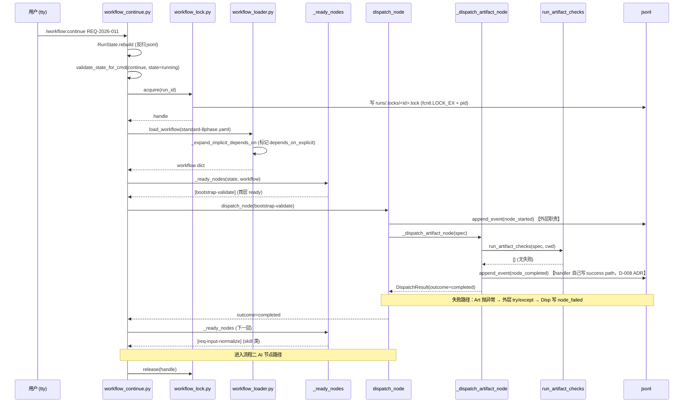
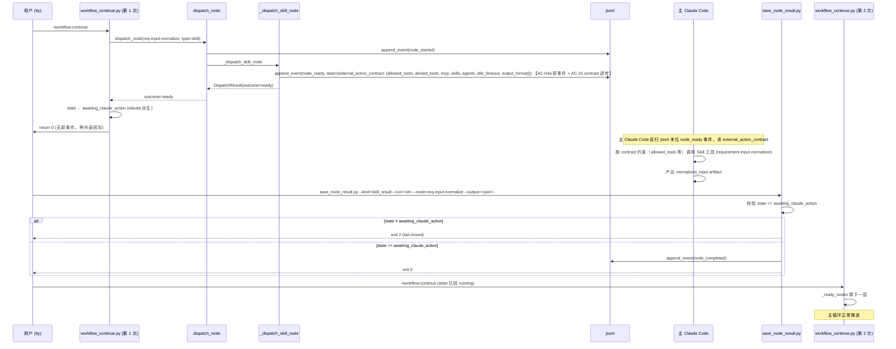
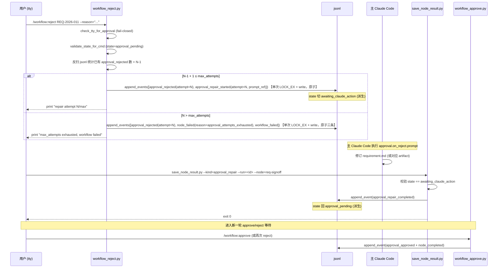
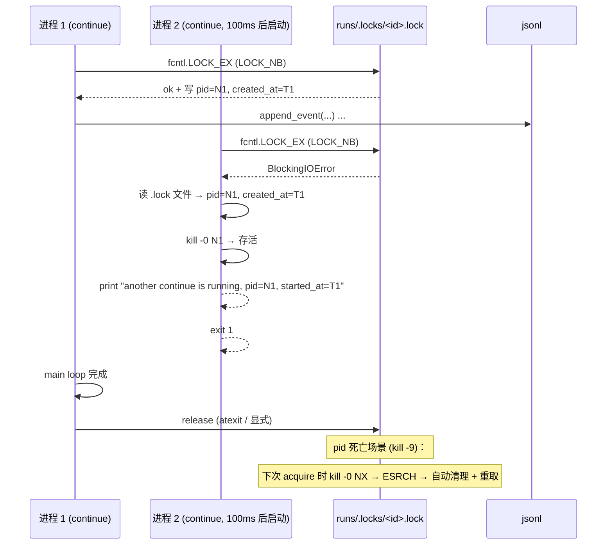
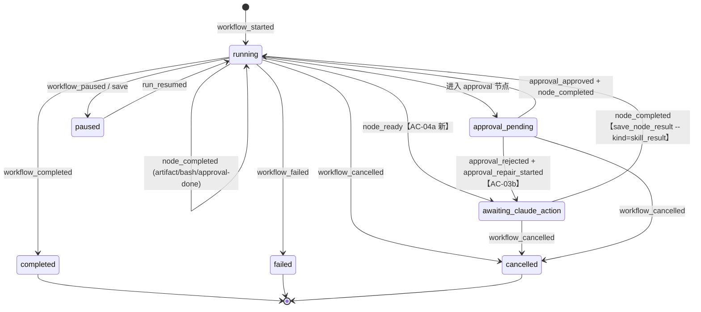
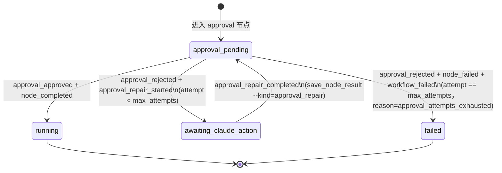

# REQ-2026-011 · 概要设计

> 仅覆盖架构 / 模块边界 / 技术选型 / 关键流程；接口签名 / 数据结构 / 错误码 / 测试用例归 detail-design 阶段。

## 架构方案

### 整体分层（基于已有 4 层结构定向补齐）

```
┌──────────────────────────────────────────────────────────────────────────┐
│ CLI Layer                                                                │
│ workflow_run / continue / approve / reject / status / save / cancel /    │
│ rollback / list   (9 命令；接 D-006 tty/hook 拦截 approve/reject)        │
└────────────────────────────────┬─────────────────────────────────────────┘
                                 │ ① validate_state_for_cmd (CMD_ALLOWED_STATES)
                                 ▼
┌──────────────────────────────────────────────────────────────────────────┐
│ State Layer                                                              │
│ run_state.py: VALID_EVENT_TYPES / WORKFLOW_EVENT_TO_STATE /              │
│               RunState.rebuild  (jsonl 反扫重建)                         │
│ workflow_state_validator.py: CMD_ALLOWED_STATES 9 命令 × N 状态矩阵      │
│ 【AC-04b 增量】新事件: node_ready/approval_repair_started/_completed     │
│ 【AC-04b 增量】新状态: awaiting_claude_action                            │
└────────────────────────────────┬─────────────────────────────────────────┘
                                 │ ② 取锁 (workflow_lock.py 新增)
                                 ▼
┌──────────────────────────────────────────────────────────────────────────┐
│ Lock Layer  【AC-05 新增】                                               │
│ workflow_lock.py: fcntl.LOCK_EX + pid 文件 + atexit + 失活 pid 自清理    │
│ 实锁 runs/.locks/<run-id>.lock；run_id 前缀 REQ- 时 acquire 期间按需      │
│ 创建 requirements/.locks/<req-id>.lock symlink → 实锁；release 不删 sym- │
│ link（dangling 容忍：下次 acquire 时用 os.path.lexists（不是 exists，    │
│ 后者对 dangling symlink 返 False） + os.readlink 一致性校验后 unlink     │
│ 重建）                                                                   │
└────────────────────────────────┬─────────────────────────────────────────┘
                                 │ ③ 加载 workflow yaml + DAG
                                 ▼
┌──────────────────────────────────────────────────────────────────────────┐
│ Loader Layer                                                             │
│ workflow_loader.py: load_workflow + topological_layers                   │
│ 【AC-01 增量】_expand_implicit_depends_on 内补 depends_on_explicit 标记  │
└────────────────────────────────┬─────────────────────────────────────────┘
                                 │ ④ 计算 ready 集合
                                 ▼
┌──────────────────────────────────────────────────────────────────────────┐
│ Scheduler Layer  【AC-01 新增 _ready_nodes，保留 _next_node 退化】       │
│ depends_on_explicit=True  → Kahn 拓扑层从已完成事件推算 ready 集         │
│ depends_on_explicit=False → 回落到 current_node.next 单链                │
│ 同层 ready 多节点：按 yaml 出现顺序串行派发（保 RunState 单 current_node)│
└────────────────────────────────┬─────────────────────────────────────────┘
                                 │ ⑤ dispatch_node
                                 ▼
┌──────────────────────────────────────────────────────────────────────────┐
│ Dispatcher Layer                                                         │
│ workflow_dispatcher.dispatch_node:                                       │
│   外层进入即写 node_started + 异常 try/except 转 node_failed             │
│   ├── agent (已) / skill (已) / prompt (已) / bash (已)                  │
│   ├── approval (已 + AC-03 闭环增强)                                     │
│   ├── loop (已 + AC-07 until_bash 增强)                                  │
│   ├── sub_workflow (已 + AC-08 父子回填)                                 │
│   └── artifact 【AC-02 第 8 类新增】 → run_artifact_checks 统一入口      │
│ 【AC-04a 增量】skill/prompt/agent 改写 node_ready，不直接写 node_completed│
└────────────┬─────────────────────────────────────────┬───────────────────┘
             │ 同进程内 outcome=completed/failed       │ outcome=ready (新)
             ▼                                         ▼
┌──────────────────────────┐    ┌────────────────────────────────────────┐
│ Persistence Layer        │    │ External Action Layer                  │
│ append_event → jsonl     │    │ 主 Claude Code 执行 skill/prompt/agent │
│ (fcntl.LOCK_EX 原子追加) │    │ 或 approval.on_reject.prompt 修订       │
└──────────────────────────┘    └────────────────┬───────────────────────┘
                                                 │ save_node_result.py CLI
                                                 │ 【AC-04a 新增模块】
                                                 ▼
                                ┌────────────────────────────────────────┐
                                │ save_node_result.py                    │
                                │ --kind=skill_result|approval_repair    │
                                │ fail-closed: state ≠ awaiting → exit 2 │
                                │ 写 node_completed / approval_repair_   │
                                │ completed → 状态回 running/approval_   │
                                │ pending                                │
                                └────────────────────────────────────────┘
```

### 数据流向

**正常路径**（用户 `/workflow:continue` → 节点闭环）：
1. CLI 读 `meta.yaml` + jsonl 反扫 → `RunState`（来源：scripts/lib/run_state.py:133）
2. `validate_state_for_cmd` 校验当前 state 允许执行 cmd（来源：scripts/lib/workflow_state_validator.py:43）
3. 取 path-lock（**AC-05 新**）
4. `load_workflow` 加载 yaml + `_expand_implicit_depends_on` 标记 `depends_on_explicit`（**AC-01 新**，来源：scripts/lib/workflow_loader.py:475）
5. `_ready_nodes` 算 ready 集合（**AC-01 新**；退化路径用 `_next_node`，来源：scripts/lib/workflow_scheduler.py:23）
6. `dispatch_node` 外层写 `node_started` → 按节点类型派发（来源：scripts/lib/workflow_dispatcher.py:128）
7. handler 写 `node_completed` / `node_ready`（**AC-04a 新事件**）→ 异常由外层转 `node_failed`
8. 主循环判断 outcome：completed → 进入下一轮 `_ready_nodes`；ready → return 等外部回写

**AI 节点外部回写路径**（**AC-04a/b 新增**）：
1. 主 Claude Code 在 `awaiting_claude_action` 状态下执行 skill/prompt/agent
2. 主 Claude Code 调 `save_node_result.py --kind=skill_result --run=<id> --node=<id>`
3. save_node_result 内部校验 state == `awaiting_claude_action`（fail-closed），写 `node_completed`
4. 下次 `/workflow:continue` → 主循环识别 state=`running` → 进入下一轮 `_ready_nodes`

**approval reject inline repair 路径**（**AC-03b 新增**）：
1. 用户 tty `/workflow:reject` → `workflow_reject.py` 调 `append_events(jsonl, [approval_rejected, approval_repair_started(attempt=N)])` 在**同一 fd + LOCK_EX + 单次 `os.write()` 多行 payload** 下原子写入两条事件（POSIX 4KB 内 write 原子，jsonl 两条事件远 < 1KB；杜绝两条之间中间态），state 切到 `awaiting_claude_action`（来源：requirements/REQ-2026-011/artifacts/requirement.md:59）
2. 主 Claude Code 执行 inline `approval.on_reject.prompt`（来源：.claude/workflows/requirement/standard-8phase.yaml:156）
3. 主 Claude Code 调 `save_node_result.py --kind=approval_repair` → 写 `approval_repair_completed` → state 回 `approval_pending`
4. 再次进入 approve/reject 等待循环；达 `max_attempts` 才 `node_failed + workflow_failed`

### 关键组件职责

| 组件 | 职责 | 引用 |
|---|---|---|
| **`_ready_nodes`** (新) | 计算当前 ready 集合：基于 `depends_on_explicit` 走 Kahn 拓扑或退化 next 链 | 来源：requirements/REQ-2026-011/artifacts/requirement.md:100 |
| **`_dispatch_artifact_node`** (新) | artifact 第 8 类 dispatcher；只调 `run_artifact_checks` 写 success path | 来源：scripts/lib/run_artifact_checks.py:145 |
| **`save_node_result.py`** (新) | 主 Claude Code 写 `node_completed/approval_repair_completed` 唯一入口；`--kind` 子模式分流；state fail-closed 校验 | 来源：requirements/REQ-2026-011/artifacts/requirement.md:103 |
| **`workflow_lock.py`** (新) | path-lock 三件套：fcntl.LOCK_EX + pid 文件 + atexit + 失活 pid 自清理 | 来源：requirements/REQ-2026-011/artifacts/requirement.md:92 |
| **`workflow_status.py` --verbose** (扩) | 树形输出 ready/running/blocked/paused + heartbeat + stale 检测 | 来源：requirements/REQ-2026-011/artifacts/requirement.md:106 |

## 模块划分

### 既有模块改造点（保持文件位置，新增功能切面）

| 模块 | 当前职责 | 本需求增量 | AC | 改造侵入度 |
|---|---|---|---|---|
| `scripts/lib/workflow_loader.py` | yaml schema 校验 + DAG 校验 + 隐式 depends_on 展开 | `_expand_implicit_depends_on` 内补 `depends_on_explicit: bool` 标记位（来源：scripts/lib/workflow_loader.py:475） | AC-01 | 低（10 行内） |
| `scripts/lib/workflow_continue.py` | jsonl 反扫 + main loop 7 outcome 派发（来源：scripts/lib/workflow_continue.py:48） | `_next_node` → `_ready_nodes` 升级 + awaiting 下只读 continue + `_finalize_after_rebuild_if_last_topology_node` 适配——**末节点判定方向**（v8 REV-007 P3 措辞修订；最终定稿见 detailed-design.md §3.6.3）：保留 `_next_node(last_visited) is None` 作 `depends_on_explicit=False` 退化分支；`depends_on_explicit=True` 走"全节点 ∈ SUCCESS_TERMINAL ({completed, skipped}) ∧ 不存在 failed ∧ _ready_nodes 为空"判定（**不再用"出度=0"** —— 该旧判定在多 sink DAG 下任一 sink 先完成会过早写 workflow_completed，详见 detail-design 修订记录 v4 P1-3）（IB-13 拆模块后 `_finalize_after_rebuild_if_last_topology_node` 移入；来源：scripts/lib/workflow_scheduler.py:293） | AC-01 / AC-04b | 中（主循环改写） |
| `scripts/lib/workflow_dispatcher.py` | 7 类节点派发 + 外层 node_started/failed 写入（来源：scripts/lib/workflow_dispatcher.py:128） | 第 8 类 artifact elif + AI 节点改写 `node_ready` 不再直接 `node_completed`（来源：scripts/lib/workflow_dispatcher.py:37） | AC-02 / AC-04a | 中 |
| `scripts/lib/workflow_approve.py` | 写 approval_approved + state 回 running（来源：scripts/lib/workflow_approve.py:64） | 追加写当前 approval 节点 `node_completed` + 推进下游 | AC-03a | 低 |
| `scripts/lib/workflow_reject.py` | 写 approval_rejected（来源：scripts/lib/workflow_reject.py:82） | 调新 `append_events` helper 原子写 `[approval_rejected, approval_repair_started(attempt=N)]` 两条 + state 切 awaiting + attempts 上限判定 | AC-03b/c | 中 |
| `scripts/lib/workflow_status.py` | 父子 run 树形 status 输出 | `--verbose` flag + heartbeat 写入 + 3 类 stuck 诊断 | AC-06 | 中 |
| `scripts/lib/run_state.py` | jsonl 反扫 + RunState.rebuild + VALID_EVENT_TYPES（来源：scripts/lib/run_state.py:54）；append_event 单条原子（来源：scripts/lib/run_state.py:288） | (1) 新增 `node_ready/approval_repair_started/approval_repair_completed` 进白名单 + rebuild 派生表（来源：scripts/lib/run_state.py:89）；(2) **新增 `append_events(jsonl_path, events: list[dict]) -> None`** helper：同一 fd + 单次 `fcntl.LOCK_EX` + 单次 `os.write()` 多行 payload 拼接（payload = `"\n".join(json.dumps(e))` 末尾加 `\n`），杜绝多条事件中间崩溃的 R-T03 风险（来源：requirements/REQ-2026-011/artifacts/tech-research.md:51）R-T03 根除方案；(3) `approval_rejected` rebuild handler 不再需要"前瞻一条"补救逻辑（`append_events` 已保证两条原子，要么都在要么都不在） | AC-04b / R-T03 | 中 |
| `scripts/lib/workflow_state_validator.py` | CMD_ALLOWED_STATES 9 命令 × N 状态矩阵（来源：scripts/lib/workflow_state_validator.py:29） | `awaiting_claude_action` 加入 continue/save/status/cancel/rollback 允许集 | AC-04b | 低 |
| `.claude/workflows/requirement/standard-8phase.yaml` | 8 阶段 workflow 模板 | line 57 `check_meta_schema.py` → `check_meta.py`（AC-02 附带修复，1 行）；line 156 `approval.on_reject` 字段语义不变，仅引擎侧理解形态调整（AC-03b，0 改动） | AC-02 / AC-03b | 低 |
| `scripts/lib/workflow_loader.py` (节点 schema) | 节点字段白名单（来源：scripts/lib/workflow_loader.py:400） | 接 `allowed_tools/denied_tools/mcp/skills/agents/idle_timeout/output_format` 7 字段 | AC-10 | 低 |
| launcher (workflow router) | 关键词派发 | 接 `difflib.get_close_matches` 编辑距离 ≤ 2 fuzzy；`workflow list --json` 输出 | AC-09 | 低 |

### 新增模块（2 个 .py 文件）

| 新模块 | 行数估算 | 职责 | 对外接口（轮廓） |
|---|---|---|---|
| `scripts/lib/save_node_result.py` | ~120 | 主 Claude Code 写 outcome 事件统一入口 | CLI: `--run --node --kind={skill_result\|approval_repair} --output=<json>`；fail-closed 状态校验；与 `save_review.py` schema 校验段有潜在重复——`save_review.py` 共 492 行 19 个函数，集中校验段约 30~60 行起自 `_validate_inputs`（来源：scripts/lib/save_review.py:275），detail-design 阶段（O-02）评估是否抽公共 helper |
| `scripts/lib/workflow_lock.py` | ~90 | path-lock 三件套封装 + 双轨 symlink | API: `acquire(run_id) -> LockHandle` / `release(handle)`；**双轨 symlink 策略**：requirement 类识别看 `run_id.startswith("REQ-")`（与 meta.yaml.id 命名约定一致，来源：requirements/REQ-2026-011/meta.yaml:2）；acquire 内按需 `os.symlink(实锁路径, requirements/.locks/<req-id>.lock)`，**存在性探测必须用 `os.path.lexists()` 或 `Path.is_symlink()`，不能用 `os.path.exists()` ——后者对 dangling symlink 返 False 会导致循环重建**；探测到则 `os.readlink()` 取 target 比对实锁路径，不一致则 `os.unlink()` 重建；release 仅释放 fcntl 不删 symlink（dangling 由下次 acquire 容忍）；CLI 无（库式调用） |

### 配置确认（不是新模块，仅审视既有文件）

- `.claude/hooks/pre-tool-use-guard.sh`：D-006 hook 拦截范围确认——确保 `save_node_result.py` 不被加入 approve/reject 拦截列表（来源：requirements/REQ-2026-011/artifacts/tech-research.md:60）R-I01；若已被误加，PR 同步修正；fail-closed 兜底由 CLI 内 state 校验承担。

### 模块依赖关系（无环）

```
CLI layer (workflow_continue/approve/reject/status/save/cancel/rollback/list)
   │
   ├──→ workflow_state_validator  ────────→ run_state (VALID_EVENT_TYPES + rebuild)
   │           ↓
   ├──→ workflow_lock (新)                       ↑
   │           ↓                                 │
   ├──→ workflow_loader (depends_on_explicit) ──→│ (loader 不依赖 run_state，
   │           ↓                                 │  反向只通过事件流)
   ├──→ workflow_continue (scheduler _ready_nodes)
   │           ↓
   └──→ workflow_dispatcher (8 类派发 + 外层 started/failed 写入)
               │
               ├──→ run_artifact_checks (已有，artifact 节点调用)
               │
               └──→ append_event → jsonl

save_node_result.py (独立 CLI，主 Claude Code 调用)
   │
   ├──→ workflow_state_validator (state == awaiting_claude_action 校验)
   └──→ append_event → jsonl
```

**对外接口（不写细节，留给 detail-design）**：
- CLI 接口稳定面：9 个 `/workflow:*` 命令 + `save_node_result.py` + `signoff` 路径；本期不破坏既有 CLI 签名。
- jsonl 事件 schema 稳定面：14 类既有事件保持兼容；本期新增 3 类（`node_ready/approval_repair_started/approval_repair_completed`），白名单扩展不删除既有。
- yaml workflow schema 稳定面：节点字段白名单新增 7 个 Claude 运行参数（AC-10），现有 yaml 兼容（缺省 = 不传）。

## 技术选型

### 选型一：DAG ready-node 计算算法

| 候选 | 描述 | 取舍 |
|---|---|---|
| A. 自实现 BFS 层级遍历 | 自写一遍 Kahn 算法 | ❌ 重复造轮子；现有 `topological_layers` 已是 Kahn 实现（来源：scripts/lib/topological_sort.py:25） |
| **B. 复用 `topological_layers`** | 调用已有函数，传入已完成节点集做过滤 | ✅ **选 B** |
| C. 引入 networkx | 第三方图库 | ❌ 新依赖、新学习成本；50 节点规模杀鸡用牛刀 |

**依据**：requirement.md 性能软约束 ≤ 50ms（来源：requirements/REQ-2026-011/artifacts/requirement.md:85）；50 节点 Kahn 实测 5~10ms（来源：requirements/REQ-2026-011/artifacts/tech-research.md:83）R-P01；零新依赖（来源：requirements/REQ-2026-011/artifacts/tech-research.md:14）「无新第三方库」+ （来源：requirements/REQ-2026-011/plan.md:108）D-006 Consequences。

### 选型二：path-lock 文件锁机制

| 候选 | 描述 | 取舍 |
|---|---|---|
| **A. `fcntl.LOCK_EX`** | POSIX 文件锁；现有 `append_event` 已用同一机制（来源：scripts/lib/run_state.py） | ✅ **选 A** |
| B. `portalocker` | 跨平台第三方锁库 | ❌ 新依赖；macOS/Linux fcntl 已经够用（来源：requirements/REQ-2026-011/artifacts/tech-research.md:51）R-T04 |
| C. `tempfile.NamedTemporaryFile` 锁 | 临时文件 + 探测存在 | ❌ 非原子，存在 TOCTOU 竞态 |

**依据**：D-003 ADR 已确认三件套（来源：requirements/REQ-2026-011/plan.md:74）；macOS Darwin 25.4 与 Linux fcntl flock 行为一致（来源：requirements/REQ-2026-011/artifacts/.rollback-20260513-112537/tech-research.md:140）。

### 选型三：AI 节点完成回写接口

| 候选 | 描述 | 取舍 |
|---|---|---|
| **A. 独立 `save_node_result.py`** | 新建模块，与 `save_review.py` 平级 | ✅ **选 A**（D-001 ADR） |
| B. 扩展 `save_review.py` 子命令 | 复用 review 入口 | ❌ 职责混淆；review 与 node result 是不同事件流 |
| C. 仅内部函数不暴露 CLI | 库式调用，主 Claude Code 通过 Python import | ❌ 主 Claude Code 倾向 CLI 子进程语义；shell 调用更显式 |

**依据**：D-001 ADR（来源：requirements/REQ-2026-011/plan.md:54）；与 `save_review.py` schema 校验代码可少量重复，detail-design 阶段评估是否抽 helper。

### 选型四：状态机扩展实现形态

| 候选 | 描述 | 取舍 |
|---|---|---|
| **A. 平铺 if/elif 扩展** | 在 `RunState.rebuild` 现有 if/elif 链上加 3 个新分支 | ✅ **选 A** |
| B. 抽 transition table 字典 | `{event: (from_state, to_state)}` 映射 | ❌ 现有 rebuild 不是纯 transition table（含 `node_started/completed` 这类不映射 state 的事件）；改造侵入度大 |
| C. State pattern 类继承 | 每个 state 一个 class | ❌ 过度工程化；状态总数 ≤ 10 不需要 |

**依据**：现有 rebuild 第 144~210 行是 if/elif 风格（来源：scripts/lib/run_state.py:133）；KISS 原则（CLAUDE.md §4）；扩展点确定（VALID_EVENT_TYPES + WORKFLOW_EVENT_TO_STATE 两个常量 + rebuild 内 3 处新分支）。

### 选型五：on_reject 事件流模型

| 候选 | 描述 | 取舍 |
|---|---|---|
| A. on_reject 视为独立 DAG node | reject 即写 approval 节点 `node_failed` + 跳到 on_reject node | ❌ DAG scheduler 把下游 permanently blocked |
| **B. inline repair 事件流** | `approval_rejected + approval_repair_started(attempt=N)` + state 切 awaiting | ✅ **选 B**（D-007 ADR） |
| C. 修订期间保持 approval_pending | save_node_result 例外放行 | ❌ 破坏 fail-closed 单一状态校验 |

**依据**：D-007 ADR（来源：requirements/REQ-2026-011/plan.md:114）；yaml 真实结构 `approval.on_reject.prompt` 不是独立 node（来源：.claude/workflows/requirement/standard-8phase.yaml:156）。

### 选型六：approval_repair 中间态归属

| 候选 | 描述 | 取舍 |
|---|---|---|
| **A. 复用 `awaiting_claude_action`** | AC-04 同款状态承载 skill 完成等待 + approval repair 等待 | ✅ **选 A** |
| B. 新增 `approval_repairing` | 独立状态，仅 `--kind=approval_repair` 在该状态合法 | ❌ 状态机维度膨胀，CMD_ALLOWED_STATES 多 1 列、rebuild 多 1 类映射 |
| C. 修订期间保持 `approval_pending` | save_node_result 例外放行 | ❌ 同选型五 C |

**依据**：D-007 决策附属项（来源：requirements/REQ-2026-011/artifacts/requirement.md:137）"approval_repair 中间态归属"；语义统一——"等主 Claude 完成外部动作 + 调 save_node_result" 即 `awaiting_claude_action` 的定义。

### 选型七：同层 ready 节点本期执行策略

| 候选 | 描述 | 取舍 |
|---|---|---|
| **a. 串行派发** | 按 yaml 出现顺序依次派发，保 `RunState` 单 `current_node` | ✅ **选 a**（D-006 ADR） |
| b. 并发派发 | `RunState.current_node` 集合化 + 事件交错 + TaskCreate 多通道 | ❌ 本期 scope 过大；列入 follow-up D-04 |
| c. 返回 ready 集合给 Claude Code 分批 | 引擎只识别，调用方决定派发 | ❌ 破坏引擎语义；调用方负担过重 |

**依据**：D-006 ADR（来源：requirements/REQ-2026-011/plan.md:104）；保持 REQ-010 main loop 兼容；并发能力拉 D-04 follow-up（来源：requirements/REQ-2026-011/artifacts/requirement.md:173）。

### 新依赖盘点

**本期不引入任何新外部依赖**。所有 8 个改造点均复用既有 stdlib（fcntl / os / subprocess / json / pathlib）+ 已有内部模块（topological_sort / run_state / common 等）。

## 关键流程

### 流程一：artifact 节点首派发（AC-01 + AC-02 P0 闭环）



### 流程二：AI 节点完成契约（AC-04a + AC-04b P1 核心）



**异常路径——awaiting 下 continue 只读语义**（AC-04b iii）：

```
用户在 awaiting_claude_action 下误调 /workflow:continue
  ↓
CLI 识别 state=awaiting_claude_action
  ↓
print "INFO: node <id> awaiting external save_node_result (kind=skill_result|approval_repair), no dispatch"
  ↓
return 0  (不写新事件、不派发、保持 idempotent)
```

### 流程三：approval reject inline repair 事件流（AC-03b P0 闭环）



### 流程四：path-lock 并发隔离（AC-05 P1）



### 状态流转图（拆为主状态机 + approval 子状态机两图）

**图 A · 主状态机**（workflow 级 + AI 节点完成契约）：



**图 B · approval 子状态机**（zoom-in：approve / reject inline repair / attempts 边界）：



**状态新增点（AC-04b）**：`awaiting_claude_action` 为新增状态，由 `node_ready` / `approval_repair_started` 两类事件触发；由 `node_completed` / `approval_repair_completed` / `workflow_cancelled` 退出。两图共享该状态——主状态机视角是"等 skill/prompt/agent 完成"，approval 子状态机视角是"等 inline repair 完成"。

### P2 四项嵌入点说明（不画完整时序，仅锚定融入位置）

**AC-07 `loop until_bash` + `max_iterations`**：嵌入 `_dispatch_loop_node` 第 386 行附近，扩展 `until_bash` 分支约 25 行：(1) 每轮 iteration_start 前跑 `subprocess.run(until_bash_cmd)`，exit=0 → 写 `loop_completed` 退出；exit≠0 → 写 `loop_iteration_started`；(2) iteration 次数达 `max_iterations` 时强制写 `loop_max_iterations_exceeded`。复用既有 `loop_iteration_started/completed/loop_completed/loop_max_iterations_exceeded` 事件，无新事件类型（来源：scripts/lib/run_state.py:70）。

**AC-08 sub_workflow 父子完成回填**：嵌入 `workflow_continue.py` main loop 的 `sub_workflow_pending` outcome 分支（与 REQ-010 已落地的 sub_workflow 派发对称）；新增轮询逻辑约 50 行：父 run 每次 continue 时反扫子 run 的 jsonl 末位事件——子 `workflow_completed/failed/cancelled` → 父写 `child_graceful_exited/child_failed/child_force_killed`（事件类型已在 VALID_EVENT_TYPES 中，来源：scripts/lib/run_state.py:80） + 父节点写 `node_completed/node_failed`；尊重 yaml `on_subworkflow_failure` 字段。

**AC-09 路由 fuzzy + `workflow list --json`**：嵌入 launcher（workflow router）层——`difflib.get_close_matches(query, registry_keys, n=1, cutoff=0.6)` 编辑距离 ≤ 2 接入约 20 行；fuzzy 词典硬编码 ≥ 10 词（涵盖 standard-8phase / code-review-embedded 等模板名常见拼写变体）。`workflow list --json` 在 `scripts/lib/workflow_list.py` 输出函数末尾加 `--json` flag，dump `json.dumps(list_result)` 约 30 行；不破坏现有 stdout 格式（默认仍为人类可读）。

**AC-10 Claude 运行参数白名单**：嵌入 `workflow_loader.py` 节点字段白名单（来源：scripts/lib/workflow_loader.py:400），追加 7 字段 `allowed_tools / denied_tools / mcp / skills / agents / idle_timeout / output_format`；**透传路径与 AC-04 外部执行模型对齐**——AI 节点（skill/prompt/agent）由 dispatcher 写 `node_ready` 后交主 Claude Code 执行（不再 subprocess 调 Claude，见流程二，line 302~），因此 7 字段不写入 subprocess 参数，而是写入 `node_ready` 事件的 `data.external_action_contract` 字典（contract 字段名 = 上述 7 个 yaml 字段名，1:1 透传，无重命名）；主 Claude Code 在主对话中执行该节点前通过反扫 jsonl（或 `/workflow:continue` 在 `awaiting_claude_action` 下的只读 INFO 输出）读取 contract 并消费；`save_node_result.py` 写 `node_completed` 时不消费这些字段，只记录 output 结果；现有 yaml 缺省 = 不传（contract 为空 dict，向后兼容）。

### 异常路径回退策略

| 异常 | 回退策略 | 引用 |
|---|---|---|
| **artifact 校验失败** | 外层 try/except 转 `node_failed`；DAG scheduler 把下游 permanently blocked 直到 retry/skip/abort 失败矩阵介入 | scripts/lib/workflow_dispatcher.py:156 |
| **save_node_result state 错** | fail-closed `exit 2` 拒绝写入；jsonl 不被污染 | requirements/REQ-2026-011/artifacts/requirement.md:104 |
| **path-lock 已被持有** | 第二进程 `exit 1` + 输出 pid/created_at 指引；jsonl 不会被并发写坏 | requirements/REQ-2026-011/artifacts/requirement.md:105 |
| **approval reject 两条事件中间 crash** | **不存在中间态**：`append_events` 在单次 `fcntl.LOCK_EX + os.write()` 下原子写多行 payload（来源：scripts/lib/run_state.py:288）单条 API 之上的批量扩展，write 系统调用前 crash → 两条都未写；write 之后 crash → 两条都已落盘；R-T03 风险根除（来源：requirements/REQ-2026-011/artifacts/tech-research.md:51）R-T03 |
| **approval reject 超 max_attempts** | 写 `node_failed + workflow_failed` reason=`approval_attempts_exhausted`；scheduler 不再推进下游 | requirements/REQ-2026-011/artifacts/requirement.md:102 |
| **path-lock pid 残留（kill -9）** | 下次取锁时 `kill -0 N → ESRCH` 自动清理 stale 锁 + 重取 | requirements/REQ-2026-011/artifacts/requirement.md:92 |

## 架构关注点与演化触发

这两条不是本期开发任务，而是 reviewer 提出的**长期架构隐患**（REV-REQ-2026-011-outline-design-002 + 003 architectural_concerns）——本期落地的设计选择给未来留了什么口子，何时该重新审视。明确"本期 baseline + 触发再评估阈值"避免知识丢失。

### AC-A1：`append_events` payload 长度上限

- **本期 baseline**：approval_rejected + approval_repair_started 两条事件 payload 总长 < 1KB（含 ts/run_id/node_id/data 等字段），远低于 POSIX `PIPE_BUF`（4096 B）保守上限。
- **风险**：Linux O_APPEND 对 regular file 的 write 原子性由 inode lock 保证（理论不受 4KB 限），但 macOS APFS / 其他 POSIX 实现不一定一致；跨平台保守取 4KB 作为"必定原子"的边界。未来若 `data` 字段携带大 payload（如 reject reason 含长文本、AI 节点 output 含大量上下文）单批 write 超过 4KB → 不再保证多行原子。
- **应对策略**（detail-design 阶段落地）：
  1. `append_events` 实现层加常量 `MAX_BATCH_PAYLOAD_BYTES = 4096`，写入前 `assert sum(len(p) for p in payloads) < MAX_BATCH_PAYLOAD_BYTES` 否则 raise `WorkflowError("batch payload exceeds atomic write limit")`；
  2. 调用方（如 `workflow_reject.py`）若 reject reason 过长，将全文落 separate 文件 `requirements/<id>/.reject-reasons/<attempt>.md`，jsonl 事件 `data` 仅记 sha256 + 前 N 字符摘要；
  3. micro-benchmark 跑一个 5KB payload 用例，断言 raise；跑一个 3.5KB 用例，断言成功并原子。
- **触发再决策阈值**：当调用方反馈"频繁触发 4KB 上限"或新事件类型设计需携大 payload → 触发 ADR 评估是否切换到"两阶段写"模式（先写一个 manifest 事件指向 separate 文件，再写最终事件）。

### AC-A2：`save_node_result.py --kind` 字符串枚举的演化路径

- **本期 baseline**：`--kind ∈ {skill_result, approval_repair}` 两个枚举值，对应两条事件 `node_completed` / `approval_repair_completed`；状态机层共享同一个 `awaiting_claude_action` 状态（D-007 复用决策）降低维度膨胀。
- **风险**：若未来出现第三类 awaiting 场景（AI loop 等待外部输入 / interactive gate / human-in-the-loop 子步骤），`--kind` 集合会无序扩张，导致：
  1. `save_node_result.py` 内部分支逻辑随 kind 数线性膨胀；
  2. 反扫 jsonl 时根据"末位 node_ready 还是末位 approval_repair_started"判定语义会变得脆弱；
  3. CMD_ALLOWED_STATES 矩阵需要为每个 kind 单独裁剪允许集（如某些 kind 不应允许 cancel）。
- **应对策略**（不在本期实施）：
  1. 当 `--kind` 枚举值 ≥ 3 **且** 分支逻辑差异 > 30% LoC（用 cyclomatic 复杂度估算），触发 ADR 评估是否拆为：(a) 子状态字段 `awaiting_kind ∈ {skill / approval_repair / loop_input / ...}` 进 RunState，每个子状态有独立 `CMD_ALLOWED_STATES` 行；(b) 或保持 kind 枚举但抽 `KindHandler` 类做分支封装；
  2. 当前两类的事件命名（`node_ready` vs `approval_repair_started`）已隐含子状态信息，未来迁移子状态字段时不破坏 jsonl schema。
- **触发再决策阈值**：第三类 awaiting 场景出现在某个 AC 草案中（不论本期还是后续需求）→ 触发 ADR 评估。

### AC-A3：AC-10 contract 消费"末位 node_ready"的歧义（REV-003 suggestion）

- **本期 baseline**：主 Claude Code 反扫 jsonl 末位 node_ready 事件取 `data.external_action_contract`。当前 `awaiting_claude_action` 状态下保证 node_ready 是末位。
- **风险**：若 O-01 决策为"独立 heartbeat 事件"方案，未来 heartbeat 可能写在 node_ready 之后变成新末位，反扫"末位"语义歧义。
- **应对策略**：detail-design 阶段定 O-01 时同步明确——AC-10 contract 反扫的是"**末位类型为 node_ready 的事件**"（按事件类型过滤后取最后一条），而非字面意义的最末位事件。

## 待澄清清单

| ID | 项 | 处理阶段 |
|---|---|---|
| D-02 | approval `max_attempts` 默认值（暂用 3） | detail-design 阶段定稿 |
| D-03 | stale 阈值默认 N 分钟（候选 15/30/60） | detail-design 阶段定稿 |
| D-04 | 同层 ready 节点并发派发 | follow-up 独立需求 |
| O-01 | heartbeat 事件 vs 复用 `last_event_ts` 字段（与 AC-A3 联动：选定后明确"末位 node_ready" 语义） | detail-design 阶段定稿（来源：requirements/REQ-2026-011/artifacts/tech-research.md:173）待澄清清单 #3 |
| O-02 | `save_node_result.py` 与 `save_review.py` 是否抽 helper | detail-design 阶段评估（来源：requirements/REQ-2026-011/plan.md:58）D-001 Consequences |
| O-03 | `_ready_nodes` 是否增量计算（传入已完成节点集） | detail-design 阶段定（性能软约束 ≤ 50ms） |
| O-04 | AC-A1 `append_events` 4KB 上限的实现层断言 + reject reason 落 separate 文件策略 | detail-design 阶段落地（本期 baseline 远低于上限不阻塞） |
| O-05 | AC-A2 `--kind` 枚举演化触发阈值（kind ≥ 3 且分支 LoC 差异 > 30%） | follow-up 触发时评估，非本期 |
