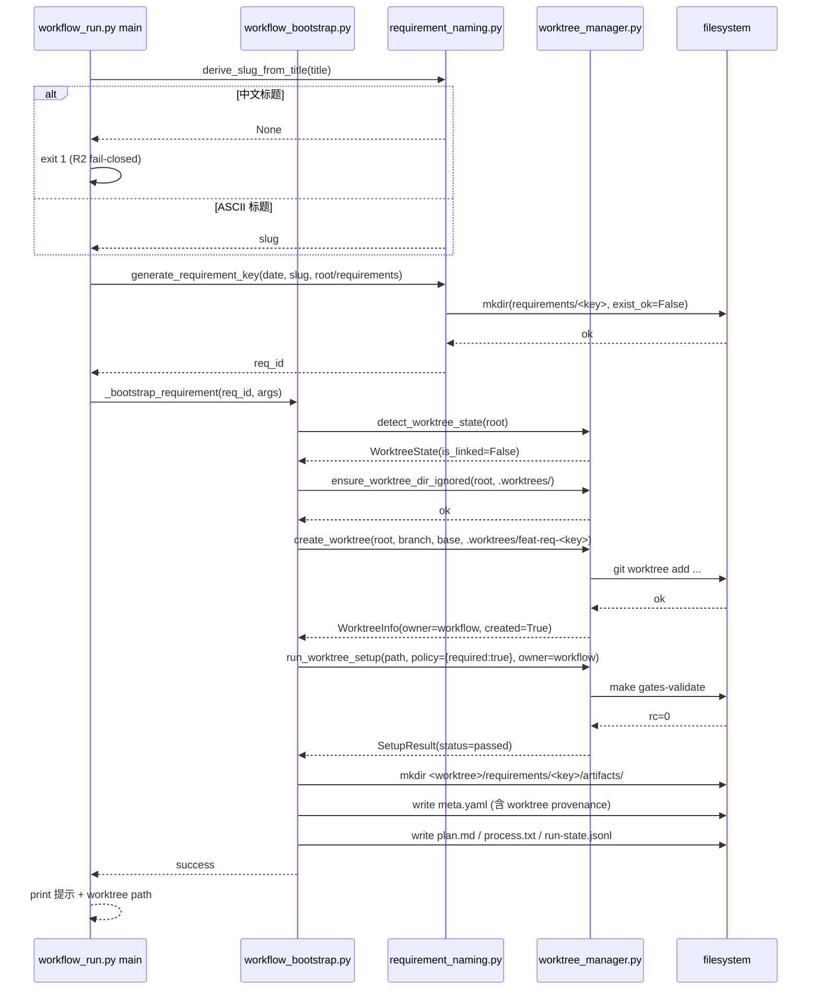
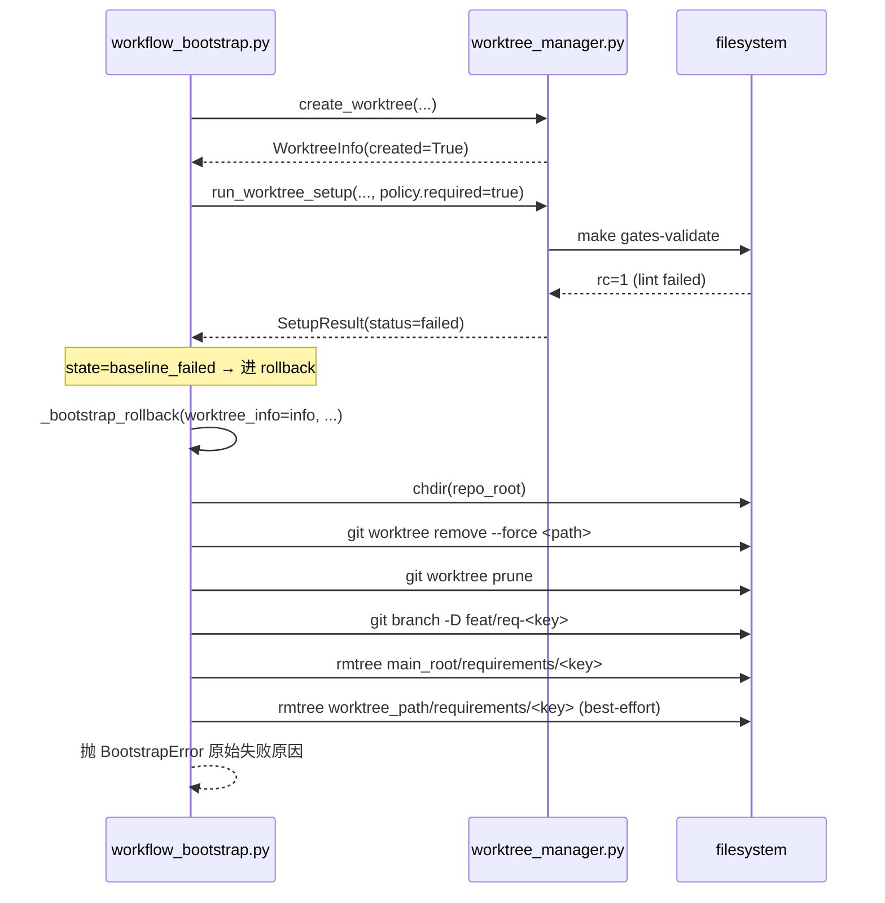
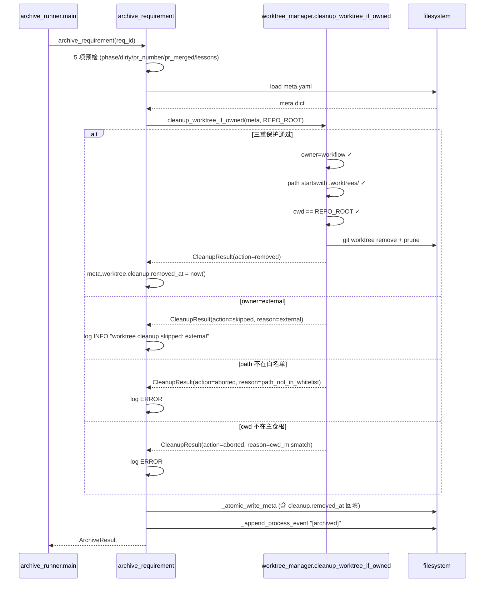

# REQ-2026-014 · 详细设计

> 覆盖 10 feature 的接口签名 / 数据契约 / 状态机 / 时序图 / 测试骨架 / OD-1~OD-4 闭环。
> 设计单源：context/team/engineering-spec/specs/2026-05-17-worktree-isolation-migration-design.md v0.2（来源：requirements/REQ-2026-014/notes.md:1）；本文档对照抽取 + 补缺口。

## 1. 设计概览

### 1.1 10 feature ID 映射（与 features.json + outline-design §模块划分对齐）

| feature_id | 范围 | kind | complexity |
|---|---|---|---|
| **F-001** | scripts/lib/requirement_naming.py 新建 | code | medium |
| **F-002** | scripts/lib/worktree_manager.py 新建 + 集成 bats | code | heavy |
| **F-003** | scripts/lib/workflow_run.py 改造（_generate_req_id + 3 参数） | code | light |
| **F-004** | scripts/lib/workflow_bootstrap.py 改造（worktree-first + rollback） | code | heavy |
| **F-005** | scripts/lib/archive_runner.py 改造（cleanup 注入） | code | light |
| **F-006** | .claude/workflows/requirement/standard-8phase.yaml worktree 配置组 | config | trivial |
| **F-007** | .gitignore 追加 .worktrees/ | config | trivial |
| **F-008** | templates/meta.yaml.tmpl worktree 段占位 | config | light |
| **F-009** | submit.md + archive.md 文档同步 | docs | trivial |
| **F-010** | context/team/engineering-spec/meta-schema.yaml worktree 扩展 | config | light |

ID 命名遵循 features-schema.yaml 强制 `^F-\d{3}$`（来源：context/team/engineering-spec/features-schema.yaml:57）。所有引用从 outline-design 模块清单（来源：requirements/REQ-2026-014/artifacts/outline-design.md:142）一一对应换算。

### 1.2 ADR 引用全集（D-001~D-015 + OD-1~OD-4 落点）

| ADR | 决策摘要 | 落地 feature | 实现位置 |
|---|---|---|---|
| D-001 | worktree 粒度 = requirement run（来源：context/team/engineering-spec/specs/2026-05-17-worktree-isolation-migration-design.md:91） | F-002 / F-004 | 一个 REQ ↔ 一个 worktree 目录与分支 |
| D-002 | requirement workflow 默认启用 worktree（来源：context/team/engineering-spec/specs/2026-05-17-worktree-isolation-migration-design.md:92） | F-006 | yaml.worktree.enabled=true 默认值 |
| D-003 | 默认目录 `.worktrees/`（来源：context/team/engineering-spec/specs/2026-05-17-worktree-isolation-migration-design.md:93） | F-006 / F-007 | yaml.worktree.location=.worktrees + .gitignore |
| D-004 | linked worktree 内运行复用（来源：context/team/engineering-spec/specs/2026-05-17-worktree-isolation-migration-design.md:94） | F-002 / F-004 | detect_worktree_state + bind_current 分支 |
| D-005 | 脚本层 fallback 用 git worktree（来源：context/team/engineering-spec/specs/2026-05-17-worktree-isolation-migration-design.md:95） | F-002 | create_worktree 调 git 子命令 |
| D-006 | worktree provenance 写入 meta.yaml（来源：context/team/engineering-spec/specs/2026-05-17-worktree-isolation-migration-design.md:96） | F-008 / F-010 | meta.yaml.worktree 段 + schema 扩展 |
| D-007 | submit 后不清理（来源：context/team/engineering-spec/specs/2026-05-17-worktree-isolation-migration-design.md:97） | F-009 | submit.md 提示文案 |
| D-008 | archive / discard 才清理 owned worktree（来源：context/team/engineering-spec/specs/2026-05-17-worktree-isolation-migration-design.md:98） | F-005 | archive_requirement 内置 cleanup |
| D-009 | 清理从主仓根执行（来源：context/team/engineering-spec/specs/2026-05-17-worktree-isolation-migration-design.md:99） | F-005 | cleanup_worktree_if_owned cwd 校验 |
| D-010 | ignore 校验 fail-closed（来源：context/team/engineering-spec/specs/2026-05-17-worktree-isolation-migration-design.md:100） | F-002 | ensure_worktree_dir_ignored 缺则抛 |
| D-011 | baseline 用轻量命令（来源：context/team/engineering-spec/specs/2026-05-17-worktree-isolation-migration-design.md:101） | F-002 / F-006 | make gates-validate 作 default |
| D-012 | --no-worktree 显式逃生（来源：context/team/engineering-spec/specs/2026-05-17-worktree-isolation-migration-design.md:102） | F-003 | workflow_run.py 参数解析 |
| D-013 | requirement key 改 YYYYMMDD-<slug>（来源：context/team/engineering-spec/specs/2026-05-17-worktree-isolation-migration-design.md:103） | F-001 / F-003 | generate_requirement_key + workflow_run 替换 |
| D-014 | REQ-YYYY-NNN legacy 兼容（来源：context/team/engineering-spec/specs/2026-05-17-worktree-isolation-migration-design.md:104） | F-001 | is_legacy_requirement_key + branch_for_requirement_key 双兼容 |
| D-015 | 分支保持 feat/req-<key> 前缀（来源：context/team/engineering-spec/specs/2026-05-17-worktree-isolation-migration-design.md:105） | F-001 | branch_for_requirement_key 统一 |
| **OD-1** | worktree_manager 与 requirement_naming 解耦（来源：requirements/REQ-2026-014/artifacts/outline-design.md:499） | F-002 / F-004 | worktree_manager.py 不 import requirement_naming；workflow_bootstrap 作汇合点 |
| **OD-2** | baseline.required → state 落点（来源：requirements/REQ-2026-014/artifacts/outline-design.md:507） | F-002 / F-006 | required=true 失败落 baseline_failed；required=false 失败落 active + status=failed |
| **OD-3** | cleanup.policy 本期占位不消费（来源：requirements/REQ-2026-014/artifacts/outline-design.md:514） | F-005 / F-008 / F-010 | 模板留字段 + archive_runner 不读 + schema optional |
| **OD-4** | external 路径始终跳过 baseline（来源：requirements/REQ-2026-014/artifacts/outline-design.md:521） | F-002 | run_worktree_setup owner=external 短路 |

### 1.3 commit / PR 拆分与依赖图

10 feature 拆 10 个独立 commit，同一 PR 内顺序提交（来源：requirements/REQ-2026-014/plan.md）依 D-000「设计稿先行 → 阶段并行压缩」决策：

```
F-001 ──┐
F-002 ──┤
F-007 ──┤
        ├──► F-003 ──┐
F-008 ──┤            │
        │            ├──► F-004 ──► F-006
        │            │
        └────────────┴──► F-005 ──► F-009
                          │
F-008 ──────────────────► F-010
```

依赖语义详见 `features.json` 各 feature `depends_on_features` 字段（来源：requirements/REQ-2026-014/artifacts/features.json）。提交顺序建议：F-001 / F-002 / F-007 / F-008 / F-010（叶子 + 浅层）→ F-003 / F-005（接入）→ F-004（重头戏）→ F-006 / F-009（收尾）。

### 1.4 工作量分布

按 features.json `estimate_days` 字段汇总：

| feature | estimate_days |
|---|---|
| F-001 | 1.25 |
| F-002 | 2.50 |
| F-003 | 0.50 |
| F-004 | 1.25 |
| F-005 | 0.625 |
| F-006 | 0.125 |
| F-007 | 0.0625 |
| F-008 | 0.125 |
| F-009 | 0.25 |
| F-010 | 0.25 |
| **合计** | **6.94 人天** |

与 tech-feasibility §5（来源：requirements/REQ-2026-014/artifacts/tech-feasibility.md:159）汇总值 8.5 人天 的差额（≈ 1.5 人天）落在「设计 + 集成测试 + 文档」横切，不绑定某个 feature_id。

---

## 2. 跨模块数据契约

> 多 feature 共用的字段 / 状态机 / 枚举在此章定义，避免在各 feature 段重复。

### 2.1 `meta.yaml.worktree` 段 schema

应用于 F-008（模板）+ F-010（schema 校验）。结构（来源：context/team/engineering-spec/specs/2026-05-17-worktree-isolation-migration-design.md:311）：

```yaml
worktree:
  enabled: true                          # bool；缺字段视同 false（legacy 兼容）
  owner: workflow                        # enum: workflow | external | none
  path: .worktrees/feat-req-20260518-foo # 主仓根相对路径
  absolute_path: /abs/.../.worktrees/feat-req-20260518-foo
  branch: feat/req-20260518-foo
  base_branch: develop
  created_at: "2026-05-18 09:50:00"
  baseline:
    command: make gates-validate
    status: passed                        # enum: passed | failed | skipped
    completed_at: "2026-05-18 09:50:15"
  cleanup:
    policy: owned-only                    # enum: owned-only | never；OD-3 本期不消费
    removed_at: null                      # archive 删除时回填
```

字段属性表：

| 字段路径 | 类型 | required | enum / 约束 | 默认 | 落地 feature |
|---|---|---|---|---|---|
| `worktree.enabled` | bool | optional | — | false（缺字段） | F-008 |
| `worktree.owner` | enum | optional | workflow / external / none | none | F-008 / F-010 |
| `worktree.path` | string | optional | 主仓根相对 | "" | F-008 |
| `worktree.branch` | string | optional | 含 feat/req- 前缀 | "" | F-008 |
| `worktree.baseline.status` | enum | optional | passed / failed / skipped | skipped（owner=external 时） | F-008 / F-010 |
| `worktree.cleanup.policy` | enum | optional | owned-only / never | owned-only | F-008 / F-010（OD-3 不消费） |

**legacy 兼容（D-014）**：旧 REQ-YYYY-NNN 需求的 meta.yaml 缺 worktree 段时，所有读取点用 `meta.get("worktree", {})` 防御性取（来源：requirements/REQ-2026-014/artifacts/tech-feasibility.md:144），等价于 enabled=false。

### 2.2 `yaml.worktree` 段 schema（standard-8phase.yaml 顶层）

应用于 F-006。结构（来源：context/team/engineering-spec/specs/2026-05-17-worktree-isolation-migration-design.md:357）：

```yaml
worktree:
  enabled: true                  # bool
  policy: auto                   # enum: auto | never | require | current
  location: .worktrees           # 主仓根相对目录
  setup:
    baseline:
      command: make gates-validate
      required: true             # bool；OD-2 决定 baseline 失败时的 state 落点
```

policy 枚举行为表（来源：context/team/engineering-spec/specs/2026-05-17-worktree-isolation-migration-design.md:370）：

| policy | 普通 repo 行为 | 在 linked worktree 内行为 | F-004 处理 |
|---|---|---|---|
| `auto`（默认） | 创建 worktree | 复用当前 | 走完整 detect → create / bind 分支 |
| `never` | 沿用当前分支 | 沿用当前分支 | 跳过 worktree_manager，回退 _checkout_feature_branch 旧路径 |
| `require` | 必须创建；失败 exit 1 | 复用当前 | create_worktree 失败抛 BootstrapError 不回退 |
| `current` | exit 1 + 提示 cd | 复用当前 | detect_worktree_state.is_linked_worktree=false 时 fail-closed |

`policy=current` fail-closed 提示文案（来源：requirements/REQ-2026-014/artifacts/tech-feasibility.md:98）：`worktree policy=current 要求在 linked worktree 中运行，当前在 normal repo；请先 cd 到 .worktrees/feat-req-<key> 目录后重试`。

### 2.3 状态机：`worktree.state` 主状态机

应用于 F-002（lib 内部状态）+ F-004（bootstrap 写入）+ F-005（archive 读取）。状态枚举：

| state | 语义 | 写入触发 | 读取触发 |
|---|---|---|---|
| `pending` | worktree 路径已选未创建 | F-004 步骤 1 完成 key 解析 | — |
| `creating` | git worktree add 进行中 | F-004 调 create_worktree 之前 | rollback 路径 |
| `active` | worktree 已创建，baseline 通过或跳过 | F-004 步骤 8 成功 | F-005 cleanup 入口 |
| `baseline_failed` | baseline 强制失败（yaml.required=true） | F-002 run_worktree_setup 解析 rc!=0 + required=true | F-004 rollback 入口 |
| `cleanup_pending` | archive 入口已读 meta，cleanup 未发生 | F-005 archive_requirement 5 项预检后 | — |
| `cleaned` | git worktree remove 成功 + meta.cleanup.removed_at 回填 | F-005 cleanup 成功 | — |

转移图，在 outline-design.md 主状态机基础上补 baseline_failed 回边（来源：requirements/REQ-2026-014/artifacts/outline-design.md:369）：

```text
            ┌─────────────────────────────────────────┐
            │                                          │
            ▼                                          │
[pending] ──► [creating] ──► [active] ──► [cleanup_pending] ──► [cleaned]
                  │              ▲
                  ▼              │
            [baseline_failed] ◀──┘ retry
                  │
                  ▼ (rollback)
            ⊥ (rolled back, no state recorded)
```

OD-2 落点：`yaml.worktree.setup.baseline.required=true` ⇒ baseline 失败时落 `baseline_failed`（exit 1，rollback 触发）；`required=false` ⇒ baseline 失败时落 `active` + `meta.worktree.baseline.status=failed`（exit 0，warning 但不终止）。

### 2.4 状态机：bootstrap policy 决策子状态机

应用于 F-004。输入：(policy, detect_worktree_state.is_linked_worktree, base_repo_dirty)；输出：decision ∈ {create_new, bind_current, skip, abort}。

| policy | is_linked | dirty | decision | feature 落点 |
|---|---|---|---|---|
| auto | false | clean | create_new | F-004 主路径 |
| auto | true | — | bind_current | F-004 D-004 路径 |
| auto | false | dirty (external) | abort（fail-closed） | F-002 detect + F-004 校验 |
| never | — | — | skip（_checkout_feature_branch 旧路径） | F-004 兼容分支 |
| require | false | clean | create_new；失败 abort | F-004 主路径 + 无 rollback fallback |
| require | true | — | bind_current | F-004 D-004 路径 |
| current | false | — | abort（exit 1） | F-002 detect + F-004 prompt |
| current | true | — | bind_current | F-004 D-004 路径 |

dirty 判定：`git status --porcelain` 非空，但 .worktrees/ 与 .claude/ 前缀的 untracked 路径白名单豁免（来源：requirements/REQ-2026-014/artifacts/tech-feasibility.md:104）。

---

## 3. 模块详细设计

> 按 feature_id 升序拆分。每段含：改造点定位 / 公开签名 / 关键实现 / 测试骨架。

### 3.1 F-001 · requirement_naming.py 新建

**新建文件**：`scripts/lib/requirement_naming.py`（≈ 150 行，标准库 only）。

**公开签名**（落地 spec §5.1 表，来源：context/team/engineering-spec/specs/2026-05-17-worktree-isolation-migration-design.md:275）：

```python
"""requirement key 命名规则的单一入口。

D-013：新格式 YYYYMMDD-<slug>，目录名自解释。
D-014：legacy REQ-YYYY-NNN 仍兼容；本模块同时处理两类 key。
D-015：分支统一 feat/req-<key>。
本模块不引用 worktree_manager 与其他 lib（叶子节点；OD-1 默认锁死）。
"""

from __future__ import annotations
import re
from dataclasses import dataclass
from datetime import date
from pathlib import Path

# 正则：复用 workflow_run._REQ_ID_PATTERN 语义（来源：scripts/lib/workflow_run.py:31）
_LEGACY_REQUIREMENT_KEY_RE = re.compile(r"^REQ-(\d{4})-(\d{3})$")
_NEW_REQUIREMENT_KEY_RE = re.compile(r"^(\d{8})-([a-z0-9]+(?:-[a-z0-9]+)*)(?:-(\d{2}))?$")
_SLUG_CHARSET_RE = re.compile(r"^[a-z0-9]+(?:-[a-z0-9]+)*$")
_SLUG_DERIVE_FROM_TITLE_RE = re.compile(r"^[\x20-\x7e]+$")  # 仅 ASCII 标题派生


class SlugError(ValueError):
    """slug 非法（非 ASCII / 非法字符 / 长度超限）。CLI 层捕获后 fail-closed exit 1。"""


def normalize_slug(raw: str) -> str:
    """规范化 ASCII slug：lower + 空白/下划线 → 连字符 + 字符集校验。

    入参：任意字符串
    返回：合法 slug
    异常：SlugError（非 ASCII / 空串 / 全连字符 / 长度 > 64）
    """


def derive_slug_from_title(title: str) -> str | None:
    """从 ASCII 标题派生 slug；中文 / 非 ASCII 标题返回 None。

    None 语义：CLI 层 fail-closed（来源：requirements/REQ-2026-014/artifacts/tech-feasibility.md:139 R2），
    要求用户显式 --slug。
    """


def generate_requirement_key(
    date_obj: date,
    slug: str,
    requirements_root: Path,
) -> str:
    """生成 YYYYMMDD-<slug>；同日同 slug 第二个落 -02 后缀。

    并发安全：与 _generate_req_id 一致（来源：scripts/lib/workflow_run.py:132），
    用原子 mkdir(exist_ok=False) 探测 + 递增重试。
    超出 -99 后缀抛 SlugError。
    """


def is_legacy_requirement_key(key: str) -> bool:
    """识别 REQ-YYYY-NNN 旧格式（D-014）。"""


def branch_for_requirement_key(key: str) -> str:
    """两种 key 统一生成 feat/req-<key>（去掉 REQ- 前缀对齐 _strip_req_prefix
    （来源：scripts/lib/workflow_bootstrap.py:77））。"""


def directory_for_requirement_key(key: str) -> Path:
    """两种 key 统一映射 requirements/<key>（同 key 字符串）。"""
```

**关键实现要点**：
- `normalize_slug`：lower → `re.sub(r"[\s_]+", "-", s)` → 字符集校验；空 / 全连字符 / 长度 > 64 抛 SlugError
- `derive_slug_from_title`：title 含非 ASCII 字符即返回 None，不走 pinyin / slugify 第三方库（来源：requirements/REQ-2026-014/artifacts/tech-feasibility.md:18）
- `generate_requirement_key`：候选 key = `f"{date_obj.strftime('%Y%m%d')}-{slug}"`；EEXIST 时递增到 `-02`、`-03`...；超 `-99` 后缀抛
- `is_legacy_requirement_key`：`bool(_LEGACY_REQUIREMENT_KEY_RE.match(key))`
- `branch_for_requirement_key`：legacy → `feat/req-{year}-{nnn}` 小写；新 key → `feat/req-{key}` 直接拼

**测试骨架**（`tests/lib/test_requirement_naming.py` ≈ 11 用例）：

```python
def test_normalize_slug_lowercase_and_hyphenate(): ...
def test_normalize_slug_rejects_non_ascii(): ...
def test_normalize_slug_rejects_empty(): ...
def test_derive_slug_from_title_chinese_returns_none(): ...
def test_derive_slug_from_title_ascii_lowercased(): ...
def test_generate_requirement_key_basic(tmp_path): ...
def test_generate_requirement_key_collision_appends_02(tmp_path): ...
def test_generate_requirement_key_overflow_after_99(tmp_path): ...
def test_is_legacy_requirement_key_recognizes_req_2026_014(): ...
def test_branch_for_requirement_key_legacy_and_new(): ...
def test_directory_for_requirement_key_returns_path_under_requirements(): ...
```

### 3.2 F-002 · worktree_manager.py 新建

**新建文件**：`scripts/lib/worktree_manager.py`（≈ 250 行，标准库 only，subprocess + pathlib）。

**dataclass 定义**（来源：context/team/engineering-spec/specs/2026-05-17-worktree-isolation-migration-design.md:286）：

```python
from dataclasses import dataclass
from pathlib import Path
from typing import Literal


@dataclass(frozen=True)
class WorktreeState:
    is_git_repo: bool
    is_linked_worktree: bool
    is_submodule: bool
    is_detached: bool
    branch: str                 # 空串若 detached
    worktree_path: Path
    git_dir: Path               # 来自 git rev-parse --git-dir
    git_common_dir: Path        # 来自 git rev-parse --git-common-dir


@dataclass(frozen=True)
class WorktreeInfo:
    path: Path
    branch: str
    base_branch: str
    owner: Literal["workflow", "external", "none"]
    created: bool               # 本次调用是否新建（vs. 复用）
```

**公开签名**：

```python
def detect_worktree_state(repo_root: Path) -> WorktreeState:
    """探测 repo_root 的 git 拓扑状态。

    判定逻辑（来源：context/team/engineering-spec/specs/2026-05-17-worktree-isolation-migration-design.md:225）：
      git_dir != git_common_dir 且 git_dir 不含 '/modules/' 路径 → linked worktree
      git_dir 含 '/modules/' → submodule
      symbolic-ref HEAD 失败 → detached
    异常：所有 subprocess 失败包装为 BootstrapError；本函数不抛裸 OSError。
    """


def select_worktree_location(
    repo_root: Path,
    branch: str,
    preference: str = ".worktrees",
) -> Path:
    """按优先级选 worktree 目录：preference 相对主仓根（默认 .worktrees/）。

    返回：repo_root / preference / branch.replace('/', '-')
    """


def ensure_worktree_dir_ignored(repo_root: Path, location: Path) -> None:
    """校验 location 已被 .gitignore（D-010 fail-closed）。

    实现：读 .gitignore 行扫描，命中即返回；否则抛 BootstrapError
    （提示用户先 commit F-007 .gitignore 改动）。
    """


def create_worktree(
    repo_root: Path,
    branch: str,
    base_branch: str,
    location: Path,
) -> WorktreeInfo:
    """执行 git worktree add <location> -b <branch> <base_branch>。

    异常：rc!=0 抛 BootstrapError（消息含 stderr trim）；
         FileExistsError 抛 BootstrapError（worktree 已存在，需先 prune）。
    返回 WorktreeInfo(owner='workflow', created=True)。
    """


def run_worktree_setup(
    worktree_path: Path,
    policy: dict,
    *,
    owner: str,
) -> "SetupResult":
    """在 worktree 内执行 baseline。

    OD-4 落点：owner='external' 短路返回 SetupResult(status='skipped')，
    不读 policy.required 字段（来源：requirements/REQ-2026-014/artifacts/outline-design.md:521）。

    OD-2 落点：
      owner='workflow' + rc==0 → SetupResult(status='passed')
      owner='workflow' + rc!=0 + policy.required=true → SetupResult(status='failed')，
        调用方（F-004）据此落 worktree.state=baseline_failed + abort
      owner='workflow' + rc!=0 + policy.required=false → SetupResult(status='failed') + warning，
        调用方落 active + baseline.status=failed + 继续

    环境变量：必要时透传 CLAUDE_GATES_AUDIT_ROOT（来源：requirements/REQ-2026-014/artifacts/tech-feasibility.md:129）。
    """


def resolve_main_repo_root(worktree_path: Path) -> Path:
    """从 worktree 路径找主仓根。

    实现：在 worktree_path 下 git rev-parse --show-toplevel + --git-common-dir，
    common-dir 的 parent 即主仓根。失败抛 BootstrapError。
    """


def cleanup_worktree_if_owned(meta: dict, repo_root: Path) -> "CleanupResult":
    """三重保护清理 worktree（D-008 / D-009）。

    保护 1：meta.worktree.owner == 'workflow'（owner=external 返回 CleanupResult(action='skipped', reason='external')）
    保护 2：meta.worktree.path 必须 startswith 'worktree.location'（默认 .worktrees/）
    保护 3：cwd 必须 == repo_root（主仓根；防止 worktree 内 self-remove）

    任一保护失败 → CleanupResult(action='skipped' | 'aborted'); 不抛异常；
    成功 → 调 git worktree remove <path> + git worktree prune；
    git 失败 → CleanupResult(action='failed') + log ERROR；不影响 archive 主流程。

    meta 缺 worktree 字段 → CleanupResult(action='skipped', reason='legacy_no_worktree_field')。
    """
```

**数据结构** `SetupResult` 与 `CleanupResult`：

```python
@dataclass(frozen=True)
class SetupResult:
    status: Literal["passed", "failed", "skipped"]
    rc: int
    duration_ms: int
    log_tail: str               # stderr 末 2KB，写 process.txt 时引用


@dataclass(frozen=True)
class CleanupResult:
    action: Literal["removed", "skipped", "aborted", "failed"]
    reason: str                 # external / legacy_no_worktree_field / path_not_in_whitelist / cwd_mismatch / git_failure
    removed_path: Path | None   # action='removed' 时回填
```

**测试骨架**（`tests/lib/test_worktree_manager.py` ≈ 14 用例）：

```python
def test_detect_worktree_state_normal_repo(tmp_git_repo): ...
def test_detect_worktree_state_linked_worktree(tmp_git_repo_with_worktree): ...
def test_detect_worktree_state_submodule(tmp_git_repo_with_submodule): ...
def test_detect_worktree_state_detached_head(tmp_git_repo): ...

def test_ensure_worktree_dir_ignored_present(tmp_path): ...
def test_ensure_worktree_dir_ignored_missing_raises(tmp_path): ...

def test_create_worktree_happy(tmp_git_repo): ...
def test_create_worktree_failure_wraps_bootstrap_error(tmp_git_repo): ...

def test_run_worktree_setup_owner_external_short_circuits(): ...        # OD-4
def test_run_worktree_setup_baseline_required_true_failure(): ...       # OD-2
def test_run_worktree_setup_baseline_required_false_warning(): ...      # OD-2

def test_cleanup_worktree_if_owned_workflow_removes(): ...
def test_cleanup_worktree_if_owned_external_skips(): ...                # R5
def test_cleanup_worktree_if_owned_cwd_mismatch_aborts(): ...           # D-009
def test_cleanup_worktree_if_owned_path_not_whitelisted_aborts(): ...
def test_cleanup_worktree_if_owned_legacy_meta_skips(): ...             # R7
```

**集成测试**（`tests/integration/test_worktree_protect_branch.bats`）：

```bash
# 验证 protect-branch hook 在 worktree 内不误触发（来源：requirements/REQ-2026-014/artifacts/tech-feasibility.md:84）
@test "protect-branch hook 在 worktree feat 分支内不拦截 Edit" {
  setup_git_repo_with_worktree
  # 模拟 Edit 工具调用（stdin JSON）
  run "$HOOK_DIR/pre-tool-use-guard.sh" <<< "$EDIT_TOOL_PAYLOAD"
  [ "$status" -eq 0 ]
  [ -z "$stderr" ]
}
```

### 3.3 F-003 · workflow_run.py 改造

**改造点 1**：`_generate_req_id` 函数体（来源：scripts/lib/workflow_run.py:100）替换：

```python
def _generate_req_id(repo_root: Path, *, slug: str, today: date | None = None) -> str:
    """生成新 requirement key（D-013）。

    保留函数名 _generate_req_id 作为兼容入口，内部转调
    requirement_naming.generate_requirement_key（OD-1 汇合点）。
    """
    from scripts.lib.requirement_naming import generate_requirement_key
    today = today or date.today()
    return generate_requirement_key(today, slug, repo_root / "requirements")
```

**改造点 2**：`_parse_args`（来源：scripts/lib/workflow_run.py:162）扩展三参数。新签名：

```python
@dataclass(frozen=True)
class RunArgs:
    template_id: str
    template_args: str
    title: str
    slug: str | None                  # --slug=<value>，None 时尝试 derive
    no_worktree: bool                 # --no-worktree
    worktree_policy: str | None       # --worktree-policy=<auto|never|require|current>


def _parse_args(args: list[str]) -> RunArgs:
    """切分 /workflow:run 位置参数 + 三新 long-option。

    long-option 用 --key=value 形式解析；--no-worktree 单独 flag；
    未知 option 直接 fail-closed exit 1（提示已知集合）。
    """
```

**改造点 3**：`_run_requirement`（来源：scripts/lib/workflow_run.py:238）新逻辑：

```python
def _run_requirement(args: RunArgs, template_path: Path, root: Path) -> int:
    # 步骤 1：决定 slug
    slug = args.slug
    if not slug:
        slug = requirement_naming.derive_slug_from_title(args.title)
    if not slug:
        # 中文标题 + 缺 --slug → fail-closed（R2 缓解）
        print(
            "ERROR: 中文标题需显式 --slug=<ascii-slug>；详见 D-013（来源：...）",
            file=sys.stderr,
        )
        return 1

    # 步骤 2：生成 key（落顶层目录占位）
    req_id = _generate_req_id(root, slug=slug)

    # 步骤 3：调 bootstrap（worktree 决策在 F-004 内部）
    return _bootstrap_or_rollback(
        req_id, args, template_path, root,
        worktree_policy=args.worktree_policy,    # None 时 F-004 读 yaml 默认
        no_worktree=args.no_worktree,
    )
```

**测试骨架**（`tests/lib/test_workflow_run_worktree_args.py` ≈ 7 用例）：

```python
def test_parse_args_slug_long_option(): ...
def test_parse_args_no_worktree_flag(): ...
def test_parse_args_worktree_policy_value(): ...
def test_parse_args_unknown_option_fail_closed(): ...

def test_run_requirement_chinese_title_without_slug_fails(): ...
def test_run_requirement_ascii_title_auto_derive_slug(): ...
def test_run_requirement_explicit_slug_overrides_derive(): ...
```

### 3.4 F-004 · workflow_bootstrap.py 改造

**改造点 1**：拆 `_checkout_feature_branch`（来源：scripts/lib/workflow_bootstrap.py:234）→ `_setup_worktree_or_branch`：

```python
def _setup_worktree_or_branch(
    req_id: str,
    repo_root: Path,
    base_branch: str,
    *,
    worktree_policy: str,
    yaml_worktree_cfg: dict,
) -> WorktreeInfo:
    """根据 policy 决策 create / bind / skip。

    decision 矩阵参见详细设计 §2.4 子状态机。
    """
    state = worktree_manager.detect_worktree_state(repo_root)

    # policy=current：必须已在 linked worktree
    if worktree_policy == "current" and not state.is_linked_worktree:
        raise BootstrapError(
            "worktree policy=current 要求在 linked worktree 中运行，"
            "当前在 normal repo；请先 cd 到 .worktrees/feat-req-<key> 后重试"
        )

    # 已在 linked worktree → 复用（D-004）
    if state.is_linked_worktree:
        return _bind_current_worktree(state, req_id, base_branch)

    # policy=never → 老路径 _checkout_feature_branch
    if worktree_policy == "never":
        branch = _checkout_feature_branch(req_id, repo_root, base_branch=base_branch)
        return WorktreeInfo(
            path=repo_root, branch=branch, base_branch=base_branch,
            owner="none", created=False,
        )

    # auto / require：创建新 worktree
    branch = requirement_naming.branch_for_requirement_key(req_id)
    location = worktree_manager.select_worktree_location(
        repo_root, branch,
        preference=yaml_worktree_cfg.get("location", ".worktrees"),
    )
    worktree_manager.ensure_worktree_dir_ignored(repo_root, location.parent)
    return worktree_manager.create_worktree(repo_root, branch, base_branch, location)
```

**改造点 2**：`_bootstrap_requirement`（来源：scripts/lib/workflow_bootstrap.py:276）写文件顺序改 worktree-first。新版步骤：

| 步骤 | 动作 | 落点 | 失败处置 |
|---|---|---|---|
| 1 | 解析 req_id / slug / yaml.worktree | — | exit 1 |
| 2 | `_setup_worktree_or_branch` → WorktreeInfo | 主仓根 / worktree path | BootstrapError(branch_created=False) |
| 3 | `worktree_manager.run_worktree_setup` baseline | worktree path | BootstrapError + state=baseline_failed（required=true 时） |
| 4 | `mkdir requirements/<req_id>/artifacts/` | worktree path（active_repo_root=info.path） | BootstrapError(artifacts_created=True) |
| 5 | render + write meta.yaml（含 worktree provenance 段）| worktree path | BootstrapError |
| 6 | render + write plan.md / process.txt / run-state.jsonl | worktree path | BootstrapError |
| 7 | `append_event workflow_started`（含 data.worktree summary）| worktree path | BootstrapError |
| 8 | 输出成功 banner（含 worktree path + 提示） | stdout | — |

**改造点 3**：`_bootstrap_rollback`（来源：scripts/lib/workflow_bootstrap.py:348）顺序补 worktree remove 前置：

```python
def _bootstrap_rollback(
    req_id: str,
    repo_root: Path,
    previous_branch: str,
    *,
    worktree_info: WorktreeInfo | None,
    artifacts_created: bool,
    branch_created: bool,
) -> None:
    # 步骤 0：cd 主仓根（cwd 当前可能在 worktree 内）
    os.chdir(repo_root)

    # 步骤 1：先撤 worktree（之前是分支撤回，顺序倒过来）
    if worktree_info and worktree_info.created and worktree_info.owner == "workflow":
        subprocess.run(
            ["git", "worktree", "remove", "--force", str(worktree_info.path)],
            cwd=str(repo_root), check=False, capture_output=True,
        )
        subprocess.run(["git", "worktree", "prune"], cwd=str(repo_root), check=False)

    # 步骤 2：删分支（同旧逻辑）
    if branch_created:
        ...  # 同 workflow_bootstrap.py:368 老路径

    # 步骤 3：删 requirements/<req_id>/（双扫主仓根 + worktree path）
    if artifacts_created:
        for root_candidate in {repo_root, worktree_info.path if worktree_info else None}:
            if root_candidate is None:
                continue
            req_dir = root_candidate / "requirements" / req_id
            ...  # rmtree best-effort
```

**测试骨架**（`tests/lib/test_workflow_bootstrap_worktree.py` ≈ 10 用例）：

```python
def test_setup_worktree_or_branch_auto_creates(tmp_git_repo): ...
def test_setup_worktree_or_branch_current_in_linked_binds(): ...
def test_setup_worktree_or_branch_current_in_normal_repo_aborts(): ...  # 见 §2.2 文案
def test_setup_worktree_or_branch_never_falls_back_to_checkout(): ...

def test_bootstrap_requirement_artifacts_land_in_worktree(tmp_git_repo): ...  # R1
def test_bootstrap_requirement_baseline_required_failure_rolls_back(): ...    # OD-2
def test_bootstrap_requirement_baseline_required_false_warns_continues(): ... # OD-2

def test_bootstrap_rollback_worktree_remove_before_branch_delete(): ...
def test_bootstrap_rollback_double_sweep_artifacts(): ...                     # 主仓根 + worktree path
def test_bootstrap_rollback_idempotent_on_partial_state(): ...
```

### 3.5 F-005 · archive_runner.py 改造

**改造点**：`archive_requirement` 函数（来源：scripts/lib/archive_runner.py:614）5 项预检通过后、`_atomic_write_meta`（来源：scripts/lib/archive_runner.py:255）之前注入 cleanup：

```python
def archive_requirement(req_id: str, ..., yes: bool = False, ...) -> ArchiveResult:
    # ... 5 项预检（_precheck_phase / _precheck_dirty / _precheck_pr_number /
    #         _precheck_pr_merged / _precheck_lessons_extracted）保留不动

    meta = _load_meta(req_id)

    # 新增：worktree cleanup（D-008 / D-009）
    cleanup_result = worktree_manager.cleanup_worktree_if_owned(meta, REPO_ROOT)
    if cleanup_result.action == "removed":
        logging.info("worktree removed: %s", cleanup_result.removed_path)
        # 回填 meta.worktree.cleanup.removed_at
        meta.setdefault("worktree", {}).setdefault("cleanup", {})["removed_at"] = _now_cst_str()
    elif cleanup_result.action == "skipped":
        logging.info("worktree cleanup skipped: %s", cleanup_result.reason)
        # external / legacy_no_worktree_field → 不回填
    elif cleanup_result.action in {"aborted", "failed"}:
        logging.error("worktree cleanup %s: %s", cleanup_result.action, cleanup_result.reason)
        # archive 主流程不阻塞——三重保护已 fail-closed 不会误删

    # ... _atomic_write_meta(req_id, meta, outcome=...) 保留不动
```

**OD-3 落点**：`meta.worktree.cleanup.policy` 字段在 F-008 模板留位，但本函数**不读** policy；统一按"owner-only 三重保护"清理（来源：requirements/REQ-2026-014/artifacts/outline-design.md:514）。

**测试骨架**（`tests/lib/test_archive_runner_worktree_cleanup.py` ≈ 6 用例）：

```python
def test_archive_runner_owner_workflow_removes_worktree(tmp_git_repo): ...
def test_archive_runner_owner_external_skips_with_log(tmp_git_repo): ...
def test_archive_runner_legacy_meta_without_worktree_field_succeeds(): ...   # R7
def test_archive_runner_cwd_mismatch_aborts_cleanup_does_not_block(): ...    # D-009
def test_archive_runner_cleanup_removed_at_writes_meta(): ...
def test_archive_runner_cli_contract_unchanged(): ...                         # archive.md frozen
```

### 3.6 F-006 · standard-8phase.yaml worktree 配置组

**改造点**：`.claude/workflows/requirement/standard-8phase.yaml` 顶层追加（位置：name / version / category / nodes 同级）：

```yaml
worktree:
  enabled: true
  policy: auto
  location: .worktrees
  setup:
    baseline:
      command: make gates-validate
      required: true
```

schema 兼容性已在 tech-feasibility §1.6 验证（来源：requirements/REQ-2026-014/artifacts/tech-feasibility.md:72）：`workflow_loader._validate_schema_top` 只校验 `TOP_REQUIRED=("name","version","category","nodes")`（来源：scripts/lib/workflow_loader.py:98），不拒绝额外顶层字段；`result.workflow=raw` 透传完整 dict（来源：scripts/lib/workflow_loader.py:188）。

**测试骨架**（`tests/lib/test_workflow_loader_worktree.py` ≈ 4 用例）：

```python
def test_load_workflow_reads_worktree_top_section(): ...
def test_load_workflow_worktree_policy_enum_all_four_values(): ...    # auto / never / require / current
def test_load_workflow_no_worktree_section_returns_none_default(): ...
def test_existing_workflow_loader_unit_tests_regression_pass(): ...
```

### 3.7 F-007 · .gitignore 追加 .worktrees/

**改造点**：在 .gitignore 已有 `.claude/worktrees/` 行（来源：.gitignore:32）之后追加：

```diff
 .claude/worktrees/
+.worktrees/
```

**测试**：不增加单测；F-002 的 `ensure_worktree_dir_ignored` 单测已间接覆盖（用例：`test_ensure_worktree_dir_ignored_present` 在 fixture 内 mock .gitignore 含 .worktrees/）。验收依赖人工执行 `git status` 验证。

### 3.8 F-008 · meta.yaml.tmpl 加 worktree 段占位

**改造点 1**：`.claude/skills/managing-requirement-lifecycle/templates/meta.yaml.tmpl`（按 managing-requirement-lifecycle Skill 实际位置）流程组之后追加：

```yaml
# ============ worktree 组（F-008 / F-010；旧需求缺该段视同 enabled=false） ============
worktree:
  enabled: __WT_ENABLED__         # 默认 true；--no-worktree 时 false
  owner: __WT_OWNER__             # workflow | external | none
  path: __WT_PATH__               # .worktrees/feat-req-<key>
  absolute_path: __WT_ABS_PATH__
  branch: __WT_BRANCH__
  base_branch: __WT_BASE_BRANCH__
  created_at: __WT_CREATED_AT__
  baseline:
    command: __WT_BASELINE_CMD__  # 默认 make gates-validate
    status: __WT_BASELINE_STATUS__ # passed | failed | skipped
    completed_at: __WT_BASELINE_COMPLETED_AT__
  cleanup:
    policy: owned-only            # OD-3：本期固定 owned-only，archive_runner 不消费
    removed_at: null              # archive 回填
```

**改造点 2**：`scripts/lib/workflow_bootstrap.py::_render_meta_yaml`（来源：scripts/lib/workflow_bootstrap.py:140）扩展占位符替换，新增 9 个 worktree.* 占位符填充。

**测试骨架**（`tests/lib/test_meta_yaml_worktree_template.py` ≈ 4 用例）：

```python
def test_rendered_meta_yaml_contains_worktree_section(): ...
def test_rendered_meta_yaml_safe_load_succeeds(): ...
def test_rendered_meta_yaml_cleanup_policy_defaults_to_owned_only(): ...  # OD-3
def test_legacy_req_missing_worktree_section_archive_succeeds(): ...      # R7
```

### 3.9 F-009 · submit.md + archive.md 文档同步

**改造点 1**：`.claude/commands/requirement/submit.md` 成功提示段（grep `成功提示` / `done message`）末尾追加：

```markdown
**worktree retained at <meta.worktree.path>**

PR feedback 阶段仍可在该 worktree 内迭代。完成后用 /requirement:archive
触发 cleanup（owner=workflow 的 worktree 才会被自动清理）。
```

**改造点 2**：`.claude/commands/requirement/archive.md` 在 cleanup 行为说明段后追加三重保护语义（不破坏 frozen 契约）：

```markdown
## worktree cleanup 三重保护（D-008 / D-009）

archive 会在 5 项预检通过后、写 meta 之前自动尝试清理 worktree，
但三个条件**同时满足**才会真删：

1. `owner=workflow`（external worktree 跳过）
2. `worktree.path` 在 `.worktrees/` 白名单前缀内
3. 当前 cwd ≡ 主仓根（防止 worktree 内 self-remove）

任一条件失败 → cleanup 静默跳过 + log，不阻塞 archive。
```

**改造点 3**：`.claude/skills/managing-requirement-lifecycle/SKILL.md` 同步段内交叉链接（≈ 5 行）。

**测试骨架**（`tests/lifecycle/test_submit_archive_worktree_docs.py` ≈ 4 用例）：

```python
def test_submit_md_contains_worktree_retained_phrase(): ...
def test_archive_md_contains_triple_protection_phrases(): ...
def test_archive_md_cli_signature_unchanged(): ...                        # grep H2 段未改
def test_skill_md_cross_link_to_archive_md(): ...
```

### 3.10 F-010 · meta-schema.yaml 扩展 worktree 段

**改造点**：`context/team/engineering-spec/meta-schema.yaml` 的 `fields:` 段追加：

```yaml
fields:
  # ... 已有字段保留
  worktree:
    type: object
    required: false
    description: "worktree 隔离能力。旧需求缺该段视同 enabled=false（D-014）。"
    properties:
      enabled:
        type: bool
        required: false
      owner:
        type: enum
        enum: [workflow, external, none]
        required: false
      path:
        type: string
        required: false
      branch:
        type: string
        required: false
      base_branch:
        type: string
        required: false
      created_at:
        type: string
        required: false
      baseline:
        type: object
        required: false
        properties:
          command:
            type: string
          status:
            type: enum
            enum: [passed, failed, skipped]
          completed_at:
            type: string
      cleanup:
        type: object
        required: false
        properties:
          policy:
            type: enum
            enum: [owned-only, never]
            required: false      # OD-3：本期 archive_runner 不消费
          removed_at:
            type: string
            required: false      # archive 回填
```

**conditional_required**：worktree 段全 optional；旧 REQ-YYYY-NNN（来源：requirements/REQ-2026-014/artifacts/tech-feasibility.md:144）meta.yaml 缺该段时校验通过（D-014 / R7 缓解）。

**测试骨架**（`tests/lib/test_meta_schema_worktree.py` ≈ 5 用例）：

```python
def test_meta_with_full_worktree_section_validates(): ...
def test_meta_with_invalid_owner_enum_fails(): ...
def test_meta_with_invalid_baseline_status_fails(): ...
def test_legacy_meta_without_worktree_section_validates(): ...  # R7
def test_existing_completed_req_metas_regress_validate(): ...   # 13 个完成需求兜底
```

---

## 4. 关键时序图

### 4.1 bootstrap 主路径（policy=auto / 普通 repo）



### 4.2 bootstrap 失败 rollback（baseline 失败 + required=true）



### 4.3 archive cleanup 三重保护



---

## 5. 异常处理与错误码

| 异常类型 | 触发场景 | 错误码（对外） | feature | 日志级别 | 用户提示 |
|---|---|---|---|---|---|
| `SlugError` | normalize_slug / generate_requirement_key 非法输入 | exit 1 | F-001 / F-003 | ERROR | "slug 含非法字符 / 长度超限；详见 D-013 决策表" |
| `BootstrapError(branch_created=False)` | create_worktree git rc!=0 | exit 1 | F-002 / F-004 | ERROR | "git worktree add 失败：<stderr>" |
| `BootstrapError("worktree policy=current ...")` | policy=current + 非 linked worktree | exit 1 | F-002 / F-004 | ERROR | §2.2 文案 |
| `BootstrapError("...未 ignore...")` | ensure_worktree_dir_ignored fail-closed | exit 1 | F-002 | ERROR | "请先 commit F-007（.worktrees/ 入 .gitignore）后重试" |
| `BootstrapError("baseline failed required=true")` | run_worktree_setup rc!=0 + required=true | exit 1 | F-002 / F-004 | ERROR | "baseline 失败；查看 worktree 内输出 / 调整 yaml.worktree.setup.baseline.required" |
| `WorkflowError("external dirty workspace")` | dirty fail-closed | exit 1 | F-004 | ERROR | "外部 worktree 存在未提交改动；commit / stash / discard 后重试，或 --no-worktree 逃生" |
| `CleanupResult(action=aborted)` | archive 三重保护任一失败 | exit 0（不阻塞 archive） | F-005 | ERROR | "worktree cleanup 跳过：<reason>" |

幂等性：
- `cleanup_worktree_if_owned` 幂等（已删的 worktree 二次调用 git worktree remove rc!=0 → CleanupResult(action=failed) + log，不抛异常）
- `_bootstrap_rollback` 幂等（所有 step best-effort，可重复调用；来源：scripts/lib/workflow_bootstrap.py:363）

并发性：
- `generate_requirement_key` 原子 mkdir + 递增重试，与 _generate_req_id 一致（来源：scripts/lib/workflow_run.py:132）
- `archive_requirement` 内的 `_append_process_event` 已用 fcntl.LOCK_EX 排他锁（来源：scripts/lib/archive_runner.py:296），新增 cleanup 步骤不引入新并发点

---

## 6. detail-design 待决问题闭环

### 6.1 OD-1 解耦边界（来源：requirements/REQ-2026-014/artifacts/outline-design.md:496）

**决议**：采纳默认 — `worktree_manager` 不引用 `requirement_naming`；`workflow_bootstrap` 作为汇合点。

**落地证据**：
- F-001 `requirement_naming.py` 仅引用 re / datetime / pathlib（叶子节点）
- F-002 `worktree_manager.py` 仅引用 subprocess / pathlib（不 import requirement_naming）
- F-004 `_setup_worktree_or_branch` 在 workflow_bootstrap.py 内同时 import 两个 lib

**风险**：`workflow_bootstrap` 圈复杂度 +1~2，已在 F-004 测试 `test_setup_worktree_or_branch_*` 4 用例覆盖。

### 6.2 OD-2 baseline.required 与状态机（来源：requirements/REQ-2026-014/artifacts/outline-design.md:504）

**决议**：采纳默认 — required=true → 失败落 `baseline_failed` + exit 1；required=false → 失败落 `active` + `meta.worktree.baseline.status=failed` + exit 0 warning。

**落地证据**：
- F-002 `run_worktree_setup` 函数签名注释固化（§3.2）
- F-004 `_bootstrap_requirement` 步骤 3 分支处理（§3.4 表）
- F-008 `meta.yaml.tmpl` `baseline.status` enum 锁 passed / failed / skipped（§3.8）
- F-010 `meta-schema.yaml` 同步 enum（§3.10）
- 测试：F-002 `test_run_worktree_setup_baseline_required_true_failure` + `test_run_worktree_setup_baseline_required_false_warning`

### 6.3 OD-3 cleanup.policy 字段（来源：requirements/REQ-2026-014/artifacts/outline-design.md:511）

**决议**：本期占位不消费 — meta 模板 `cleanup.policy: owned-only` 默认；archive_runner 不读该字段；schema 标 optional。

**落地证据**：
- F-008 模板含 `cleanup.policy: owned-only` 字面量（§3.8）
- F-005 `cleanup_worktree_if_owned` 实现不消费 `meta.worktree.cleanup.policy`（§3.5 注释）
- F-010 schema `cleanup.policy.required: false`（§3.10）

**未来扩展**：`policy=never` 入口需重新设计 archive_runner 分支；本期不做。

### 6.4 OD-4 external 路径 baseline 行为（来源：requirements/REQ-2026-014/artifacts/outline-design.md:518）

**决议**：采纳默认 — external worktree 始终跳过 baseline；`yaml.worktree.setup.baseline.required=true` 仅作用于 `owner=workflow`。

**落地证据**：
- F-002 `run_worktree_setup` owner='external' 短路返回 `SetupResult(status='skipped')`，不读 policy.required（§3.2）
- 测试：F-002 `test_run_worktree_setup_owner_external_short_circuits`

**外部用户告知**：在 F-009 `archive.md` cleanup 段中补一行 "external worktree 需用户手动 `make gates-validate`"（§3.9）。

---

## 7. 引用源汇总

### 7.1 spec 文档

- `context/team/engineering-spec/specs/2026-05-17-worktree-isolation-migration-design.md`
  - D-001~D-015：§4 决策表（line 91-105）
  - §5.1 新增模块（line 259）
  - §5.2 meta.yaml 扩展（line 307）
  - §5.4 yaml 配置入口（line 353）
  - §6 Bootstrap 详细流程（line 387）
  - §11 4 阶段功能清单（line 631）
  - §13 验收标准 9 条（line 677）

### 7.2 本需求产出物

- `requirements/REQ-2026-014/artifacts/requirement.md` — 4 场景 / 5 待澄清 / 9 验收
- `requirements/REQ-2026-014/artifacts/tech-feasibility.md` — GO/high 67.5h / 8 风险表 / 5 待澄清消化
- `requirements/REQ-2026-014/artifacts/outline-design.md` — 8 模块 + 7 选型 + 4 流程 + 2 状态机 + OD-1~OD-4
- `requirements/REQ-2026-014/plan.md` — D-000 设计稿先行

### 7.3 现有代码锚点

- `scripts/lib/workflow_run.py:31` — `_REQ_ID_PATTERN` 正则复用
- `scripts/lib/workflow_run.py:100` — `_generate_req_id` 替换点
- `scripts/lib/workflow_run.py:132` — mkdir + 递增重试范式
- `scripts/lib/workflow_run.py:162` — `_parse_args` 扩展点
- `scripts/lib/workflow_bootstrap.py:77` — `_strip_req_prefix` 对齐
- `scripts/lib/workflow_bootstrap.py:140` — `_render_meta_yaml` 占位符填充
- `scripts/lib/workflow_bootstrap.py:234` — `_checkout_feature_branch` 改造点
- `scripts/lib/workflow_bootstrap.py:276` — `_bootstrap_requirement` 写文件顺序改造点
- `scripts/lib/workflow_bootstrap.py:348` — `_bootstrap_rollback` 顺序改造点
- `scripts/lib/workflow_loader.py:98` — `_validate_schema_top` 不拒绝额外顶层字段
- `scripts/lib/workflow_loader.py:188` — `result.workflow=raw` 透传
- `scripts/lib/archive_runner.py:255` — `_atomic_write_meta` 插入点
- `scripts/lib/archive_runner.py:296` — fcntl 排他锁范式
- `scripts/lib/archive_runner.py:614` — `archive_requirement` 5 项预检
- `scripts/lib/common.py:27` — `infer_run_id_from_branch` 双格式兼容（已具备）
- `.gitignore:32` — `.claude/worktrees/` 已有锚点

### 7.4 团队规范

- `context/team/engineering-spec/features-schema.yaml` — features.json schema v1.0
- `context/team/engineering-spec/meta-schema.yaml` — meta.yaml schema（F-010 扩展点）

---

## 8. 阶段约束自检

- ✅ 10 feature 全部含接口签名 / 数据结构 / 测试骨架（§3.1-3.10）
- ✅ 跨模块数据契约独立成章避免重复（§2.1-2.4）
- ✅ 状态机两张：worktree.state 主状态机 + bootstrap policy 子状态机（§2.3-2.4）
- ✅ 关键流程时序图三张：主路径 / 失败 rollback / archive cleanup（§4.1-4.3）
- ✅ 异常 + 错误码 + 幂等 + 并发显式（§5）
- ✅ OD-1~OD-4 全部闭环且每条标注落地证据（§6）
- ✅ 引用源汇总分四类，所有数字断言带 `（来源：...）` 标记（§7）
- ✅ 模块依赖无环（§1.3 依赖图）

DRAFT_COMPLETE
